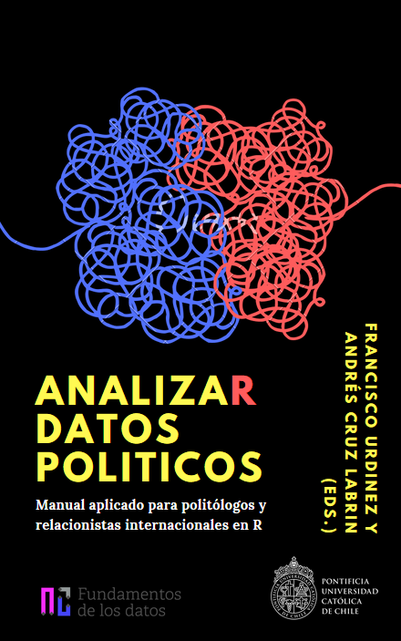

--- 
title: "AnalizaR datos políticos"
author: "Francisco Urdinez y Andrés Cruz Labrín (editores)"
date: "2019-01-13; Borrador inicial, favor no distribuir ni citar."
site: bookdown::bookdown_site
output:
  bookdown::gitbook:
    split_by: chapter
  # bookdown::pdf_book:
  #   keep_tex: yes
  #   includes: 
  #     in_header: preamble.tex
documentclass: book
bibliography: [book.bib, packages.bib]
biblio-style: apalike
link-citations: yes
description: "Proyecto de libro"
favicon: "favicon.ico"
---

# Tabla de contenidos {-}

1. Prefacio
1. Introducción  **I. Introducción a R** 
1. R Básico (Andrés Cruz Labrín)
1. Manejo de datos (Andrés Cruz Labrín)
1. Visualización de datos (Soledad Araya) 
1. Carga de bases y flujo de trabajo (Andrés Cruz Labrín)  **II. Modelos** 
1. Estadística inferencial básica (?)
1. Modelos lineales (Inés Fynn y Lihuen Nocetto)
1. Modelos binarios (Francisco Urdinez)
1. Modelos de supervivencia (Francisco Urdinez)  **III. Aplicaciones** 
1. Manejo avanzado de datos políticos (Andrés Cruz Labrín y Francisco Urdinez)
1. Creación de índices con Análisis de Componentes Principales (PCA) (Caterina Labrín)
1. Minería de datos (Gonzalo Barría)
1. Análisis de redes (Andrés Cruz Labrín)
1. Análisis cuantitativo de textos (Sebastián Huneeus)
1. Manejo y visualización de datos espaciales (Andrea Escobar y Gabriel Ortiz)

#### Acerca de los autores y autoras {-}

- 
