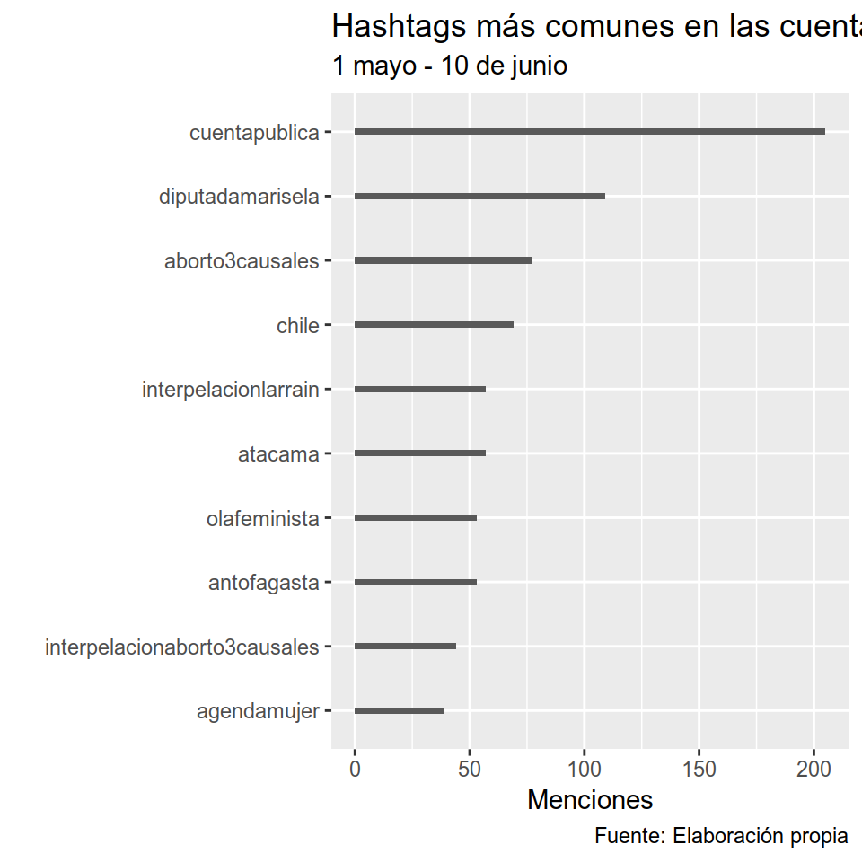
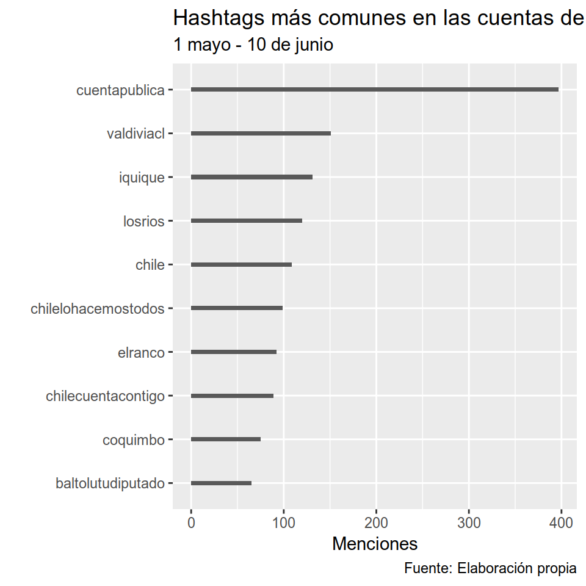
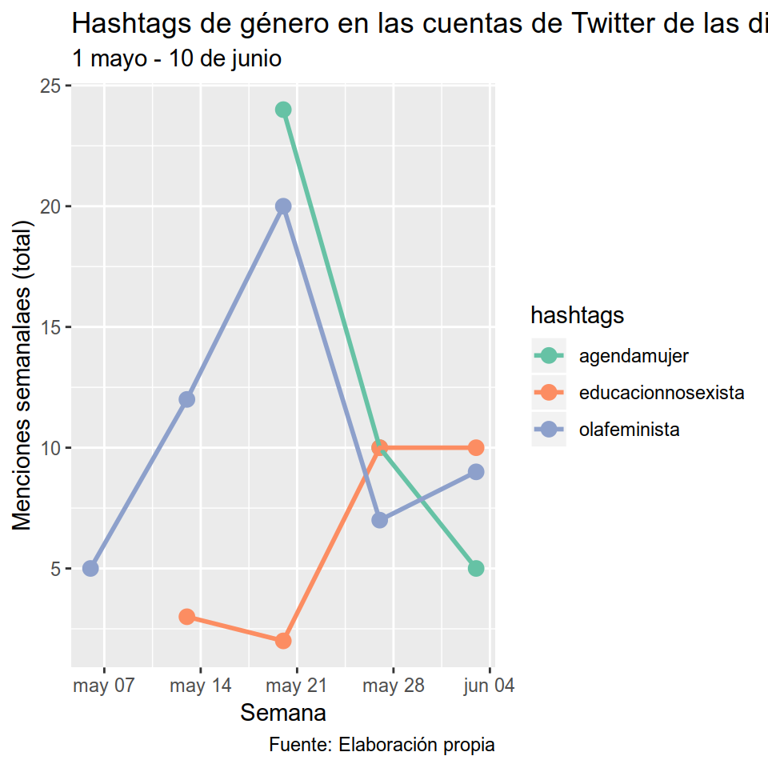

# Análisis cuantitativo de textos {#qta}
*Por Sebastián Huneeus*


***

**Lecturas de referencia**

- Calvo, E., & Aruguete, N. (2018). #Tarifazo. Medios tradicionales y fusión de agenda en redes sociales. En *Inmediaciones de la Comunicación*, 13(1), 189–213. https://doi.org/10.18861/ic.2018.13.1.2831

- Calvo, E., Dunford, E., & Lund, N. (2016). Hashtags that Matter: Measuring the propagation of Tweets in the Dilma Crisis. Working Paper. Recuperado de https://www.researchgate.net/profile/Ernesto_Calvo/publication/306275910_Hashtags_that_Matter_Measuring_the_propagation_of_Tweets_in_the_Dilma_Crisis/links/57b732b408aec9984ff2a21f/Hashtags-that-Matter-Measuring-the-propagation-of-Tweets-in-the-Dilma-Crisis.pdf

- Jelani Ince, Fabio Rojas & Clayton A. Davis (2017) The social media response to Black Lives Matter: how Twitter users interact with Black Lives Matter through hashtag use, Ethnic and Racial Studies, 40:11, 1814-1830, DOI: 10.1080/01419870.2017.1334931 

- Salganik, Matthew J. (2017). Bit by Bit: Social Research in the Digital Age. Princeton, NJ: Princeton University Press. Open review edition. 

- Steinert-Threlkeld, Z. (2018). Twitter as Data (Elements in Quantitative and Computational Methods for the Social Sciences). Cambridge: Cambridge University Press. doi:10.1017/9781108529327

- Trott, Verity. (2018) Connected feminists: foregrounding the interpersonal in connective action, Australian Journal of Political Science, 53:1, 116-129, DOI: 10.1080/10361146.2017.1416583 

***

## Introducción 

La #olafeminista, #metoo, #blacklivesmatter o #niunasmenos son hashtags que han inundado las comunicaciones en Twitter en el último tiempo. Un hashtag es un texto que conecta a varias cuentas de Twitter a través de un tema; son conexiones entre nodos, lo que es sumamente útil para entender la dinámica de la propagación de la protestas online y examinar cómo se desarrollan en el tiempo. Recientemente, ha emergido una literatura que aborda las protestas sociales y la defensa de derechos a través de la propagación de hashtags. En este contexto estudios, hay trabajos recientes que abordan el [hashtag-feminismo](https://www.tandfonline.com/doi/abs/10.1080/10361146.2017.1416583) o [formas de activismo racial](https://www.tandfonline.com/doi/abs/10.1080/01419870.2017.1334931) 

En este capítulo vamos a aplicar estadística desciptiva básica para abordar el uso de hashtags en la #olafeminista. La pregunta que dió origen a este análisis es ¿Qué patrones y/o variaciones se observan en la frecuencia con que los diputados usan los hashtags en la protesta social #olafeminista? Se trata de una pregunta exploratoria y no explicativa. El tema de fondo que nos interesa abordar es que en redes sociales, usar un hashtag en general equivale a estar interesado sobre un tema - independientemente de estar a favor o en contra. 

Este ejercicio es un paso previo al análisis de texto de los tweets, ya que los hashtag puede servir para filtrar e identificar a quienes están favor, en contra o simplemente no les interesa el movimiento. Así mismo, sirve para identificar a diputados que tienen como prioridad las temáticas de género.En términos metodológicos, con este ejercicio vamos a aproximarnos a cómo las coaliciones y diputados usan hashtags de género y/o feminismo. Los paquetes de R utilizados serán `tidyverse`, `wordcloud2`, `skimr` y `lubridate`. La unidad de análisis son los 155 diputados chilenos y el período de recolección de datos abarca entre 1 de mayo y el 10 de junio de 2018. En total, 131 de 155 diputados fueron activos en Twitter durante ese período, que coincidió con el auge de la ola feminista. 

Para el análisis usaremos una base de datos original con variables de identificación de diputados, tweets y hashtags. Las variables de identificación de los diputados se extrajeron fácilmente de la [Página oficial de la Cámara de Diputados](https://www.camara.cl/camara/diputados.aspx#tab). Para hacer la extracción de datos de Twitter, utilicé el paquete `Rtweet`, que permite ingresar de manera gratuita al API de Twitter para [descargar información por usuarios, fechas y hashtags](https://www.earthdatascience.org/courses/earth-analytics/get-data-using-apis/use-twitter-api-r/). Para extraer datos de Twitter con R se recomienda leer [Twitter as Data](https://www.cambridge.org/core/elements/twitter-as-data/27B3DE20C22E12E162BFB173C5EB2592), que contiene algunas rutinas estandarizadas para descargar datos de esta plataforma. La base final tiene 15 variables y 9758 observaciones: tiene tantas observaciones como veces cada diputado usó cualquier hashtag en cualquiera de sus tweets y retweets. En esta base, por tanto, están incorporados solamente los tweets que usaron algún hashtag y se excluyeron todos los mensajes que no ocuparon algún hashtag durante ese período. 


## Bases de datos 

Cargamos la base de datos y la exploramos con el paquete `skimr`, el que permite hacer una exploración rápida del tamaño de la base, su número de observaciones y variables, así como el tipo de variables (character, integer, factor, etc.).   


```r
library(tidyverse)
library(skimr)
```


```r
base_tweets <- read_rds("00-datos/qta_base.rds")
```

`skimr` también nos entrega información sobre el número de datos perdidos (missing), la cantidad de categorías o valores que toma la variable de factor (n_unique), así como estadísticos de disperción para las variables cuantitativas (min, max, quantiles, media y desviación estándar). Esto permite hacer un diagnóstico rápido sobre los datos con los que vamos a trabajar; en el caso de nuestra base, vemos que hay 11 variables de tipo "character", 1 de tipo "date", 2 de tipo "factor" y otra de tipo "POSIXct" que permite trabajar con fechas. La variable que contiene los hashtags de interés es la variable del mismo nombre, con `skimr`vemos que no hay valores perdidos, que tiene 9758 observaciones, siendo el más corto de ellos uno con 2 caracteres y el más largo con 54. Por último, vemos que en total se usaron 2309 hashtags unicos. Construir esta variable fue bastante sencillo, en la medida que el API separa, en una variable distinta, los mensajes de los hashtags. A través del paquete `stringr`para operar con expresiones regulares, separamos los hashtags cuando en un mensaje había más de uno y además hicimos una limpieza, quitando espacios, acentos y mayúsculas. 


```r
skim(base_tweets)
## Skim summary statistics
##  n obs: 9758 
##  n variables: 15 
## 
## ── Variable type:character ────────────────────────────────────────────────────────────────────────
##        variable missing complete    n min max empty n_unique
##       coalicion       0     9758 9758   2   4     0        7
##  [ reached getOption("max.print") -- omitted 10 rows ]
## 
## ── Variable type:Date ─────────────────────────────────────────────────────────────────────────────
##         variable missing complete    n        min        max     median
##  fechanacimiento       0     9758 9758 1938-06-16 1991-03-11 1973-07-19
##  n_unique
##       123
## 
## ── Variable type:factor ───────────────────────────────────────────────────────────────────────────
##     variable missing complete    n n_unique
##     distrito       0     9758 9758       27
##                           top_counts ordered
##  14: 1121, 24: 1068, 10: 773, 4: 662   FALSE
##  [ reached getOption("max.print") -- omitted 1 row ]
## 
## ── Variable type:POSIXct ──────────────────────────────────────────────────────────────────────────
##    variable missing complete    n        min        max     median
##  created_at       0     9758 9758 2018-05-01 2018-06-10 2018-05-23
##  n_unique
##      6197
```

Podemos observar los primeros valores de la variable "hashtags" simplemente seleccionando dichas variables en la base:


```r
base_tweets %>% select(hashtags)
## # A tibble: 9,758 x 1
##    hashtags            
##    <chr>               
##  1 lugaresquehablan    
##  2 puertomontt         
##  3 salvemoslagochapo   
##  4 lagochapo           
##  5 ancud               
##  6 chiloe              
##  7 interpelacionlarrain
##  8 interpelacionlarrain
##  9 sqm                 
## 10 poncelerou          
## # ... with 9,748 more rows
```

## Cálculo de frecuencias

### 10 hashtags mas usados de las cuentas de los diputados 

Nos interesa saber es cuáles son los hashtags más usados, para esto usaremos `count()` para ver la frecuencia y luego `arrange(-n)` que ordena el conteo de mayor a menor. Agregando los comandos `as.tibble()`y `dplyr::slice()`, generamos una tabla en que solamente se muestran una cantidad acotada de valores, en este caso, los 20 mayores. Vemos que el hashtag más usado es #cuentapublica, asociado al la rendición de cuentas presidencial del 21 de mayo en el que Sebastián Piñera se dirigió al Congreso Nacional. El hashtag #aborto3causales se ubica en quinto lugar, con 122 menciones en total. En el lugar 12 se ubica  #interpelacionaborto3causales y en el 16 #olafeminista.   


```r

base_tweets %>% 
  count(hashtags) %>% 
  arrange(-n) %>% 
  dplyr::slice(1:20)
## # A tibble: 20 x 2
##    hashtags                         n
##    <chr>                        <int>
##  1 cuentapublica                  602
##  2 chile                          178
##  3 valdiviacl                     153
##  4 iquique                        132
##  5 aborto3causales                122
##  6 losrios                        120
##  7 chilelohacemostodos            109
##  8 diputadamarisela               109
##  9 chilecuentacontigo             100
## 10 interpelacionlarrain           100
## 11 elranco                         92
## 12 interpelacionaborto3causales    79
## 13 coquimbo                        76
## 14 diadelpatrimonio                73
## 15 antofagasta                     69
## 16 olafeminista                    67
## 17 laserena                        66
## 18 baltolutudiputado               65
## 19 tiemposmejores                  65
## 20 semanadistrital                 62
```

También creamos una tabla en que las frecuencias hashtags están separadas por la variable de género "dummy_mujer". 


```r
base_tweets %>% 
  group_by(dummy_mujer) %>% 
  count(hashtags) %>% 
  arrange(hashtags)
## # A tibble: 2,760 x 3
## # Groups:   dummy_mujer [2]
##    dummy_mujer hashtags        n
##    <fct>       <chr>       <int>
##  1 0           106añospc      18
##  2 1           106añospc       2
##  3 1           11mayo1935      1
##  4 0           1demayo        18
##  5 1           1demayo         9
##  6 0           1demayo2018     1
##  7 1           1erodemayo      1
##  8 1           1m              4
##  9 0           1mayo           1
## 10 1           1mayo           2
## # ... with 2,750 more rows
```


### Frecuencias por género: cantidad de hashtags usados por los diputados en total

Las funciones `group_by()` y `summarise()` permiten contar el número de observaciones asociados a una variable de base. Al hacer un conteo de los valores 0 (hombre) y 1 (mujer) de dummy_mujer, sabremos que tantas veces cada género ocupó algún hashtag. Vemos que los hombres ocuparon un hashtag 6169 veces, mientras que las mujeres 3589 veces. 


```r
base_tweets %>% 
  group_by(dummy_mujer) %>% 
  summarise(total = n())
## # A tibble: 2 x 2
##   dummy_mujer total
##   <fct>       <int>
## 1 0            6169
## 2 1            3589
```

## Wordcloud de hashtags

El Wordcloud permite generar una representación visualmente amena de las frecuencias, 
ubicando al centro y más grandes los casos que tiene una mayor frecuencia. Para ello cargamos `Wordcloud2` y lo aplicamos sobre el conteo de cada hashtag. 


```r
library(wordcloud2)

wordcloud2(base_tweets %>% count(hashtags) %>% arrange(-n)) 
```

<!--html_preserve--><div id="htmlwidget-b31703977d05922a5b58" style="width:480px;height:480px;" class="wordcloud2 html-widget"></div>
<script type="application/json" data-for="htmlwidget-b31703977d05922a5b58">{"x":{"word":["cuentapublica","chile","valdiviacl","iquique","aborto3causales","losrios","chilelohacemostodos","diputadamarisela","chilecuentacontigo","interpelacionlarrain","elranco","interpelacionaborto3causales","coquimbo","diadelpatrimonio","antofagasta","olafeminista","laserena","baltolutudiputado","tiemposmejores","semanadistrital","puertomontt","atacama","aricayparinacota","diadeltrabajador","agendamujer","losniñosprimero","venezuela","leycultivoseguro","diputadosrn","diadelamadre","chiloe","valparaiso","arica","chaobolsasplasticas","tarapaca","las5posverdadesdebachelet","reformaintegral","diamundialdelmedioambiente","educacionnosexista","gloriasnavales","leydeidentidaddegenero","mehagocargo","altohospicio","cuentapublica2018","diputadohugorey","piñerapresidente","talcahuano","domatuvida","eutanasia","niunamenos","1demayo","piñeranoesfeminista","cnnchile","vanrysselberghediputado","enacional","calama","leygala","panguipulli","riobueno","felizjueves","felizmartes","launioncl","leydeidentidaddegeneroahora","valdivia","santiago","106añospc","copiapo","ovalle","paillaco","petorca","quilpue","sqm","tomafeminista","osorno","todasparatodas","cannabismedicinal","diamundialdelreciclaje","diputadotorres","interpelacion","isapres","iveen3causales","noesno","diadelteatro","felizlunes","loslagos","mafil","ñuñoa","adultosmayores","ahora","atacamamerecemas","diputadaenterreno","diputadoálvarez","felizviernes","quillota","temuco","ancud","buenviernes","ddhh","diamundialdelosoceanos","distrito14","lanco","launion","medioambiente","viapublica","agua","diputadoenterreno","estaciondetrenes","nomasafp","sanbernardo","sename","somosdc","coronel","fealatitud","felizdiadelasmadres","felizmiercoles","felizsabado","inteperlacionaborto3causales","lacalera","leydepesca","mesdelmar","pacientesprimero","pica","rancagua","salud","sanfelipe","viñadelmar","castro","concepcion","elinformantetvn","elplaninicial","felizdiamama","leydeeducacionsuperior","losliberales","maipu","melipilla","metroparalapintana","mujeres","objetoressinconciencia","pagooportuno","pais","siempreenterreno","sineditar","somosfuturo","tocopilla","tome","21demayo","calbuco","cambiodehora","cobresal","corral","derechoaltiempo","diadelalumno","dominga","huara","leyextraviados","marx200","ncntvn","noculpesalanoche","objeciondeconciencia","pesadamochiladebachelet","pozoalmonte","sigamosdelargo","bancadasonar","colchane","curico","estadonacional","estoesconzapatillas","finalapescadearrastre","guatitadelantal","lapintana","leyvalparaiso","losandes","ltenvivo","mariquina","palena","quintero","saludparatodxs","sinconsentimientoesviolacion","villaalemana","7dejunio","acusacionconstitucional","baltoludiputadoenterreno","buenjueves","camiña","diamundialsintabaco","elbosque","envivo","fechasinlupa","futrono","futuropsp","identidadparatodes","laligua","oas","palestina","pardoenterreno","parinacota","pasapalabrachv","piñerano","pymes","renuncieministrosantelices","rnconelgobierno","sanfernando","siempreconlosadultosmayores","sonarinformativo","soquimich","vicuña","yotelocuento","acosocallejero","aleymariselaensdl","buenmiercoles","caldera","cannabis","chañaral","comisioninvestigadora","corrupcion","cultivatusderechos","debatecnn","debatelt","enap","equidaddegenero","feminismo","leyeducacionsuperior","margamarga","mesacentral","migracion","puchuncavi","puentealto","rutaenergetica","seguridad","talagante","tecnologia","tierraparapalestina","todasportodas","velaslatinoamerica2018","yoelijovivirsano","cambiandolapolitica","consejogeneralevopoli","contraloria","coyhaique","cuentapublicapresidencial2018","detenidosdesaparecidos","diadelpatrimomio","diadeltrabajo","educacion","emprendedores","fenpruss","financiamientosolidario","freepalestine","frenteamplio","frutillar","hijuelas","hoy","interpelacionalministrodesalud","larrain","leyeutanasiaahora","litio","maxberru","niunpesomasalasisapres","noadominga","partidosocialista","poncelerou","quepiñerahablede","radomirotomic","rmdetodos","sanpedrodelapaz","t13enpunto","tratobancariojusto","villagrimaldi","abbott","abusosexualimprescriptible","adultomayor","alertafeminista","asambleaoea","buenlunes","buenmartes","ciencia","comisiondesalud","cooperativaconversa","dalcahue","democracia","deporte","diadelreciclaje","diamundialdelabicicleta","ecuador","eldiainforma","felizdiadelamadre","felizdomingo","fotodeldia","genero","hablemosenoff","illapel","judejut","labasedelcompromiso","lagoranco","lasobremesa","libertad","limache","loespejo","maduro","nicaragua","piñera","porchileporlapesca","rafael","regiondeaconcagua","saludpublica","sanantonio","santiagonoeschile","siempreenlacalle","tamarugal","todosportodas","yomarchoel1","yoveoshowdegoles","acososexual","aculeo","bachelet","bacheletwars","bancadaevopoli","barriosuarezmujicazonatipica","bolsasplasticas","cabildo","cae","chilesinbarreras","chilevamos","cnnprime","codelco","colocolo","combinacionclave","corfo","cuentapublicaarica","cuentapublicasegpres","derechoshumanos","diadelalibertaddeprensa","diadelasmadres","diadelosoceanos","diainternacionaldelafamilia","diarioelmercurio","diegodealmagro","eleccionesdc2018","emol","felizdiadeltrabajador","forestal","gaza","gobierno","grancircoteatro","guatemala","hualpen","hualqui","inclusion","jorgeabbott","judejutchile2018","l9","laflorida","lamanada","larojafemenina","leydefarmacos","leydemigraciones","leysophia","ligahora","lista2","lluvia","mariarozas","minvu","miprimerapega","nuevoppd","padrelascasas","paine","pisagua","quevuelvalaniñaitaliana","quilicura","radiodulce","reciclatubotella","regresoaluniverso","reservadelabiosfera","ruta5sur","ruta68","ruta78","salamanca","salvemoslahiguera","sellomoreira","siempreporchile","sinpretexto","sjmq","t13","tecondulce","trendelsol","vamoscolocolo","vejezdigna","yotecreo","1m","21mayo","acuerdonacionaldesalud","adopcion","alertaciper","andacollo","aquisedebate","archipielagohumboldt","ascar","asi","auge","aysen","bajosdemena","bancadafeministajulietakirkwood","biodiversidad","boletinparlamentario","bonoinvierno","cadem","cafeconnata","carabineros","carmenfrei","casoascar","cecosf","cerronavia","claustrofeministard","comisiondeinfancia","contigosiempre","cuba","curacavi","diadelcompleto","diadelpatrimonio2018","diadelpisco","diamundialmedioambiente","dichato","distrito10","distrito6","donantedesangre","equipocristobal","estasemanaenlacamara","finalcae","franciscalinconao","hacienda","horauniverso","huasco","idahobit2018","imacec","imprescriptibilidad","juegosinclusivos","late","latercerapm","leydeabortotrescausales","leydeadopcion","leydefarmacos2","leydemigracion","lig","llanquihue","losangelescl","losmuermos","losrulos","losvilos","lota","marchaestudiantil","marchafeminista","matrimonioigualitario","maullin","mineria","ministrosantelices","mujer","mumotupper","nakba70","ncnconkathytvn","objecionconciencia","oea","operacioncardumen","paihuano","palestinalibre","papafrancisco","patrimonio","pautafinal","pautapresidencial","porfinlosniñosprimero","puertovaras","renovacionnacional","rinconada","sanjoaquin","santelices","seguridadciudadana","solteraotravez3","sonreiresgratis","stockdisponible","t13noche","teno","tierraamarilla","trabajadores","trabajo","vamosñuble","vertigo2018","villarrica","violenciaobstetrica","virginiareginato","yositecreo","1mayo","3causales","85añoscbñ","aguante","alertachilecheck","aps","bancadard","bancadaregionalista","bullying","calidaddelaire","camaradediputados","campanapeñuelas","capitan","cariñomalo","chacao","chiguayante","chilezuela","chillanonline","clasemediaprotegida","cochabamba2018","concluámbar","congresistasfa","congreso","contigoentodas","cooperativapm","corpesca","cortesuprema","crisiscontaminacion","cuentapresidencial","cuentapublicamop","cuentapublicatvn","cumpeo","curimon","derechosfiliativosahora","desesperados","deuda","diainternacionaldeltrabajo","diputada","diputadoalvarez","diputadopresente","dobleopuesto","donaciondeórganos","donarsalvavidas","donbosco","dueñasdesalas","educacioncivica","elenapricinger","ellastienenlavoz","elquisco","enterreno","equipohugorey","estacionsantiago","estudiantes","eutanasiamv","felizdiadelnutricionista","feriaartesanal","fiscalnacional","frvs","futuropqn","gobiernoenterreno","graciaschile","gratuidad","hacemoslapega","hernanlarrain","homofobia","irlanda","isapre","isladepascua","jovenes","justiciaparaambar","lahaya","lahiguera","lajuventuddelcambio","leyaborto3causales","leydearboladourbano","listasdeespera","listasespera","llaitul","lobarnechea","loscruzados","machifranciscalinconao","magazinenocturno","marianopuga","marx","maspatrimonioparachile","mastrabajoparalaregiondeantofagasta","maszonastipicas","maternidadlibre","mayoriapopular","meconecto","melefquen","metrotren","movimientofeminista","mujerps","netneutrality","niebla","niunpasoatras","noalaculturadelaviolacion","noalmaltratoanimal","nochedigna","nodiscriminacion","nomasabusoscontracarabineros","nomasmachismo","nomasplasticos","operacionhuracan","paipote","paredes","pautaendesarrollo","pedroaguirrecerda","peñaflor","penco","pensiones","peru","pichidegua","pitrufquen","plannochedigna","politicamentehumanas","protocoloobjecionconciencia","proyectodeley","quintaregion","regiondelaaraucania","renca","reparacion","respondesantelices","samu","sanmiguel","sebastianálvarez","siempreeshoy","silala","sindromedetourette","sustentable","talcamavida","todaslasmujeres","tomafeministauc","tvn","ultimamirada","últimamirada","undiacomohoy","vallenar","venezueladecide","volcandefuego","wplsummit","yaestaenemol","yocambiolapolitica","24horascentral","28aniversario","accesolibremontaña","acuerdonacional","acuerdonacionalporlainfancia","aculeosinagua","adopcionhomoparental","adultosmayoresadultosmejores","agendadegenero","agendamtt","agricultores","agricultura","agroturismo","ahora24h","alerce","alertaambiental","andresperez","apararlaimpunidad","apr","araucania","argentina","argentinanova","armada","arturoprat","asimprescriptible","asmar","aulaslibres","autonomia","bahiainglesa","bds","buenasrazonesparaseguirme","buenosdias","cablesendesuso","caletaportales","callforpapers","candelaria","cañete","carlotaquierebailar","cartagena","casocaval","cavancha","cerremosunaescuela","championsleaguefinal","chaoleylongueira","chillan","choapa","chuquicamata","clausura","cocha2018","colombia","colun","colusion","comisiondeagricultura","comisiondehacienda","comisonhuracan","comprometidoconlagente","comunidadhumedal","conchali","concluambar","concon","conectados","confusam","congresonacional","constitucion","contaminacion","contralaculturadelaviolacion","contralaimpunidad","cooperativateescucha","copalibertadores2018","cordillera","core","coron","corta","criptomonedas","cueca","cuentapublicamtt","curarrehue","defendamoselparque","deportes","derecho","derechoadecidir","derechosfiliativos","descentralizacion","diacontralahomofobiabifobialesbofobiaytransfobia","diadelasgloriasnavales","diainternacionaldelosmuseos","diamundialdelabiodiversidad","díamundialdelosocéanos","dianacionaldelteatro","diariolasegunda","dictadurastodasmalas","diputadodelosrios","distrito7","distrito8","dobleestandar","dolares","educacionfeminista","educacionpublica","efectomariposa","efemeridestelesur","elecciondc2018","eleccionespdc2018","eligeivivirsano","elpartidodegobierno","elsalvador","emprendedoresatacama","enfermeras","enfermeros","enterrenomarcamosladiferencia","envivo24h","epilepsia","erikaolivera","españa","especialeslt","estapasando","estatutolaboraljoven","estonoesplazaitalia","estoyconkena","expropiarsqm","fa","familia","felizdiadelaenfermeria","felizdiadelkinesiologo","fibromialgia","finalcarbon","finjusticiamilitar","fiscalizacion","florida","fondoscultura2019","freirina","fueroparlamentario","futbol","futbolfemenino","gastronomica","girlpower","gomezcarreño","guacamayo","haciendohistoria","harry","harvard","hectorllaitul","hospicio","hospitaldequilpue","huellelhue","idahot","igualdad","igualdadantelaley","imprescriptibilidadtotal","infancia","infografias","integridadpublica","israel","javierablanco","jibia","joaquinniemann","jrn","judejut2018","justicia","kinesiologos","l4","l8","la","laaraucania","lacisterna","ladormida","lafloridachv","lagochapo","lamañanadechv","lamañanagenial","lareina","larojasub20","larutadelbeneficio","las","latirana","leche","lesbofobia","leyadopcion","leydemigracionyextranjeria","leyidentidaddegenero","leylafkenche","leylongueira","lgbt","lgbti","lgtbi","libertaddeexpresion","libertaddeprensa","liveunderpar","lojusto","lojustocnn","losangeles","losángeles","losloros","lospacientesprimero","losrioslalleva","lugaresquehablan","lunescooperativa","machi","macul","maitencillo","mapuche","marcha","marchamundialdelamarihuana","marcoantoniodiaz","mariselaensdl","mascercadeti","maule","megaterremoto","mejillones","mejorespensiones","melitrenahora","memoria","metrotrenmelipilla","michellebachelet","miderechomiidentidad","migraciones","migrantes","migrarenigualdad","migratorio","minctci","ministeriodecienciaytecnologia","ministeriopublico","minsal","mitestvih","monckebergnuñez","montañaslibres","mop","mtblavacada","mujeresrn","nabila","nantoco","nataliacastillo","neltume","nepotismo","niemann","niños","noalosdespidosmasivos","noalplastic","noalprotocolo","nomasabuso","nomasabusos","nomasmaduro","nomasviolenciamachista","nonosvamosnicagando","nontuelá","notronaduras","ñuble","nuevafotodeperfil","nuevapoliticadedrogas","obispos","olmue","onemi","orgullonacional","pablolorenzini","palabrassacanpalabras","parquerenatopoblete","pasapalabra","pasemosdelargo","patrimoniocultural","patrimonionatural","pc","pdc","peligroenelcaburgua","pequeñosmineros","pesca","pescadoresartesanales","pichicuy","piñera2018","planinvierno","planinvierno2018","plannacionalvih","podriaserpeor","pomaire","ponteenmiszapatos","porunainfanciaconderechos","potrerillos","preemergenciaambiental","presidente","protecciondedatosdelosconsumidores","ps","puerto","puntaarenas","puntapeuco","putaendo","putre","quellon","quenomueraaculeo","quienlodiria","quilaco","quintacordillera","recomiendochile","reconstruccion","recursoshidricos","region","regionbiobiocuenta","regiondeloslagos","regiondevalparaiso","regiones","rengo","revistaya","revolucionesalminuto","rmcuentacontodos","rodolfoleveque","rt","ruta160","sag","salah","sanpablo","sanramon","sanvicente","sebastiandavalos","seestavaciando","segundoacceso","segurounico","senda","seremi","sergiobravo","servel","sigueeldebate","simce","sinpretextos","solodiscurso","soloenchile","sonarglobal","sopaipillasconpalta","soydonante","stgolovers","subetealabici","sustentabilidad","taltal","tarapacacuenta","tc","teatro","tedefiende","terapiaocupacional","tiemposdeausteridad","toma","tomauc","tongoy","trabajadoresalascalles","trafkintu","trans","transfobia","uach","uc","ucfinal","uda","usa","valledeaconcagua","vamoscacique","vamosmelipilla","verdadyjusticia","viernes","vilnius","viña","vinadelmar","viñaoriente","vitacura","vivienda","volcan","wctransitmaps","yoapoyoalministro","yoapoyoalrodeo","yoeligovivirsano","yoelijo","yomarcho","yovivoel21","yovivoel21eniquique","zonadesacrificio","zonasaturada","zonasdesacrificio","11mayo1935","1demayo2018","1erodemayo","1rodemayocut","200añosmarx","20may","21mayoeniquique","24play","279añoslosangeles","27f","30may","31años","3añosdefendiendochiloe","3demayo","41añosdelucha","4añosclave","4dejulio","500años","5poder","7junio","7junioenarica","7lucas","91aniversario","9quezada","a1metrodetodos","aborto","abott","abriendorutasinclusivas","abusan","abusos","accesolibrealamontaña","acciona","accionpoliticasinprivilegios","acompañando","aconcagua","aconcaguaregion","acosoescolar","acosoesviolencia","acta","actadetarapaca","actualidad","adnhoy","adultomejor","aefen","aereas","afodegama","afp","agendadeequidad","agendaeconomica","agendamop","aguantaparinacota","aguantecolocolo","aguaparachile","aguaparalospueblos","aguasquietas","ahoraescuando","airetoxico","ajedrez","alaire","alcadiacuidadana","alcalde","alcaldeciudadano","aldia","alejandraperez","alemanianazi","alergiasalimentarias","alertadememoria","alnakba","alvarocorbalan","ambar","amigasdecirugiainfantil","amisimeimporta","amor","amordelbueno","amortodaunavida","anef","anfa","angelamerkel","angelmo","aniversario","aniversariocoquimbo","antuco","anuario2017","apartheid","apec2019","apinforma","archi","archipielagohumbodlt","archipiélagohumboldt","archivo","archivopaula","aricacuenta","aricasiemprearica","arjona","arribaloscorazones","arribalosqueluchan","artesmarciales","artritis","asambleamujeres","ascensor","asque","atacamamerecesmas","atlasdelosoceanos","augemayor","autodeterminaciondelospueblos","avanzachile","bailetipico","bajoelaguasomostodosiguales","baquedano","barbarafigueroa","barrionorte","barriopatrimonialyungay","bicentenario","bienvenidos13","bifobia","biobio","bioequivalentes","biotren","bitran","blacksabbath","blogtelesur","bodasdeoro","boletin","bolivia","boliviano","bomberos","bomberoschicosbuenos","bonobodasdeoro","bonoleña","book","boot","bots","bourdain","buenacosa","buenastardes","buendomingo","buenosaires","buensabado","buentrato","buentratobuenpartido","buin","cac1ke","calidaddevida","callaqui","calleconferencia","camaelonesdelapolitica","camaradesenadores","cambioclimatico","cambioradical","campusriosimpson","canal13","canal24horas","cancer","canchasderespeto","canciller","capacitacion","capitalsemilla","capsuladelamemoria","caraacara","carabinerosdechile","cardenalcaro","carmelacarvajal","carrerasolar2018","carreteraaustral","carteldelaguaypalta","cartillaeducativa","casaabierta","casablanca","casadelainclusion","casadeldonante","casamorada","cascabelalgato","casoambarmv","casoharvard","catedraldelrock","caval","cbñ","cehum","celestinocordova","centralfoxchile","centroculturaldepuentealto","centroculturalmargamargacunadelarte","cerrobellavista","cerrocastillo","chaihuin","chaiten","chamisero","championsleague","championsxfox","chantal","chaocae","charliegard","chicagoboys","chileanway","chilecompite","chilecuentaconmigo","chiledeheroes","chiledetodos","chileencochabamba","chilelibredeviolenciamachista","chilelindo","chilelohacamostodos","chilelohacemostodo","chilelomovemostodos","chilelotrabajamostodos","chilenos","chilepolocientifico","chileretrocede","chiletieneunasolabandera","chinchorroapatrimoniomundial","chonchi","chong","chorrilanaconpalta","chorrillos","chvnoticias","cicletada","cicletadarn","ciclisthrash","ciclofeminista","cienciaenregiones","ciencias","cierre","ciudadanosinformados","ciudaddelfuturo","claudiamix","claudioarrau","clubes","clubesamateur","cnn","cnnchiledebate","cochabamba","cocinademercado","codelo","codigosanitario","colchagua","colchan","colocolo1991","colombiadecide","coloniadignidad","coloniadignidadchv","coloquio","coloquiosaps","columna","columnadehoy","colusión","colusiondefarmacias","combatienteinternacionalista","comenzamos","comicconchile2018","comisaria","comisiondefamilia","comisionespecial","comisionmedioambiente","comisionmixta","comitepolitico","comitesdevivienda","compartan","comparte","compin","comproetidoconlostrabajadores","comprometidoconlafamilia","comprometidoconlanaturaleza","compromisoregional","comunadepica","comunidades","concejal","concejales","concejalesfa","conectividad","conexiont13","conexiontele13","conferenciajs","confiesoquecontwitter","confuerzayesperanzaelfaavanza","confusam2018","conicyt","conmebollibertadores","consecuencia","consejeroslosrios","consejojrn","contaminado","contiamos","contracaramv","conutt","conversandoconcorrea","cooperation","cooperativaam","cooperativagolea","cooperativalahistoria","cooperativaregiones","copagobernacionhistorica","copalibertadores1991","coquimbo151años","correasutil","corresponsabilidad","corrupcity","cortedeenergia","cortedeluz","cosoc","coves","cpi","cqcxchv","criando","cristianmella","cruzroja","cuartaedad","cubana","cuecahuasa","cuenta","cuentaconnosotros","cuentacooperativa","cuentapublica2017","cuentapublicacnn","cuentapublicaintendencia","cuentapublicaparticipativa","cuentopublico","cultivatuidentidad","cultura","cumbreneoliberal","cumpliendocontigo","curacodevelez","curepto","cut","cyberbullying","d10","dalecalor","daniela","daniellacicardini","dc","debate","debateppd","decidoyo","declaraciondesanramon","dedomingoadomingo","defensordelcliente","defienderiomaipo","dejentrabajar","democraciadirecta","denuncia","deporteesvida","deportistasporunsueño","derechos","derechosciviles","derrameenquintero","desarrollosocial","desarrollourbano","desdezero","desfile","designatedsurvivor","destitucion","deudahistorica","devoluciondeimpuestos","devuelvanlaplata","diacontralalgbtfobia","diacruzroja","diadelabici","diadelacruzroja","diadelaenfermera","diadelaenfermeria","diadelafamilia","diadelaluz","diadelamadre2018","diadelcuequeroylacuequera","diadelfutbolistaamateur","diadelmedioambiente","diadelnutricionista","diadelostrabajadores","diadelpatrimonionacional","diadelsuplementero","diainternacionalcontralahomofobiatransfobiaylesbofobia","diainternacionaldelalibertaddeprensa","diainternacionaldelmedioambiente","diainternacionaldelosniñosvictimasdeagresion","diainternacionaldeltrabajador","diamundialcontraelbullying","diamundialcontralahomofobiaytransfobia","diamundialcruzroja","diamundialdelacruzroja","diamundialdelahipertension","diamundialdelaleche","diamundialdelalibertaddeprensa","díamundialdelasavesmigratorias","diamundialdeloceano","dianacionaldelacueca","dianacionaldelpisco","dianacionaldelsuplementero","diaproductorlechero","diarioaustral","dicom","dictadura","dictadurapinochet","dictaduravenezolana","dictamen","dioutadamarisela","diputado","diputadoflores","diputadosalasaladeclases","diputadosudi","dirigentes","discapacidad","discriminacion","distrito21","distrito9","distritof","diversidad","doctorencasa","domingafidalgoaraya","duranasenador","economia","ecosistema","eduardobitran","eduardofrei","educacionambiental","educacionartistica","educacionsuperior","educando","efe","eileenramirezcerda","ejecutivo","ejercitorojo","el","elabrazo","elclubesnuestro","elcortijo","eldeporteesvida","eldiputadodeatacama","eldistrito","eldistritof","eleccionesppd2018","electrodependientes","elfutbolnotienegenero","elmercurio","elpenquistailustrado","elperiferico","elpintordeangelmo","elpisconacioenchile","elqui","elsalado","elsecreto","eltabo","eltepual","elvecinonormal","empoderadas","emprendedoras","empresasdelestado","en","en21demayosigochilenosque","enacioal","encuentrodemujeresrn","encuentroenergiaelectrica","energetica","energia","enfotos","eniquiqueseviveel21","eniquiqueyovivoel21","enlineayconectados","enparejarlacancha","ensintonia","enterate","entrevista","entrevistas","envalpodecidenlasmujeres","envideos","eptv","epu2018","equidad","equipo","equipo4x4","equipoenterreno","erikaoliveradiputada","esapreguntayonotelaacepto","esclerosismultiple","escuelarural","estadolaico","estamosalerta","estatutojoven","estebanparedes","estoesnoticiatv","estosesconzapatillas","estosiqueesgobernar","estoyconpilar","estudiocientifico","esviolacion","eutanasiaahora","evaristo","evopoli","evopolivota","evrdiputado","excelente","expoempleosaiep","eyzaguirre","facebooklive","fachopobre","fadisex","fairplay","falangedigital","faltaunticketdecambiopara","familiaesfamilia","familiasdiversas","familiavarela","fb","felipelarrain","feliz21demayo","felizcumpleaños","felizdia","felizdiadelafamilia","felizdiadelalumno","felizfinde","feriadosetrabajaigual","fes","ffaa","fiebreamarilla","fiji","filialpadrehurtado","finalfuero","financiamiento","findeprivilegios","firmecontigo","fl30años","folclore","fonasa","fondomedios2018","formacioncivica","francia","franciscalinconaoinocente","franciscobilbao","francobelmar","françoistruffaut","frasesliberales","fraudealaley","fraudeelectoralenvenezuela","frazadas","freetaner","frei","freire","frenteamplioputaendo","fresia","fueraezzati","fueramonsantobayer","fuerzaandres","fuerzafeminista","fuerzaguatemala","funaalvarocorbalan","fundacionamandalabarca","fundacioncomprometidos","futuro","gabrielamistral","gabrielruiztagle","gahonacumple","gajesdesermama","galatelsur","gam","garra","gazamassacre","geriatras","gestionterritorial","giradeestudio","glaciares","gloruasnavales","gobernadoresregionales","gobiernoabierto","gobiernointerior","goleador","googlealerts","gracias","grandelakolbe","grandepiñera","gratitud","greatreturnmarch","guatitadedelantal","guetovertical","hablemossobreciencia","haganseesa","handball","hartas","harvardgate","hayquehaceralgo","henrycamposalcalde","heradiocabildo","hernando","hernánlarraín","hilociper","hipertension","historico","hockey","horariodeinvierno","horarioinvierno","horcon","horvath","hospitalsalvador","huatacondo","huechuraba","huelquen","huerta","humanismo49años","humbertolepe","humedaldearica","humo","humor","icc","idahot2018","idahotb","identidaddegenero","idl2018","ifttalca","iglesia","ilabacateinforma","imperdible","impulsapersonas","impunidad","incendiosforestal","inclusionlaboral","indap","independencia","independenciamassegura","influenza","informate","informe","informeespecial","inglaterra","innovacion","inspirones","institutonacionaldegeriatria","interessuperiordelaniñez","interior","internetsegura","interperlacionlarrain","intocable","ips","iquiquequieresuteatro","islariesco","islasantamaria","italia","jadue","jaque","jeanpierreleaud","jennifermarquez","jerusalen","jjvvlagorupanco","joaquingarciaaguilar","jorgebermudez","jornadadetrabajo","jornadagyp","josecerdabecerra","josehuenante","josemarti","jovenesinnovadores","joycegonzalez","juan","juanandresfontaine","juancarlossilva","juecesconcriterio","jueves","julianelfenbein","juniodeseguirchilenos","junji","justiciahoynomañana","justiciamilitar","justiciaparaámbar","justiciaparajoaquin","justiciaparanabila","justiciaporconcepcion","juventuddelcambio","juventududi","karadima","karius","karlaortizvargas","karlmarx","laborales","labranza","lactanciamaterna","ladiputadadelagente","lafuerzadelasideas","lagranja","lagunadeaculeo","lahoradelaradio","lahuida","lainfanciaprimero","lainterpelacionesuncirco","laisla","laisladelospinguinos","lalogistica","lalola","lamagiadelsur","lamañana","lamoneda","lampa","lamujernuncaesculpable","lamunicipalizacionfracaso","laniñezprimero","lapaz","lapenademuerte","lapesadamochiladebachelet","lapiztoria","laplancha","lapollarecords","larebeliondelcuerpo","lascartassobrelamesa","lascondes","lasemanaennoticias","lasemanapolitica","laslomas","latetvn","latinoamerica","latransfobianosmata","lavelocidadmata","lavictimanuncaesculpable","lbtgiqfobia","lechedeverdad","lechero","legadominh","legisladores","legislar","lemebel","leonidasromero","letrans","ley","leyabortotrescausales","leyantipituto","leyantiterrorista","leydeadopciones","leydeartesescenicas","leydecuotas","leydefarmacosii","leydeiidentidaddegeneroahora","leydeinclusionlaboral","leydelconsumidor","leyeutanasia","leyeutanasiaparachile","leyfarmacosii","leykaty","leyluciano","leypartorespetado","leysophie","lgtb","liberalismoprogresista","libertadparaglas","libertadparalula","librecompetencia","libreseiguales","libronaranja","licenciasmedicas","lietomenowsatirapura","limacheavanzacontigo","linares","linconao","linea6","linea9","lineas","liquiñe","liverpool","liverpoolfc","llanadagrande","lleyvalparaiso","lliulliu","lluviaenchilecentral","lluvias","lonquen","loquenosune","lorojas","los","losingleses","losmolles","losninosprimero","losniñosprimeroenlafila","losniñossondetodos","lospacientesprimeros","lostiemposmejores","luchemosporlosniños","luksicpagaleasalamanca","luz","macarenavaldes","machali","madres","madresehijossebuscan","maduroesunfraude","maduropresidente","maestranza","magallanes","makingamericasluggishagain","mama","mamaesquienama","mamas","mamasfantasticas","mamasfeministas","mamiña","mañanaendirecto","manipulacion","mapochopedaleable","mapudungun","marcha6dejunio","marchablancancntvn","marchaeducacionnosexista","marchafeministavalparaiso","marchamundialporlamarihuana","marchaporaculeo","marchaporlavida","mariapinto","mariposablanca","mariseladiputada","mariselasantibañez","marxismo","mas","masaccionmenosqueja","masdeporte","masseguridad","mauriciosoria","maxitoporsiempre","mayofeminista","me","medecidiporpetro","medicinaalternativa","medicinaplacentaria","mediosnosexistas","mehuin","mejorsaludenaysen","melpilla","mensajepresidencial","mentepositiva","merval","mesadeinfancia","mesdelpartorespetado","mestizo","metal","metro","metrotrennos","mexico","micastillo","microplasticos","midentidadmiderecho","migracionyextranjeria","mimotuga","ministeriodesalud","ministrodehacienda","ministrolarrain","miopinionyrespetolatuya","miradainclusiva","miriamolate","missingperson","mocioncensura","modelo","molina","monumentoalpadregatica","monumentohistorico","mostazal","movistararena","muertedigna","mueveteconresponsabilidad","mujerempoderada","mujeresalcentro","mujeresdeportistas","mujeresps","mulchen","munder","mundorural","municipalidadesdechile","museocomunitario","musicoop","nacional","nacionesunidas","nakbah70","nancagua","nbaplayoffs","nemesioantunez","neonicotinoides","nico","nieve","niñas","ninhue","niunniñomenos","no","noacruzgrande","noadictadurasdeizquierdayderecha","noalacorrupcioninmobiliaria","noalaeducacionsexista","noalaleylongueira","noalastorres","noalatermo","noalestatutojoven","noalpatriarcado","noalplastico","noaltomaipo","noaltpp","noaviolenciaobtetrica","noculpesalanochetvn","noentiendennada","nohayexcusas","nohayjaquesinmate","nomasabigeato","nomasabusoinfantil","nomasacoso","nomasbasuraenvalpo","nomascontratoshonorarios","nomasdaño","nomasdelincuencia","nomasdiscriminacion","nomashonorarios","nomasideologiadegenero","nomasmuertesdecarabineros","nomaspresosporplantar","nomasprivilegios","nomasterritoriosensacrificio","nomaszonasdesacrificio","nomineradominga","noquierotuacosoquiero","norte","nortedechile","noruega","noticia","noticiasenduna","noticiasinanillo","novoa","nuble","nuestragente","nueva","nuevaimperial","nuevaleydemigracion","nutricionistas","nutricionistasalcodigosanitario","objetoresde","obrasparalizadas","oceanodeplastico","odesur","odesur2018","oeafracasoeeuu","oficinagestionproyectos","ohiggins","olafeministamaipu","olatransfeminista","oms","opengovweek","opengovweek2018","operadorespoliticos","opinion","opinión","oportunidadsence","orgullolbtgi","oslo","oteduca","otoñofeminista","ovejeria","ozzyosbourne","pabellonamordechile","pabloartigas","pac","padregatica","pagina13","pajaritovaldes","pajarovaldes","palta","palteros","pamelajilespresidenta","panquehue","paraderosegurolovalledor","pargua","parinacotacuenta","paris","parlamentoenchile","paroresidentesmfuchile","parpress","parquecerrochena","partidodegobierno","partohumanizado","pasajeros","patagoniarock","patriciobustamante","patriciobustos","patrimonial","patrimoniodela","patrimoniodelahumanidad","patrimoniohistoricoyambiental","paz","pdcsinmachismo","pedofilia","pelarco","peñablanca","penademuerte","peñalolen","pensionesdignas","pensionilegal","penta","pequeñashumillaciones","perritoperdido","personasextraviadas","piñeraanoesfeminista","piñeraxlosniños","pinguinazocones","pinochet","piraña","piropo","planificacionurbana","plastico","plasticos","plazacivica","poblacionelcastillo","podcast","poderfemenino","poderosas","porconveniencia","pormiyportodasmiscompañeras","portodochile","ppd","precaucion","presentesiempre","primeradechile","primerapauta","proenmedios","profegarin","programamasleñaseca2018","progresista","propais","proteccionalosniñosahora","protecciondelosniñosahora","protegerlosocéanos","protocoloacoso","protocoloreprobado","provincia","provinciacordillera","proyeccionurbanacoyhaique","proyectoleyintegridadpublico","proyectosdeley","psatacama","psu2018","pudor","pueblodefrente","puente","puenteferroviario","puertofuy","puertooctay","puertospublicos","pullinque","pulsopolitico","punta","puntadechoros","puq","puqueldon","purranque","qedp","queilen","quemchi","quenomueraculeo","quepaguenlasisapres","queratoconoalauge","quesevayantodos","quilimari","quiloue","quinchao","quintanormal","quintavision","radiocristal","radioenfasis","radioloncoche","radionuevomundo","radiopicarona","radiopositiva","radioritmo","rafaela","rahuealto","raimundotupper","ramonsepulveda","rapanui","reclicatubotella","recoleta","reconstruyamoslaesperanza","redesdetutorias","redmeteoaficionada","reds","reformalaboral","regionaconcagua","regionaysen","regiondelosrios","registrodepedofilos","regulacionya","regularizacionextraordinario","regulatorio","reichstag","relato","reloj","reñaca","renovacion","repealthe8th","respetemonos","respetocivico","retirobasura","retroexcavadora","revolucion","revoluciondemayo","revoluciondemocratica","revolucionfeminista","rewe","ricartesoto","rioclaro","riohurtado","rm","rnchile","rocafulldiputado","rock","rodolfoberstein","rodrigoegañabarahona","rojoopcion18","rolandgarros","rosamariapaya","rotarios","sabado","sabiasque","sacerdotes","salacunauniversal","salesianos","saludparatodos","saludprimaria","salufpublica","salvemoselkiosco","salvemoslagochapo","salvemoslosoceanos","salvemosuaysen","sanaconvivenciaescolar","sanciones","sanesteban","sanfrancisco","sanjose","sanjosedemaipo","sanpedro","sanpedrodeatacama","santamaría","santamarta","saval","savalfg","sdl","seca","seguimosdelargo","segurouniconacional","seguroúnicosalud","seia","semanadeladignidad","semanadistritaldiputadosrn","semillacorfo","senado","senaf","senanadistrital","sepuede","sequia","sequialegislativa","seraotrodia","serenacoquimboovalle","sergioaguirre","sernac","serviciodeevaluacionambiental","serviu","sesiondesala","sesionespecial","sevieneelnuevosotero","sextaregion","sialaplaza","siemprecontigo","silovive","simedicennovengo","simplementelaabuela","sinconsentimiento","siniestrosviales","sintabaco","sisepuede","sismo","sistemadeeducacionpublica","sistemapublico","siyofuerarico","sobreseimiento","socialcristianismo","socialcristiano","socialismochileno","solucionesparalazona","somoslatribu","somosmilloneslosjiles","somospueblo","somosrenovacion","sonesta","stgo","subsidiossectoresmedios","t13movil","talca","tallerdescentralizacion2","tamaraavendaño","tarapacaenaccion","tarjetajoven","tea","teatromunicipal","telecentros","tequeremosbachelet","tercerdique","terremotode1960","thememorial","tiempospeores","tirana","todaslasfamiliascuentan","todesamarchar","todos","todosconchaiten","todosconmonserrat","todoslibres","tolerancia","toleranciaceroapedofilos","tolten","tomafeministaua","tpp","trabajadoresalacalle","trabajodecente","trabajodecenteparachile","trabajodigno","tradicionesancestrales","traficodeniños","tragedia","transfeministasenresistencia","transformateasustentable","transparencia","transporte","trenalsur","trenamelipilla","tribunalambiental","tribunalconstitucional","tsunami","tucuentaespurocuento","turismo","twitterosdederechacl","ua","uach2018","uclfinal","uclfinal2018","udec99años","ue","ultimominuto","umag","umlem","unahistoriademetro","unatremendanoticia","undiaperfecto","unidad","unidadciudadana","unidospodemos","universoaldia","urbanismo","uruguay","usach","utfsm","uvalpo","valdiciacl","valentinaacuñaobregon","valledelaconcagua","vallegrande","vallehermoso","valoragregado","vamosamarchar","vamoschile","vamoscontodalafe","vamosporanchocamino","vamospormas","vamospormasderechos","vamosteamchile","vanrysselberghesenadora","velaslatinoamericas","venezuelalibre","verdad","verdadjusticiareparacion","verdadyjusticiaahora","vertedero","vertederosantamarta","vertigo","viapublicla","viax","vicuna","video","viel","vih","vilcun","villaclarodeluna","villadiegoportales","violacionddhh","violenciacontralamujer","virginia","vivachile","viviendadigna","vivirmejor","vocestransfeministas","volcanllaima","volcanosorno","voluntarias","voluntarios","weloveindependencia","wlpsummit","worldoceansday","xaobolsasplasticas","xennials","yanomas","yerkopuchento","yernisimo","yomehagocargo","yomelajuego","yomepreparo","yoprevengo","yoquierometrotren","yoquieromiferia","yosoyporquetodossomos","youneverwalkalone","zapallar","zofri","zonalacustre","zonasdesacrificios","zonasextremas"],"freq":[602,178,153,132,122,120,109,109,100,100,92,79,76,73,69,67,66,65,65,62,61,58,57,56,55,50,48,47,44,42,41,41,39,37,36,35,35,34,33,32,32,32,31,31,31,30,29,28,28,28,27,27,26,26,25,24,23,23,23,22,22,22,22,22,21,20,20,20,20,20,20,20,20,19,19,18,18,18,18,18,18,18,17,17,17,17,17,16,16,16,16,16,16,16,16,15,15,15,15,15,15,15,15,15,14,14,14,14,14,14,14,13,13,13,13,13,13,13,13,13,13,13,13,13,13,13,12,12,12,12,12,12,12,12,12,12,12,12,12,12,12,12,12,12,12,11,11,11,11,11,11,11,11,11,11,11,11,11,11,11,11,11,10,10,10,10,10,10,10,10,10,10,10,10,10,10,10,10,10,9,9,9,9,9,9,9,9,9,9,9,9,9,9,9,9,9,9,9,9,9,9,9,9,9,9,9,9,8,8,8,8,8,8,8,8,8,8,8,8,8,8,8,8,8,8,8,8,8,8,8,8,8,8,8,8,7,7,7,7,7,7,7,7,7,7,7,7,7,7,7,7,7,7,7,7,7,7,7,7,7,7,7,7,7,7,7,7,7,6,6,6,6,6,6,6,6,6,6,6,6,6,6,6,6,6,6,6,6,6,6,6,6,6,6,6,6,6,6,6,6,6,6,6,6,6,6,6,6,6,6,6,6,5,5,5,5,5,5,5,5,5,5,5,5,5,5,5,5,5,5,5,5,5,5,5,5,5,5,5,5,5,5,5,5,5,5,5,5,5,5,5,5,5,5,5,5,5,5,5,5,5,5,5,5,5,5,5,5,5,5,5,5,5,5,5,5,5,5,5,5,5,5,5,5,5,5,5,5,4,4,4,4,4,4,4,4,4,4,4,4,4,4,4,4,4,4,4,4,4,4,4,4,4,4,4,4,4,4,4,4,4,4,4,4,4,4,4,4,4,4,4,4,4,4,4,4,4,4,4,4,4,4,4,4,4,4,4,4,4,4,4,4,4,4,4,4,4,4,4,4,4,4,4,4,4,4,4,4,4,4,4,4,4,4,4,4,4,4,4,4,4,4,4,4,4,4,4,4,4,3,3,3,3,3,3,3,3,3,3,3,3,3,3,3,3,3,3,3,3,3,3,3,3,3,3,3,3,3,3,3,3,3,3,3,3,3,3,3,3,3,3,3,3,3,3,3,3,3,3,3,3,3,3,3,3,3,3,3,3,3,3,3,3,3,3,3,3,3,3,3,3,3,3,3,3,3,3,3,3,3,3,3,3,3,3,3,3,3,3,3,3,3,3,3,3,3,3,3,3,3,3,3,3,3,3,3,3,3,3,3,3,3,3,3,3,3,3,3,3,3,3,3,3,3,3,3,3,3,3,3,3,3,3,3,3,3,3,3,3,3,3,3,3,2,2,2,2,2,2,2,2,2,2,2,2,2,2,2,2,2,2,2,2,2,2,2,2,2,2,2,2,2,2,2,2,2,2,2,2,2,2,2,2,2,2,2,2,2,2,2,2,2,2,2,2,2,2,2,2,2,2,2,2,2,2,2,2,2,2,2,2,2,2,2,2,2,2,2,2,2,2,2,2,2,2,2,2,2,2,2,2,2,2,2,2,2,2,2,2,2,2,2,2,2,2,2,2,2,2,2,2,2,2,2,2,2,2,2,2,2,2,2,2,2,2,2,2,2,2,2,2,2,2,2,2,2,2,2,2,2,2,2,2,2,2,2,2,2,2,2,2,2,2,2,2,2,2,2,2,2,2,2,2,2,2,2,2,2,2,2,2,2,2,2,2,2,2,2,2,2,2,2,2,2,2,2,2,2,2,2,2,2,2,2,2,2,2,2,2,2,2,2,2,2,2,2,2,2,2,2,2,2,2,2,2,2,2,2,2,2,2,2,2,2,2,2,2,2,2,2,2,2,2,2,2,2,2,2,2,2,2,2,2,2,2,2,2,2,2,2,2,2,2,2,2,2,2,2,2,2,2,2,2,2,2,2,2,2,2,2,2,2,2,2,2,2,2,2,2,2,2,2,2,2,2,2,2,2,2,2,2,2,2,2,2,2,2,2,2,2,2,2,2,2,2,2,2,2,2,2,2,2,2,2,2,2,2,2,2,2,2,2,2,2,2,2,2,2,2,2,2,2,2,2,2,2,2,2,2,2,2,2,2,2,2,2,2,2,2,2,2,2,2,2,2,2,2,2,2,2,2,2,2,2,2,2,2,2,2,2,2,2,2,1,1,1,1,1,1,1,1,1,1,1,1,1,1,1,1,1,1,1,1,1,1,1,1,1,1,1,1,1,1,1,1,1,1,1,1,1,1,1,1,1,1,1,1,1,1,1,1,1,1,1,1,1,1,1,1,1,1,1,1,1,1,1,1,1,1,1,1,1,1,1,1,1,1,1,1,1,1,1,1,1,1,1,1,1,1,1,1,1,1,1,1,1,1,1,1,1,1,1,1,1,1,1,1,1,1,1,1,1,1,1,1,1,1,1,1,1,1,1,1,1,1,1,1,1,1,1,1,1,1,1,1,1,1,1,1,1,1,1,1,1,1,1,1,1,1,1,1,1,1,1,1,1,1,1,1,1,1,1,1,1,1,1,1,1,1,1,1,1,1,1,1,1,1,1,1,1,1,1,1,1,1,1,1,1,1,1,1,1,1,1,1,1,1,1,1,1,1,1,1,1,1,1,1,1,1,1,1,1,1,1,1,1,1,1,1,1,1,1,1,1,1,1,1,1,1,1,1,1,1,1,1,1,1,1,1,1,1,1,1,1,1,1,1,1,1,1,1,1,1,1,1,1,1,1,1,1,1,1,1,1,1,1,1,1,1,1,1,1,1,1,1,1,1,1,1,1,1,1,1,1,1,1,1,1,1,1,1,1,1,1,1,1,1,1,1,1,1,1,1,1,1,1,1,1,1,1,1,1,1,1,1,1,1,1,1,1,1,1,1,1,1,1,1,1,1,1,1,1,1,1,1,1,1,1,1,1,1,1,1,1,1,1,1,1,1,1,1,1,1,1,1,1,1,1,1,1,1,1,1,1,1,1,1,1,1,1,1,1,1,1,1,1,1,1,1,1,1,1,1,1,1,1,1,1,1,1,1,1,1,1,1,1,1,1,1,1,1,1,1,1,1,1,1,1,1,1,1,1,1,1,1,1,1,1,1,1,1,1,1,1,1,1,1,1,1,1,1,1,1,1,1,1,1,1,1,1,1,1,1,1,1,1,1,1,1,1,1,1,1,1,1,1,1,1,1,1,1,1,1,1,1,1,1,1,1,1,1,1,1,1,1,1,1,1,1,1,1,1,1,1,1,1,1,1,1,1,1,1,1,1,1,1,1,1,1,1,1,1,1,1,1,1,1,1,1,1,1,1,1,1,1,1,1,1,1,1,1,1,1,1,1,1,1,1,1,1,1,1,1,1,1,1,1,1,1,1,1,1,1,1,1,1,1,1,1,1,1,1,1,1,1,1,1,1,1,1,1,1,1,1,1,1,1,1,1,1,1,1,1,1,1,1,1,1,1,1,1,1,1,1,1,1,1,1,1,1,1,1,1,1,1,1,1,1,1,1,1,1,1,1,1,1,1,1,1,1,1,1,1,1,1,1,1,1,1,1,1,1,1,1,1,1,1,1,1,1,1,1,1,1,1,1,1,1,1,1,1,1,1,1,1,1,1,1,1,1,1,1,1,1,1,1,1,1,1,1,1,1,1,1,1,1,1,1,1,1,1,1,1,1,1,1,1,1,1,1,1,1,1,1,1,1,1,1,1,1,1,1,1,1,1,1,1,1,1,1,1,1,1,1,1,1,1,1,1,1,1,1,1,1,1,1,1,1,1,1,1,1,1,1,1,1,1,1,1,1,1,1,1,1,1,1,1,1,1,1,1,1,1,1,1,1,1,1,1,1,1,1,1,1,1,1,1,1,1,1,1,1,1,1,1,1,1,1,1,1,1,1,1,1,1,1,1,1,1,1,1,1,1,1,1,1,1,1,1,1,1,1,1,1,1,1,1,1,1,1,1,1,1,1,1,1,1,1,1,1,1,1,1,1,1,1,1,1,1,1,1,1,1,1,1,1,1,1,1,1,1,1,1,1,1,1,1,1,1,1,1,1,1,1,1,1,1,1,1,1,1,1,1,1,1,1,1,1,1,1,1,1,1,1,1,1,1,1,1,1,1,1,1,1,1,1,1,1,1,1,1,1,1,1,1,1,1,1,1,1,1,1,1,1,1,1,1,1,1,1,1,1,1,1,1,1,1,1,1,1,1,1,1,1,1,1,1,1,1,1,1,1,1,1,1,1,1,1,1,1,1,1,1,1,1,1,1,1,1,1,1,1,1,1,1,1,1,1,1,1,1,1,1,1,1,1,1,1,1,1,1,1,1,1,1,1,1,1,1,1,1,1,1,1,1,1,1,1,1,1,1,1,1,1,1,1,1,1,1,1,1,1,1,1,1,1,1,1,1,1,1,1,1,1,1,1,1,1,1,1,1,1,1,1,1,1,1,1,1,1,1,1,1,1,1,1,1,1,1,1,1,1,1,1,1,1,1,1,1,1,1,1,1,1,1,1,1,1,1,1,1,1,1,1,1,1,1,1,1,1,1,1,1,1,1,1,1,1,1,1,1,1,1,1,1,1,1,1,1,1,1,1,1,1,1,1,1,1,1,1,1,1,1,1,1,1,1,1,1,1,1,1,1,1,1,1,1,1,1,1,1,1,1,1,1,1,1,1,1,1,1,1,1,1,1,1,1,1,1,1,1,1,1,1,1,1,1,1,1,1,1,1,1,1,1,1,1,1,1,1,1,1,1,1,1,1,1,1,1,1,1,1,1,1,1,1,1,1,1,1,1,1,1,1,1,1,1,1,1,1,1,1,1,1,1,1,1,1,1,1,1,1,1,1,1,1,1,1,1,1,1,1,1,1,1,1,1,1,1,1,1,1,1,1,1,1,1,1,1,1,1,1,1,1,1,1,1,1,1,1,1,1,1,1,1,1,1,1,1,1,1,1,1,1,1,1,1,1,1,1,1,1,1,1,1,1,1,1,1,1,1,1,1,1,1,1,1,1,1,1,1,1,1,1,1,1,1,1,1,1,1,1,1,1,1,1,1,1,1,1,1,1,1,1,1,1,1,1,1,1,1,1,1,1,1,1,1,1,1],"fontFamily":"Segoe UI","fontWeight":"bold","color":"random-dark","minSize":0,"weightFactor":0.299003322259136,"backgroundColor":"white","gridSize":0,"minRotation":-0.785398163397448,"maxRotation":0.785398163397448,"shuffle":true,"rotateRatio":0.4,"shape":"circle","ellipticity":0.65,"figBase64":null,"hover":null},"evals":[],"jsHooks":{"render":[{"code":"function(el,x){\n                        console.log(123);\n                        if(!iii){\n                          window.location.reload();\n                          iii = False;\n\n                        }\n  }","data":null}]}}</script><!--/html_preserve-->

Agregando un filtro sobre la variable "dummy_mujer" podemos generar wordclouds diferenciados para diputadas y diputados. Con esto se aprecia inmediatamente que los hashtags como #olafeminista, #agendamujer y #educacionnosexista aparecen con mucha mayor frecuencia entre diputadas que entre los diputados hombres. 


```r

wordcloud2(base_tweets %>% filter(dummy_mujer == 1) %>%  count(hashtags) %>% arrange(-n)) 
```

<!--html_preserve--><div id="htmlwidget-508140776e0427a5c51c" style="width:480px;height:480px;" class="wordcloud2 html-widget"></div>
<script type="application/json" data-for="htmlwidget-508140776e0427a5c51c">{"x":{"word":["cuentapublica","diputadamarisela","aborto3causales","chile","atacama","interpelacionlarrain","antofagasta","olafeminista","interpelacionaborto3causales","agendamujer","semanadistrital","diadelpatrimonio","leydeidentidaddegenero","domatuvida","leycultivoseguro","educacionnosexista","reformaintegral","diadeltrabajador","niunamenos","las5posverdadesdebachelet","leydeidentidaddegeneroahora","copiapo","enacional","losniñosprimero","diamundialdelmedioambiente","leygala","atacamamerecemas","diadelamadre","diputadaenterreno","calama","ñuñoa","noesno","diadelteatro","chilecuentacontigo","cnnchile","cobresal","elinformantetvn","interpelacion","metroparalapintana","objetoressinconciencia","quilpue","tomafeminista","valparaiso","chilelohacemostodos","felizjueves","felizmartes","leyextraviados","ltenvivo","maipu","ncntvn","noculpesalanoche","nomasafp","piñeranoesfeminista","santiago","sinconsentimientoesviolacion","sqm","venezuela","1demayo","cannabismedicinal","distrito14","estadonacional","fealatitud","fechasinlupa","sanfernando","siempreconlosadultosmayores","tocopilla","todasparatodas","acosocallejero","aleymariselaensdl","caldera","ddhh","dominga","isapres","lapintana","marx200","mujeres","objeciondeconciencia","puentealto","sanbernardo","sigamosdelargo","todasportodas","buenviernes","cuentapublica2018","debatelt","diamundialdelreciclaje","felizviernes","feminismo","identidadparatodes","medioambiente","mehagocargo","pagooportuno","pymes","renuncieministrosantelices","sename","siempreenterreno","tiemposmejores","acusacionconstitucional","adultosmayores","ahora","buenjueves","buenmiercoles","chañaral","chaobolsasplasticas","cultivatusderechos","equidaddegenero","felizdiadelasmadres","felizlunes","gloriasnavales","judejut","larrain","libertad","pasapalabrachv","rafael","siempreenlacalle","yoelijovivirsano","yoveoshowdegoles","abbott","barriosuarezmujicazonatipica","buenlunes","buenmartes","cannabis","colocolo","diadelreciclaje","diadeltrabajo","diamundialdelabicicleta","diamundialdelosoceanos","diarioelmercurio","diegodealmagro","diputadosrn","emprendedores","eutanasia","felizmiercoles","jorgeabbott","larojafemenina","maxberru","mesacentral","migracion","nuevoppd","piñerano","quepiñerahablede","quevuelvalaniñaitaliana","saludparatodxs","vamoscolocolo","1m","aculeo","bajosdemena","bancadafeministajulietakirkwood","boletinparlamentario","cafeconnata","comisiondesalud","comisioninvestigadora","coronel","corrupcion","coyhaique","debatecnn","diainternacionaldelafamilia","diamundialsintabaco","distrito10","donantedesangre","elplaninicial","finalcae","frenteamplio","gobierno","grancircoteatro","inteperlacionaborto3causales","iveen3causales","laflorida","late","leydeabortotrescausales","leydeeducacionsuperior","leydemigracion","leydemigraciones","leysophia","marchaestudiantil","matrimonioigualitario","melipilla","mineria","ministrosantelices","ncnconkathytvn","noadominga","oas","pautafinal","reservadelabiosfera","rutaenergetica","santelices","siempreporchile","sonreiresgratis","t13enpunto","talagante","tierraamarilla","violenciaobstetrica","yotecreo","85añoscbñ","adopcion","adultomayor","agua","aguante","alertafeminista","asambleaoea","bancadard","biodiversidad","cadem","cambiodehora","capitan","cariñomalo","casoascar","cerronavia","chilesinbarreras","chilezuela","comisiondeinfancia","concluámbar","cuentapublicamop","cuentapublicapresidencial2018","deporte","derechosfiliativosahora","diadelalibertaddeprensa","diadelalumno","diadelpatrimonio2018","diputada","dueñasdesalas","educacion","elenapricinger","envivo","felizdiadeltrabajador","felizsabado","fotodeldia","franciscalinconao","freepalestine","genero","hernanlarrain","huasco","imacec","interpelacionalministrodesalud","lamanada","leyeutanasiaahora","machifranciscalinconao","marchafeminista","mastrabajoparalaregiondeantofagasta","maternidadlibre","mayoriapopular","movimientofeminista","mujer","mujerps","nicaragua","niunpasoatras","niunpesomasalasisapres","noalaculturadelaviolacion","paipote","papafrancisco","paredes","petorca","pichidegua","piñera","politicamentehumanas","poncelerou","protocoloobjecionconciencia","puchuncavi","regiondeaconcagua","reparacion","respondesantelices","salud","sanantonio","santiagonoeschile","siempreeshoy","solteraotravez3","sustentable","todaslasmujeres","todosportodas","tratobancariojusto","ultimamirada","viapublica","wplsummit","yositecreo","106añospc","1mayo","21demayo","28aniversario","3causales","acososexual","aculeosinagua","adopcionhomoparental","agendadegenero","alertachilecheck","ancud","arturoprat","auge","aulaslibres","bachelet","bacheletwars","bahiainglesa","bancadaevopoli","bancadaregionalista","bolsasplasticas","cae","campanapeñuelas","casocaval","cerremosunaescuela","chuquicamata","claustrofeministard","clausura","cochabamba2018","combinacionclave","comisonhuracan","concluambar","confusam","congreso","cooperativaconversa","cooperativateescucha","copalibertadores2018","core","corta","cortesuprema","curacavi","democracia","derecho","derechoaltiempo","derechosfiliativos","diadelasgloriasnavales","diadelasmadres","diadelpatrimomio","diamundialdelabiodiversidad","dianacionaldelteatro","diariolasegunda","distrito8","efectomariposa","eligeivivirsano","ellastienenlavoz","elsalvador","emol","emprendedoresatacama","envivo24h","epilepsia","erikaolivera","especialeslt","estapasando","estasemanaenlacamara","estatutolaboraljoven","estoyconkena","familia","felizdiadelamadre","fibromialgia","fiscalnacional","freirina","fueroparlamentario","futuropsp","girlpower","gobiernoenterreno","guatemala","guatitadelantal","hacienda","homofobia","hoy","imprescriptibilidad","irlanda","judejutchile2018","labasedelcompromiso","larojasub20","larutadelbeneficio","leydearboladourbano","leydemigracionyextranjeria","leydepesca","leyeducacionsuperior","leyidentidaddegenero","lgbt","lgtbi","lig","ligahora","limache","lluvia","lojusto","losloros","lospacientesprimero","machi","maitencillo","marcha","marchamundialdelamarihuana","marcoantoniodiaz","mariselaensdl","maspatrimonioparachile","maszonastipicas","mejillones","mejorespensiones","mesdelmar","metrotrenmelipilla","michellebachelet","miderechomiidentidad","migraciones","migrarenigualdad","migratorio","ministeriopublico","mitestvih","monckebergnuñez","mujeresrn","nabila","nantoco","nataliacastillo","noalprotocolo","nomasabuso","nuevapoliticadedrogas","objecionconciencia","orgullonacional","paine","pais","palestinalibre","parquerenatopoblete","pasemosdelargo","peñaflor","pequeñosmineros","piñera2018","pomaire","porunainfanciaconderechos","potrerillos","ps","puertomontt","quenomueraaculeo","quilicura","rancagua","reconstruccion","renca","rodolfoleveque","ruta5sur","ruta68","ruta78","salvemoslahiguera","sanvicente","sebastiandavalos","segurounico","seremi","simce","sindromedetourette","sinpretexto","sonarglobal","t13","taltal","teatro","tierraparapalestina","toma","trans","uda","últimamirada","valdiviacl","vallenar","vamoscacique","verdadyjusticia","vertigo2018","villaalemana","villagrimaldi","vilnius","volcan","yoapoyoalrodeo","yomarcho","zonadesacrificio","zonasaturada","zonasdesacrificio","11mayo1935","1erodemayo","200añosmarx","24horascentral","27f","31años","3añosdefendiendochiloe","41añosdelucha","4añosclave","4dejulio","500años","7lucas","91aniversario","9quezada","abott","abusan","abusos","acompañando","aconcaguaregion","acosoesviolencia","actualidad","acuerdonacional","adnhoy","adultomejor","aereas","afp","agendaeconomica","agricultura","aguantecolocolo","aguaparachile","ahora24h","aldia","alejandraperez","alerce","ambar","amisimeimporta","amor","andresperez","anuario2017","apararlaimpunidad","archipielagohumboldt","archipiélagohumboldt","archivopaula","argentina","argentinanova","arjona","armada","artesmarciales","artritis","asambleamujeres","ascar","atacamamerecesmas","augemayor","autodeterminaciondelospueblos","autonomia","bajoelaguasomostodosiguales","barbarafigueroa","barriopatrimonialyungay","bds","bienvenidos13","bioequivalentes","bitran","blacksabbath","bonoinvierno","boot","bots","buenacosa","buenasrazonesparaseguirme","buentratobuenpartido","bullying","cac1ke","calidaddelaire","calidaddevida","callforpapers","camaelonesdelapolitica","cambioclimatico","cambioradical","campusriosimpson","canal13","cancer","canchasderespeto","capacitacion","carabinerosdechile","carlotaquierebailar","carmelacarvajal","carreteraaustral","cartagena","carteldelaguaypalta","cartillaeducativa","casaabierta","casadeldonante","cascabelalgato","cbñ","celestinocordova","centroculturaldepuentealto","centroculturalmargamargacunadelarte","cerrocastillo","chilecompite","chilelibredeviolenciamachista","chiletieneunasolabandera","chillan","chiloe","chong","ciclisthrash","ciclofeminista","cierre","ciudaddelfuturo","claudiamix","cnn","cnnchiledebate","cnnprime","cocinademercado","colchagua","colocolo1991","coloniadignidadchv","colusión","combatienteinternacionalista","comicconchile2018","comisiondefamilia","comisiondehacienda","concejal","concejalesfa","concepcion","conchali","conexiont13","conexiontele13","conferenciajs","confiesoquecontwitter","confuerzayesperanzaelfaavanza","confusam2018","congresistasfa","congresonacional","conmebollibertadores","consecuencia","constitucion","contracaramv","contraloria","conutt","cooperativagolea","cooperativapm","copalibertadores1991","coquimbo","coron","correasutil","corresponsabilidad","cosoc","cqcxchv","criando","cuartaedad","cuba","cueca","cuentaconnosotros","cuentapublica2017","cuentapublicaintendencia","cuentapublicaparticipativa","cuentopublico","cultivatuidentidad","cyberbullying","d10","daniela","daniellacicardini","debate","debateppd","decidoyo","deportes","derechoadecidir","derechoshumanos","derrameenquintero","desarrollosocial","descentralizacion","desfile","destitucion","deudahistorica","devoluciondeimpuestos","diacontralahomofobiabifobialesbofobiaytransfobia","diacontralalgbtfobia","diadelabici","diadelafamilia","diadelcompleto","diadelcuequeroylacuequera","diadelsuplementero","diainternacionalcontralahomofobiatransfobiaylesbofobia","diainternacionaldelmedioambiente","diainternacionaldelosniñosvictimasdeagresion","diainternacionaldeltrabajador","diainternacionaldeltrabajo","diamundialcontraelbullying","diamundialcontralahomofobiaytransfobia","diamundialdelahipertension","diamundialdelalibertaddeprensa","diamundialdeloceano","díamundialdelosocéanos","diamundialmedioambiente","dianacionaldelacueca","dicom","dictadura","dictadurapinochet","dioutadamarisela","dirigentes","discriminacion","distrito21","distrito9","distritof","diversidad","doctorencasa","domingafidalgoaraya","economia","eduardobitran","educacionartistica","educacionsuperior","educando","eileenramirezcerda","ejecutivo","elabrazo","eldeporteesvida","eldistrito","eldistritof","eleccionespdc2018","eleccionesppd2018","elsalado","elsecreto","eltabo","eltepual","elvecinonormal","empoderadas","emprendedoras","empresasdelestado","encuentrodemujeresrn","encuentroenergiaelectrica","energetica","energia","enfotos","enparejarlacancha","ensintonia","enterate","entrevista","entrevistas","envalpodecidenlasmujeres","epu2018","equidad","equipo","equipo4x4","equipocristobal","equipoenterreno","erikaoliveradiputada","esclerosismultiple","españa","estacionsantiago","estamosalerta","estatutojoven","estebanparedes","estudiantes","esviolacion","evaristo","excelente","fa","faltaunticketdecambiopara","familiaesfamilia","felipelarrain","felizdiadelalumno","felizdiamama","felizdomingo","fenpruss","filialpadrehurtado","finalfuero","fondomedios2018","franciscalinconaoinocente","fraudealaley","frazadas","fueraezzati","fueramonsantobayer","fuerzaguatemala","funaalvarocorbalan","fundacionamandalabarca","fundacioncomprometidos","futbolfemenino","futuro","futuropqn","gabrielruiztagle","gajesdesermama","garra","gaza","gazamassacre","gestionterritorial","gobiernointerior","goleador","gracias","gratitud","greatreturnmarch","handball","harry","hartas","hectorllaitul","hernando","hijuelas","hockey","horariodeinvierno","horauniverso","horcon","horvath","hospitaldequilpue","huechuraba","huelquen","huerta","humor","idahobit2018","idahot2018","idahotb","identidaddegenero","igualdad","igualdadantelaley","imperdible","imprescriptibilidadtotal","impunidad","incendiosforestal","inclusion","independencia","independenciamassegura","infancia","infografias","informe","interessuperiordelaniñez","interior","iquique","isapre","isladepascua","jadue","jaque","javierablanco","jennifermarquez","joaquingarciaaguilar","joaquinniemann","jornadadetrabajo","jornadagyp","josecerdabecerra","jovenes","juecesconcriterio","julianelfenbein","justicia","justiciahoynomañana","justiciaparajoaquin","justiciaparanabila","justiciaporconcepcion","karadima","karlmarx","laborales","lacalera","lacisterna","lactanciamaterna","ladiputadadelagente","lagochapo","lagunadeaculeo","lahaya","lahiguera","lahoradelaradio","lainfanciaprimero","laisladelospinguinos","lajuventuddelcambio","lalola","lamañana","lamañanadechv","lamujernuncaesculpable","lamunicipalizacionfracaso","laniñezprimero","lapaz","lapenademuerte","lapiztoria","laplancha","lapollarecords","las","lascartassobrelamesa","laserena","latercerapm","latetvn","latinoamerica","latransfobianosmata","lavelocidadmata","lavictimanuncaesculpable","lbtgiqfobia","lemebel","lesbofobia","letrans","ley","leyaborto3causales","leyantipituto","leyantiterrorista","leydeadopcion","leydeartesescenicas","leydecuotas","leydefarmacos2","leydeiidentidaddegeneroahora","leydelconsumidor","leyeutanasia","leypartorespetado","leyvalparaiso","libertadparalula","lineas","lista2","listasespera","litio","llaitul","llanquihue","lluviaenchilecentral","lobarnechea","lonquen","lorojas","losninosprimero","lota","luz","macarenavaldes","machali","macul","madres","maestranza","mama","mamaesquienama","mamasfantasticas","mamasfeministas","mañanaendirecto","mapuche","marchablancancntvn","marchaeducacionnosexista","marchamundialporlamarihuana","marchaporaculeo","margamarga","marianopuga","mariposablanca","mariseladiputada","mariselasantibañez","marxismo","masaccionmenosqueja","me","medicinaplacentaria","mediosnosexistas","memoria","mentepositiva","mesadeinfancia","mesdelpartorespetado","mestizo","metal","micastillo","midentidadmiderecho","migracionyextranjeria","migrantes","ministrolarrain","minsal","minvu","miprimerapega","missingperson","montañaslibres","monumentohistorico","movistararena","muertedigna","mujeresalcentro","mujeresps","mundorural","musicoop","nacional","nancagua","neonicotinoides","nepotismo","nico","niñas","niños","no","noacruzgrande","noalaeducacionsexista","noalestatutojoven","noalosdespidosmasivos","noalpatriarcado","noaltpp","nochedigna","noculpesalanochetvn","noentiendennada","nohayjaquesinmate","nomasabusoinfantil","nomasabusos","nomasabusoscontracarabineros","nomasacoso","nomasdaño","nomasdiscriminacion","nomasmachismo","nomasmaduro","nomasprivilegios","nomasviolenciamachista","nomaszonasdesacrificio","noquierotuacosoquiero","norte","nortedechile","noticia","noticiasinanillo","notronaduras","novoa","ñuble","nueva","nuevafotodeperfil","obispos","objetoresde","oceanodeplastico","odesur","oeafracasoeeuu","ohiggins","olatransfeminista","opengovweek2018","operacionhuracan","operadorespoliticos","opinion","orgullolbtgi","osorno","oteduca","otoñofeminista","ozzyosbourne","pacientesprimero","pajaritovaldes","pajarovaldes","palabrassacanpalabras","palestina","palteros","pamelajilespresidenta","parlamentoenchile","parpress","partidodegobierno","partidosocialista","partohumanizado","pasajeros","pasapalabra","patrimonial","patrimonio","patrimonionatural","paz","pc","pdc","pedofilia","penademuerte","pensiones","pequeñashumillaciones","perritoperdido","peru","pesadamochiladebachelet","pesca","pescadoresartesanales","piñeraanoesfeminista","pinguinazocones","pinochet","piraña","piropo","planinvierno2018","plannochedigna","plazacivica","poblacionelcastillo","poderfemenino","poderosas","podriaserpeor","ponteenmiszapatos","pormiyportodasmiscompañeras","portodochile","ppd","precaucion","presentesiempre","proenmedios","progresista","propais","protocoloacoso","protocoloreprobado","provinciacordillera","psatacama","psu2018","pueblodefrente","puente","puerto","puertospublicos","pulsopolitico","puntaarenas","puntadechoros","puntapeuco","putre","quemchi","quenomueraculeo","queratoconoalauge","quilaco","quillota","quiloue","quintacordillera","quintanormal","quintaregion","quintavision","radioenfasis","radionuevomundo","radioritmo","radomirotomic","rafaela","recoleta","recursoshidricos","redesdetutorias","redmeteoaficionada","reformalaboral","region","regionaconcagua","registrodepedofilos","regulacionya","renovacion","renovacionnacional","repealthe8th","respetemonos","retirobasura","revistaya","revolucion","revoluciondemocratica","revolucionesalminuto","revolucionfeminista","rewe","ricartesoto","rm","rmdetodos","rock","rodolfoberstein","rolandgarros","rotarios","rt","sabiasque","salamanca","saludparatodos","saludpublica","salvemoselkiosco","sanciones","sanesteban","sanfelipe","sanfrancisco","sanjosedemaipo","sanpedro","santamarta","sdl","seca","seguimosdelargo","seguridad","segurouniconacional","seguroúnicosalud","seia","semanadistritaldiputadosrn","sepuede","seraotrodia","serenacoquimboovalle","sergioaguirre","sernac","servel","sesiondesala","sesionespecial","sevieneelnuevosotero","sigueeldebate","simedicennovengo","simplementelaabuela","sinconsentimiento","siniestrosviales","sinpretextos","sisepuede","siyofuerarico","socialismochileno","soloenchile","somosdc","somosmilloneslosjiles","somospueblo","soydonante","stockdisponible","subetealabici","t13movil","tamaraavendaño","temuco","tequeremosbachelet","terapiaocupacional","tiempospeores","todaslasfamiliascuentan","todesamarchar","todosconchaiten","todosconmonserrat","tolerancia","toleranciaceroapedofilos","tomafeministaua","tomafeministauc","tpp","trabajadoresalacalle","trabajadoresalascalles","trabajo","trabajodecente","trabajodigno","transfeministasenresistencia","transfobia","transporte","uc","ue","ultimominuto","umlem","unahistoriademetro","undiaperfecto","unidad","unidadciudadana","usach","uvalpo","valdivia","valentinaacuñaobregon","vamosamarchar","vamoschile","vamospormasderechos","velaslatinoamericas","venezueladecide","verdad","verdadjusticiareparacion","vertedero","vertederosantamarta","viax","viel","viernes","vih","vinadelmar","viñadelmar","violacionddhh","violenciacontralamujer","vitacura","vivienda","viviendadigna","vocestransfeministas","volcandefuego","wctransitmaps","weloveindependencia","wlpsummit","xaobolsasplasticas","yaestaenemol","yanomas","yerkopuchento","yoeligovivirsano","yomehagocargo","yomelajuego","yoprevengo","zonasdesacrificios","zonasextremas"],"freq":[205,109,77,69,57,57,53,53,44,39,33,29,29,28,27,25,24,23,23,22,21,20,19,19,18,18,16,16,16,14,14,13,12,11,11,11,11,11,11,11,11,11,11,10,10,10,10,10,10,10,10,10,10,10,10,10,10,9,9,9,9,9,9,9,9,9,9,8,8,8,8,8,8,8,8,8,8,8,8,8,8,7,7,7,7,7,7,7,7,7,7,7,7,7,7,7,6,6,6,6,6,6,6,6,6,6,6,6,6,6,6,6,6,6,6,6,5,5,5,5,5,5,5,5,5,5,5,5,5,5,5,5,5,5,5,5,5,5,5,5,5,5,5,4,4,4,4,4,4,4,4,4,4,4,4,4,4,4,4,4,4,4,4,4,4,4,4,4,4,4,4,4,4,4,4,4,4,4,4,4,4,4,4,4,4,4,4,4,4,4,4,4,3,3,3,3,3,3,3,3,3,3,3,3,3,3,3,3,3,3,3,3,3,3,3,3,3,3,3,3,3,3,3,3,3,3,3,3,3,3,3,3,3,3,3,3,3,3,3,3,3,3,3,3,3,3,3,3,3,3,3,3,3,3,3,3,3,3,3,3,3,3,3,3,3,3,3,3,3,3,3,3,3,2,2,2,2,2,2,2,2,2,2,2,2,2,2,2,2,2,2,2,2,2,2,2,2,2,2,2,2,2,2,2,2,2,2,2,2,2,2,2,2,2,2,2,2,2,2,2,2,2,2,2,2,2,2,2,2,2,2,2,2,2,2,2,2,2,2,2,2,2,2,2,2,2,2,2,2,2,2,2,2,2,2,2,2,2,2,2,2,2,2,2,2,2,2,2,2,2,2,2,2,2,2,2,2,2,2,2,2,2,2,2,2,2,2,2,2,2,2,2,2,2,2,2,2,2,2,2,2,2,2,2,2,2,2,2,2,2,2,2,2,2,2,2,2,2,2,2,2,2,2,2,2,2,2,2,2,2,2,2,2,2,2,2,2,2,2,2,2,2,2,2,2,2,2,2,2,2,2,2,2,2,1,1,1,1,1,1,1,1,1,1,1,1,1,1,1,1,1,1,1,1,1,1,1,1,1,1,1,1,1,1,1,1,1,1,1,1,1,1,1,1,1,1,1,1,1,1,1,1,1,1,1,1,1,1,1,1,1,1,1,1,1,1,1,1,1,1,1,1,1,1,1,1,1,1,1,1,1,1,1,1,1,1,1,1,1,1,1,1,1,1,1,1,1,1,1,1,1,1,1,1,1,1,1,1,1,1,1,1,1,1,1,1,1,1,1,1,1,1,1,1,1,1,1,1,1,1,1,1,1,1,1,1,1,1,1,1,1,1,1,1,1,1,1,1,1,1,1,1,1,1,1,1,1,1,1,1,1,1,1,1,1,1,1,1,1,1,1,1,1,1,1,1,1,1,1,1,1,1,1,1,1,1,1,1,1,1,1,1,1,1,1,1,1,1,1,1,1,1,1,1,1,1,1,1,1,1,1,1,1,1,1,1,1,1,1,1,1,1,1,1,1,1,1,1,1,1,1,1,1,1,1,1,1,1,1,1,1,1,1,1,1,1,1,1,1,1,1,1,1,1,1,1,1,1,1,1,1,1,1,1,1,1,1,1,1,1,1,1,1,1,1,1,1,1,1,1,1,1,1,1,1,1,1,1,1,1,1,1,1,1,1,1,1,1,1,1,1,1,1,1,1,1,1,1,1,1,1,1,1,1,1,1,1,1,1,1,1,1,1,1,1,1,1,1,1,1,1,1,1,1,1,1,1,1,1,1,1,1,1,1,1,1,1,1,1,1,1,1,1,1,1,1,1,1,1,1,1,1,1,1,1,1,1,1,1,1,1,1,1,1,1,1,1,1,1,1,1,1,1,1,1,1,1,1,1,1,1,1,1,1,1,1,1,1,1,1,1,1,1,1,1,1,1,1,1,1,1,1,1,1,1,1,1,1,1,1,1,1,1,1,1,1,1,1,1,1,1,1,1,1,1,1,1,1,1,1,1,1,1,1,1,1,1,1,1,1,1,1,1,1,1,1,1,1,1,1,1,1,1,1,1,1,1,1,1,1,1,1,1,1,1,1,1,1,1,1,1,1,1,1,1,1,1,1,1,1,1,1,1,1,1,1,1,1,1,1,1,1,1,1,1,1,1,1,1,1,1,1,1,1,1,1,1,1,1,1,1,1,1,1,1,1,1,1,1,1,1,1,1,1,1,1,1,1,1,1,1,1,1,1,1,1,1,1,1,1,1,1,1,1,1,1,1,1,1,1,1,1,1,1,1,1,1,1,1,1,1,1,1,1,1,1,1,1,1,1,1,1,1,1,1,1,1,1,1,1,1,1,1,1,1,1,1,1,1,1,1,1,1,1,1,1,1,1,1,1,1,1,1,1,1,1,1,1,1,1,1,1,1,1,1,1,1,1,1,1,1,1,1,1,1,1,1,1,1,1,1,1,1,1,1,1,1,1,1,1,1,1,1,1,1,1,1,1,1,1,1,1,1,1,1,1,1,1,1,1,1,1,1,1,1,1,1,1,1,1,1,1,1,1,1,1,1,1,1,1,1,1,1,1,1,1,1,1,1,1,1,1,1,1,1,1,1,1,1,1,1,1,1,1,1,1,1,1,1,1,1,1,1,1,1,1,1,1,1,1,1,1,1,1,1,1,1,1],"fontFamily":"Segoe UI","fontWeight":"bold","color":"random-dark","minSize":0,"weightFactor":0.878048780487805,"backgroundColor":"white","gridSize":0,"minRotation":-0.785398163397448,"maxRotation":0.785398163397448,"shuffle":true,"rotateRatio":0.4,"shape":"circle","ellipticity":0.65,"figBase64":null,"hover":null},"evals":[],"jsHooks":{"render":[{"code":"function(el,x){\n                        console.log(123);\n                        if(!iii){\n                          window.location.reload();\n                          iii = False;\n\n                        }\n  }","data":null}]}}</script><!--/html_preserve-->

```r
wordcloud2(base_tweets %>% filter(dummy_mujer == 0) %>%  count(hashtags) %>% arrange(-n)) 
```

<!--html_preserve--><div id="htmlwidget-5772284d6d84507fd280" style="width:480px;height:480px;" class="wordcloud2 html-widget"></div>
<script type="application/json" data-for="htmlwidget-5772284d6d84507fd280">{"x":{"word":["cuentapublica","valdiviacl","iquique","losrios","chile","chilelohacemostodos","elranco","chilecuentacontigo","coquimbo","baltolutudiputado","laserena","puertomontt","tiemposmejores","aricayparinacota","aborto3causales","diadelpatrimonio","interpelacionlarrain","chiloe","arica","diputadosrn","venezuela","tarapaca","interpelacionaborto3causales","diadeltrabajador","altohospicio","chaobolsasplasticas","diputadohugorey","losniñosprimero","piñerapresidente","valparaiso","semanadistrital","talcahuano","diadelamadre","gloriasnavales","vanrysselberghediputado","mehagocargo","cuentapublica2018","eutanasia","panguipulli","riobueno","launioncl","valdivia","leycultivoseguro","ovalle","paillaco","106añospc","1demayo","diputadotorres","osorno","loslagos","mafil","petorca","piñeranoesfeminista","agendamujer","antofagasta","diamundialdelmedioambiente","diputadoálvarez","cnnchile","lanco","launion","quillota","temuco","diputadoenterreno","estaciondetrenes","iveen3causales","olafeminista","ancud","las5posverdadesdebachelet","pica","somosdc","castro","felizjueves","felizmartes","lacalera","losliberales","pacientesprimero","sanfelipe","sineditar","somosfuturo","tome","viapublica","viñadelmar","agua","calbuco","concepcion","corral","diamundialdelreciclaje","felizdiamama","felizlunes","huara","leydepesca","mesdelmar","pozoalmonte","rancagua","reformaintegral","santiago","adultosmayores","ahora","bancadasonar","calama","colchane","curico","diamundialdelosoceanos","estoesconzapatillas","felizsabado","finalapescadearrastre","isapres","losandes","mariquina","pais","palena","pesadamochiladebachelet","quintero","salud","sqm","todasparatodas","21demayo","7dejunio","baltoludiputadoenterreno","camiña","cannabismedicinal","coronel","derechoaltiempo","elbosque","felizviernes","futrono","inteperlacionaborto3causales","laligua","leyvalparaiso","pardoenterreno","parinacota","quilpue","rnconelgobierno","sonarinformativo","soquimich","tomafeminista","vicuña","yotelocuento","buenviernes","cambiodehora","diadelalumno","educacionnosexista","elplaninicial","enap","felizmiercoles","guatitadelantal","leydeeducacionsuperior","medioambiente","melipilla","palestina","tecnologia","velaslatinoamerica2018","villaalemana","cambiandolapolitica","consejogeneralevopoli","ddhh","detenidosdesaparecidos","felizdiadelasmadres","financiamientosolidario","frutillar","futuropsp","interpelacion","margamarga","sanpedrodelapaz","seguridad","sename","abusosexualimprescriptible","ciencia","contraloria","dalcahue","distrito14","ecuador","eldiainforma","enacional","envivo","fenpruss","hablemosenoff","hijuelas","illapel","lagoranco","lasobremesa","leyeducacionsuperior","litio","loespejo","maduro","partidosocialista","porchileporlapesca","radomirotomic","rmdetodos","sanbernardo","tamarugal","tierraparapalestina","yomarchoel1","cabildo","chilevamos","codelco","corfo","cuentapublicaarica","cuentapublicasegpres","diadelosoceanos","diadelpatrimomio","diadelteatro","diamundialsintabaco","eleccionesdc2018","felizdomingo","forestal","hoy","hualpen","hualqui","l9","leydefarmacos","leygala","mariarozas","niunamenos","noesno","oas","padrelascasas","pagooportuno","pisagua","puchuncavi","radiodulce","reciclatubotella","regresoaluniverso","saludparatodxs","saludpublica","sellomoreira","siempreenterreno","sjmq","tecondulce","trendelsol","vejezdigna","villagrimaldi","21mayo","acuerdonacionaldesalud","alertaciper","andacollo","aquisedebate","asi","aysen","carabineros","carmenfrei","cecosf","cnnprime","comisioninvestigadora","contigosiempre","cooperativaconversa","corrupcion","cuentapublicapresidencial2018","debatecnn","democracia","derechoshumanos","diadelpisco","dichato","distrito6","educacion","fealatitud","felizdiadelamadre","freepalestine","gaza","inclusion","interpelacionalministrodesalud","juegosinclusivos","labasedelcompromiso","leyeutanasiaahora","limache","lista2","losangelescl","losmuermos","losrulos","losvilos","maullin","minvu","miprimerapega","mujeres","mumotupper","nakba70","niunpesomasalasisapres","nomasafp","oea","operacioncardumen","paihuano","pautapresidencial","piñerano","poncelerou","porfinlosniñosprimero","puertovaras","rinconada","rutaenergetica","salamanca","sanjoaquin","seguridadciudadana","t13noche","talagante","teno","trabajadores","tratobancariojusto","vamosñuble","villarrica","virginiareginato","acososexual","acusacionconstitucional","adultomayor","alertafeminista","aps","archipielagohumboldt","asambleaoea","ascar","bachelet","bacheletwars","bancadaevopoli","bolsasplasticas","bonoinvierno","buenjueves","cae","camaradediputados","cannabis","chacao","chiguayante","chillanonline","clasemediaprotegida","combinacionclave","contigoentodas","corpesca","coyhaique","crisiscontaminacion","cuba","cuentapresidencial","cuentapublicatvn","cumpeo","curimon","deporte","desesperados","deuda","diadelasmadres","diadelcompleto","diamundialmedioambiente","diputadoalvarez","diputadopresente","dobleopuesto","dominga","donaciondeórganos","donarsalvavidas","donbosco","educacioncivica","elquisco","emol","enterreno","equipocristobal","equipohugorey","eutanasiamv","felizdiadelnutricionista","feriaartesanal","fotodeldia","frenteamplio","frvs","genero","graciaschile","gratuidad","guatemala","hacemoslapega","horauniverso","idahobit2018","judejutchile2018","justiciaparaambar","latercerapm","leydeadopcion","leydefarmacos2","leydeidentidaddegenero","ligahora","listasdeespera","llanquihue","lluvia","loscruzados","lota","magazinenocturno","marx","marx200","meconecto","melefquen","mesacentral","metrotren","migracion","netneutrality","nicaragua","niebla","noadominga","noalmaltratoanimal","nodiscriminacion","nomasplasticos","ñuñoa","objeciondeconciencia","paine","pasapalabrachv","patrimonio","pautaendesarrollo","pedroaguirrecerda","penco","piñera","pitrufquen","proyectodeley","quilicura","regiondeaconcagua","regiondelaaraucania","renovacionnacional","ruta5sur","ruta68","ruta78","salvemoslahiguera","samu","sanantonio","sanmiguel","santiagonoeschile","sebastianálvarez","sigamosdelargo","silala","sinpretexto","stockdisponible","t13","t13enpunto","talcamavida","tocopilla","todosportodas","trabajo","tvn","undiacomohoy","yocambiolapolitica","accesolibremontaña","acuerdonacionalporlainfancia","adultosmayoresadultosmejores","agendamtt","agricultores","agroturismo","alertaambiental","apr","araucania","asimprescriptible","asmar","auge","buenmiercoles","buenosdias","bullying","cablesendesuso","caletaportales","calidaddelaire","candelaria","cañete","cavancha","championsleaguefinal","chañaral","chaoleylongueira","chilesinbarreras","choapa","claustrofeministard","cocha2018","colombia","colun","colusion","comisiondeagricultura","comisiondesalud","comprometidoconlagente","comunidadhumedal","concon","conectados","congresistasfa","contaminacion","contralaculturadelaviolacion","contralaimpunidad","cooperativapm","cordillera","criptomonedas","cuentapublicamtt","cultivatusderechos","curacavi","curarrehue","defendamoselparque","diadelalibertaddeprensa","diadeltrabajo","diainternacionaldelosmuseos","diainternacionaldeltrabajo","dictadurastodasmalas","diputadodelosrios","distrito7","dobleestandar","dolares","educacionfeminista","educacionpublica","efemeridestelesur","elecciondc2018","elpartidodegobierno","emprendedores","enfermeras","enfermeros","enterrenomarcamosladiferencia","equidaddegenero","estacionsantiago","estasemanaenlacamara","estonoesplazaitalia","estudiantes","expropiarsqm","felizdiadelaenfermeria","felizdiadelkinesiologo","felizdiadeltrabajador","finalcarbon","finjusticiamilitar","fiscalizacion","florida","fondoscultura2019","futbol","futuropqn","gastronomica","gomezcarreño","guacamayo","hacienda","haciendohistoria","harvard","hospicio","huellelhue","idahot","identidadparatodes","imprescriptibilidad","integridadpublica","isapre","isladepascua","israel","jibia","jovenes","jrn","judejut2018","kinesiologos","l4","l8","la","laaraucania","ladormida","lafloridachv","lahaya","lahiguera","lajuventuddelcambio","lamanada","lamañanagenial","lapintana","lareina","latirana","leche","leyaborto3causales","leyadopcion","leylafkenche","leylongueira","lgbti","libertaddeexpresion","libertaddeprensa","lig","listasespera","liveunderpar","llaitul","lobarnechea","lojustocnn","losangeles","losángeles","losrioslalleva","lugaresquehablan","lunescooperativa","maipu","marianopuga","mascercadeti","maule","maxberru","megaterremoto","melitrenahora","minctci","ministeriodecienciaytecnologia","mop","mtblavacada","neltume","niemann","noalplastic","nochedigna","nomasabusoscontracarabineros","nomasmachismo","nonosvamosnicagando","nontuelá","objecionconciencia","olmue","onemi","operacionhuracan","pablolorenzini","palestinalibre","patrimoniocultural","peligroenelcaburgua","pensiones","peru","pichicuy","planinvierno","plannacionalvih","plannochedigna","preemergenciaambiental","presidente","protecciondedatosdelosconsumidores","putaendo","pymes","quellon","quepiñerahablede","quienlodiria","quintaregion","recomiendochile","regionbiobiocuenta","regiondeloslagos","regiondevalparaiso","regiones","rengo","renuncieministrosantelices","rmcuentacontodos","ruta160","sag","salah","sanpablo","sanramon","seestavaciando","segundoacceso","senda","sergiobravo","solodiscurso","sopaipillasconpalta","stgolovers","sustentabilidad","tarapacacuenta","tc","tedefiende","tiemposdeausteridad","tomafeministauc","tomauc","tongoy","trafkintu","uach","ucfinal","usa","valledeaconcagua","vamosmelipilla","venezueladecide","vertigo2018","viña","viñaoriente","volcandefuego","yaestaenemol","yoapoyoalministro","yoelijo","yoelijovivirsano","yovivoel21","yovivoel21eniquique","1demayo2018","1mayo","1rodemayocut","20may","21mayoeniquique","24horascentral","24play","279añoslosangeles","30may","3causales","3demayo","5poder","7junio","7junioenarica","a1metrodetodos","abbott","aborto","abriendorutasinclusivas","accesolibrealamontaña","acciona","accionpoliticasinprivilegios","aconcagua","acosoescolar","acta","actadetarapaca","acuerdonacional","aculeo","adopcion","aefen","afodegama","agendadeequidad","agendamop","agricultura","aguantaparinacota","aguaparalospueblos","aguasquietas","ahora24h","ahoraescuando","airetoxico","ajedrez","alaire","alcadiacuidadana","alcalde","alcaldeciudadano","alemanianazi","alerce","alergiasalimentarias","alertachilecheck","alertadememoria","alnakba","alvarocorbalan","amigasdecirugiainfantil","amordelbueno","amortodaunavida","andresperez","anef","anfa","angelamerkel","angelmo","aniversario","aniversariocoquimbo","antuco","apararlaimpunidad","apartheid","apec2019","apinforma","archi","archipielagohumbodlt","archivo","argentina","argentinanova","aricacuenta","aricasiemprearica","armada","arribaloscorazones","arribalosqueluchan","ascensor","asque","atacama","atlasdelosoceanos","autonomia","avanzachile","bailetipico","bancadaregionalista","baquedano","barrionorte","bds","bicentenario","bifobia","biobio","biodiversidad","biotren","blogtelesur","bodasdeoro","boletin","bolivia","boliviano","bomberos","bomberoschicosbuenos","bonobodasdeoro","bonoleña","book","bourdain","buenasrazonesparaseguirme","buenastardes","buendomingo","buenlunes","buenmartes","buenosaires","buensabado","buentrato","buin","cadem","callaqui","calleconferencia","callforpapers","camaradesenadores","campanapeñuelas","canal24horas","canciller","capitalsemilla","capsuladelamemoria","caraacara","cardenalcaro","carlotaquierebailar","carrerasolar2018","cartagena","casablanca","casadelainclusion","casamorada","casoambarmv","casoascar","casoharvard","catedraldelrock","caval","cehum","centralfoxchile","cerrobellavista","cerronavia","chaihuin","chaiten","chamisero","championsleague","championsxfox","chantal","chaocae","charliegard","chicagoboys","chileanway","chilecuentaconmigo","chiledeheroes","chiledetodos","chileencochabamba","chilelindo","chilelohacamostodos","chilelohacemostodo","chilelomovemostodos","chilelotrabajamostodos","chilenos","chilepolocientifico","chileretrocede","chillan","chinchorroapatrimoniomundial","chonchi","chorrilanaconpalta","chorrillos","chvnoticias","cicletada","cicletadarn","cienciaenregiones","ciencias","ciudadanosinformados","claudioarrau","clubes","clubesamateur","cochabamba","cochabamba2018","codelo","codigosanitario","colchan","colombiadecide","coloniadignidad","coloquio","coloquiosaps","columna","columnadehoy","colusiondefarmacias","comenzamos","comisaria","comisiondehacienda","comisiondeinfancia","comisionespecial","comisionmedioambiente","comisionmixta","comitepolitico","comitesdevivienda","compartan","comparte","compin","comproetidoconlostrabajadores","comprometidoconlafamilia","comprometidoconlanaturaleza","compromisoregional","comunadepica","comunidades","concejales","conchali","conectividad","congreso","congresonacional","conicyt","consejeroslosrios","consejojrn","constitucion","contaminado","contiamos","conversandoconcorrea","cooperation","cooperativaam","cooperativalahistoria","cooperativaregiones","copagobernacionhistorica","coquimbo151años","coron","corrupcity","cortedeenergia","cortedeluz","cortesuprema","coves","cpi","cristianmella","cruzroja","cubana","cueca","cuecahuasa","cuenta","cuentacooperativa","cuentapublicacnn","cultura","cumbreneoliberal","cumpliendocontigo","curacodevelez","curepto","cut","dalecalor","dc","debatelt","declaraciondesanramon","dedomingoadomingo","defensordelcliente","defienderiomaipo","dejentrabajar","democraciadirecta","denuncia","deporteesvida","deportes","deportistasporunsueño","derechoadecidir","derechos","derechosciviles","desarrollourbano","descentralizacion","desdezero","designatedsurvivor","devuelvanlaplata","diacontralahomofobiabifobialesbofobiaytransfobia","diacruzroja","diadelacruzroja","diadelaenfermera","diadelaenfermeria","diadelaluz","diadelamadre2018","diadelfutbolistaamateur","diadelmedioambiente","diadelnutricionista","diadelostrabajadores","diadelpatrimonio2018","diadelpatrimonionacional","diadelreciclaje","diainternacionaldelafamilia","diainternacionaldelalibertaddeprensa","diamundialcruzroja","diamundialdelabicicleta","diamundialdelacruzroja","diamundialdelaleche","díamundialdelasavesmigratorias","díamundialdelosocéanos","dianacionaldelpisco","dianacionaldelsuplementero","diaproductorlechero","diarioaustral","dictaduravenezolana","dictamen","diputado","diputadoflores","diputadosalasaladeclases","diputadosudi","discapacidad","duranasenador","ecosistema","eduardofrei","educacionambiental","efe","ejercitorojo","el","elclubesnuestro","elcortijo","eldiputadodeatacama","eleccionespdc2018","electrodependientes","elfutbolnotienegenero","elinformantetvn","ellastienenlavoz","elmercurio","elpenquistailustrado","elperiferico","elpintordeangelmo","elpisconacioenchile","elqui","en","en21demayosigochilenosque","enacioal","eniquiqueseviveel21","eniquiqueyovivoel21","enlineayconectados","envideos","eptv","esapreguntayonotelaacepto","escuelarural","españa","estadolaico","estadonacional","estoesnoticiatv","estosesconzapatillas","estosiqueesgobernar","estoyconpilar","estudiocientifico","eutanasiaahora","evopoli","evopolivota","evrdiputado","expoempleosaiep","eyzaguirre","fa","facebooklive","fachopobre","fadisex","fairplay","falangedigital","familiasdiversas","familiavarela","fb","feliz21demayo","felizcumpleaños","felizdia","felizdiadelafamilia","felizfinde","feminismo","feriadosetrabajaigual","fes","ffaa","fiebreamarilla","fiji","financiamiento","findeprivilegios","firmecontigo","fiscalnacional","fl30años","folclore","fonasa","formacioncivica","francia","franciscalinconao","franciscobilbao","francobelmar","françoistruffaut","frasesliberales","fraudeelectoralenvenezuela","freetaner","frei","freire","frenteamplioputaendo","fresia","fuerzaandres","fuerzafeminista","futbolfemenino","gabrielamistral","gahonacumple","galatelsur","gam","geriatras","giradeestudio","glaciares","gloruasnavales","gobernadoresregionales","gobierno","gobiernoabierto","gobiernoenterreno","googlealerts","grancircoteatro","grandelakolbe","grandepiñera","guatitadedelantal","guetovertical","hablemossobreciencia","haganseesa","harry","harvardgate","hayquehaceralgo","hectorllaitul","henrycamposalcalde","heradiocabildo","hernánlarraín","hilociper","hipertension","historico","homofobia","horarioinvierno","hospitaldequilpue","hospitalsalvador","huasco","huatacondo","humanismo49años","humbertolepe","humedaldearica","humo","icc","idl2018","ifttalca","iglesia","igualdad","igualdadantelaley","ilabacateinforma","imacec","imprescriptibilidadtotal","impulsapersonas","inclusionlaboral","indap","infancia","influenza","infografias","informate","informeespecial","inglaterra","innovacion","inspirones","institutonacionaldegeriatria","internetsegura","interperlacionlarrain","intocable","ips","iquiquequieresuteatro","irlanda","islariesco","islasantamaria","italia","javierablanco","jeanpierreleaud","jerusalen","jjvvlagorupanco","joaquinniemann","jorgebermudez","josehuenante","josemarti","jovenesinnovadores","joycegonzalez","juan","juanandresfontaine","juancarlossilva","jueves","juniodeseguirchilenos","junji","justicia","justiciamilitar","justiciaparaámbar","juventuddelcambio","juventududi","karius","karlaortizvargas","labranza","lacisterna","laflorida","lafuerzadelasideas","lagochapo","lagranja","lahuida","lainterpelacionesuncirco","laisla","lalogistica","lamagiadelsur","lamañanadechv","lamoneda","lampa","lapesadamochiladebachelet","larebeliondelcuerpo","larrain","las","lascondes","lasemanaennoticias","lasemanapolitica","laslomas","lechedeverdad","lechero","legadominh","legisladores","legislar","leonidasromero","lesbofobia","leyabortotrescausales","leydeadopciones","leydearboladourbano","leydefarmacosii","leydeidentidaddegeneroahora","leydeinclusionlaboral","leydemigraciones","leyeutanasiaparachile","leyextraviados","leyfarmacosii","leykaty","leyluciano","leysophia","leysophie","lgtb","liberalismoprogresista","libertadparaglas","librecompetencia","libreseiguales","libronaranja","licenciasmedicas","lietomenowsatirapura","limacheavanzacontigo","linares","linconao","linea6","linea9","liquiñe","liverpool","liverpoolfc","llanadagrande","lleyvalparaiso","lliulliu","lluvias","loquenosune","los","losingleses","losmolles","losniñosprimeroenlafila","losniñossondetodos","lospacientesprimeros","lostiemposmejores","luchemosporlosniños","luksicpagaleasalamanca","macul","madresehijossebuscan","maduroesunfraude","maduropresidente","magallanes","makingamericasluggishagain","mamas","mamiña","manipulacion","mapochopedaleable","mapuche","mapudungun","marcha6dejunio","marchafeminista","marchafeministavalparaiso","marchaporlavida","mariapinto","mas","masdeporte","maspatrimonioparachile","masseguridad","maszonastipicas","mauriciosoria","maxitoporsiempre","mayofeminista","medecidiporpetro","medicinaalternativa","mehuin","mejorsaludenaysen","melpilla","memoria","mensajepresidencial","merval","metro","metroparalapintana","metrotrennos","mexico","microplasticos","migrantes","mimotuga","ministeriodesalud","ministrodehacienda","minsal","miopinionyrespetolatuya","miradainclusiva","miriamolate","mocioncensura","modelo","molina","montañaslibres","monumentoalpadregatica","mostazal","mueveteconresponsabilidad","mujer","mujerempoderada","mujeresdeportistas","mulchen","munder","municipalidadesdechile","museocomunitario","nacionesunidas","nakbah70","nbaplayoffs","ncntvn","nemesioantunez","nepotismo","nieve","ninhue","niños","niunniñomenos","noadictadurasdeizquierdayderecha","noalacorrupcioninmobiliaria","noalaleylongueira","noalastorres","noalatermo","noalosdespidosmasivos","noalplastico","noaltomaipo","noaviolenciaobtetrica","noculpesalanoche","nohayexcusas","nomasabigeato","nomasabusos","nomasbasuraenvalpo","nomascontratoshonorarios","nomasdelincuencia","nomashonorarios","nomasideologiadegenero","nomasmaduro","nomasmuertesdecarabineros","nomaspresosporplantar","nomasterritoriosensacrificio","nomasviolenciamachista","nomineradominga","noruega","noticiasenduna","notronaduras","nuble","ñuble","nuestragente","nuevafotodeperfil","nuevaimperial","nuevaleydemigracion","nutricionistas","nutricionistasalcodigosanitario","obispos","objetoressinconciencia","obrasparalizadas","odesur2018","oficinagestionproyectos","olafeministamaipu","oms","opengovweek","opinión","oportunidadsence","oslo","ovejeria","pabellonamordechile","pabloartigas","pac","padregatica","pagina13","palabrassacanpalabras","palta","panquehue","papafrancisco","paraderosegurolovalledor","pargua","parinacotacuenta","paris","paroresidentesmfuchile","parquecerrochena","pasapalabra","patagoniarock","patriciobustamante","patriciobustos","patrimoniodela","patrimoniodelahumanidad","patrimoniohistoricoyambiental","patrimonionatural","pc","pdc","pdcsinmachismo","pelarco","peñablanca","peñaflor","peñalolen","pensionesdignas","pensionilegal","penta","personasextraviadas","pesca","pescadoresartesanales","piñeraxlosniños","planificacionurbana","planinvierno2018","plastico","plasticos","podcast","podriaserpeor","ponteenmiszapatos","porconveniencia","primeradechile","primerapauta","profegarin","programamasleñaseca2018","proteccionalosniñosahora","protecciondelosniñosahora","protegerlosocéanos","provincia","proyeccionurbanacoyhaique","proyectoleyintegridadpublico","proyectosdeley","pudor","puenteferroviario","puerto","puertofuy","puertooctay","pullinque","punta","puntaarenas","puntapeuco","puq","puqueldon","purranque","putre","qedp","queilen","quepaguenlasisapres","quesevayantodos","quilaco","quilimari","quinchao","quintacordillera","radiocristal","radioloncoche","radiopicarona","radiopositiva","rahuealto","raimundotupper","ramonsepulveda","rapanui","reclicatubotella","reconstruyamoslaesperanza","recursoshidricos","reds","region","regionaysen","regiondelosrios","regularizacionextraordinario","regulatorio","reichstag","relato","reloj","reñaca","renca","reservadelabiosfera","respetocivico","retroexcavadora","revistaya","revoluciondemayo","revolucionesalminuto","rioclaro","riohurtado","rnchile","rocafulldiputado","rodrigoegañabarahona","rojoopcion18","rosamariapaya","rt","sabado","sacerdotes","salacunauniversal","salesianos","saludprimaria","salufpublica","salvemoslagochapo","salvemoslosoceanos","salvemosuaysen","sanaconvivenciaescolar","sanjose","sanpedrodeatacama","santamaría","saval","savalfg","semanadeladignidad","semillacorfo","senado","senaf","senanadistrital","sequia","sequialegislativa","servel","serviciodeevaluacionambiental","serviu","sextaregion","sialaplaza","siemprecontigo","siempreporchile","sigueeldebate","silovive","sindromedetourette","sinpretextos","sintabaco","sismo","sistemadeeducacionpublica","sistemapublico","sobreseimiento","socialcristianismo","socialcristiano","soloenchile","solteraotravez3","solucionesparalazona","somoslatribu","somosrenovacion","sonesta","soydonante","stgo","subetealabici","subsidiossectoresmedios","talca","tallerdescentralizacion2","tarapacaenaccion","tarjetajoven","tea","teatromunicipal","telecentros","terapiaocupacional","tercerdique","terremotode1960","thememorial","tirana","todos","todoslibres","tolten","trabajadoresalascalles","trabajodecenteparachile","tradicionesancestrales","traficodeniños","tragedia","transfobia","transformateasustentable","transparencia","trenalsur","trenamelipilla","tribunalambiental","tribunalconstitucional","tsunami","tucuentaespurocuento","turismo","twitterosdederechacl","ua","uach2018","uc","uclfinal","uclfinal2018","udec99años","últimamirada","umag","unatremendanoticia","unidospodemos","universoaldia","urbanismo","uruguay","utfsm","valdiciacl","valledelaconcagua","vallegrande","vallehermoso","vallenar","valoragregado","vamoscontodalafe","vamosporanchocamino","vamospormas","vamosteamchile","vanrysselberghesenadora","venezuelalibre","verdadyjusticiaahora","vertigo","viapublicla","vicuna","video","viernes","vilcun","villaclarodeluna","villadiegoportales","vinadelmar","virginia","vitacura","vivachile","vivienda","vivirmejor","volcanllaima","volcanosorno","voluntarias","voluntarios","wctransitmaps","worldoceansday","xennials","yernisimo","yoeligovivirsano","yomepreparo","yoquierometrotren","yoquieromiferia","yositecreo","yosoyporquetodossomos","yotecreo","youneverwalkalone","zapallar","zofri","zonalacustre"],"freq":[397,151,131,120,109,99,92,89,75,65,65,59,58,57,45,44,43,40,39,39,38,36,35,33,31,31,31,31,30,30,29,29,26,26,26,25,24,23,23,23,22,21,20,20,20,18,18,18,18,17,17,17,17,16,16,16,16,15,15,15,15,15,14,14,14,14,13,13,13,13,12,12,12,12,12,12,12,12,12,12,12,12,11,11,11,11,11,11,11,11,11,11,11,11,11,11,10,10,10,10,10,10,10,10,10,10,10,10,10,10,10,10,10,10,10,10,9,9,9,9,9,9,9,9,9,9,9,9,9,9,9,9,9,9,9,9,9,9,8,8,8,8,8,8,8,8,8,8,8,8,8,8,8,7,7,7,7,7,7,7,7,7,7,7,7,7,6,6,6,6,6,6,6,6,6,6,6,6,6,6,6,6,6,6,6,6,6,6,6,6,6,6,6,5,5,5,5,5,5,5,5,5,5,5,5,5,5,5,5,5,5,5,5,5,5,5,5,5,5,5,5,5,5,5,5,5,5,5,5,5,5,5,4,4,4,4,4,4,4,4,4,4,4,4,4,4,4,4,4,4,4,4,4,4,4,4,4,4,4,4,4,4,4,4,4,4,4,4,4,4,4,4,4,4,4,4,4,4,4,4,4,4,4,4,4,4,4,4,4,4,4,4,4,4,4,4,4,4,4,3,3,3,3,3,3,3,3,3,3,3,3,3,3,3,3,3,3,3,3,3,3,3,3,3,3,3,3,3,3,3,3,3,3,3,3,3,3,3,3,3,3,3,3,3,3,3,3,3,3,3,3,3,3,3,3,3,3,3,3,3,3,3,3,3,3,3,3,3,3,3,3,3,3,3,3,3,3,3,3,3,3,3,3,3,3,3,3,3,3,3,3,3,3,3,3,3,3,3,3,3,3,3,3,3,3,3,3,3,3,3,3,3,3,3,3,3,3,3,3,3,3,3,3,3,3,3,2,2,2,2,2,2,2,2,2,2,2,2,2,2,2,2,2,2,2,2,2,2,2,2,2,2,2,2,2,2,2,2,2,2,2,2,2,2,2,2,2,2,2,2,2,2,2,2,2,2,2,2,2,2,2,2,2,2,2,2,2,2,2,2,2,2,2,2,2,2,2,2,2,2,2,2,2,2,2,2,2,2,2,2,2,2,2,2,2,2,2,2,2,2,2,2,2,2,2,2,2,2,2,2,2,2,2,2,2,2,2,2,2,2,2,2,2,2,2,2,2,2,2,2,2,2,2,2,2,2,2,2,2,2,2,2,2,2,2,2,2,2,2,2,2,2,2,2,2,2,2,2,2,2,2,2,2,2,2,2,2,2,2,2,2,2,2,2,2,2,2,2,2,2,2,2,2,2,2,2,2,2,2,2,2,2,2,2,2,2,2,2,2,2,2,2,2,2,2,2,2,2,2,2,2,2,2,2,2,2,2,2,2,2,2,2,2,2,2,2,2,2,2,1,1,1,1,1,1,1,1,1,1,1,1,1,1,1,1,1,1,1,1,1,1,1,1,1,1,1,1,1,1,1,1,1,1,1,1,1,1,1,1,1,1,1,1,1,1,1,1,1,1,1,1,1,1,1,1,1,1,1,1,1,1,1,1,1,1,1,1,1,1,1,1,1,1,1,1,1,1,1,1,1,1,1,1,1,1,1,1,1,1,1,1,1,1,1,1,1,1,1,1,1,1,1,1,1,1,1,1,1,1,1,1,1,1,1,1,1,1,1,1,1,1,1,1,1,1,1,1,1,1,1,1,1,1,1,1,1,1,1,1,1,1,1,1,1,1,1,1,1,1,1,1,1,1,1,1,1,1,1,1,1,1,1,1,1,1,1,1,1,1,1,1,1,1,1,1,1,1,1,1,1,1,1,1,1,1,1,1,1,1,1,1,1,1,1,1,1,1,1,1,1,1,1,1,1,1,1,1,1,1,1,1,1,1,1,1,1,1,1,1,1,1,1,1,1,1,1,1,1,1,1,1,1,1,1,1,1,1,1,1,1,1,1,1,1,1,1,1,1,1,1,1,1,1,1,1,1,1,1,1,1,1,1,1,1,1,1,1,1,1,1,1,1,1,1,1,1,1,1,1,1,1,1,1,1,1,1,1,1,1,1,1,1,1,1,1,1,1,1,1,1,1,1,1,1,1,1,1,1,1,1,1,1,1,1,1,1,1,1,1,1,1,1,1,1,1,1,1,1,1,1,1,1,1,1,1,1,1,1,1,1,1,1,1,1,1,1,1,1,1,1,1,1,1,1,1,1,1,1,1,1,1,1,1,1,1,1,1,1,1,1,1,1,1,1,1,1,1,1,1,1,1,1,1,1,1,1,1,1,1,1,1,1,1,1,1,1,1,1,1,1,1,1,1,1,1,1,1,1,1,1,1,1,1,1,1,1,1,1,1,1,1,1,1,1,1,1,1,1,1,1,1,1,1,1,1,1,1,1,1,1,1,1,1,1,1,1,1,1,1,1,1,1,1,1,1,1,1,1,1,1,1,1,1,1,1,1,1,1,1,1,1,1,1,1,1,1,1,1,1,1,1,1,1,1,1,1,1,1,1,1,1,1,1,1,1,1,1,1,1,1,1,1,1,1,1,1,1,1,1,1,1,1,1,1,1,1,1,1,1,1,1,1,1,1,1,1,1,1,1,1,1,1,1,1,1,1,1,1,1,1,1,1,1,1,1,1,1,1,1,1,1,1,1,1,1,1,1,1,1,1,1,1,1,1,1,1,1,1,1,1,1,1,1,1,1,1,1,1,1,1,1,1,1,1,1,1,1,1,1,1,1,1,1,1,1,1,1,1,1,1,1,1,1,1,1,1,1,1,1,1,1,1,1,1,1,1,1,1,1,1,1,1,1,1,1,1,1,1,1,1,1,1,1,1,1,1,1,1,1,1,1,1,1,1,1,1,1,1,1,1,1,1,1,1,1,1,1,1,1,1,1,1,1,1,1,1,1,1,1,1,1,1,1,1,1,1,1,1,1,1,1,1,1,1,1,1,1,1,1,1,1,1,1,1,1,1,1,1,1,1,1,1,1,1,1,1,1,1,1,1,1,1,1,1,1,1,1,1,1,1,1,1,1,1,1,1,1,1,1,1,1,1,1,1,1,1,1,1,1,1,1,1,1,1,1,1,1,1,1,1,1,1,1,1,1,1,1,1,1,1,1,1,1,1,1,1,1,1,1,1,1,1,1,1,1,1,1,1,1,1,1,1,1,1,1,1,1,1,1,1,1,1,1,1,1,1,1,1,1,1,1,1,1,1,1,1,1,1,1,1,1,1,1,1,1,1,1,1,1,1,1,1,1,1,1,1,1,1,1,1,1,1,1,1,1,1,1,1,1,1,1,1,1,1,1,1,1,1,1,1,1,1,1,1,1,1,1,1,1,1,1,1,1,1,1,1,1,1,1,1,1,1,1,1,1,1,1,1,1,1,1,1,1,1,1,1,1,1,1,1,1,1,1,1,1,1,1,1,1,1,1,1,1,1,1,1,1,1,1,1,1,1,1,1,1,1,1,1,1,1,1,1],"fontFamily":"Segoe UI","fontWeight":"bold","color":"random-dark","minSize":0,"weightFactor":0.453400503778338,"backgroundColor":"white","gridSize":0,"minRotation":-0.785398163397448,"maxRotation":0.785398163397448,"shuffle":true,"rotateRatio":0.4,"shape":"circle","ellipticity":0.65,"figBase64":null,"hover":null},"evals":[],"jsHooks":{"render":[{"code":"function(el,x){\n                        console.log(123);\n                        if(!iii){\n                          window.location.reload();\n                          iii = False;\n\n                        }\n  }","data":null}]}}</script><!--/html_preserve-->


## Hashtags más usados por género

### Entre las diputadas

Usaremos `ggplot2` para graficar estas frecuencias, ordenándolas de mayor a menor a través de `fct_reorder()`. Vamos a generar este gráfico en dos pasos, primero creando una nueva tabla con los 10 hashtags más utilizados por las mujeres; en esta tabla solamente habrán dos variables, una con el nombre del hashtag y la segunda con su frecuencia "n".  Luego, haremos un gráfico de columnas agregando el argumento `geom_col()` a la función `ggplot`. Al filtrar por género y considerar solamente a las diputadas mujeres, los hashtags #aborto3causales se ubica en tercer lugar, así como #olafeminista  que se ubica en el octavo lugar y #agendamujer en el décimo lugar. 


```r
plot_10_mujeres <- base_tweets %>% filter(dummy_mujer == 1) %>% 
  count(hashtags) %>% 
  arrange(-n) %>% 
  dplyr::slice(1:10) 

plot_10_mujeres
## # A tibble: 10 x 2
##    hashtags                         n
##    <chr>                        <int>
##  1 cuentapublica                  205
##  2 diputadamarisela               109
##  3 aborto3causales                 77
##  4 chile                           69
##  5 atacama                         57
##  6 interpelacionlarrain            57
##  7 antofagasta                     53
##  8 olafeminista                    53
##  9 interpelacionaborto3causales    44
## 10 agendamujer                     39


ggplot(data    = plot_10_mujeres,
       mapping = aes(x = fct_reorder(hashtags, n), y = n)) +
  geom_col (width =0.1) +
  coord_flip() +
  labs(x        = "", 
       y        = "Menciones",
       title    = "Hashtags más comunes en las cuentas de Twitter de las diputadas",
       subtitle = "1 mayo - 10 de junio",
       caption  = "Fuente: Elaboración propia")
```



### Entre las diputadas

Al filtrar por género y considerar solamente a los diputados hombres, los hashtags #aborto3causales, #olafeminista y #agendamujer desaparecen del ranking. Esto entrega señales para posteriores preguntas empíricas, por ejemplo, sobre las motivaciones que tienen los diputados para posicionarse a temas de género.


```r
plot_10_hombres <- base_tweets %>% filter(dummy_mujer == 0) %>% 
  count(hashtags) %>% 
  arrange(-n) %>% 
  dplyr::slice(1:10)

plot_10_hombres
## # A tibble: 10 x 2
##    hashtags                n
##    <chr>               <int>
##  1 cuentapublica         397
##  2 valdiviacl            151
##  3 iquique               131
##  4 losrios               120
##  5 chile                 109
##  6 chilelohacemostodos    99
##  7 elranco                92
##  8 chilecuentacontigo     89
##  9 coquimbo               75
## 10 baltolutudiputado      65


ggplot(data    = plot_10_hombres,
       mapping = aes(x = fct_reorder(hashtags, n), y = n)) +
  geom_col(width = 0.1) +
  coord_flip() +
  labs(x        = "", 
       y        = "Menciones",
       title    = "Hashtags más comunes en las cuentas de Twitter de los diputados",
       subtitle = "1 mayo - 10 de junio",
       caption  = "Fuente: Elaboración propia")
```




## Hashtags de género por características del diputado 

### Por el género del diputado

Contamos la frecuencia con que las diputadas usan algunos de los hashtags más emblemáticos de la ola feminista. Para ello aplicamos dos filtros, uno sobre la variable "hashtags" y otro sobre "dummy_mujer". A esto se le agrega la función `count()` que permite contar frecuencias. 


```r
base_tweets %>%
  filter(hashtags %in% c("olafeminista",
                         "agendamujer", 
                         "interpelacionaborto3causales", 
                         "educacionnosexista") & 
           dummy_mujer == 1) %>%
  count(hashtags) %>% 
  arrange(-n)
## # A tibble: 4 x 2
##   hashtags                         n
##   <chr>                        <int>
## 1 olafeminista                    53
## 2 interpelacionaborto3causales    44
## 3 agendamujer                     39
## 4 educacionnosexista              25
```


Luego, contamos la frecuencia con que los diputados hombres usan algunos de los hashtags más emblemáticos de la ola feminista: 


```r
base_tweets %>%
  filter(hashtags %in% c("olafeminista",
                         "agendamujer", 
                         "interpelacionaborto3causales", 
                         "educacionnosexista") & 
           dummy_mujer == 0) %>%
  count(hashtags) %>% 
  arrange(-n)
## # A tibble: 4 x 2
##   hashtags                         n
##   <chr>                        <int>
## 1 interpelacionaborto3causales    35
## 2 agendamujer                     16
## 3 olafeminista                    14
## 4 educacionnosexista               8
```

Solamente contando frecuencias y comparando a hombres y mujeres, vemos que existen diferencias notorias. Por ejemplo, las diputadas usaron #olafeminista 53 veces, mientras que los diputados solamente 14 veces. Posteriormente, se podría ver qué tan significativa es esta diferencia a través de un test de comparación de proporciones `prop.test`. 


### Por la coalición de los diputados

Ahora vamos a examinar la frecuencia con que cada coalición emplea el hashtag #olafeminista, uno de los más emblemáticos de la movilización.A nivel de coaliciones, vemos que el hashtag #olafeminista es mencionado por La Fuerza de la Mayoría (LFM) y Frente Amplio (FA). La coalición de derecha, Chile Vamos (ChV) y Convergencia Democrática (CODE) no ocuparon este hashtag durante período analizado. Este dato puede servir para explorar el posicionamiento de los políticos de centro y de derecha en temas como el avance en la igualación de los derechos de las mujeres. 

Primero vemos la cantidad de veces que una coalición ocupó algún hashtag. 


####  Chile Vamos

```r
base_tweets %>%
  filter(hashtags== "olafeminista" & coalicion == "ChV") %>%
  count(hashtags) 
## # A tibble: 0 x 2
## # ... with 2 variables: hashtags <chr>, n <int>
```

#### La Fuerza de la Mayoría 

```r
base_tweets %>%
  filter(hashtags== "olafeminista" & coalicion == "LFM") %>%
  count(hashtags)
## # A tibble: 1 x 2
##   hashtags         n
##   <chr>        <int>
## 1 olafeminista     8
```

#### Frente Amplio

```
## # A tibble: 1 x 2
##   hashtags         n
##   <chr>        <int>
## 1 olafeminista    48
```

####  Convergencia Democrática

```
## # A tibble: 0 x 2
## # ... with 2 variables: hashtags <chr>, n <int>
```


Ahora tomando una tríada de hashtags feministas y/o que hacen referencia a temas de género, constatamos que la coalición Convergencia Democrática (CODE) desaparece totalmente de la conversación. Es decir, que la coalición de centro, integrada por la Democracia Cristiana, no ocupó los tres hashtags durante el período analizado. 

####  Chile Vamos

```
## # A tibble: 2 x 2
##   hashtags                         n
##   <chr>                        <int>
## 1 agendamujer                     32
## 2 interpelacionaborto3causales    36
```

####  La Fuerza de la Mayoría 

```
## # A tibble: 3 x 2
##   hashtags                         n
##   <chr>                        <int>
## 1 agendamujer                      8
## 2 educacionnosexista               2
## 3 interpelacionaborto3causales    12
```

####  Frente Amplio 

```
## # A tibble: 3 x 2
##   hashtags                         n
##   <chr>                        <int>
## 1 agendamujer                     15
## 2 educacionnosexista              29
## 3 interpelacionaborto3causales    27
```

####  Convergencia Democrática 

```
## # A tibble: 0 x 2
## # ... with 2 variables: hashtags <chr>, n <int>
```


## Variación temporal del uso de estos hashtags 

Para examinar la frecuencia semanal de cada hashtag por cada una de las coaliciones utilizamos el paquete `lubridate` que opera con datos en formato de fechas, por ejemplo, variables tipo "date" o "POSIXct". En nuestra base tenemos dos variables de ese tipo: "fechanacimiento" y "created_at". La segunda nos va a servir para generar una nueva base, con una variable que es la cantidad de hashtags por semana, a partir de los comandos `mutate()` y `floor_date()`.Vemos que en la base hay un total de 7 semanas consecutivas, siendo la semana 5 de nuestro análisis, entre el 21 y 27 de mayo, la que concentra la mayor cantidad de tweets con hashtags. 


###  Frecuencia semanal de #olafeminista
Para examinar la frecuencia semanal con que se utiliza un determinado hashtag, simplemente agregamos un `filter()`. 


```
## # A tibble: 5 x 2
##   week                agendamujer_week
##   <dttm>                         <int>
## 1 2018-05-06 00:00:00                5
## 2 2018-05-13 00:00:00               13
## 3 2018-05-20 00:00:00               28
## 4 2018-05-27 00:00:00               10
## 5 2018-06-03 00:00:00               11
```

### Frecuencia semanal de tres hashtags de género 
Lo mismo si queremos calcular cuantas veces se dijeron tres hashtags en una misma semana. 

```
## # A tibble: 13 x 3
## # Groups:   week [?]
##    week                hashtags           hashtags_por_semana
##    <dttm>              <chr>                            <int>
##  1 2018-05-06 00:00:00 educacionnosexista                   1
##  2 2018-05-06 00:00:00 olafeminista                         5
##  3 2018-05-13 00:00:00 educacionnosexista                   6
##  4 2018-05-13 00:00:00 olafeminista                        13
##  5 2018-05-20 00:00:00 agendamujer                         40
##  6 2018-05-20 00:00:00 educacionnosexista                   2
##  7 2018-05-20 00:00:00 olafeminista                        28
##  8 2018-05-27 00:00:00 agendamujer                         10
##  9 2018-05-27 00:00:00 educacionnosexista                  13
## 10 2018-05-27 00:00:00 olafeminista                        10
## 11 2018-06-03 00:00:00 agendamujer                          5
## 12 2018-06-03 00:00:00 educacionnosexista                  11
## 13 2018-06-03 00:00:00 olafeminista                        11
```


### Grafiquemos los hashtags de género por semana

A continuación graficaremos el peak del uso de hashtags de género, que se dio en la semana del 14-20 de mayo. Esto coincide con la antesala de la cuenta pública del 21 de mayo y con la marcha feminista del día 16 de mayo. Este gráfico se nutre de una tabla como la generada justo más arriba.    


### Ponderamos en relación al total de hashtags por semana

Si queremos ponderar por el total de hashtags usados semanalmente, generamos una nueva variable con `mutate()`es es la razón entre hashgtags de interés dividido por el total semana. 


```
## Joining, by = "week"
```
    
### Grafiquemos los hashtags interesantes ponderados por el total semanal   
    
Observamos que #agendamujer y #olafeminista tienen su peak durante la semana del 21 de mayo, período que coincidió con [una marcha](http://www.eldesconcierto.cl/2018/05/17/video-mayo-feminista-el-emocionante-registro-de-la-marcha-contra-la-violencia-de-genero/) y con la [cuenta pública presidencial](https://www.gob.cl/cuenta-publica-2018/). 


```
## Warning: Removed 2 rows containing missing values (geom_point).
## Warning: Removed 2 rows containing missing values (geom_path).
```


### Diputadas

Para generar comparaciones, ahora hacemos el mismo ejercicio con las diputadas mujeres. Para ello agregamos un filtro a la variable "dummy_mujer", seleccionando el valor 1. 

#### Menciones de género por semana


#### Hashtags de interés por semana

Observamos que #agendamujer y #olafeminista tienen su peak durante la semana del 21 de mayo, período que coincidió con [una marcha](http://www.eldesconcierto.cl/2018/05/17/video-mayo-feminista-el-emocionante-registro-de-la-marcha-contra-la-violencia-de-genero/) 




#### Hashtags de género por semana a nivel de diputadas (ponderados por el total semanal)

Ahora el grafico está representando el total de hashtags de género, ponderados por el total de hashtags usados durante esa semana. Vemos que se mantiene la relación, ya que #agendamujer y #olafeminista siguen preponderando en la semana del 21 de mayo, pero el eje Y ahora representa porcentajes semanales, de modo que en la semana peak, de todos los hashtags usados por la diputadas, cerca del 5% fueron #agendamujer. 


```
## Warning: Removed 2 rows containing missing values (geom_point).
## Warning: Removed 2 rows containing missing values (geom_path).
```


#### Diputados

Repetimos elejercicio con los diputados hombres, Para ello agregamos un filtro a la variable "dummy_mujer", seleccionando el valor 0. 

#### Hashtags de género por semana


Al graficar la frecuencia de uso de hashtags, en la semana del 21 de mayo los diputados usaron #agendamujer 16 veces, pero no lo ocuparon en ninguna otra semana. En ese mismo período se da el peak de #olafeminista. 


## Hashtags de género por semana a nivel de diputados (ponderados por semana)
Al graficar la ponderación, los valores del eje Y representan porcentajes semanales. Vemos que #agendamujer es un poco más del 1% y #olafeminista cerca del 0,5%, en la semana del 21 de mayo.  


```
## Warning: Removed 2 rows containing missing values (geom_point).
## Warning: Removed 2 rows containing missing values (geom_path).
```


## Comentarios finales 

Este ejercicio permite constatar varias diferencias en el uso de hashtags tanto a nivel de género de los diputados como de las coaliciones estudiadas. Respecto de la variación de género, las mujeres ocupan los hashtags relacionados con temas de género con mayor frecuencia, lo que fue particularmente evidente con #olafeminista y #agendamujer. Respecto de las coaliciones, el Frente Amplio y La Fuerza de la Mayoría (ex Nueva Mayoría) se posicionaron con mayor intensidad, ya que usaron hashtags de interés con mayor frecuencia, lo que queda patente nuevamente con #olafeminista. Al contrario, coaliciones como Convergencia Democrática desaparecen totalmente de la conversación si se filtra, por ejemplo, por #agendamujer. 

Respecto de la variación temporal, la mayor intensidad de las menciones a temas de género se dío en la semana del 14-20 de mayo, semana previa al discurso presidencial del 21 de mayo, que además coincidió con una marcha en varias ciudades del país. Vemos que en términos relativos, las diputadas mujeres están hasta cinco veces más interesadas en el movimiento feminista, esto ya que en la semana del 14-20 de mayo, las mujeres ocuparon #agendamujer 5 veces más que los hombres. 

¿Para qué hacer este ejercicio? Principalmente, puede servir como paso previo para un diseño de investigación descriptivo, que aborde los tipos de apoyo e intensidades de opiniones entorno al movimiento feminista y los temas de género. Por otra parte, también puede servir de punto de arranque para diseños explicativos que indaguen en las causas del posicionamiento de los políticos en temas de derechos de la mujer. La estrategia empleada puede servir como una forma de medir, indirectamente, el apoyo o interés que tienen los diputados sobre derechos de la mujer y temáticas de género. Para profundizar sobre el tipo de estrategias de investigación más comunes en ciencias sociales usando bigdata, se puede leer online este [capítulo del libro Bit by Bit de Matthew Salganik](https://www.bitbybitbook.com/en/1st-ed/observing-behavior/strategies/). 

En términos de destrezas necesarias, este ejercicio no requiere más que manejo básico de `Tidyverse`. Posiblemente la parte más compleja sea la obtención y la estructuración de la base de datos. Afortunadamente, el API de Twitter y paquetes como `TwwiteR`o `Rtweet` permiten gestionar las descargas de información de manera sencilla y ordenada. Para una referencia completa sobre como como se han abordado y de cómo enfrentar preguntas de investigación de ciencias sociales en Twitter, más sugerencias técnicas sobre como descargar y procesar datos de esta plataforma, se recomienda ver el [libro Twitter as Data de Zachary Steinert-Threlkeld](https://www.cambridge.org/core/elements/twitter-as-data/27B3DE20C22E12E162BFB173C5EB2592). 

Por último, para profundizar sobre el movimiento feminista chileno durante el año 2018, se recomienda el libro editado por la periodista [Faride Zerán, Mayo feminista. La rebelión contra el patriarcado](https://lom.cl/0679a41b-1e5e-4045-87ae-39fba9e76acc/Mayo-feminista-La-rebeli%C3%B3n-contra-el-patriarcado.aspx) y para una referencia obligada sobre cómo una crisis política latinoamericana puede ser estudiada desde Twitter, el libro de [Ernesto Calvo, Anatomía Política de Twitter en Argentina](http://www.revistaanfibia.com/ensayo/la-grieta-en-tu-celular/) es un fluido y claro trabajo sobre la polarización desatada a raíz de la muerte del Fiscal Nisman. 


