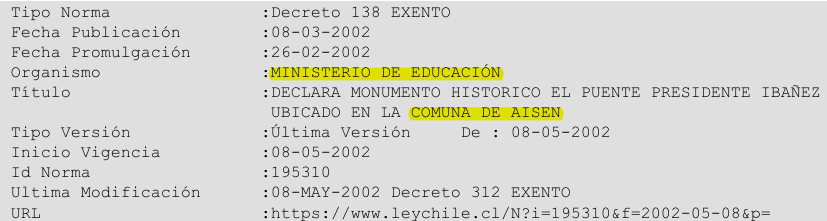
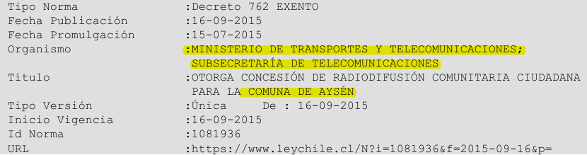
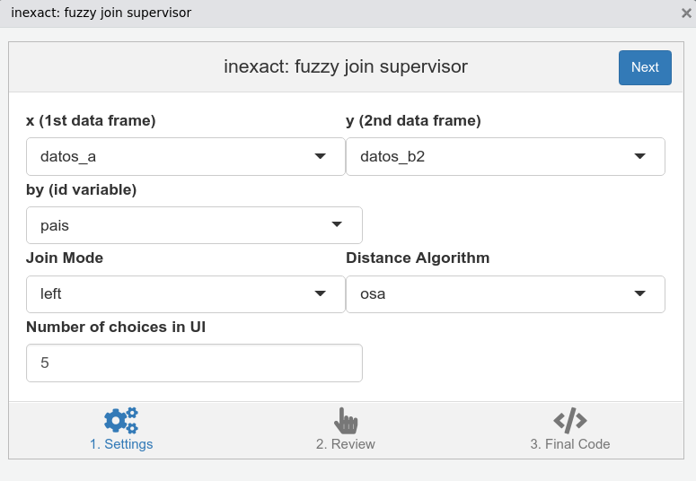
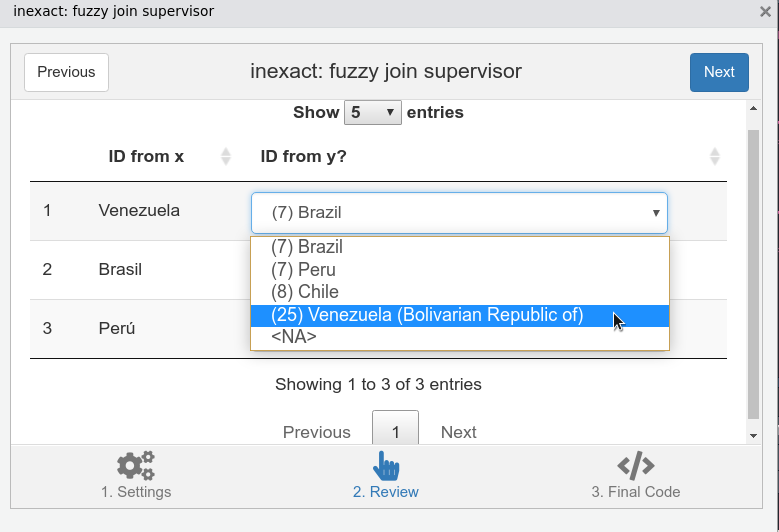
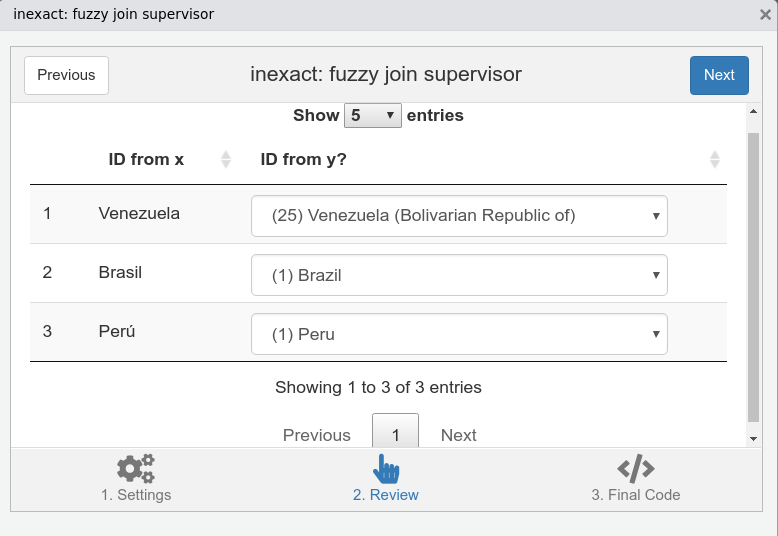

```{r include=F}
datos_a <- data.frame(
  pais  = c("Brasil", "Chile", "Perú", "Venezuela"),
  var_a = 1:4, stringsAsFactors = F
)

datos_b1 <- data.frame(
  pais   = c("Brasil", "Chile", "Perú", "Venezuela"),
  var_b1 = 11:14, stringsAsFactors = F
)

datos_b2 <- data.frame(
  pais   = c("Brazil", "Chile", "Peru", "Venezuela (Bolivarian Republic of)"),
  var_b2 = 11:14, stringsAsFactors = F
)
```


```{r xaringan-themer, include=F}
library(xaringanthemer)
mono_accent(base_color = "#0B486B", text_font_size = "20px",
            header_h1_font_size = "45px",
            header_h2_font_size = "38px",
            header_h3_font_size = "30px", 
            header_font_google = google_font("Be Vietnam",
                                             "600", "700"),
            text_font_google   = google_font("Be Vietnam",
                                             "300", "300i", "700"),
            code_font_google   = google_font("Fira Mono"),
            extra_css = list(
              "strong" = list("color" = "#0B486B",
                                "font-weight" = "bold"),
              ".inverse a" = list("color" = "#CFF09E"),
              ".inverse strong" = list("color" = "inherit",
                                       "font-weight" = "bold")
            ))
```

```{r setup, include=FALSE}
options(htmltools.dir.version = FALSE)
```

class: middle

## Índice

1. Motivación
1. Unión *fuzzy* de bases de datos
1. Supervisión reproducible con `inexact`
1. Por hacer

---

layout: true

## Unir bases de datos

.pull-left[
```{r}
datos_a
```
]

.pull-right[
```{r}
datos_b1
```
]

---

---

```{r}
merge(datos_a, datos_b1, by = "pais", all.x = T)
```

---

```{r}
dplyr::left_join(datos_a, datos_b1, by = "pais")
```

---

layout: true

## Unir bases de datos con columnas de identificación *inexactas*

.pull-left-narrower[
```{r}
datos_a
```
]

.pull-right-wider[
```{r}
datos_b2
```
]

---

---

```{r}
dplyr::left_join(datos_a, datos_b2, by = "pais")
```

---

layout: false

class: middle

.center[
```{r echo=F}

```
]

.right[
Fuente: [Biblioteca del Congreso Nacional (2019)](https://www.bcn.cl/historiapolitica/resenas_parlamentarias/wiki/Jos%C3%A9_Manuel_Edwards_Silva).
]

---

class: middle

```{r echo=F}

```

```{r echo=F}

```

.right[
Fuente: [Ley Chile (2019)](https://www.leychile.cl/).
]

---

## Soluciones

--

- Editar los datos a mano en Excel/Sheets/Calc.

--

- Explorar y editar los datos con R. Por ejemplo, con `dplyr::recode()`.

--

- Crear un algoritmo *ad hoc* usando expresiones regulares.

--

- Implementar una unión *fuzzy* de datos.


---

layout: true

## Unión *fuzzy* de datos

- Con el paquete `stringdist` ([van der Loo, 2014](https://cran.r-project.org/web/packages/stringdist/index.html)) es posible calcular una matriz de distancias entre las dos variables de identificación.

- Luego, para cada fila podríamos elegir el pareo con la mínima distancia (tal vez fijando un umbral máximo).

---

```{r}
stringdist::stringdistmatrix(
  datos_a$pais, datos_b2$pais, method = "osa", useNames = T
  )
```

---

```{r highlight.output = c(3)}
stringdist::stringdistmatrix(
  datos_a$pais, datos_b2$pais, method = "osa", useNames = T
  )
```

---

```{r highlight.output = c(2, 4)}
stringdist::stringdistmatrix(
  datos_a$pais, datos_b2$pais, method = "osa", useNames = T
  )
```

---

```{r highlight.output = c(5)}
stringdist::stringdistmatrix(
  datos_a$pais, datos_b2$pais, method = "osa", useNames = T
  )
```

---

layout: false

## Supervisar al algoritmo

--

- Podemos usar el paquete `fuzzyjoin` ([Robinson et al., 2019](https://cran.r-project.org/web/packages/fuzzyjoin/index.html)), modificar un poco sus resultados (¿fijar un umbral?), inspeccionarlos visualmente y luego hacer las modificaciones que nos parezcan pertinentes.

--

    + Contras: proceso tedioso, posibilidad de errores, no es el objetivo central del paquete.

--

- Otra alternativa fuera del ecosistema de R es utilizar `OpenRefine` ([OpenRefine, 2019](http://openrefine.org/)) junto a la extensión `reconcile-csv` ([Bauer, 2013](http://okfnlabs.org/reconcile-csv/)), que sí es una interfaz gráfica.

--

    + Contras: fuera de un ecosistema de programación, solamente un algoritmo de pareo disponible, dificultad para hacer múltiples uniones seguidas, problemas en la interfaz.

---

## `inexact`

--

- `inexact` es un addin de RStudio (GUI) que permite supervisar, de manera reproducible, la unión *fuzzy* de datos.

--

- El trabajo pesado es realizado tras bambalinas por `stringdist` ([van der Loo, 2014](https://cran.r-project.org/web/packages/stringdist/index.html)) y `fuzzyjoin` ([Robinson et al., 2019](https://cran.r-project.org/web/packages/fuzzyjoin/index.html)), `inexact` se encarga de la supervisión humana.

--

- La interfaz gráfica solo asiste en la creación de código, no modifica cosas por sí misma. Esto sigue el ejemplo de otros paquetes que implementan addins, como `questionr` ([Barnier, Briatte & Larmar, 2018](ttps://CRAN.R-project.org/package=questionr)).

--

- Su versión preliminar está [disponible en GitHub](https://github.com/arcruz0/inexact). Para instalarlo:

```{r eval=F}
remotes::install_github("arcruz0/inexact")
```


---

## Los datos de ejemplo

.pull-left-narrower[
```{r}
datos_a
```
]

.pull-right-wider[
```{r}
datos_b2
```
]

---

## `inexact`: panel inicial

.center[
```{r echo=F}

```
]

---

## `inexact`: supervisión (I)

.center[
```{r echo=F}

```
]

---

## `inexact`: supervisión (II)

.center[
```{r echo=F}

```
]

---

## `inexact`: supervisión (III)

.center[
```{r echo=F}

```
]

---

## `inexact`: código final

.center[
```{r echo=F}
knitr::include_graphics("imgs/inexact_3.png")
```
]

---

## `inexact`: resultado (I)

```{r}
inexact::inexact_join(
  x  = datos_a,
  y  = datos_b2,
  by = 'pais',
  method = 'osa',
  mode = 'left',
  custom_match = c(
   'Venezuela' = 'Venezuela (Bolivarian Republic of)'
  )
)
```

---

## `inexact`: resultado (II)

```{r}
inexact::inexact_join(
  x  = datos_a,
  y  = datos_b2,
  by = 'pais',
  method = 'osa',
  mode = 'left',
  custom_match = c(
   'Venezuela' = 'Venezuela (Bolivarian Republic of)'
  ),
  match_cols = T
)
```

---

## Por hacer

--

- Testeo con más bases.

--

- Mejor documentación, interfaz, y rendimiento.

--

- Características planificadas:

--

    + Uniones por más de una variable de identificación (distintas posibilidades de pareos *fuzzy*).

--
    + Supervisión para *clustering*.

---

class: center, middle, inverse

# **¡Gracias!**

<br>

<h3><a href='http://github.com/arcruz0/inexact/'><i class='fa fa-link fa-fw'></i>http://github.com/arcruz0/inexact/</a></h3>

<br>

<h3><a href='mailto:arcruz@uc.cl'><i class='fa fa-paper-plane fa-fw'></i> arcruz@uc.cl</a>&nbsp; <a href='http://twitter.com/arcruz0'><i class='fa fa-twitter fa-fw'></i>@arcruz0</a></h3>

