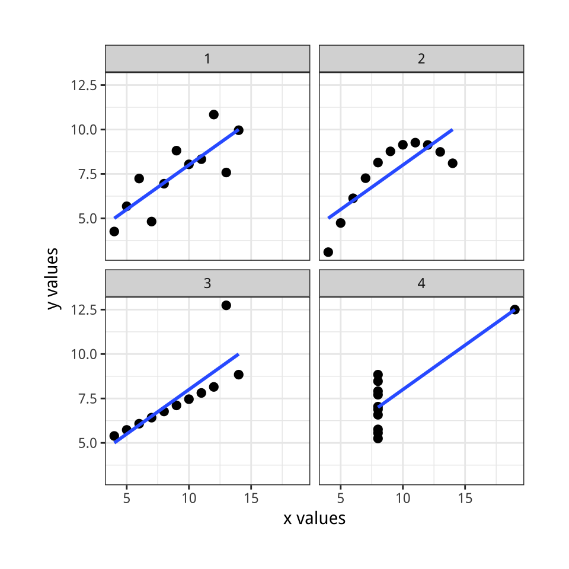
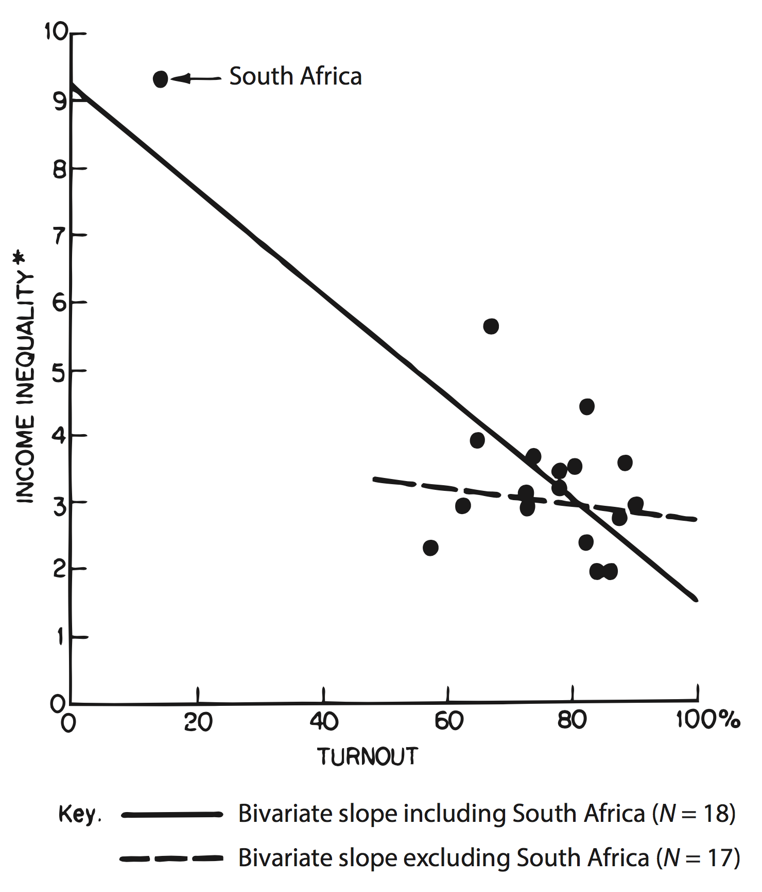
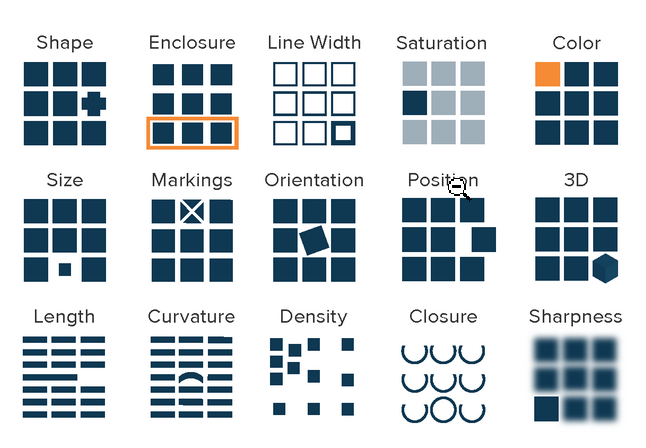
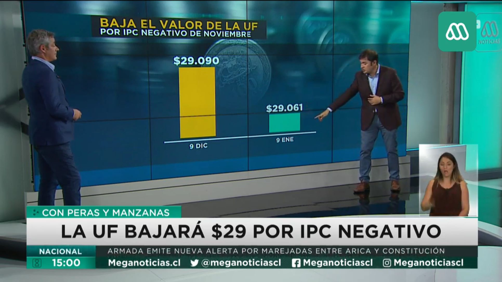

```{r xaringan-themer, include=F}
library(xaringanthemer)
style_mono_accent(base_color = "#892232", text_font_size = "23px",
                  padding	= "7px 32px 7px 32px",
                  header_h1_font_size = "36px",
                  header_h2_font_size = "32px",
                  header_h3_font_size = "28px", 
                  header_font_google = google_font("Be Vietnam",
                                                   "600", "700"),
                  text_font_google   = google_font("Be Vietnam",
                                                   "300", "300i", "700"),
                  code_font_google   = google_font("Fira Mono"),
                  extra_css = list(
                    "strong" = list("color" = "#5b1824",
                                    "font-weight" = "bold"),
                    ".inverse a" = list("color" = "#CFF09E"),
                    ".inverse strong" = list("color" = "inherit",
                                             "font-weight" = "bold")
                  ))
```

```{r setup, include=FALSE}
options(htmltools.dir.version = FALSE)
```

# Plan de la clase

- ¿Por qué visualizar datos?
- Preceptos de visualización de datos
- Gráficos en R con la gramática de gráficos (`ggplot2`)
- Tipos de gráfico

---

class: inverse, center, middle

# [¿Por qué visualizar datos? (I)](https://www.nytimes.com/interactive/2018/03/19/upshot/race-class-white-and-black-men.html)

---

# ¿Por qué visualizar datos? (II)

.pull-left[
```{r ans, echo=FALSE, eval=T, out.width="100%"}

```
]

.pull-right[
```{r ans-p, echo=FALSE, eval=T, out.width="95%"}
knitr::include_graphics("imgs/anscombe_paper.png")
```
]


Cuarteto de Anscombe. Fuente: [Healy (2018)](http://socviz.co/) y [Anscombe (1973)](https://www.jstor.org/stable/2682899).

---

# ¿Por qué visualizar datos? (III)

```{r jackman, echo=FALSE, eval=T, out.width="45%"}

```

Fuente: Jackman (1980) en [Healy (2018)](http://socviz.co/).

---

class: inverse, center, middle

# Principios de visualización de datos

<center><small>
Fuentes: Healy ([2018](http://socviz.co/)); PolicyViz ([2018a](https://policyviz.com/wp-content/uploads/2018/08/PolicyViz-DataViz-Cheatsheet_Page_1.png), [2018b](https://policyviz.com/wp-content/uploads/2018/08/PolicyViz-DataViz-Cheatsheet_Page_2.png)).
</center></small>

---

# Forma y función de la visualización

```{r formafunc, echo=FALSE, fig.cap="", eval=T, out.width="50%"}
knitr::include_graphics("imgs/forma_funcion_grafs.png")
```

Fuente: Adaptado de [PolicyViz (2018b)](https://policyviz.com/wp-content/uploads/2018/08/PolicyViz-DataViz-Cheatsheet_Page_2.png)

--

[[I, graf. 1]](https://revistapolitica.uchile.cl/index.php/RP/article/view/53180/55817): Explicativo y estático - Alcatruz & Sanhueza-Riffo (2019)

--

[[II]](https://arcruz0.github.io/libroadp/06-case-sel_es_files/figure-html/unnamed-chunk-5-1.png): Exploratorio y estático - Fynn & Nocetto (2019)

--

[[III]](https://jgendron.shinyapps.io/DataScienceSalaries2013/): Exploratorio e interactivo - Gendron (s.f.) 

--

[[IV]](https://pudding.cool/2017/05/song-repetition/): Explicativo e interactivo - The Pudding (2017)

---

class: inverse, center, middle

# Preceptos de visualización de datos

---

# Audiencia

```{r monst, echo=FALSE, eval=T, out.width="55%"}
knitr::include_graphics("imgs/monstruo.png")
```

Fuente: Holmes en [Healy (2018, cap. 1)](http://socviz.co/lookatdata.html#lookatdata).

Como en todo ejercicio de comunicación, es crucial entender quién es nuestro receptor. ¿Academia? ¿Público general? ¿Técnicos(as)?

---

# Reducir la complejidad

```{r clutter, echo=FALSE, eval=T, out.width="65%"}
knitr::include_graphics("imgs/clutter.png")
```

Fuente: [PolicyViz (2018a)](https://policyviz.com/wp-content/uploads/2018/08/PolicyViz-DataViz-Cheatsheet_Page_1.png)

Usualmente queremos maximizar el ratio de información/tinta [(Healy, 2018, cap. 1)](https://socviz.co/lookatdata.html), lo que implica evitar 3D/Colores/formas que no registren información o sean redundante.

---

# Percepciones y dimensiones (I)

```{r perc1, echo=FALSE, eval=T, out.width="65%"}

```

Fuente: [PolicyViz (2018a)](https://policyviz.com/wp-content/uploads/2018/08/PolicyViz-DataViz-Cheatsheet_Page_1.png)

---

# Percepciones y dimensiones (II)

```{r perc2, echo=FALSE, eval=T, out.width="55%"}
knitr::include_graphics("imgs/percepciones2.png")
```

Fuente: [Healy (2018, cap. 1)](http://socviz.co/lookatdata.html#lookatdata)

---

# Tamaño de los elementos

```{r include=F}
library(ggplot2)
```

```{r echo=F, message=F, eval=T, out.width="65%"}
ggplot(midwest, aes(x = popdensity, y = percblack)) +
  geom_point() +
  theme_grey(base_size = 6) +
  ggtitle("Relación entre densidad poblacional y población negra para los estados del Midwest norteamericano") +
  labs(caption = "Elaboración propia en base a Wickham (2019)")
```

---

# Escalas

```{r pinera, echo=FALSE, eval=T, out.width="90%"}

```

Fuente: Mega, 2020.

---

# Etiquetas (I)

```{r reyesh, echo=FALSE, eval=T, out.width="60%"}
knitr::include_graphics("imgs/reyesh.png")
```

Fuente: [Reyes-Housholder (2019)](https://reyes-housholder.weebly.com/uploads/8/1/0/9/81091026/10._prq_manuscript_feb_2019.pdf)

Queremos que las etiquetas de texto en nuestros gráficos sean autoexplicativas y ayuden a la lectura. Es importante colocar la fuente.

---

# Etiquetas (II)

```{r casos, echo=FALSE, eval=T, out.width="48%"}
knitr::include_graphics("imgs/casos_desv.png")
```

Fuente: [Fynn & Nocetto (2020)](https://arcruz0.github.io/libroadp/case-sel.html)

Los elementos de texto de un gráfico también guían al receptor a propósito de qué elementos concentrar su atención.

---

# Colores

--

- Las paletas de colores son importantes para transmitir correctamente información.

--

- En general, hay paletas secuenciales, divergentes y cualitativas. Veamos [Color Brewer 2.0](http://colorbrewer2.org/). Siempre queremos utilizar la correcta para nuestra visualización.

--

- Hay paletas más amigables con daltónicos(as) que otras. Para paletas cualitativas, una buena fuente es Color Brewer. Otras opciones son las paletas "colorblind" del paquete [`ggthemes`](https://rdrr.io/cran/ggthemes/man/colorblind.html).

--

- En términos de paletas de colores secuenciales, [viridis](https://youtu.be/xAoljeRJ3lU?t=1052) parece ser la más óptima, y está disponible directamente en `ggplot2`.

---

# Gusto y "sentido común"

```{r esperanza, out.width='65%', echo=FALSE}
knitr::include_graphics("imgs/esperanza.png")
```

Promedio de esperanza de vida por continente, 2007. Fuente: [Healy (2018)](http://socviz.co/lookatdata.html#what-makes-bad-figures-bad)

---

class: center, middle

# Elegir el gráfico correcto

Veamos [From Data to Viz](https://www.data-to-viz.com/#explore)

---

class: inverse, center, middle

# Gráficos en R con la gramática de gráficos

---

# Componentes de un gráfico en la "gramática de gráficos" (gg)

--

* (1) Base de datos. (2) Sistema de coordenadas. (3) Objetos geométricos o *geoms*.

--

* Los *geoms* se posicionan en el sistema de coordenadas de acuerdo a cómo mapeamos distintas **propiedades estéticas** a las variables de la base de datos (x, y, color, fill, etc.).

```{r gg, echo=FALSE, eval=T, out.width="50%"}
knitr::include_graphics("imgs/gg.png")
```

Fuente: [RStudio (2016)](https://docs.google.com/viewer?url=https://github.com/rstudio/cheatsheets/raw/master/translations/spanish/ggplot2.pdf)

---

# Tipos de gráficos y su comando en `ggplot2`

- Univariados
  + *Categórica*. 
    + Barras -- `geom_bar()`
  + *Numérica*. 
    + Histograma -- `geom_histogram()`

--

- Bivariados
  + *Distribución numérica + categórica*. 
    - Boxplots por categoría -- `geom_boxplot()`
  + *Conteo numérica + categórica*. 
    - Columnas -- `geom_col()`
  + *Numérica + numérica*. 
    - Puntos / dispersión -- `geom_point()`

---

# Datos

```{r echo=F, message=F}
library(tidyverse)
df_municipios <- read_rds("datos/datos_municipios.rds")
theme_set(theme_grey(base_size = 12))
```

```{r}
glimpse(df_municipios)
```

---

# Barras

```{r fig.height=5, fig.width=8}
ggplot(data    = df_municipios,                # datos
       mapping = aes(x = alcalde_coalicion)) + # mapeos estéticos
  geom_bar()                                   # geoms
```

---

# Histograma

```{r fig.height=5, fig.width=8}
ggplot(data    = df_municipios,
       mapping = aes(x = porc_rural)) +
  geom_histogram()
```

---

# Boxplots por categoría

```{r fig.height=5, fig.width=8}
ggplot(data    = df_municipios,
       mapping = aes(x = alcalde_coalicion, y = porc_pobres_md4)) +
  geom_boxplot()
```

---

# Columnas (I)

```{r fig.height=5, fig.width=7, message=F, warning=F}
resumen_reel_por_coal <- df_municipios %>% 
  group_by(alcalde_coalicion) %>%
  summarize(porc_alcaldes_reelectos = mean(alcalde_reelecto))

ggplot(data    = resumen_reel_por_coal,
       mapping = aes(x = alcalde_coalicion, y = porc_alcaldes_reelectos)) +
  geom_col()
```

---

# Columnas (II)

```{r fig.height=5, fig.width=8}
ggplot(data    = resumen_reel_por_coal,
       mapping = aes(x = porc_alcaldes_reelectos, 
                     y = fct_reorder(alcalde_coalicion, porc_alcaldes_reelectos))) +
  geom_col()
```

---

# Puntos

```{r fig.height=5, fig.width=8}
ggplot(data    = df_municipios,
       mapping = aes(x = porc_mapuche, y = porc_pobres_md4,
                     color = alcalde_coalicion, shape = alcalde_coalicion)) +
  geom_point()
```

---

# Etiquetas

```{r, eval=F}
... +
  labs(title = "Relación entre porcentaje de población mapuche y porcentaje de pobreza",
       subtitle = "por comunas, año 2017", caption = "Fuente: Casen (2017).",
       # ahora para los mapeos estéticos:
       x = "% de población mapuche", y = "% de población pobreza (multidimensional)",
       color = "Coalición del(la) edil", shape = "Coalición del(la) edil")
```

```{r echo=F, fig.height=5, fig.width=8}
ggplot(data    = df_municipios,
       mapping = aes(x = porc_mapuche, y = porc_pobres_md4,
                     color = alcalde_coalicion, shape = alcalde_coalicion)) +
  geom_point() +
  labs(title = "Relación entre porcentaje de población mapuche y porcentaje de pobreza",
       subtitle = "por comunas, año 2017",
       caption = "Fuente: Casen (2017).",
       # ahora para los mapeos estéticos:
       x = "% de población mapuche",
       y = "% de población pobreza (multidimensional)",
       color = "Coalición del(la) edil",
       shape = "Coalición del(la) edil")
```