# (PART) Respuestas ejercicios {-}

# Respuestas ejercicios {-}

Eliana Jung^[E-mail: epjung\@uc.cl]

Este capítulo ofrece una guía de respuestas para los ejercicios de los capítulos anteriores. En general, no hay una sola forma de resolver los ejercicios, por lo que lo siguiente debe tomarse como una guía para que compares y autoevalúes tus respuestas. 

Si eres profesor(a) y piensas utilizar el libro en tu curso de métodos, te sugerimos usar esto como una guía de preguntas y respuestas, pero incluir también otros ejercicios.

## Capítulo 1: R Básico {-}

#### Paquetes: tidyverse y paqueteadp {-}


```r
library(tidyverse)
library(remotes)
library(readr)
library(paqueteadp)
```

#### Ejercicio 1B {-}


```r
vector_salarios <- c(462.3, 431.7, 394, 355.6, 298, 297.9, 275.7, 257.3, 254.7, 156.9, 7)
mean(vector_salarios)
## [1] 290
```

#### Ejercicio 1C


```r
## install.packages("ggparliament")
library(ggparliament)
```

## Capítulo 2: Manejo de datos {-}

#### Paquetes y carga de datos {-}


```r
library(tidyverse)
library(paqueteadp)
## install.packages("skimr")
library(skimr)

data("aprobacion") 
```

#### Ejercicio 2A {-}

> Seleccione sólo las dos columnas que registran el género del presidente en la base de datos.


```r
select(aprobacion, presidente, presidente_genero) 
## # A tibble: 1,020 x 2
##   presidente         presidente_genero
##   <chr>              <chr>            
## 1 Fernando de la Rúa Masculino        
## 2 Fernando de la Rúa Masculino        
## 3 Fernando de la Rúa Masculino        
## # ... with 1,017 more rows
```

#### Ejercicio 2B {-}

> Filtrar los datos para que contengan sólo observaciones del año 2000.


```r
filter(aprobacion, anio == 2000)
## # A tibble: 68 x 11
##   pais   anio trimestre presidente presidente_gene~ aprobacion_neta   pib
##   <chr> <dbl>     <dbl> <chr>      <chr>                      <dbl> <dbl>
## 1 Arge~  2000         1 Fernando ~ Masculino                   40.1  14.0
## 2 Arge~  2000         2 Fernando ~ Masculino                   16.4  14.0
## 3 Arge~  2000         3 Fernando ~ Masculino                   24.0  14.0
## # ... with 65 more rows, and 4 more variables
```

#### Ejercicio 2C {-}

> Crear una nueva base, que está ordenada por país-trimestre del año con menos aprobación presidencial al de más alto nivel (recuerde crear un nuevo objeto y darle un nombre descriptivo). En tu nuevo objeto, conserva sólo las observaciones con mujeres como presidentas.


```r
aprobacion_presidentas <- aprobacion %>% 
  filter(presidente_genero == "Femenino") %>% 
  arrange(pais, trimestre, aprobacion_neta) 

head(aprobacion_presidentas, n = 20)
## # A tibble: 20 x 11
##   pais   anio trimestre presidente presidente_gene~ aprobacion_neta   pib
##   <chr> <dbl>     <dbl> <chr>      <chr>                      <dbl> <dbl>
## 1 Arge~  2010         1 Cristina ~ Femenino                  -18.5   52.4
## 2 Arge~  2014         1 Cristina ~ Femenino                   -6.77  52.4
## 3 Arge~  2009         1 Cristina ~ Femenino                   -5.64  50.1
## # ... with 17 more rows, and 4 more variables
```

#### Ejercicio 2D {-}

> Crear una nueva variable, que registre el desempleo como proporción en lugar de como porcentaje.


```r
aprobacion %>% 
  mutate(desempleo_proporcion = desempleo/100) %>% 
  select(pais, anio, trimestre, presidente, desempleo, desempleo_proporcion)
## # A tibble: 1,020 x 6
##   pais      anio trimestre presidente       desempleo desempleo_proporci~
##   <chr>    <dbl>     <dbl> <chr>                <dbl>               <dbl>
## 1 Argenti~  2000         1 Fernando de la ~        15                0.15
## 2 Argenti~  2000         2 Fernando de la ~        15                0.15
## 3 Argenti~  2000         3 Fernando de la ~        15                0.15
## # ... with 1,017 more rows
```

#### Ejercicio 2E {-}

> Calcular, con la ayuda de los `pipes`, la corrupción del ejecutivo medio y el PIB por país. Recuerde que puede insertar `pipes` con `Ctrl` o `Cmd` + `Shift` + `M`.


```r
aprobacion %>% 
  group_by(pais) %>% 
  summarize(promedio_corrupcion = mean(corrupcion),
            promedio_pib = mean(pib))
## # A tibble: 17 x 3
##   pais      promedio_corrupcion promedio_pib
##   <chr>                   <dbl>        <dbl>
## 1 Argentina       671977296126.         44.4
## 2 Bolivia          48568023767.         46.1
## 3 Brasil         2540610234933.         31.4
## # ... with 14 more rows
```

#### Ejercicio 2F {-}

> Una vez más, utilizando `pipes`, clasifique los países de la base de datos desde el que obtuvo el mayor promedio de PIB per cápita en el período 2010-2014 hasta el más bajo.


```r
aprobacion %>% 
  filter(anio >= 2010 & anio <= 2014) %>% 
  group_by(pais) %>% 
  summarize(promedio_pib = mean(pib)) %>% 
  arrange(-promedio_pib)
## # A tibble: 17 x 2
##   pais      promedio_pib
##   <chr>            <dbl>
## 1 Venezuela         86.6
## 2 Honduras          78.6
## 3 Guatemala         76.4
## # ... with 14 more rows
```

#### Ejercicio 2G {-}

> ¿Qué trimestre del año, entre los gobernados por mujeres presidenteas, tuvo la corrupción más alta? ¿Y la mayor aprobación neta? 


```r
aprobacion %>% 
  filter(presidente_genero == "Femenino") %>% 
  arrange(-corrupcion) %>% 
  select(pais, anio, trimestre, presidente, corrupcion)
## # A tibble: 98 x 5
##   pais    anio trimestre presidente          corrupcion
##   <chr>  <dbl>     <dbl> <chr>                    <dbl>
## 1 Brasil  2014         1 Dilma Vana Rousseff    3.14e12
## 2 Brasil  2014         2 Dilma Vana Rousseff    3.14e12
## 3 Brasil  2014         3 Dilma Vana Rousseff    3.14e12
## # ... with 95 more rows

aprobacion %>% 
  filter(presidente_genero == "Femenino") %>% 
  arrange(-aprobacion_neta) %>% 
  select(pais, anio, trimestre, presidente, aprobacion_neta)
## # A tibble: 98 x 5
##   pais    anio trimestre presidente          aprobacion_neta
##   <chr>  <dbl>     <dbl> <chr>                         <dbl>
## 1 Brasil  2013         1 Dilma Vana Rousseff            62.5
## 2 Brasil  2012         4 Dilma Vana Rousseff            60.9
## 3 Brasil  2012         2 Dilma Vana Rousseff            60.5
## # ... with 95 more rows
```

#### Ejercicio 2H {-}

> `if_else()` puede ser pensado como una versión reducida de `case_when()`: todo lo que hacemos con la primera función podría ser convertido en la sintaxis de la segunda. Traduzca uno de los ejemplos anteriores con `if_else()` a la sintaxis `case_when()`}


```r
aprobacion %>%
  mutate(d_pres_mujer = case_when(presidente_genero == "Femenino" ~ 1,
                                  presidente_genero != "Femenino" ~ 0))%>%
  select(pais:presidente, presidente_genero, d_pres_mujer)
## # A tibble: 1,020 x 6
##   pais      anio trimestre presidente       presidente_gene~ d_pres_mujer
##   <chr>    <dbl>     <dbl> <chr>            <chr>                   <dbl>
## 1 Argenti~  2000         1 Fernando de la ~ Masculino                   0
## 2 Argenti~  2000         2 Fernando de la ~ Masculino                   0
## 3 Argenti~  2000         3 Fernando de la ~ Masculino                   0
## # ... with 1,017 more rows

aprobacion %>%
  mutate(d_crisis_ec = case_when(crecimiento_pib < 0 | desempleo > 20 ~ 1,
                                 TRUE ~ 0)) %>%
  select(pais:trimestre, crecimiento_pib, desempleo, d_crisis_ec) %>%
  filter(pais == "Argentina" & anio %in% c(2001, 2013))
## # A tibble: 8 x 6
##   pais       anio trimestre crecimiento_pib desempleo d_crisis_ec
##   <chr>     <dbl>     <dbl>           <dbl>     <dbl>       <dbl>
## 1 Argentina  2001         1            -4.4      18.3           1
## 2 Argentina  2001         2            -4.4      18.3           1
## 3 Argentina  2001         3            -4.4      18.3           1
## # ... with 5 more rows
```

#### Ejercicio 2I {-}

> Crea una nueva variable que separa los países en tres grupos: “América del Norte”, “América Central” y “América del Sur”.


```r
unique(aprobacion$pais)    # Para ver los países y evitar posibles errores de tipeo/escritura
##  [1] "Argentina"   "Bolivia"     "Brasil"      "Chile"      
##  [5] "Colombia"    "Costa Rica"  "Ecuador"     "El Salvador"
##  [9] "Guatemala"   "Honduras"    "México"      "Nicaragua"  
## [13] "Panamá"      "Paraguay"    "Perú"        "Uruguay"    
## [17] "Venezuela"
```

###### Alternativa 1


```r
aprobacion %>% 
  mutate(region = case_when(pais == "México" ~ "América del Norte",
                            pais %in% c("Costa Rica", 
                                        "El Salvador", 
                                        "Guatemala",
                                        "Honduras",
                                        "Nicaragua", 
                                        "Panamá") ~ "América Central",
                            pais %in% c("Argentina", "Bolivia",
                                        "Brasil",
                                        "Chile",
                                        "Colombia",
                                        "Ecuador", 
                                        "Paraguay",
                                        "Perú",
                                        "Uruguay",
                                        "Venezuela") ~ "América del Sur")) %>% 
  select(pais:presidente,region)
## # A tibble: 1,020 x 5
##   pais       anio trimestre presidente         region         
##   <chr>     <dbl>     <dbl> <chr>              <chr>          
## 1 Argentina  2000         1 Fernando de la Rúa América del Sur
## 2 Argentina  2000         2 Fernando de la Rúa América del Sur
## 3 Argentina  2000         3 Fernando de la Rúa América del Sur
## # ... with 1,017 more rows
```


###### Alternativa 2


```r
aprobacion %>% 
  mutate(region = case_when(pais == "México" ~ "América del Norte",
                            pais %in% c("Costa Rica", 
                                        "El Salvador", 
                                        "Guatemala",
                                        "Honduras",
                                        "Nicaragua", 
                                        "Panamá") ~ "América Central",
                            TRUE ~ "América del Sur")) %>% 
  select(pais:presidente,region)
## # A tibble: 1,020 x 5
##   pais       anio trimestre presidente         region         
##   <chr>     <dbl>     <dbl> <chr>              <chr>          
## 1 Argentina  2000         1 Fernando de la Rúa América del Sur
## 2 Argentina  2000         2 Fernando de la Rúa América del Sur
## 3 Argentina  2000         3 Fernando de la Rúa América del Sur
## # ... with 1,017 more rows
```


#### Ejercicio 2J {-}

> Genera una base en formato tidy con el crecimiento medio del PIB por país-año. Convierte estos datos a un formato ancho/wide, moviendo los años a las columnas


```r
aprobacion_pib <- aprobacion %>% 
  group_by(pais, anio) %>% 
  summarize(crecimiento_pib_promedio = mean(crecimiento_pib)) 

aprobacion_pib
## # A tibble: 255 x 3
## # Groups:   pais [17]
##   pais       anio crecimiento_pib_promedio
##   <chr>     <dbl>                    <dbl>
## 1 Argentina  2000                     -0.8
## 2 Argentina  2001                     -4.4
## 3 Argentina  2002                    -10.9
## # ... with 252 more rows

aprobacion_pib_wide <- aprobacion_pib %>%
  pivot_wider(names_from = "anio", values_from = "crecimiento_pib_promedio")

aprobacion_pib_wide
## # A tibble: 17 x 16
## # Groups:   pais [17]
##   pais  `2000` `2001` `2002` `2003` `2004` `2005` `2006` `2007` `2008`
##   <chr>  <dbl>  <dbl>  <dbl>  <dbl>  <dbl>  <dbl>  <dbl>  <dbl>  <dbl>
## 1 Arge~  -0.8   -4.4  -10.9    8.8    9      8.9    8      9      4.1 
## 2 Boli~   2.51   1.68   2.49   2.71   4.17   4.42   4.80   4.56   6.15
## 3 Bras~   4.4    1.4    3.1    1.1    5.8    3.2    4      6.1    5.1 
## # ... with 14 more rows, and 6 more variables
```

## Capítulo 3: Visualización de datos {-}

#### Paquetes y carga de datos {-}


```r
library(tidyverse)
library(paqueteadp)
## install.packages("ggrepel")
library(ggrepel)

data("datos_municipales")
```

#### Ejercicio 3A {-}

> Te invitamos a jugar con `geom_text()`: cambiar los colores, el tamaño, las fuentes, etcétera.  
> 
> También te animamos a instalar paquetes que te permitan personalizar aún más tus gráficos: `ggthemes` de [**jrnorl**](https://github.com/jrnold/ggthemes) tiene temas para gráficos de programas y revistas conocidas como Excel o The Economist. Por otro lado, `hrbrthemes` de [**hrbrmstr**](https://github.com/hrbrmstr/hrbrthemes) ha elaborado algunos temas minimalistas y elegantes que harán que todos tus gráficos se vean mejor. Si te gustan los colores, puedes consultar el paquete `wespalette` de [**karthik**](https://github.com/karthik/wesanderson), una paleta cromática basada en las películas de Wes Anderson, o crear tus propias paletas basadas en imágenes con [`colorfindr`](https://github.com/zumbov2/colorfindr). Puedes encontrar más sobre esto último en el [siguiente link](https://github.com/zumbov2/colorfindr).

###### Gráfico original {-}


```r
plot_c <- ggplot(data    = datos_municipales %>% 
                   filter(anio %in% c(2004, 2008, 2012)),
                 mapping = aes(x = zona, y = ingreso, color = zona)) +
  geom_boxplot() +
  facet_wrap(~anio, ncol = 1)

plot_c
```


###### Cambiar el tamaño al texto {-}


```r
plot_c + 
  geom_text_repel(data    = datos_municipales %>% 
                    filter(ingreso > 50000000),
                  mapping = aes(label = municipalidad), 
                  size = 7)
```

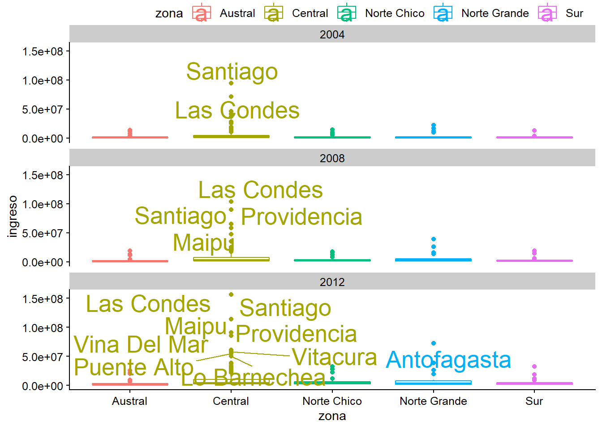

###### Cambiar el color al texto {-}


```r
plot_c + 
  geom_text_repel(data    = datos_municipales %>% 
                    filter(ingreso > 50000000),
                  mapping = aes(label = municipalidad),
                  colour = "red")

plot_c + 
  geom_text_repel(data    = datos_municipales %>% 
                    filter(ingreso > 50000000),
                  mapping = aes(label = municipalidad),
                  colour = "#56B4E9")
```

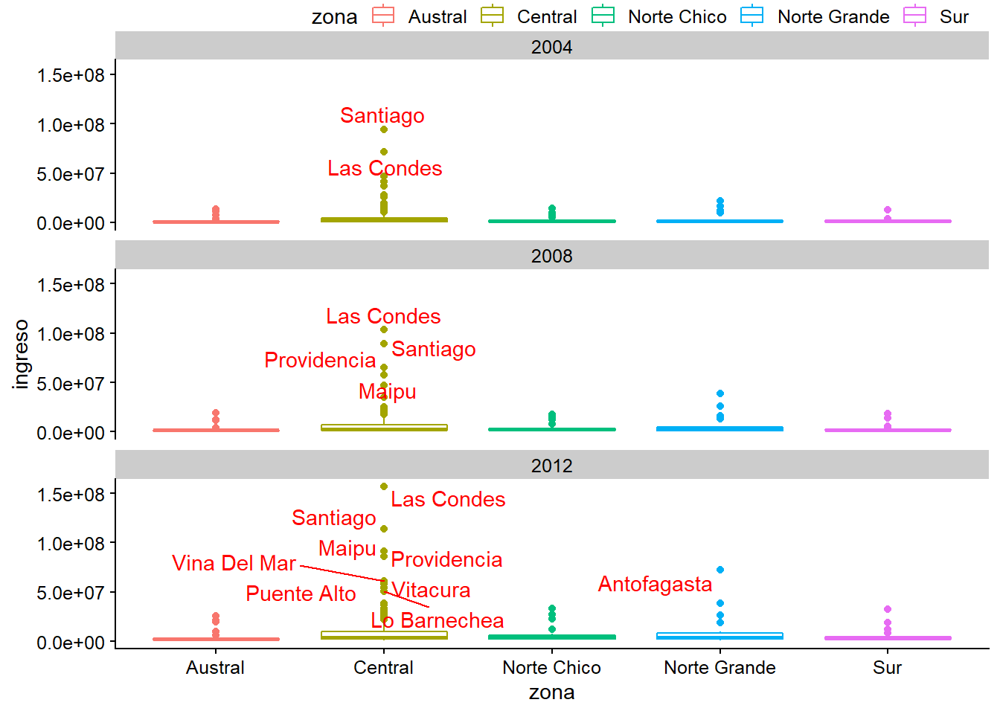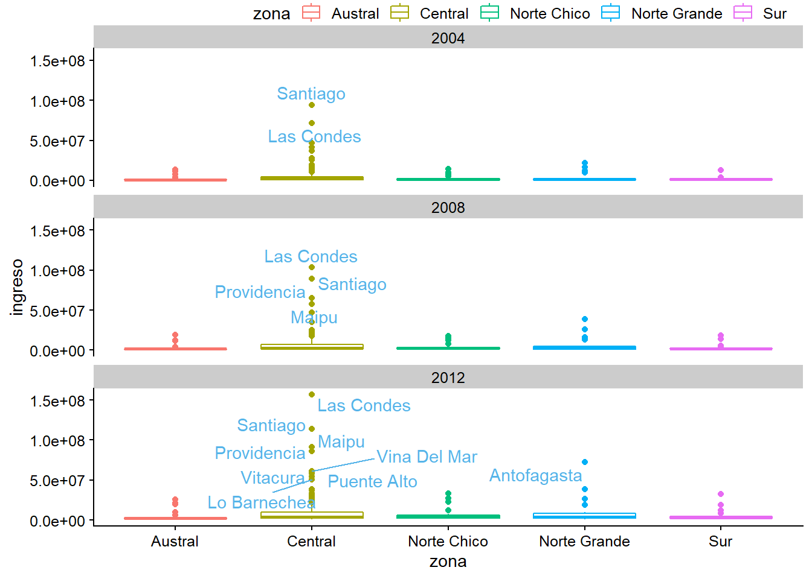

###### Cambiar la fuente y el tipo de letra {-}


```r
plot_c + 
  geom_text_repel(data    = datos_municipales %>% 
                    filter(ingreso > 50000000),
                  mapping = aes(label = municipalidad),
                  family = "serif",
                  fontface = "bold")
```

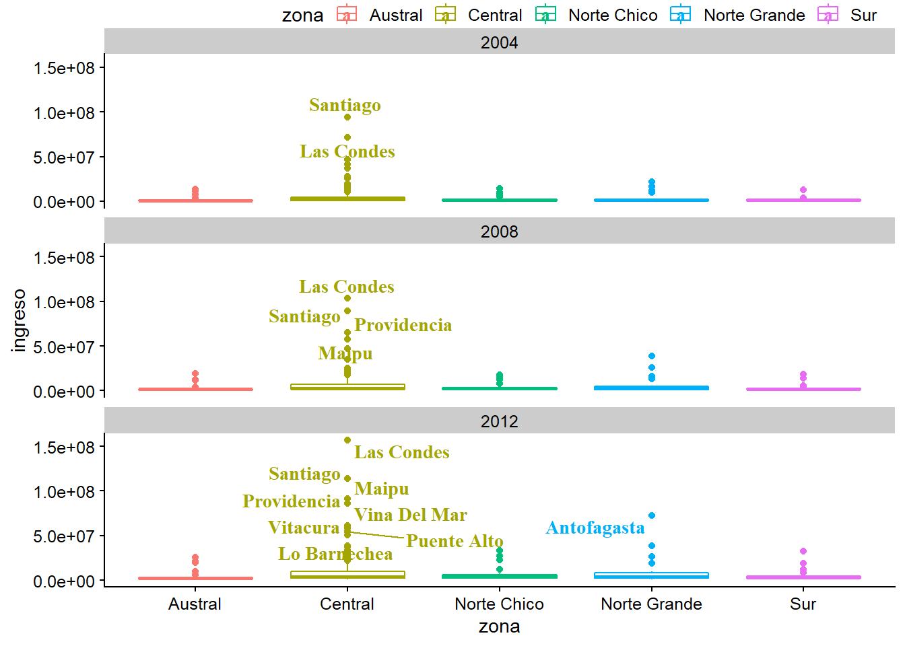

###### Cambiar el tipo de etiqueta con `geom_label_repel` {-}


```r
plot_c + 
  geom_label_repel(data    = datos_municipales %>% 
                    filter(ingreso > 50000000),
                  mapping = aes(label = municipalidad),
                  colour = "black",
                  fontface = "italic")
```


###### Otros paquetes: `ggthemes` y `hrbrthemes` {-}


```r
## install.packages("ggthemes")
## install.packages("hrbrthemes")
library(ggthemes)
library(hrbrthemes)
```

###### `ggthemes` {-}


```r
plot_c + 
  theme_economist_white()

plot_c +
  theme_solarized()
```

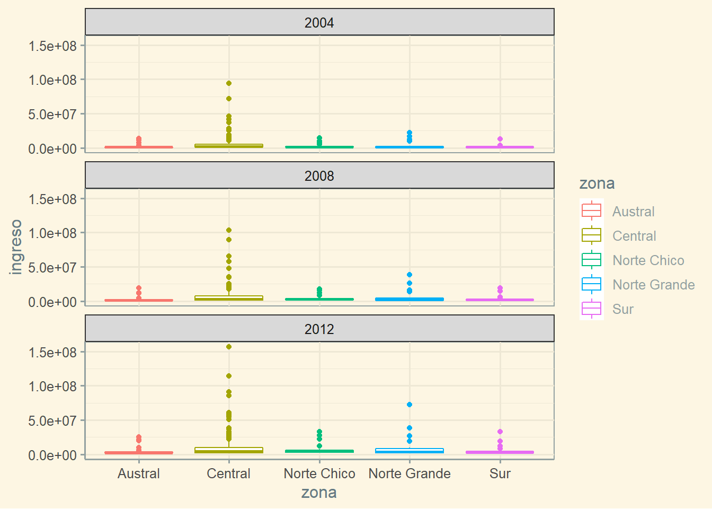

###### `hrbrthemes` {-}


```r
plot_c + 
  theme_tinyhand()
  
plot_c + 
  theme_modern_rc()
```

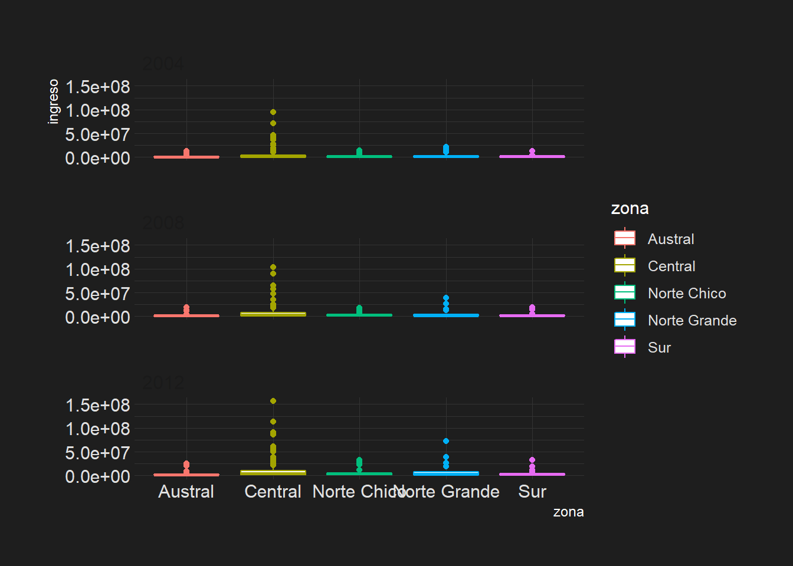


#### Ejercicio 3B {-}

> ¿Qué pasa si ponemos bins = 15 de intervalos?

###### Gráfico original {-}


```r
ggplot(data    = datos_municipales, 
       mapping = aes(x = ingreso)) +
  geom_histogram(bins = 50) +
  scale_x_continuous(labels = scales::dollar)
```

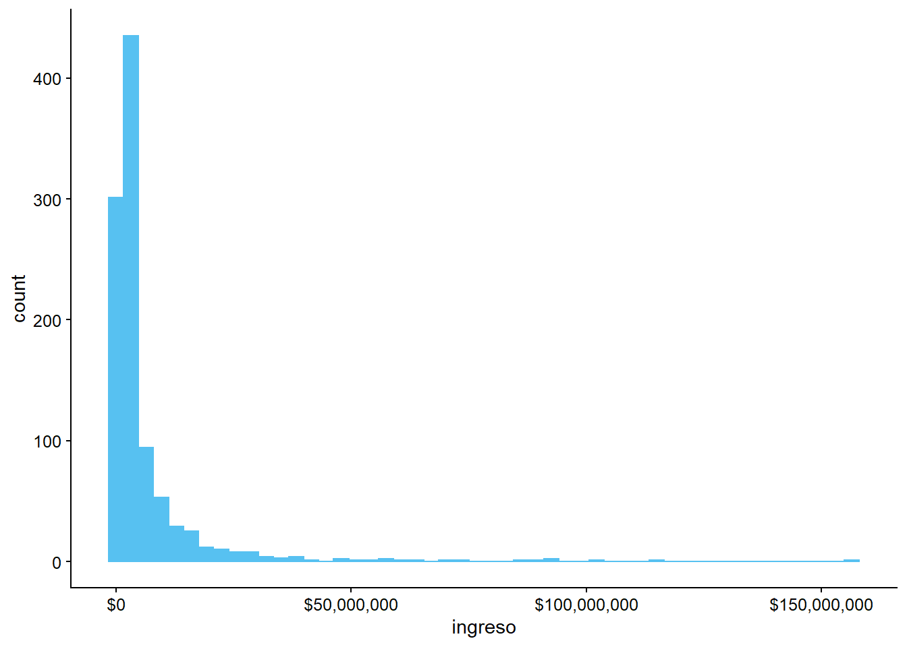

###### Cambiar tamaño de barras {-}


```r
ggplot(data    = datos_municipales, 
       mapping = aes(x = ingreso)) +
  geom_histogram(bins = 15) +
  scale_x_continuous(labels = scales::dollar)
```

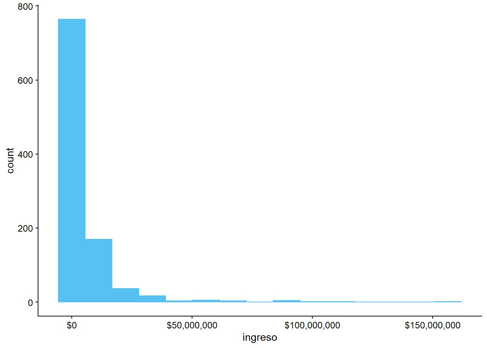

#### Ejercicio 3C {-}

> Ya hemos aprendido a hacer un histograma, sin embargo, los gráficos de densidad tienden a ser más utilizados para mirar la distribución de una variable. Usando las mismas variables, haz una gráfica de densidad con `geom_density()`


```r
ggplot(data    = datos_municipales, 
       mapping = aes(x = ingreso)) +
  geom_density() +
  scale_x_continuous(labels = scales::dollar)
```


#### Ejercicio 3D {-}

> Normalmente, los gráficos de barras se presentan con la frecuencia o proporción dentro de la barra. También podemos hacer esto con el `ggplot2`. Usando `geom_bar()` y `geom_text()`, apunta el número de alcaldes por área geográfica. Un consejo: tienes que hacer algunos cálculos con tidyverse antes de añadir esa información en la gráfica.


```r
datos_municipales %>% 
  group_by(anio) %>% 
  count(zona)
## # A tibble: 15 x 3
## # Groups:   anio [3]
##   anio  zona            n
##   <chr> <chr>       <int>
## 1 2004  Austral        59
## 2 2004  Central       203
## 3 2004  Norte Chico    23
## # ... with 12 more rows

ggplot(datos_municipales %>% 
         group_by(anio) %>% 
         count(zona),
       aes(x = zona, y = n)) + 
  geom_bar(stat = "identity") + 
  facet_grid(~ anio) + 
  geom_text(aes(label = n)) 
```


Mejoramos la presentación: 


```r
ggplot(datos_municipales %>% 
         group_by(anio) %>% 
         count(zona),
       aes(x = zona, y = n)) + 
  geom_bar(stat = "identity") + 
  facet_grid(~ anio) + 
  geom_label(aes(label = n)) + 
  labs(title = "Cantidad de alcaldes por zona",
       subtitle = "Chile",
       y = "",
       x = "") + 
  theme(axis.text.x = element_text(angle = 45, hjust = 1))   #Cambiar ángulo de etiquetas en eje x
```


#### Ejercicio 3E {-}

> Escogiendo sólo un año, haz un gráfico de líneas con geom_smooth que indique la relación entre los ingresos y la tasa de pobreza. Ahora, con annotate, haz un gráfico de caja que contenga los municipios con mayor índice de pobreza y, encima de él, escribe el nombre del municipio correspondiente.


```r
grafico1_3e <- ggplot(datos_municipales %>% 
                        filter(anio == 2004),
                      aes(x = pobreza, y = log(ingreso))) +
  geom_smooth(method = "lm", color = "#330066")

grafico1_3e
## Warning: Removed 40 rows containing non-finite values (stat_smooth).
```

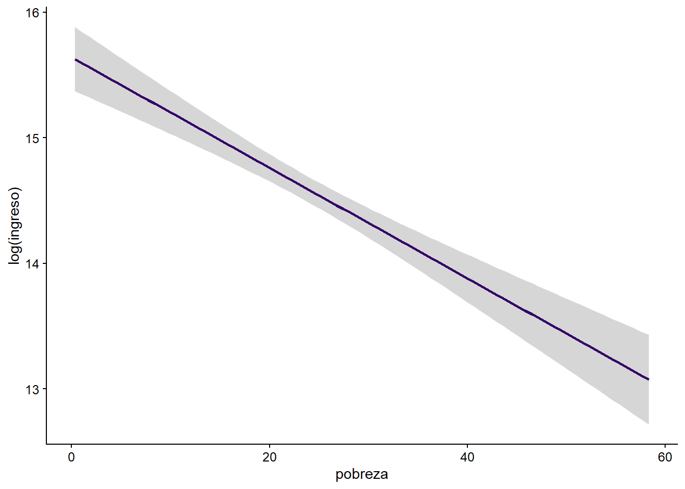

Ahora pasaremos al gráfico de cajas con las municipalidades. Para este ejercicio no vamos a filtrar las observaciones para tener sólo un año, ya que necesitamos la variación en el tiempo para crear las cajas. Vayamos paso a paso!

En primer lugar, creamos el gráfico con las cajas que representan la pobreza de los municipios. 


```r
ggplot(datos_municipales, 
       aes(x = municipalidad, y = pobreza)) + 
  geom_boxplot()
## Warning: Removed 47 rows containing non-finite values (stat_boxplot).
```


Vemos que no es muy legible, por lo que pasaremos a filtrar sólo aquellas observaciones en que el porcentaje de personas en situación de pobreza es mayor a 35%.


```r
ggplot(datos_municipales %>% 
           filter(pobreza >= 35), 
       aes(x = municipalidad, y = pobreza)) + 
  geom_boxplot() 
```

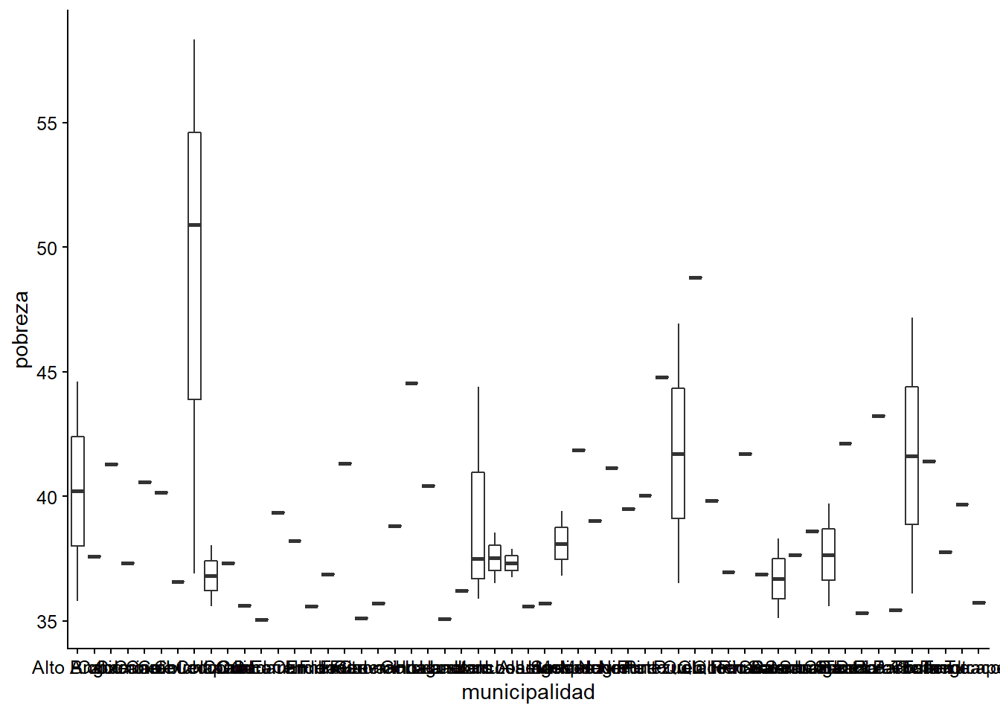

Ahora va quedando mejor, sin embargo, las etiquetas en el eje x todavía no pueden leerse. A continuación verás dos opciones de lo que se podría hacer para mejorar el gráfico (recuerda que pueden haber otras formas de hacerlo, todo depende de lo que quieras hacer y mostrar!)

###### Alternativa 1 {-}

A continuación vamos a quitar todas las etiquetas del eje X (tanto el nombre del eje como los valores del mismo)


```r
ggplot(datos_municipales %>% 
                        filter(pobreza >= 35),
       aes(x = municipalidad, y = pobreza)) + 
  geom_boxplot() + 
  theme(axis.title.x=element_blank(),                         
        axis.text.x=element_blank(),
        axis.ticks.x=element_blank())
```

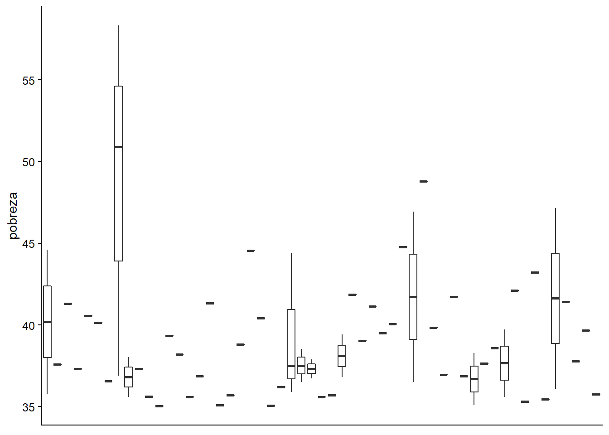

Ahora le agregamos el nombre de la municipalidad a aquellas observaciones en donde la pobreza es mayor o igual al 40%


```r
ggplot(datos_municipales %>% 
         filter(pobreza >= 35),
       aes(x = municipalidad, y = pobreza)) + 
  geom_boxplot() + 
  theme(axis.title.x=element_blank(),                         
        axis.text.x=element_blank(),
        axis.ticks.x=element_blank()) + 
  geom_text_repel(data = datos_municipales %>% 
                    filter(pobreza >= 40), aes(x = municipalidad, label = municipalidad))
```


###### Alternativa 2 {-}

Ahora en vez de sacar la información del eje X, vamos a cambiar la orientación de las etiquetas en 45°:


```r
ggplot(datos_municipales %>% 
         filter(pobreza >= 35),
       aes(x = municipalidad, y = pobreza)) + 
  geom_boxplot() + 
  theme(axis.text.x = element_text(angle = 45, hjust = 1),
        axis.title.x=element_blank()) 
```

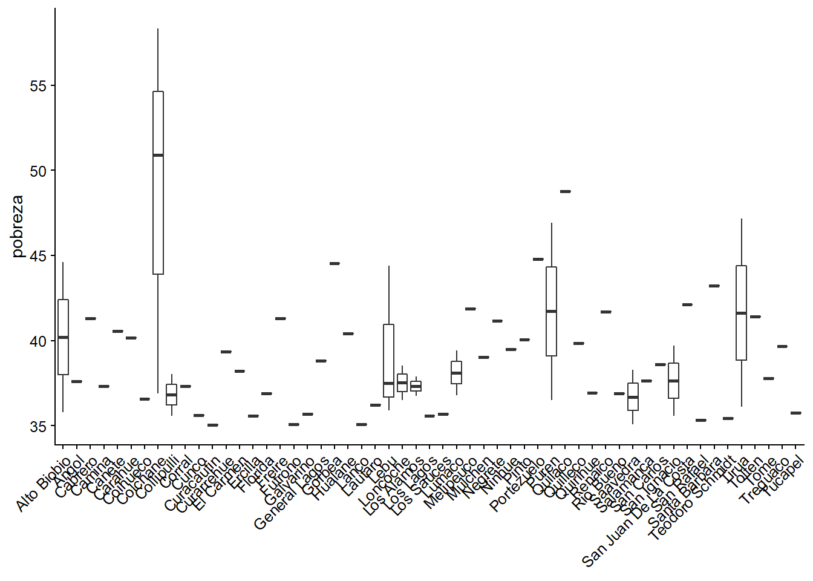

Si quisieramos, podríamos agregarle neuvamente las etiquetas de aquellas municipalidades en donde la pobreza es igual o mayor al 40%


```r
ggplot(datos_municipales %>% 
         filter(pobreza >= 35),
       aes(x = municipalidad, y = pobreza)) + 
  geom_boxplot() + 
  theme(axis.text.x = element_text(angle = 45, hjust = 1),
        axis.title.x=element_blank()) + 
  geom_text_repel(data = datos_municipales %>% 
                    filter(pobreza >= 40), aes(x = municipalidad, label = municipalidad))
```


## Capítulo 4: Carga de bases {-}

#### Paquetes y carga de datos {-}


```r
library(tidyverse)
library(paqueteadp)
library(haven)
## install.packages("readxl")
library(readxl)
library(janitor)
```

#### Ejercicio 4A {-}

> Desde la página web de Latinobarómetro, descarga la edición 2017 en formato SPSS (.sav) e impórtelas a R. Ten cuidado con las etiquetas

*Este ejercicio puede tener distintos nombres, dependiendo del nombre de las carpetas, ordenador, etc.*


```r
getwd()   #Este comando nos sirve para saber la direccion de la carpeta en la que trabajamos
## [1] "C:/Users/andres/Dropbox/Proyecto de libro/libroadp_es_v1"

df_latinobarometro2017_spss <- read_spss("00-archivos/ejercicios/capitulo 4/latinobarometro2017_sav/Latinobarometro2017Eng_v20180117.sav")

glimpse(df_latinobarometro2017_spss)   # Notamos que hay etiquetas en las variables
## Rows: 20,200
## Columns: 324
## $ NUMINVES   <dbl+lbl> 2017, 2017, 2017, 2017, 2017, 2017, 2017, 2017, ~
## $ IDENPA     <dbl+lbl> 32, 32, 32, 32, 32, 32, 32, 32, 32, 32, 32, 32, ~
## $ NUMENTRE   <dbl> 1, 2, 3, 4, 5, 6, 7, 8, 9, 10, 11, 12, 13, 14, 15, 1~
## $ REG        <dbl+lbl> 32301, 32301, 32301, 32301, 32301, 32301, 32301,~
## $ CIUDAD     <dbl+lbl> 3.2e+07, 3.2e+07, 3.2e+07, 3.2e+07, 3.2e+07, 3.2~
## $ TAMCIUD    <dbl+lbl> 7, 7, 7, 7, 7, 7, 7, 7, 7, 7, 7, 7, 7, 7, 7, 7, ~
## $ COMDIST    <dbl> 1, 1, 1, 1, 1, 1, 1, 1, 2, 2, 2, 2, 2, 2, 2, 2, 3, 3~
## $ CODIGO     <dbl> 37, 43, 37, 43, 37, 43, 43, 37, 43, 37, 37, 43, 37, ~
## $ DIAREAL    <dbl+lbl> 29, 29, 29, 29, 29, 29, 29, 29,  4,  4,  4,  4, ~
## $ MESREAL    <dbl+lbl> 7, 7, 7, 7, 7, 7, 7, 7, 8, 8, 8, 8, 8, 8, 8, 8, ~
## $ INI        <dbl> 1053, 1103, 1149, 1158, 1251, 1432, 1306, 1354, 1141~
## $ FIN        <dbl> 1128, 1146, 1227, 1241, 1346, 1505, 1351, 1422, 1212~
## $ DURA       <dbl> 35, 43, 38, 43, 55, 33, 45, 28, 31, 33, 27, 30, 37, ~
## $ TOTREVI    <dbl> 0, 0, 1, 0, 0, 0, 2, 0, 0, 0, 0, 0, 1, 0, 0, 4, 0, 0~
## $ TOTCUOT    <dbl+lbl> 0, 1, 5, 0, 1, 1, 4, 0, 0, 0, 0, 0, 0, 1, 1, 0, ~
## $ TOTRECH    <dbl+lbl> 3, 1, 3, 1, 3, 0, 1, 0, 1, 0, 0, 0, 2, 1, 2, 3, ~
## $ TOTPERD    <dbl+lbl> 0, 0, 0, 0, 0, 0, 0, 0, 0, 0, 0, 0, 0, 0, 0, 0, ~
## $ NUMCASA    <dbl+lbl> 4, 2, 4, 2, 4, 1, 2, 1, 2, 1, 1, 1, 3, 2, 3, 4, ~
## $ CODSUPER   <dbl+lbl> 1, 1, 1, 1, 1, 0, 1, 0, 0, 0, 0, 0, 0, 0, 0, 0, ~
## $ SUPERVVI   <dbl+lbl> 1, 2, 1, 1, 2, 2, 1, 2, 2, 2, 2, 2, 2, 2, 2, 2, ~
## $ SUPERVEN   <dbl+lbl> 0, 1, 1, 1, 1, 0, 0, 0, 0, 0, 0, 0, 0, 0, 0, 0, ~
## $ CODIF      <dbl+lbl> 2, 2, 2, 2, 2, 2, 2, 2, 2, 2, 2, 2, 2, 2, 2, 2, ~
## $ DIGIT      <dbl+lbl> 1, 1, 1, 1, 1, 1, 1, 1, 1, 1, 1, 1, 1, 1, 1, 1, ~
## $ WT         <dbl+lbl> 1.58, 0.71, 1.00, 0.71, 0.71, 0.71, 0.71, 0.71, ~
## $ P1ST       <dbl+lbl> 3, 3, 1, 2, 2, 3, 1, 1, 1, 1, 1, 1, 1, 1, 1, 3, ~
## $ P2ST       <dbl+lbl>  2,  2, NA,  1,  1,  3,  1,  2,  1,  2,  2,  3, ~
## $ P3STGBS    <dbl+lbl>  7, 25,  6, 13,  6,  6, 13,  6, 15, 25, 25,  7, ~
## $ P4STGBSC   <dbl+lbl> 4, 3, 3, 4, 2, 4, 3, 3, 2, 4, 3, 4, 3, 5, 3, 4, ~
## $ P5STGBS    <dbl+lbl> 4, 4, 2, 4, 3, 5, 4, 4, 3, 4, 4, 4, 4, 4, 2, 5, ~
## $ P6STICC1   <dbl+lbl>  2,  2,  2,  2,  3,  4,  1,  4,  4,  4, NA, NA, ~
## $ P7STGBS    <dbl+lbl>  3,  3,  1,  2,  3,  2,  2,  3,  2,  2,  2,  3, ~
## $ P8STGBS    <dbl+lbl>  2,  1,  1,  1,  1,  1,  1,  1,  3,  2,  3,  1, ~
## $ P9STGBSC.A <dbl+lbl>  3,  3,  1,  3,  2,  2,  3,  1,  4,  1,  3,  2, ~
## $ P9STGBS.B  <dbl+lbl> 3, 4, 3, 3, 2, 4, 3, 4, 2, 3, 3, 3, 4, 4, 4, 3, ~
## $ P10ST      <dbl+lbl>  1,  1,  2, NA,  1,  1,  2,  1,  2,  2,  1,  1, ~
## $ P11STGBSC  <dbl+lbl>  1,  6,  8,  6,  7,  6, 10,  5,  8,  7,  5, 10, ~
## $ P12STC     <dbl+lbl> 16, 16,  1,  1,  1,  2,  1,  3, 97,  1,  3, 97, ~
## $ P13STGBS   <dbl+lbl> 2, 2, 2, 2, 2, 2, 2, 2, 2, 2, 2, 2, 2, 2, 2, 2, ~
## $ P14STGBS.A <dbl+lbl> 2, 4, 2, 1, 1, 3, 1, 3, 1, 3, 2, 2, 3, 3, 3, 3, ~
## $ P14STGBS.B <dbl+lbl> 2, 4, 2, 3, 3, 4, 2, 2, 4, 4, 3, 2, 4, 3, 3, 2, ~
## $ P14ST.C    <dbl+lbl> NA,  3,  2,  1,  1,  1,  1,  1,  2,  2,  4,  2, ~
## $ P14ST.D    <dbl+lbl>  2,  4,  3,  3,  3,  3,  3,  4,  4,  2,  1,  2, ~
## $ P14ST.E    <dbl+lbl> 2, 4, 2, 1, 1, 4, 1, 2, 2, 4, 3, 3, 4, 4, 4, 4, ~
## $ P14ST.F    <dbl+lbl>  2,  4,  2,  4,  1,  3,  2,  1,  4,  4,  2,  2, ~
## $ P14ST.G    <dbl+lbl> 3, 3, 3, 4, 4, 4, 3, 4, 3, 4, 2, 2, 4, 4, 3, 3, ~
## $ P14ST.H    <dbl+lbl>  2,  3,  2,  2,  3,  3,  1,  4,  4,  4,  3,  2, ~
## $ P15ST.A    <dbl+lbl> 0, 0, 1, 1, 0, 0, 0, 0, 0, 1, 0, 1, 0, 1, 0, 1, ~
## $ P15ST.B    <dbl+lbl> 0, 0, 0, 1, 0, 0, 0, 0, 0, 0, 0, 0, 0, 0, 0, 1, ~
## $ P15ST.C    <dbl+lbl> 0, 0, 0, 1, 0, 0, 0, 0, 0, 0, 0, 0, 0, 0, 0, 0, ~
## $ P15ST.D    <dbl+lbl> 0, 0, 0, 0, 0, 0, 0, 0, 0, 0, 1, 1, 0, 0, 0, 0, ~
## $ P15ST.E    <dbl+lbl> 0, 0, 0, 1, 1, 0, 0, 0, 1, 0, 0, 0, 0, 0, 0, 1, ~
## $ P15ST.F    <dbl+lbl> 0, 1, 0, 0, 1, 0, 0, 0, 0, 0, 0, 1, 0, 0, 0, 0, ~
## $ P15ST.G    <dbl+lbl> 0, 0, 1, 1, 0, 0, 0, 1, 0, 0, 1, 1, 0, 0, 0, 0, ~
## $ P15ST.H    <dbl+lbl> 0, 0, 0, 1, 0, 0, 0, 0, 0, 0, 0, 0, 0, 0, 0, 0, ~
## $ P15ST.I    <dbl+lbl> 1, 1, 1, 1, 1, 1, 1, 1, 0, 0, 0, 0, 0, 1, 1, 1, ~
## $ P15ST.J    <dbl+lbl> 0, 0, 0, 0, 0, 0, 0, 0, 0, 0, 0, 0, 0, 0, 0, 0, ~
## $ P15ST.K    <dbl+lbl> 0, 0, 0, 0, 0, 0, 0, 0, 0, 0, 0, 0, 1, 0, 0, 0, ~
## $ P16STGBS   <dbl+lbl>    NA,    95, 32044, 32006, 32044, 32001,    NA,~
## $ P16STGBS.A <dbl+lbl> NA, NA,  1,  1,  1,  2, NA,  2,  1,  2, NA,  2, ~
## $ PERPART    <dbl+lbl> 4, 4, 1, 1, 1, 2, 4, 2, 1, 2, 4, 2, 4, 4, 2, 2, ~
## $ FAMPART    <dbl+lbl>  0,  0, 30, 60, 30, 30,  0, 30, 30, 30,  0, 30, ~
## $ P17STGBSC  <dbl+lbl> 2, 1, 1, 1, 1, 2, 1, 2, 1, 2, 2, 2, 2, 2, 2, 2, ~
## $ P18GBS     <dbl+lbl> 3, 3, 2, 3, 2, 5, 2, 1, 4, 2, 3, 2, 2, 3, 3, 3, ~
## $ P19STC     <dbl+lbl>  0,  5,  8, NA,  8,  4,  5,  5,  5,  8,  5,  6, ~
## $ P20ST      <dbl+lbl>  3,  3, NA,  3,  3,  3,  3,  3,  2,  3,  1,  3, ~
## $ P21ST.A    <dbl+lbl>  1,  2,  2,  2, NA,  1,  2,  3,  4,  2,  2,  2, ~
## $ P21ST.B    <dbl+lbl>  2,  2,  3,  3,  4,  2,  3,  2, NA,  2,  1,  2, ~
## $ P21ST.C    <dbl+lbl>  1,  3,  1,  1,  2,  2,  2,  1, NA,  2,  2,  1, ~
## $ P21ST.D    <dbl+lbl> 2, 2, 1, 1, 3, 2, 3, 1, 1, 2, 3, 2, 2, 3, 2, 2, ~
## $ P21ST.E    <dbl+lbl> 2, 3, 3, 1, 3, 3, 3, 3, 4, 2, 2, 3, 2, 3, 2, 2, ~
## $ P21ST.F    <dbl+lbl>  2,  2,  2,  2, NA,  3,  2,  2,  2,  2,  2,  3, ~
## $ P21ST.G    <dbl+lbl>  2,  2,  1,  2,  4,  2,  3,  4,  2,  2,  2,  2, ~
## $ P21ST.H    <dbl+lbl> 2, 3, 1, 1, 4, 2, 3, 2, 1, 2, 1, 1, 1, 2, 2, 2, ~
## $ P22ST      <dbl+lbl> 4, 3, 1, 1, 1, 2, 1, 2, 3, 2, 3, 2, 2, 4, 2, 2, ~
## $ P23STC     <dbl+lbl> 1, 2, 1, 1, 1, 2, 1, 2, 1, 1, 2, 1, 1, 2, 1, 4, ~
## $ P24STC     <dbl+lbl>  2,  2,  1,  1,  1,  1,  3, NA,  1,  2,  2,  1, ~
## $ P25STTI    <dbl+lbl> 2, 1, 1, 1, 1, 1, 2, 1, 1, 2, 4, 1, 2, 3, 1, 1, ~
## $ P26ST      <dbl+lbl> 2, 2, 4, 4, 2, 2, 4, 4, 1, 2, 2, 2, 4, 3, 2, 1, ~
## $ P27ST      <dbl+lbl>  2,  2,  1,  3,  1,  2,  1,  2,  2,  2,  2,  2, ~
## $ P28N.A     <dbl+lbl> 8, 8, 8, 8, 8, 2, 1, 2, 2, 8, 2, 8, 8, 2, 8, 8, ~
## $ P28N.B     <dbl+lbl>  8,  8,  2,  2,  8,  2,  1,  2,  2,  8,  2,  8, ~
## $ P28N.C     <dbl+lbl> 2, 8, 8, 8, 8, 2, 2, 8, 8, 8, 2, 8, 8, 1, 8, 8, ~
## $ P28N.D     <dbl+lbl>  8,  8,  8,  8,  8,  2,  8,  2,  2,  8,  2,  8, ~
## $ P28N.E     <dbl+lbl>  8,  1,  2,  2,  2,  2,  2,  2,  2,  8,  2,  8, ~
## $ P28N.F     <dbl+lbl>  8,  8,  2,  2,  2,  2,  2,  2,  2,  8,  2,  8, ~
## $ P29NSPA    <dbl+lbl> 0, 0, 0, 1, 1, 0, 0, 0, 1, 1, 1, 1, 0, 1, 1, 0, ~
## $ P29NSPB    <dbl+lbl> 0, 0, 0, 1, 0, 0, 0, 0, 0, 0, 0, 0, 0, 0, 0, 1, ~
## $ P29NSPC    <dbl+lbl> 0, 1, 0, 1, 0, 0, 0, 0, 1, 0, 0, 0, 0, 1, 0, 0, ~
## $ P29NSPD    <dbl+lbl> 0, 0, 0, 1, 0, 0, 0, 1, 1, 0, 0, 0, 0, 0, 0, 0, ~
## $ P29NSPE    <dbl+lbl> 0, 0, 0, 0, 0, 0, 0, 0, 0, 0, 0, 0, 0, 0, 0, 0, ~
## $ P29NSPF    <dbl+lbl> 0, 0, 0, 0, 0, 0, 0, 0, 0, 0, 0, 0, 0, 0, 0, 0, ~
## $ P29NSPG    <dbl+lbl> 0, 0, 0, 0, 0, 0, 0, 0, 0, 0, 0, 0, 0, 0, 0, 0, ~
## $ P29NSPH    <dbl+lbl> 1, 1, 1, 1, 1, 1, 0, 1, 1, 0, 0, 0, 1, 1, 0, 0, ~
## $ P29NSPI    <dbl+lbl> 0, 0, 0, 1, 0, 0, 1, 0, 1, 0, 0, 1, 0, 0, 1, 0, ~
## $ P29NSPJ    <dbl+lbl> 0, 1, 1, 1, 0, 0, 0, 0, 1, 0, 0, 0, 0, 1, 0, 0, ~
## $ P29NSPZ    <dbl+lbl> 0, 0, 0, 0, 0, 0, 0, 0, 0, 0, 0, 0, 0, 0, 0, 0, ~
## $ P29NSPX    <dbl+lbl> 0, 0, 0, 0, 0, 0, 0, 0, 0, 0, 0, 0, 0, 0, 0, 0, ~
## $ P30NSP     <dbl+lbl> 10, 10,  8,  1,  9, 10,  5,  1,  1, 10, 10,  1, ~
## $ P31NSP     <dbl+lbl> NA, NA,  1,  1,  3, NA,  1,  1,  1, NA, NA,  1, ~
## $ P32NSP.A   <dbl+lbl> NA, NA,  2,  1,  1, NA,  1,  1,  1, NA, NA,  6, ~
## $ P33NSP     <dbl+lbl> NA, NA,  1,  1,  1, NA,  1,  1,  1, NA, NA,  2, ~
## $ P34NA      <dbl+lbl> NA, NA, NA,  1,  9, NA, NA, 24, NA, NA, NA,  1, ~
## $ P34NB      <dbl+lbl> 99, 99, 10,  0,  0, 99, 15,  0, 20, 99, 99,  0, ~
## $ P35NC      <dbl+lbl>  1,  1,  3,  2,  0,  1,  1,  1,  0,  2,  0,  3, ~
## $ P36C       <dbl+lbl> 2, 1, 2, 1, 1, 2, 2, 2, 2, 2, 2, 2, 2, 2, 2, 2, ~
## $ P37NC      <dbl+lbl> NA,  2,  1,  2,  1,  1,  1,  1,  1,  2,  1,  1, ~
## $ P38ST      <dbl+lbl>  4,  2,  1,  4,  1,  4,  2,  3,  2,  3,  1,  2, ~
## $ P39STTI    <dbl+lbl>  3,  3,  4,  3,  4,  2,  3,  3,  4,  2,  2,  2, ~
## $ P40NC_A    <dbl+lbl>  1, NA,  2, NA,  0, NA,  2, NA,  2, NA,  1, NA, ~
## $ P40NC_B    <dbl+lbl> NA,  2, NA,  1, NA,  2, NA,  1, NA,  1, NA,  2, ~
## $ P41STC.A   <dbl+lbl>  1,  5,  4, NA,  5,  5,  5,  4,  5,  4,  1,  4, ~
## $ P41STC.B   <dbl+lbl>  2,  5,  4, NA,  5,  5,  3,  2,  5,  4,  1,  3, ~
## $ P41STC.C   <dbl+lbl>  2, NA,  2, NA,  5,  5,  2,  2,  5,  4,  1,  3, ~
## $ P42NC.A    <dbl+lbl>  5,  5,  7, 10,  7,  3,  7,  5, 10,  7,  6,  7, ~
## $ P42NC.B    <dbl+lbl>  5,  6,  7,  4,  8,  1,  9,  5,  5,  6,  6,  8, ~
## $ P42NC.C    <dbl+lbl>  2,  6,  8,  6, NA,  1,  9,  8,  2,  8,  0,  9, ~
## $ P42NC.D    <dbl+lbl>  6,  6,  3, 10,  7, 10,  8,  5, 10,  8,  0,  8, ~
## $ P42NC.E    <dbl+lbl>  6,  4,  5, 10,  8,  5,  4,  5, 10,  8,  0,  7, ~
## $ P42NC.F    <dbl+lbl>  6,  4,  5, 10, 10, NA,  1,  7, 10,  7,  0,  7, ~
## $ P43ST.A    <dbl+lbl>  2,  1,  1,  1,  1,  2,  1,  1,  4,  1,  1,  2, ~
## $ P43ST.B    <dbl+lbl>  2,  1,  2,  1,  1,  2,  1,  1,  4,  1,  1,  2, ~
## $ P44N       <dbl+lbl>  5,  3,  5, NA,  5,  5,  4,  2,  6,  3,  3,  5, ~
## $ P45ST.A    <dbl+lbl>  2,  2,  2,  4,  2,  4,  3,  2,  2,  2,  2,  2, ~
## $ P45N.B     <dbl+lbl> NA,  3, NA, NA, NA, NA,  3, NA, NA, NA,  2, NA, ~
## $ P45ST.C    <dbl+lbl>  2,  2,  2,  2,  2, NA,  2, NA,  2, NA,  2,  2, ~
## $ P45ST.D    <dbl+lbl> NA, NA,  1,  2,  2, NA,  1, NA,  3, NA,  2, NA, ~
## $ P45ST.E    <dbl+lbl> NA,  2,  3, NA, NA, NA,  2, NA,  3, NA,  2, NA, ~
## $ P45N.F     <dbl+lbl>  4,  3, NA, NA, NA, NA,  2, NA,  3, NA,  2, NA, ~
## $ P46ST.A    <dbl+lbl> NA,  2,  2,  2,  1,  3,  2, NA,  2,  2, NA,  2, ~
## $ P46ST.B    <dbl+lbl> NA,  3, NA, NA,  3, NA,  2, NA, NA, NA, NA, NA, ~
## $ P46ST.C    <dbl+lbl>  2,  3,  2, NA,  2, NA,  1, NA,  2, NA, NA, NA, ~
## $ P46ST.D    <dbl+lbl>  2,  3,  2,  2,  3, NA,  2, NA,  3, NA, NA, NA, ~
## $ P46STM.E   <dbl+lbl> NA,  4, NA, NA,  3, NA,  3, NA,  3, NA, NA, NA, ~
## $ P47N       <dbl+lbl>  2,  3,  1,  3,  2,  4,  1,  1,  1,  3,  3,  3, ~
## $ P48STM     <dbl+lbl>  1,  1,  1,  2,  1,  1,  1, NA,  2,  2, NA,  1, ~
## $ P49STA.1   <dbl+lbl> 2, 1, 1, 1, 1, 2, 1, 2, 1, 2, 1, 1, 1, 2, 1, 2, ~
## $ P49STA.2   <dbl+lbl> 2, 2, 1, 2, 1, 2, 1, 2, 1, 2, 2, 2, 2, 2, 2, 2, ~
## $ P49STA.3   <dbl+lbl> 2, 2, 2, 2, 2, 2, 2, 2, 2, 2, 2, 2, 2, 2, 2, 2, ~
## $ P49STA.4   <dbl+lbl> 1, 1, 1, 1, 1, 2, 1, 2, 2, 2, 2, 2, 2, 2, 2, 2, ~
## $ P49STA.5   <dbl+lbl> 2, 2, 2, 2, 2, 1, 2, 2, 2, 2, 1, 2, 2, 2, 2, 2, ~
## $ P49STA.6   <dbl+lbl> 2, 2, 2, 2, 1, 2, 2, 2, 2, 2, 2, 2, 2, 2, 2, 2, ~
## $ P49STA.7   <dbl+lbl> 1, 1, 1, 1, 1, 1, 1, 2, 1, 2, 1, 1, 2, 2, 1, 2, ~
## $ P49STA.8   <dbl+lbl> 2, 1, 1, 1, 1, 2, 1, 2, 2, 2, 1, 2, 2, 2, 2, 2, ~
## $ P49STB.1   <dbl+lbl> NA,  2,  2,  3,  3, NA,  1, NA,  2, NA,  2,  1, ~
## $ P49STB.2   <dbl+lbl> NA, NA,  2, NA,  1, NA,  3, NA,  2, NA, NA, NA, ~
## $ P49STB.3   <dbl+lbl> NA, NA, NA, NA, NA, NA, NA, NA, NA, NA, NA, NA, ~
## $ P49STB.4   <dbl+lbl>  2,  2, NA,  3,  1, NA,  2, NA, NA, NA, NA, NA, ~
## $ P49STB.5   <dbl+lbl> NA, NA, NA, NA, NA, NA, NA, NA, NA, NA,  2, NA, ~
## $ P49STB.6   <dbl+lbl> NA, NA, NA, NA,  1, NA, NA, NA, NA, NA, NA, NA, ~
## $ P49STB.7   <dbl+lbl>  2,  4,  2,  4,  3, NA,  3, NA,  4, NA,  1,  2, ~
## $ P49STB.8   <dbl+lbl> NA,  4,  2,  4,  3, NA,  3, NA, NA, NA,  1, NA, ~
## $ P50STM     <dbl+lbl> NA,  4,  1,  1,  2, 97,  4, NA,  7, NA, NA, NA, ~
## $ P51STMA    <dbl+lbl> 0, 1, 0, 1, 1, 0, 0, 0, 1, 1, 0, 1, 0, 0, 0, 0, ~
## $ P51STMB    <dbl+lbl> 1, 1, 1, 0, 1, 1, 1, 0, 1, 0, 1, 1, 1, 1, 0, 1, ~
## $ P51STMC    <dbl+lbl> 0, 0, 1, 1, 1, 0, 1, 1, 1, 0, 0, 1, 0, 0, 0, 0, ~
## $ P51STMD    <dbl+lbl> 0, 0, 1, 1, 1, 0, 0, 0, 1, 0, 0, 1, 0, 0, 0, 0, ~
## $ P51STME    <dbl+lbl> 0, 0, 0, 1, 1, 0, 1, 0, 1, 0, 0, 1, 1, 0, 1, 0, ~
## $ P51STMF    <dbl+lbl> 0, 0, 0, 1, 1, 0, 0, 0, 1, 0, 0, 1, 0, 1, 0, 0, ~
## $ P51STMG    <dbl+lbl> 0, 0, 0, 1, 1, 1, 1, 0, 1, 0, 0, 1, 1, 1, 0, 0, ~
## $ P51STMH    <dbl+lbl> 0, 0, 0, 1, 0, 0, 1, 0, 1, 0, 0, 1, 0, 0, 0, 0, ~
## $ P51STMI    <dbl+lbl> 0, 0, 0, 1, 0, 0, 1, 0, 1, 0, 0, 1, 0, 0, 0, 0, ~
## $ P51STMJ    <dbl+lbl> 0, 0, 1, 1, 0, 0, 1, 0, 1, 0, 0, 1, 0, 0, 0, 0, ~
## $ P51STMK    <dbl+lbl> 0, 1, 0, 1, 0, 1, 1, 0, 1, 0, 0, 1, 0, 0, 0, 0, ~
## $ P51STMZ    <dbl+lbl> 0, 0, 0, 0, 0, 0, 0, 0, 0, 0, 0, 0, 0, 0, 0, 0, ~
## $ P52NA      <dbl+lbl> 1, 0, 1, 1, 0, 0, 1, 1, 0, 1, 1, 1, 1, 0, 1, 1, ~
## $ P52NB      <dbl+lbl> 0, 1, 0, 0, 1, 1, 1, 0, 0, 0, 0, 0, 0, 0, 0, 0, ~
## $ P52NC      <dbl+lbl> 0, 0, 0, 1, 0, 0, 0, 0, 0, 0, 0, 1, 0, 0, 0, 0, ~
## $ P52ND      <dbl+lbl> 0, 0, 1, 0, 0, 0, 1, 0, 0, 0, 0, 0, 0, 0, 0, 0, ~
## $ P52NE      <dbl+lbl> 0, 0, 0, 1, 0, 0, 1, 0, 1, 0, 0, 1, 0, 0, 0, 0, ~
## $ P52NF      <dbl+lbl> 0, 0, 0, 0, 0, 0, 0, 0, 0, 0, 0, 1, 0, 0, 0, 0, ~
## $ P52NZ      <dbl+lbl> 0, 0, 0, 0, 0, 0, 0, 0, 0, 0, 0, 0, 0, 1, 0, 0, ~
## $ P53ST.A    <dbl+lbl>  2,  2,  2,  2,  1,  2,  1,  1,  2,  1,  1,  3, ~
## $ P53N.B     <dbl+lbl>  2,  3,  1,  2,  2,  2,  3,  4,  1,  2,  2,  2, ~
## $ P53N.C     <dbl+lbl>  2,  3,  3, NA,  4,  2,  3,  4,  3,  4, NA,  3, ~
## $ P53N.D     <dbl+lbl>  1,  3,  3,  1,  2,  2,  4,  4,  3,  1,  4,  4, ~
## $ P53N.E     <dbl+lbl>  2,  2,  2,  2,  1,  1,  1,  1,  2,  1,  2,  2, ~
## $ P53N.F     <dbl+lbl>  2,  2,  1,  1,  2,  2,  3,  4,  2,  1,  2,  3, ~
## $ P53N.G     <dbl+lbl>  2,  2,  1,  1,  2,  2,  3,  4,  2,  1,  2,  3, ~
## $ P53N.H     <dbl+lbl>  1,  2,  1,  1,  1,  2,  1,  4,  1,  1,  2,  1, ~
## $ P53N.I     <dbl+lbl>  1,  1,  1,  1,  1,  3,  1,  1,  1,  1,  4,  1, ~
## $ P54STMA    <dbl+lbl> 0, 0, 0, 0, 0, 0, 0, 0, 0, 0, 1, 0, 0, 0, 0, 0, ~
## $ P54STMB    <dbl+lbl> 0, 0, 1, 0, 1, 0, 0, 0, 0, 0, 0, 0, 0, 0, 0, 1, ~
## $ P54STMC    <dbl+lbl> 0, 0, 0, 0, 0, 0, 0, 0, 0, 1, 0, 0, 0, 0, 1, 0, ~
## $ P54STMD    <dbl+lbl> 0, 0, 0, 1, 0, 0, 0, 0, 0, 0, 0, 0, 0, 0, 0, 0, ~
## $ P54STME    <dbl+lbl> 0, 0, 1, 0, 0, 0, 0, 0, 0, 0, 0, 0, 0, 0, 0, 0, ~
## $ P54STMF    <dbl+lbl> 0, 0, 0, 1, 0, 0, 0, 0, 1, 0, 0, 0, 0, 0, 0, 0, ~
## $ P54STMG    <dbl+lbl> 0, 0, 0, 0, 0, 0, 0, 0, 0, 0, 1, 0, 0, 0, 0, 0, ~
## $ P54STMH    <dbl+lbl> 0, 0, 0, 0, 0, 0, 0, 0, 0, 0, 0, 0, 0, 0, 0, 0, ~
## $ P54STMI    <dbl+lbl> 0, 1, 1, 0, 0, 0, 0, 0, 0, 0, 0, 0, 0, 0, 0, 0, ~
## $ P54STMJ    <dbl+lbl> 0, 0, 0, 0, 1, 0, 0, 0, 0, 0, 0, 0, 0, 0, 0, 0, ~
## $ P54STMX    <dbl+lbl> 1, 0, 0, 0, 0, 0, 1, 1, 0, 0, 0, 0, 0, 0, 0, 0, ~
## $ P54STMZ    <dbl+lbl> 0, 0, 0, 0, 0, 1, 0, 0, 0, 0, 0, 1, 1, 1, 0, 0, ~
## $ P55N.A     <dbl+lbl>  1,  2,  1,  2,  1,  2,  2,  2,  2,  2,  1,  2, ~
## $ P55N.B     <dbl+lbl> 1, 2, 2, 2, 1, 2, 2, 2, 2, 2, 2, 2, 2, 2, 2, 2, ~
## $ P55N.C     <dbl+lbl> 2, 2, 2, 2, 2, 2, 2, 2, 2, 2, 2, 2, 2, 2, 2, 2, ~
## $ P56N.A     <dbl+lbl> 1, 2, 1, 1, 1, 3, 3, 4, 1, 1, 2, 2, 1, 1, 1, 1, ~
## $ P56N.B     <dbl+lbl> 1, 2, 3, 1, 1, 1, 3, 4, 1, 1, 1, 3, 1, 1, 1, 1, ~
## $ P56N.C     <dbl+lbl> 1, 2, 1, 1, 1, 2, 1, 1, 1, 2, 1, 1, 1, 1, 1, 1, ~
## $ P56N.D     <dbl+lbl>  1,  2,  1,  2,  1,  2,  3,  1,  1,  1,  1,  1, ~
## $ P56N.E     <dbl+lbl> 1, 2, 1, 1, 1, 1, 1, 4, 1, 1, 1, 2, 1, 1, 1, 4, ~
## $ P56N.F     <dbl+lbl>  2,  2,  1,  2,  2,  2,  1,  1,  2,  1,  1,  2, ~
## $ P56N.G     <dbl+lbl>  1,  3,  1,  2,  1,  2, NA,  1,  2,  2,  1,  3, ~
## $ P57N       <dbl+lbl> 2, 1, 1, 2, 2, 2, 1, 2, 2, 2, 2, 2, 2, 2, 1, 2, ~
## $ P58N       <dbl+lbl> 2, 2, 1, 2, 2, 2, 2, 1, 2, 2, 2, 2, 2, 2, 2, 2, ~
## $ P59N       <dbl+lbl> NA,  1,  1,  1,  1,  2,  2,  1,  1,  1,  1,  1, ~
## $ P60N       <dbl+lbl>  1,  1,  1,  1,  1,  2,  1,  2,  1,  2,  2,  1, ~
## $ P61ST.1    <dbl+lbl> NA,  5,  5,  4, NA,  1,  2, NA,  1,  8, -6,  8, ~
## $ P61ST.2    <dbl+lbl>  0,  4,  0,  0,  4,  0,  4,  8,  0, NA, NA,  2, ~
## $ P61ST.3    <dbl+lbl> 10,  7,  9,  9,  8, 10, 10, 10,  2,  8, NA, 10, ~
## $ P62NA      <dbl+lbl> 0, 1, 1, 1, 0, 0, 1, 0, 0, 1, 1, 0, 1, 0, 0, 0, ~
## $ P62NB      <dbl+lbl> 0, 0, 0, 1, 1, 0, 0, 0, 0, 1, 0, 0, 1, 1, 0, 0, ~
## $ P62NC      <dbl+lbl> 0, 1, 0, 1, 1, 0, 1, 1, 1, 1, 0, 1, 1, 1, 1, 1, ~
## $ P62ND      <dbl+lbl> 0, 0, 0, 1, 0, 0, 0, 0, 1, 1, 0, 0, 0, 0, 0, 0, ~
## $ P62NE      <dbl+lbl> 0, 1, 0, 1, 1, 0, 1, 0, 1, 1, 0, 1, 0, 0, 0, 0, ~
## $ P62NF      <dbl+lbl> 0, 0, 0, 1, 1, 0, 0, 0, 0, 1, 0, 0, 1, 1, 0, 0, ~
## $ P62NG      <dbl+lbl> 0, 0, 0, 0, 1, 0, 1, 0, 1, 0, 0, 1, 1, 0, 0, 0, ~
## $ P62NH      <dbl+lbl> 0, 1, 0, 0, 1, 0, 0, 0, 0, 0, 0, 0, 1, 0, 0, 0, ~
## $ P62NI      <dbl+lbl> 0, 0, 0, 0, 0, 1, 1, 0, 0, 0, 0, 0, 0, 0, 0, 0, ~
## $ P62NJ      <dbl+lbl> 1, 1, 1, 0, 0, 0, 1, 0, 1, 0, 0, 1, 0, 0, 0, 0, ~
## $ P62NK      <dbl+lbl> 0, 0, 0, 0, 0, 1, 0, 0, 1, 0, 0, 1, 0, 0, 0, 0, ~
## $ P62NX      <dbl+lbl> 0, 0, 0, 0, 0, 0, 0, 0, 0, 0, 0, 0, 0, 0, 0, 0, ~
## $ P62NY      <dbl+lbl> 0, 0, 0, 0, 0, 0, 0, 0, 0, 0, 0, 0, 0, 0, 0, 0, ~
## $ P62NZ      <dbl+lbl> 0, 0, 0, 0, 0, 0, 0, 0, 0, 0, 0, 0, 0, 0, 0, 0, ~
## $ P63A       <dbl+lbl> 1, 0, 0, 0, 1, 0, 0, 0, 1, 0, 0, 0, 0, 0, 0, 0, ~
## $ P63B       <dbl+lbl> 0, 1, 0, 0, 0, 1, 1, 0, 1, 0, 0, 0, 0, 0, 0, 0, ~
## $ P63C       <dbl+lbl> 0, 0, 1, 0, 0, 0, 0, 0, 0, 0, 0, 0, 0, 0, 0, 1, ~
## $ P63D       <dbl+lbl> 0, 0, 0, 0, 0, 0, 0, 0, 0, 0, 0, 0, 0, 0, 0, 0, ~
## $ P63E       <dbl+lbl> 0, 0, 1, 0, 1, 1, 1, 1, 0, 0, 0, 0, 0, 1, 1, 0, ~
## $ P63F       <dbl+lbl> 0, 0, 0, 0, 1, 0, 1, 0, 1, 0, 0, 0, 0, 0, 0, 0, ~
## $ P63G       <dbl+lbl> 0, 0, 0, 0, 0, 0, 1, 0, 0, 0, 0, 0, 0, 0, 0, 0, ~
## $ P63H       <dbl+lbl> 0, 0, 0, 0, 0, 0, 0, 0, 0, 0, 0, 0, 0, 0, 0, 0, ~
## $ P63I       <dbl+lbl> 0, 0, 1, 0, 0, 0, 0, 0, 0, 0, 0, 0, 0, 0, 1, 0, ~
## $ P63J       <dbl+lbl> 0, 0, 1, 0, 1, 0, 0, 1, 1, 0, 0, 0, 0, 0, 0, 0, ~
## $ P63K       <dbl+lbl> 0, 0, 0, 1, 0, 0, 0, 0, 0, 0, 1, 1, 1, 0, 0, 0, ~
## $ P63X       <dbl+lbl> 0, 0, 0, 0, 0, 0, 0, 0, 0, 0, 0, 0, 0, 0, 0, 0, ~
## $ P63Y       <dbl+lbl> 0, 0, 0, 0, 0, 0, 0, 0, 0, 1, 0, 0, 0, 0, 0, 0, ~
## $ P63Z       <dbl+lbl> 0, 0, 0, 0, 0, 0, 0, 0, 0, 0, 0, 0, 0, 0, 0, 0, ~
## $ P64STAA    <dbl+lbl> 0, 1, 0, 0, 0, 0, 0, 0, 0, 0, 0, 1, 1, 1, 0, 0, ~
## $ P64STAB    <dbl+lbl> 0, 0, 1, 1, 1, 1, 1, 0, 0, 0, 0, 1, 1, 1, 0, 0, ~
## $ P64STAC    <dbl+lbl> 0, 0, 0, 1, 1, 1, 1, 0, 0, 0, 0, 1, 1, 1, 0, 1, ~
## $ P64STAD    <dbl+lbl> 0, 1, 1, 1, 0, 0, 0, 1, 1, 0, 0, 1, 1, 1, 0, 1, ~
## $ P64STAE    <dbl+lbl> 1, 0, 0, 1, 1, 1, 1, 1, 1, 0, 0, 1, 1, 0, 0, 0, ~
## $ P64STAF    <dbl+lbl> 0, 0, 1, 1, 0, 1, 0, 1, 0, 0, 0, 1, 1, 1, 1, 1, ~
## $ P64STAG    <dbl+lbl> 0, 1, 0, 1, 1, 0, 1, 1, 1, 1, 1, 1, 1, 0, 0, 0, ~
## $ P64STAH    <dbl+lbl> 0, 0, 0, 1, 1, 0, 1, 0, 0, 0, 0, 1, 1, 0, 0, 0, ~
## $ P64STAZ    <dbl+lbl> 0, 0, 0, 0, 0, 0, 0, 0, 0, 0, 0, 0, 0, 0, 0, 0, ~
## $ P64STBA    <dbl+lbl> 1, 0, 0, 0, 1, 0, 0, 1, 0, 0, 0, 0, 0, 0, 0, 0, ~
## $ P64STBB    <dbl+lbl> 1, 0, 0, 0, 0, 0, 0, 1, 0, 0, 0, 0, 0, 0, 0, 0, ~
## $ P64STBC    <dbl+lbl> 1, 0, 0, 1, 0, 0, 0, 1, 0, 1, 0, 0, 0, 0, 0, 0, ~
## $ P64STBD    <dbl+lbl> 1, 1, 1, 1, 1, 0, 1, 1, 1, 0, 1, 0, 0, 0, 1, 0, ~
## $ P64STBE    <dbl+lbl> 1, 0, 0, 0, 0, 0, 0, 0, 0, 0, 0, 0, 0, 0, 0, 0, ~
## $ P64STBF    <dbl+lbl> 1, 0, 0, 0, 1, 0, 0, 0, 0, 0, 0, 0, 0, 0, 0, 1, ~
## $ P64STBG    <dbl+lbl> 1, 0, 0, 0, 0, 0, 0, 0, 0, 0, 0, 0, 0, 0, 0, 0, ~
## $ P64STBH    <dbl+lbl> 1, 1, 0, 1, 1, 0, 0, 0, 0, 0, 0, 0, 0, 0, 0, 0, ~
## $ P64STBZ    <dbl+lbl> 0, 0, 0, 0, 0, 1, 0, 0, 0, 0, 0, 1, 1, 1, 0, 0, ~
## $ P65ST.A    <dbl+lbl> 4, 4, 1, 4, 4, 4, 1, 1, 2, 1, 4, 4, 4, 2, 4, 4, ~
## $ P65ST.B    <dbl+lbl> 4, 4, 4, 4, 4, 4, 1, 4, 2, 4, 4, 4, 4, 2, 4, 4, ~
## $ P66ST      <dbl+lbl> 1, 1, 1, 1, 1, 1, 2, 1, 1, 1, 4, 1, 1, 1, 1, 1, ~
## $ P67NBCS    <dbl+lbl>  3,  3,  2, NA,  2,  2,  2,  4, NA,  1,  3, NA, ~
## $ P68NBCS    <dbl+lbl> 1, 1, 2, 2, 1, 2, 2, 1, 2, 2, 2, 2, 1, 2, 1, 2, ~
## $ P69NBCS    <dbl+lbl> 1, 1, 1, 1, 1, 1, 1, 1, 2, 1, 1, 3, 1, 4, 1, 2, ~
## $ P70N_A     <dbl+lbl>  0, NA,  1, NA,  0, NA,  2, NA,  1, NA,  0, NA, ~
## $ P70N_B     <dbl+lbl> NA,  0, NA,  2, NA,  1, NA,  1, NA,  0, NA,  3, ~
## $ P71N       <dbl+lbl>  2,  2,  1,  1,  1,  2,  1,  2,  2,  2,  1,  1, ~
## $ P72NR      <dbl+lbl> 1, 4, 2, 4, 1, 4, 2, 1, 5, 4, 4, 3, 4, 4, 4, 4, ~
## $ P73NR      <dbl+lbl>  1,  4,  2,  4,  1,  4,  1,  1,  5,  4,  4,  2, ~
## $ P74NR      <dbl+lbl>  1,  1, NA,  1, NA,  4,  1,  4,  5,  5,  4,  5, ~
## $ P75NR      <dbl+lbl>  4,  4,  4,  4,  4,  4,  5,  5,  3,  4,  4,  5, ~
## $ P76NR      <dbl+lbl> 3, 1, 3, 2, 3, 4, 1, 1, 3, 4, 4, 4, 4, 4, 4, 5, ~
## $ SEXO       <dbl+lbl> 2, 1, 2, 2, 1, 1, 1, 2, 1, 2, 2, 2, 2, 2, 1, 2, ~
## $ S1         <dbl+lbl> 3, 4, 3, 4, 4, 5, 4, 3, 3, 3, 3, 4, 3, 3, 3, 3, ~
## $ EDAD       <dbl> 61, 39, 38, 48, 67, 45, 48, 22, 42, 33, 22, 22, 26, ~
## $ S2         <dbl+lbl> 2, 2, 2, 1, 2, 1, 2, 1, 2, 1, 1, 1, 2, 1, 2, 2, ~
## $ S3         <dbl+lbl> 1, 1, 1, 1, 1, 1, 1, 1, 1, 1, 1, 1, 1, 1, 1, 1, ~
## $ S4         <dbl+lbl> 5, 2, 4, 4, 5, 2, 4, 5, 4, 2, 2, 1, 5, 5, 1, 5, ~
## $ S5         <dbl+lbl> 2, 2, 2, 3, 2, 4, 2, 2, 1, 2, 2, 3, 2, 4, 2, 2, ~
## $ S6         <dbl+lbl> 1, 1, 1, 3, 1, 1, 1, 1, 1, 1, 1, 1, 1, 1, 1, 2, ~
## $ S7         <dbl+lbl> 2e+07, 2e+07, 2e+07, 2e+07, 2e+07, 2e+07, 2e+07,~
## $ S8         <dbl+lbl> 1, 1, 1, 1, 1, 1, 1, 1, 1, 1, 1, 1, 1, 1, 1, 1, ~
## $ S9         <dbl+lbl> 12,  1, 97,  2,  1,  1,  1, 97,  1, 97, 97,  1, ~
## $ S9.A       <dbl+lbl> NA,  4, NA,  2,  2,  2,  3, NA,  4, NA, NA,  2, ~
## $ S10        <dbl+lbl> 6, 6, 6, 6, 6, 6, 6, 6, 6, 6, 6, 6, 6, 6, 6, 6, ~
## $ S11        <dbl+lbl> NA,  2,  2,  1,  2,  2,  2,  2,  2,  2,  2,  2, ~
## $ S12        <dbl+lbl> 2, 1, 1, 1, 1, 1, 1, 2, 1, 2, 2, 2, 2, 2, 1, 2, ~
## $ S13        <dbl+lbl> 13, 30, 21, 16, 17, 35, 15, 19, 14, 21, NA, 22, ~
## $ S14        <dbl+lbl>  8, 13, 17,  9, 10, 13, 11, 12, 10, 13, 12, 17, ~
## $ REEDUC.1   <dbl+lbl> 3, 5, 7, 4, 4, 5, 4, 4, 4, 5, 4, 7, 5, 3, 5, 2, ~
## $ S15        <dbl+lbl>  1,  8, 10, NA,  3,  4, 13, 13, NA,  8,  1, 13, ~
## $ REEDUC.2   <dbl+lbl>  1,  3,  4, NA,  2,  2,  5,  5, NA,  3,  1,  5, ~
## $ REEDAD     <dbl+lbl> 4, 2, 2, 3, 4, 3, 3, 1, 3, 2, 1, 1, 2, 1, 2, 1, ~
## $ S16M_A     <dbl+lbl> 0, 1, 1, 1, 0, 0, 0, 1, 0, 1, 1, 1, 1, 0, 1, 1, ~
## $ S16M_B     <dbl+lbl> 0, 0, 0, 0, 0, 0, 0, 0, 0, 0, 1, 0, 0, 0, 0, 0, ~
## $ S16M_C     <dbl+lbl> 0, 1, 1, 1, 0, 0, 1, 0, 0, 0, 0, 1, 1, 1, 1, 0, ~
## $ S16M_D     <dbl+lbl> 0, 0, 0, 0, 0, 0, 0, 0, 0, 0, 0, 0, 0, 0, 1, 0, ~
## $ S16M_E     <dbl+lbl> 0, 1, 1, 1, 0, 0, 1, 1, 1, 1, 1, 1, 1, 1, 1, 1, ~
## $ S16M_F     <dbl+lbl> 0, 0, 0, 0, 0, 0, 0, 0, 0, 0, 1, 0, 1, 1, 1, 0, ~
## $ S16M_G     <dbl+lbl> 0, 0, 0, 0, 0, 0, 0, 0, 0, 0, 0, 0, 0, 0, 0, 0, ~
## $ S16M_H     <dbl+lbl> 0, 0, 0, 0, 0, 0, 0, 0, 0, 0, 0, 0, 0, 0, 0, 0, ~
## $ S16M_I     <dbl+lbl> 0, 0, 0, 0, 0, 0, 0, 0, 0, 0, 0, 0, 0, 0, 0, 0, ~
## $ S16M_K     <dbl+lbl> 0, 0, 0, 0, 0, 0, 0, 0, 0, 0, 0, 0, 0, 0, 0, 0, ~
## $ S16M_J     <dbl+lbl> 1, 0, 0, 0, 1, 1, 0, 0, 0, 0, 0, 0, 0, 0, 0, 0, ~
## $ S17.A      <dbl+lbl> 2, 1, 1, 1, 1, 1, 1, 1, 1, 1, 2, 2, 1, 2, 1, 2, ~
## $ S17.B      <dbl+lbl> 1, 1, 1, 2, 1, 1, 1, 1, 1, 2, 2, 2, 1, 1, 1, 1, ~
## $ S17.C      <dbl+lbl> 2, 1, 1, 1, 2, 2, 1, 2, 2, 2, 1, 2, 1, 2, 1, 1, ~
## $ S17.E      <dbl+lbl> 1, 1, 1, 2, 1, 1, 1, 1, 1, 1, 2, 2, 1, 1, 1, 1, ~
## $ S17.F      <dbl+lbl> 2, 1, 1, 2, 1, 2, 1, 2, 1, 2, 2, 1, 1, 2, 1, 1, ~
## $ S17.G      <dbl+lbl> 1, 1, 1, 1, 2, 1, 1, 1, 1, 1, 1, 1, 1, 1, 1, 1, ~
## $ S17.I      <dbl+lbl> 2, 2, 1, 2, 2, 2, 1, 2, 1, 2, 2, 2, 1, 2, 1, 2, ~
## $ S17.J      <dbl+lbl> 1, 1, 1, 2, 1, 2, 1, 1, 1, 2, 1, 1, 1, 2, 1, 1, ~
## $ S17.K      <dbl+lbl> 1, 1, 2, 2, 1, 1, 1, 2, 1, 1, 2, 1, 1, 1, 1, 1, ~
## $ S17.L      <dbl+lbl> 1, 1, 1, 1, 1, 1, 1, 1, 1, 1, 1, 1, 1, 1, 1, 1, ~
## $ S17.M      <dbl+lbl> 1, 1, 1, 1, 1, 1, 1, 1, 1, 1, 2, 1, 1, 1, 1, 1, ~
## $ S17.N      <dbl+lbl> 1, 2, 1, 2, 2, 2, 2, 1, 2, 1, 1, 2, 1, 2, 1, 1, ~
## $ S18.A      <dbl+lbl> 6, 3, 2, 1, 5, 1, 1, 6, 1, 1, 1, 2, 6, 6, 3, 4, ~
## $ S18.B      <dbl+lbl> NA, NA, NA, NA,  7, NA, NA, NA, NA, NA, NA, NA, ~
## $ S19        <dbl+lbl> NA,  7,  5,  4, NA,  4,  2, NA,  4,  4,  4,  5, ~
## $ S20        <dbl+lbl>  9, NA, NA, NA, NA, NA, NA, 25, NA, 12, 20, NA, ~
## $ S20.A      <dbl+lbl>  5, NA, NA, NA, NA, NA, NA,  3, NA,  1,  3,  2, ~
## $ S20.B      <dbl+lbl>  8, NA, NA, NA, NA, NA, NA, NA, NA, NA, NA, NA, ~
## $ S21        <dbl+lbl> NA, NA, NA, NA, NA, NA, NA,  5, NA,  4,  8,  7, ~
## $ S22        <dbl+lbl> 3, 3, 1, 4, 2, 4, 2, 2, 5, 3, 4, 2, 1, 4, 2, 5, ~
## $ S23        <dbl+lbl> 1, 1, 1, 1, 1, 1, 1, 1, 1, 1, 1, 1, 1, 1, 1, 1, ~
## $ S24.A      <dbl+lbl> 1, 1, 1, 1, 1, 1, 1, 1, 1, 1, 1, 1, 1, 1, 1, 1, ~
## $ S24.B      <dbl+lbl> 1, 1, 1, 1, 1, 1, 1, 1, 1, 1, 1, 1, 1, 1, 1, 1, ~

df_latinobarometro2017_spss_2 <- df_latinobarometro2017_spss %>% clean_names()
```

#### Ejercicio 4B {-}

> Ahora, repite el proceso de descarga de la base de datos de Stata (.dta).


```r
df_latinobarometro2017_stata <- read_stata("00-archivos/ejercicios/capitulo 4/latinobarometro2017_dta/Latinobarometro2017Eng_v20180117.dta")

glimpse(df_latinobarometro2017_stata)   # Notamos que hay etiquetas en las variables
## Rows: 20,200
## Columns: 324
## $ numinves   <dbl+lbl> 2017, 2017, 2017, 2017, 2017, 2017, 2017, 2017, ~
## $ idenpa     <dbl+lbl> 32, 32, 32, 32, 32, 32, 32, 32, 32, 32, 32, 32, ~
## $ numentre   <dbl> 1, 2, 3, 4, 5, 6, 7, 8, 9, 10, 11, 12, 13, 14, 15, 1~
## $ reg        <dbl+lbl> 32301, 32301, 32301, 32301, 32301, 32301, 32301,~
## $ ciudad     <dbl+lbl> 3.2e+07, 3.2e+07, 3.2e+07, 3.2e+07, 3.2e+07, 3.2~
## $ tamciud    <dbl+lbl> 7, 7, 7, 7, 7, 7, 7, 7, 7, 7, 7, 7, 7, 7, 7, 7, ~
## $ comdist    <dbl> 1, 1, 1, 1, 1, 1, 1, 1, 2, 2, 2, 2, 2, 2, 2, 2, 3, 3~
## $ codigo     <dbl> 37, 43, 37, 43, 37, 43, 43, 37, 43, 37, 37, 43, 37, ~
## $ diareal    <dbl+lbl> 29, 29, 29, 29, 29, 29, 29, 29,  4,  4,  4,  4, ~
## $ mesreal    <dbl+lbl> 7, 7, 7, 7, 7, 7, 7, 7, 8, 8, 8, 8, 8, 8, 8, 8, ~
## $ ini        <dbl> 1053, 1103, 1149, 1158, 1251, 1432, 1306, 1354, 1141~
## $ fin        <dbl> 1128, 1146, 1227, 1241, 1346, 1505, 1351, 1422, 1212~
## $ dura       <dbl> 35, 43, 38, 43, 55, 33, 45, 28, 31, 33, 27, 30, 37, ~
## $ totrevi    <dbl> 0, 0, 1, 0, 0, 0, 2, 0, 0, 0, 0, 0, 1, 0, 0, 4, 0, 0~
## $ totcuot    <dbl+lbl> 0, 1, 5, 0, 1, 1, 4, 0, 0, 0, 0, 0, 0, 1, 1, 0, ~
## $ totrech    <dbl+lbl> 3, 1, 3, 1, 3, 0, 1, 0, 1, 0, 0, 0, 2, 1, 2, 3, ~
## $ totperd    <dbl+lbl> 0, 0, 0, 0, 0, 0, 0, 0, 0, 0, 0, 0, 0, 0, 0, 0, ~
## $ numcasa    <dbl+lbl> 4, 2, 4, 2, 4, 1, 2, 1, 2, 1, 1, 1, 3, 2, 3, 4, ~
## $ codsuper   <dbl+lbl> 1, 1, 1, 1, 1, 0, 1, 0, 0, 0, 0, 0, 0, 0, 0, 0, ~
## $ supervvi   <dbl+lbl> 1, 2, 1, 1, 2, 2, 1, 2, 2, 2, 2, 2, 2, 2, 2, 2, ~
## $ superven   <dbl+lbl> 0, 1, 1, 1, 1, 0, 0, 0, 0, 0, 0, 0, 0, 0, 0, 0, ~
## $ codif      <dbl+lbl> 2, 2, 2, 2, 2, 2, 2, 2, 2, 2, 2, 2, 2, 2, 2, 2, ~
## $ digit      <dbl+lbl> 1, 1, 1, 1, 1, 1, 1, 1, 1, 1, 1, 1, 1, 1, 1, 1, ~
## $ wt         <dbl+lbl> 1.58, 0.71, 1.00, 0.71, 0.71, 0.71, 0.71, 0.71, ~
## $ P1ST       <dbl+lbl> 3, 3, 1, 2, 2, 3, 1, 1, 1, 1, 1, 1, 1, 1, 1, 3, ~
## $ P2ST       <dbl+lbl>  2,  2, -1,  1,  1,  3,  1,  2,  1,  2,  2,  3, ~
## $ P3STGBS    <dbl+lbl>  7, 25,  6, 13,  6,  6, 13,  6, 15, 25, 25,  7, ~
## $ P4STGBSC   <dbl+lbl> 4, 3, 3, 4, 2, 4, 3, 3, 2, 4, 3, 4, 3, 5, 3, 4, ~
## $ P5STGBS    <dbl+lbl> 4, 4, 2, 4, 3, 5, 4, 4, 3, 4, 4, 4, 4, 4, 2, 5, ~
## $ P6STICC1   <dbl+lbl>  2,  2,  2,  2,  3,  4,  1,  4,  4,  4, -1, -1, ~
## $ P7STGBS    <dbl+lbl>  3,  3,  1,  2,  3,  2,  2,  3,  2,  2,  2,  3, ~
## $ P8STGBS    <dbl+lbl>  2,  1,  1,  1,  1,  1,  1,  1,  3,  2,  3,  1, ~
## $ P9STGBSC_A <dbl+lbl>  3,  3,  1,  3,  2,  2,  3,  1,  4,  1,  3,  2, ~
## $ P9STGBS_B  <dbl+lbl> 3, 4, 3, 3, 2, 4, 3, 4, 2, 3, 3, 3, 4, 4, 4, 3, ~
## $ P10ST      <dbl+lbl>  1,  1,  2, -1,  1,  1,  2,  1,  2,  2,  1,  1, ~
## $ P11STGBSC  <dbl+lbl>  1,  6,  8,  6,  7,  6, 10,  5,  8,  7,  5, 10, ~
## $ P12STC     <dbl+lbl> 16, 16,  1,  1,  1,  2,  1,  3, 97,  1,  3, 97, ~
## $ P13STGBS   <dbl+lbl> 2, 2, 2, 2, 2, 2, 2, 2, 2, 2, 2, 2, 2, 2, 2, 2, ~
## $ P14STGBS_A <dbl+lbl> 2, 4, 2, 1, 1, 3, 1, 3, 1, 3, 2, 2, 3, 3, 3, 3, ~
## $ P14STGBS_B <dbl+lbl> 2, 4, 2, 3, 3, 4, 2, 2, 4, 4, 3, 2, 4, 3, 3, 2, ~
## $ P14ST_C    <dbl+lbl> -1,  3,  2,  1,  1,  1,  1,  1,  2,  2,  4,  2, ~
## $ P14ST_D    <dbl+lbl>  2,  4,  3,  3,  3,  3,  3,  4,  4,  2,  1,  2, ~
## $ P14ST_E    <dbl+lbl> 2, 4, 2, 1, 1, 4, 1, 2, 2, 4, 3, 3, 4, 4, 4, 4, ~
## $ P14ST_F    <dbl+lbl>  2,  4,  2,  4,  1,  3,  2,  1,  4,  4,  2,  2, ~
## $ P14ST_G    <dbl+lbl> 3, 3, 3, 4, 4, 4, 3, 4, 3, 4, 2, 2, 4, 4, 3, 3, ~
## $ P14ST_H    <dbl+lbl>  2,  3,  2,  2,  3,  3,  1,  4,  4,  4,  3,  2, ~
## $ P15ST_A    <dbl+lbl> 0, 0, 1, 1, 0, 0, 0, 0, 0, 1, 0, 1, 0, 1, 0, 1, ~
## $ P15ST_B    <dbl+lbl> 0, 0, 0, 1, 0, 0, 0, 0, 0, 0, 0, 0, 0, 0, 0, 1, ~
## $ P15ST_C    <dbl+lbl> 0, 0, 0, 1, 0, 0, 0, 0, 0, 0, 0, 0, 0, 0, 0, 0, ~
## $ P15ST_D    <dbl+lbl> 0, 0, 0, 0, 0, 0, 0, 0, 0, 0, 1, 1, 0, 0, 0, 0, ~
## $ P15ST_E    <dbl+lbl> 0, 0, 0, 1, 1, 0, 0, 0, 1, 0, 0, 0, 0, 0, 0, 1, ~
## $ P15ST_F    <dbl+lbl> 0, 1, 0, 0, 1, 0, 0, 0, 0, 0, 0, 1, 0, 0, 0, 0, ~
## $ P15ST_G    <dbl+lbl> 0, 0, 1, 1, 0, 0, 0, 1, 0, 0, 1, 1, 0, 0, 0, 0, ~
## $ P15ST_H    <dbl+lbl> 0, 0, 0, 1, 0, 0, 0, 0, 0, 0, 0, 0, 0, 0, 0, 0, ~
## $ P15ST_I    <dbl+lbl> 1, 1, 1, 1, 1, 1, 1, 1, 0, 0, 0, 0, 0, 1, 1, 1, ~
## $ P15ST_J    <dbl+lbl> 0, 0, 0, 0, 0, 0, 0, 0, 0, 0, 0, 0, 0, 0, 0, 0, ~
## $ P15ST_K    <dbl+lbl> 0, 0, 0, 0, 0, 0, 0, 0, 0, 0, 0, 0, 1, 0, 0, 0, ~
## $ P16STGBS   <dbl+lbl>    -1,    95, 32044, 32006, 32044, 32001,    -1,~
## $ P16STGBS_A <dbl+lbl> -1, -1,  1,  1,  1,  2, -1,  2,  1,  2, -1,  2, ~
## $ perpart    <dbl+lbl> 4, 4, 1, 1, 1, 2, 4, 2, 1, 2, 4, 2, 4, 4, 2, 2, ~
## $ fampart    <dbl+lbl>  0,  0, 30, 60, 30, 30,  0, 30, 30, 30,  0, 30, ~
## $ P17STGBSC  <dbl+lbl> 2, 1, 1, 1, 1, 2, 1, 2, 1, 2, 2, 2, 2, 2, 2, 2, ~
## $ P18GBS     <dbl+lbl> 3, 3, 2, 3, 2, 5, 2, 1, 4, 2, 3, 2, 2, 3, 3, 3, ~
## $ P19STC     <dbl+lbl>  0,  5,  8, -2,  8,  4,  5,  5,  5,  8,  5,  6, ~
## $ P20ST      <dbl+lbl>  3,  3, -1,  3,  3,  3,  3,  3,  2,  3,  1,  3, ~
## $ P21ST_A    <dbl+lbl>  1,  2,  2,  2, -1,  1,  2,  3,  4,  2,  2,  2, ~
## $ P21ST_B    <dbl+lbl>  2,  2,  3,  3,  4,  2,  3,  2, -1,  2,  1,  2, ~
## $ P21ST_C    <dbl+lbl>  1,  3,  1,  1,  2,  2,  2,  1, -1,  2,  2,  1, ~
## $ P21ST_D    <dbl+lbl> 2, 2, 1, 1, 3, 2, 3, 1, 1, 2, 3, 2, 2, 3, 2, 2, ~
## $ P21ST_E    <dbl+lbl> 2, 3, 3, 1, 3, 3, 3, 3, 4, 2, 2, 3, 2, 3, 2, 2, ~
## $ P21ST_F    <dbl+lbl>  2,  2,  2,  2, -1,  3,  2,  2,  2,  2,  2,  3, ~
## $ P21ST_G    <dbl+lbl>  2,  2,  1,  2,  4,  2,  3,  4,  2,  2,  2,  2, ~
## $ P21ST_H    <dbl+lbl> 2, 3, 1, 1, 4, 2, 3, 2, 1, 2, 1, 1, 1, 2, 2, 2, ~
## $ P22ST      <dbl+lbl> 4, 3, 1, 1, 1, 2, 1, 2, 3, 2, 3, 2, 2, 4, 2, 2, ~
## $ P23STC     <dbl+lbl> 1, 2, 1, 1, 1, 2, 1, 2, 1, 1, 2, 1, 1, 2, 1, 4, ~
## $ P24STC     <dbl+lbl>  2,  2,  1,  1,  1,  1,  3, -1,  1,  2,  2,  1, ~
## $ P25STTI    <dbl+lbl> 2, 1, 1, 1, 1, 1, 2, 1, 1, 2, 4, 1, 2, 3, 1, 1, ~
## $ P26ST      <dbl+lbl> 2, 2, 4, 4, 2, 2, 4, 4, 1, 2, 2, 2, 4, 3, 2, 1, ~
## $ P27ST      <dbl+lbl>  2,  2,  1,  3,  1,  2,  1,  2,  2,  2,  2,  2, ~
## $ P28N_A     <dbl+lbl> 8, 8, 8, 8, 8, 2, 1, 2, 2, 8, 2, 8, 8, 2, 8, 8, ~
## $ P28N_B     <dbl+lbl>  8,  8,  2,  2,  8,  2,  1,  2,  2,  8,  2,  8, ~
## $ P28N_C     <dbl+lbl> 2, 8, 8, 8, 8, 2, 2, 8, 8, 8, 2, 8, 8, 1, 8, 8, ~
## $ P28N_D     <dbl+lbl>  8,  8,  8,  8,  8,  2,  8,  2,  2,  8,  2,  8, ~
## $ P28N_E     <dbl+lbl>  8,  1,  2,  2,  2,  2,  2,  2,  2,  8,  2,  8, ~
## $ P28N_F     <dbl+lbl>  8,  8,  2,  2,  2,  2,  2,  2,  2,  8,  2,  8, ~
## $ P29NSPA    <dbl+lbl> 0, 0, 0, 1, 1, 0, 0, 0, 1, 1, 1, 1, 0, 1, 1, 0, ~
## $ P29NSPB    <dbl+lbl> 0, 0, 0, 1, 0, 0, 0, 0, 0, 0, 0, 0, 0, 0, 0, 1, ~
## $ P29NSPC    <dbl+lbl> 0, 1, 0, 1, 0, 0, 0, 0, 1, 0, 0, 0, 0, 1, 0, 0, ~
## $ P29NSPD    <dbl+lbl> 0, 0, 0, 1, 0, 0, 0, 1, 1, 0, 0, 0, 0, 0, 0, 0, ~
## $ P29NSPE    <dbl+lbl> 0, 0, 0, 0, 0, 0, 0, 0, 0, 0, 0, 0, 0, 0, 0, 0, ~
## $ P29NSPF    <dbl+lbl> 0, 0, 0, 0, 0, 0, 0, 0, 0, 0, 0, 0, 0, 0, 0, 0, ~
## $ P29NSPG    <dbl+lbl> 0, 0, 0, 0, 0, 0, 0, 0, 0, 0, 0, 0, 0, 0, 0, 0, ~
## $ P29NSPH    <dbl+lbl> 1, 1, 1, 1, 1, 1, 0, 1, 1, 0, 0, 0, 1, 1, 0, 0, ~
## $ P29NSPI    <dbl+lbl> 0, 0, 0, 1, 0, 0, 1, 0, 1, 0, 0, 1, 0, 0, 1, 0, ~
## $ P29NSPJ    <dbl+lbl> 0, 1, 1, 1, 0, 0, 0, 0, 1, 0, 0, 0, 0, 1, 0, 0, ~
## $ P29NSPZ    <dbl+lbl> 0, 0, 0, 0, 0, 0, 0, 0, 0, 0, 0, 0, 0, 0, 0, 0, ~
## $ P29NSPX    <dbl+lbl> 0, 0, 0, 0, 0, 0, 0, 0, 0, 0, 0, 0, 0, 0, 0, 0, ~
## $ P30NSP     <dbl+lbl> 10, 10,  8,  1,  9, 10,  5,  1,  1, 10, 10,  1, ~
## $ P31NSP     <dbl+lbl> -3, -3,  1,  1,  3, -3,  1,  1,  1, -3, -3,  1, ~
## $ P32NSP_A   <dbl+lbl> -3, -3,  2,  1,  1, -3,  1,  1,  1, -3, -3,  6, ~
## $ P33NSP     <dbl+lbl> -3, -3,  1,  1,  1, -3,  1,  1,  1, -3, -3,  2, ~
## $ P34NA      <dbl+lbl> -3, -3, -2,  1,  9, -3, -2, 24, -2, -3, -3,  1, ~
## $ P34NB      <dbl+lbl> 99, 99, 10,  0,  0, 99, 15,  0, 20, 99, 99,  0, ~
## $ P35NC      <dbl+lbl>  1,  1,  3,  2,  0,  1,  1,  1,  0,  2,  0,  3, ~
## $ P36C       <dbl+lbl> 2, 1, 2, 1, 1, 2, 2, 2, 2, 2, 2, 2, 2, 2, 2, 2, ~
## $ P37NC      <dbl+lbl> -1,  2,  1,  2,  1,  1,  1,  1,  1,  2,  1,  1, ~
## $ P38ST      <dbl+lbl>  4,  2,  1,  4,  1,  4,  2,  3,  2,  3,  1,  2, ~
## $ P39STTI    <dbl+lbl>  3,  3,  4,  3,  4,  2,  3,  3,  4,  2,  2,  2, ~
## $ P40NC_A    <dbl+lbl>  1, -3,  2, -3,  0, -3,  2, -3,  2, -3,  1, -3, ~
## $ P40NC_B    <dbl+lbl> -3,  2, -3,  1, -3,  2, -3,  1, -3,  1, -3,  2, ~
## $ P41STC_A   <dbl+lbl>  1,  5,  4, -1,  5,  5,  5,  4,  5,  4,  1,  4, ~
## $ P41STC_B   <dbl+lbl>  2,  5,  4, -1,  5,  5,  3,  2,  5,  4,  1,  3, ~
## $ P41STC_C   <dbl+lbl>  2, -1,  2, -1,  5,  5,  2,  2,  5,  4,  1,  3, ~
## $ P42NC_A    <dbl+lbl>  5,  5,  7, 10,  7,  3,  7,  5, 10,  7,  6,  7, ~
## $ P42NC_B    <dbl+lbl>  5,  6,  7,  4,  8,  1,  9,  5,  5,  6,  6,  8, ~
## $ P42NC_C    <dbl+lbl>  2,  6,  8,  6, -1,  1,  9,  8,  2,  8,  0,  9, ~
## $ P42NC_D    <dbl+lbl>  6,  6,  3, 10,  7, 10,  8,  5, 10,  8,  0,  8, ~
## $ P42NC_E    <dbl+lbl>  6,  4,  5, 10,  8,  5,  4,  5, 10,  8,  0,  7, ~
## $ P42NC_F    <dbl+lbl>  6,  4,  5, 10, 10, -1,  1,  7, 10,  7,  0,  7, ~
## $ P43ST_A    <dbl+lbl>  2,  1,  1,  1,  1,  2,  1,  1,  4,  1,  1,  2, ~
## $ P43ST_B    <dbl+lbl>  2,  1,  2,  1,  1,  2,  1,  1,  4,  1,  1,  2, ~
## $ P44N       <dbl+lbl>  5,  3,  5, -1,  5,  5,  4,  2,  6,  3,  3,  5, ~
## $ P45ST_A    <dbl+lbl>  2,  2,  2,  4,  2,  4,  3,  2,  2,  2,  2,  2, ~
## $ P45N_B     <dbl+lbl> -1,  3, -1, -1, -1, -1,  3, -1, -1, -1,  2, -1, ~
## $ P45ST_C    <dbl+lbl>  2,  2,  2,  2,  2, -1,  2, -1,  2, -1,  2,  2, ~
## $ P45ST_D    <dbl+lbl> -1, -1,  1,  2,  2, -1,  1, -1,  3, -1,  2, -1, ~
## $ P45ST_E    <dbl+lbl> -1,  2,  3, -1, -1, -1,  2, -1,  3, -1,  2, -1, ~
## $ P45N_F     <dbl+lbl>  4,  3, -1, -1, -1, -1,  2, -1,  3, -1,  2, -1, ~
## $ P46ST_A    <dbl+lbl> -1,  2,  2,  2,  1,  3,  2, -1,  2,  2, -1,  2, ~
## $ P46ST_B    <dbl+lbl> -1,  3, -1, -1,  3, -1,  2, -1, -1, -1, -1, -1, ~
## $ P46ST_C    <dbl+lbl>  2,  3,  2, -1,  2, -1,  1, -1,  2, -1, -1, -1, ~
## $ P46ST_D    <dbl+lbl>  2,  3,  2,  2,  3, -1,  2, -1,  3, -1, -1, -1, ~
## $ P46STM_E   <dbl+lbl> -1,  4, -1, -1,  3, -1,  3, -1,  3, -1, -1, -1, ~
## $ P47N       <dbl+lbl>  2,  3,  1,  3,  2,  4,  1,  1,  1,  3,  3,  3, ~
## $ P48STM     <dbl+lbl>  1,  1,  1,  2,  1,  1,  1, -1,  2,  2, -1,  1, ~
## $ P49STA_1   <dbl+lbl> 2, 1, 1, 1, 1, 2, 1, 2, 1, 2, 1, 1, 1, 2, 1, 2, ~
## $ P49STA_2   <dbl+lbl> 2, 2, 1, 2, 1, 2, 1, 2, 1, 2, 2, 2, 2, 2, 2, 2, ~
## $ P49STA_3   <dbl+lbl> 2, 2, 2, 2, 2, 2, 2, 2, 2, 2, 2, 2, 2, 2, 2, 2, ~
## $ P49STA_4   <dbl+lbl> 1, 1, 1, 1, 1, 2, 1, 2, 2, 2, 2, 2, 2, 2, 2, 2, ~
## $ P49STA_5   <dbl+lbl> 2, 2, 2, 2, 2, 1, 2, 2, 2, 2, 1, 2, 2, 2, 2, 2, ~
## $ P49STA_6   <dbl+lbl> 2, 2, 2, 2, 1, 2, 2, 2, 2, 2, 2, 2, 2, 2, 2, 2, ~
## $ P49STA_7   <dbl+lbl> 1, 1, 1, 1, 1, 1, 1, 2, 1, 2, 1, 1, 2, 2, 1, 2, ~
## $ P49STA_8   <dbl+lbl> 2, 1, 1, 1, 1, 2, 1, 2, 2, 2, 1, 2, 2, 2, 2, 2, ~
## $ P49STB_1   <dbl+lbl> -1,  2,  2,  3,  3, -1,  1, -1,  2, -1,  2,  1, ~
## $ P49STB_2   <dbl+lbl> -1, -1,  2, -1,  1, -1,  3, -1,  2, -1, -1, -1, ~
## $ P49STB_3   <dbl+lbl> -1, -1, -1, -1, -1, -1, -1, -1, -1, -1, -1, -1, ~
## $ P49STB_4   <dbl+lbl>  2,  2, -1,  3,  1, -1,  2, -1, -1, -1, -1, -1, ~
## $ P49STB_5   <dbl+lbl> -1, -1, -1, -1, -1, -1, -1, -1, -1, -1,  2, -1, ~
## $ P49STB_6   <dbl+lbl> -1, -1, -1, -1,  1, -1, -1, -1, -1, -1, -1, -1, ~
## $ P49STB_7   <dbl+lbl>  2,  4,  2,  4,  3, -1,  3, -1,  4, -1,  1,  2, ~
## $ P49STB_8   <dbl+lbl> -1,  4,  2,  4,  3, -1,  3, -1, -1, -1,  1, -1, ~
## $ P50STM     <dbl+lbl> -1,  4,  1,  1,  2, 97,  4, -1,  7, -1, -1, -1, ~
## $ P51STMA    <dbl+lbl> 0, 1, 0, 1, 1, 0, 0, 0, 1, 1, 0, 1, 0, 0, 0, 0, ~
## $ P51STMB    <dbl+lbl> 1, 1, 1, 0, 1, 1, 1, 0, 1, 0, 1, 1, 1, 1, 0, 1, ~
## $ P51STMC    <dbl+lbl> 0, 0, 1, 1, 1, 0, 1, 1, 1, 0, 0, 1, 0, 0, 0, 0, ~
## $ P51STMD    <dbl+lbl> 0, 0, 1, 1, 1, 0, 0, 0, 1, 0, 0, 1, 0, 0, 0, 0, ~
## $ P51STME    <dbl+lbl> 0, 0, 0, 1, 1, 0, 1, 0, 1, 0, 0, 1, 1, 0, 1, 0, ~
## $ P51STMF    <dbl+lbl> 0, 0, 0, 1, 1, 0, 0, 0, 1, 0, 0, 1, 0, 1, 0, 0, ~
## $ P51STMG    <dbl+lbl> 0, 0, 0, 1, 1, 1, 1, 0, 1, 0, 0, 1, 1, 1, 0, 0, ~
## $ P51STMH    <dbl+lbl> 0, 0, 0, 1, 0, 0, 1, 0, 1, 0, 0, 1, 0, 0, 0, 0, ~
## $ P51STMI    <dbl+lbl> 0, 0, 0, 1, 0, 0, 1, 0, 1, 0, 0, 1, 0, 0, 0, 0, ~
## $ P51STMJ    <dbl+lbl> 0, 0, 1, 1, 0, 0, 1, 0, 1, 0, 0, 1, 0, 0, 0, 0, ~
## $ P51STMK    <dbl+lbl> 0, 1, 0, 1, 0, 1, 1, 0, 1, 0, 0, 1, 0, 0, 0, 0, ~
## $ P51STMZ    <dbl+lbl> 0, 0, 0, 0, 0, 0, 0, 0, 0, 0, 0, 0, 0, 0, 0, 0, ~
## $ P52NA      <dbl+lbl> 1, 0, 1, 1, 0, 0, 1, 1, 0, 1, 1, 1, 1, 0, 1, 1, ~
## $ P52NB      <dbl+lbl> 0, 1, 0, 0, 1, 1, 1, 0, 0, 0, 0, 0, 0, 0, 0, 0, ~
## $ P52NC      <dbl+lbl> 0, 0, 0, 1, 0, 0, 0, 0, 0, 0, 0, 1, 0, 0, 0, 0, ~
## $ P52ND      <dbl+lbl> 0, 0, 1, 0, 0, 0, 1, 0, 0, 0, 0, 0, 0, 0, 0, 0, ~
## $ P52NE      <dbl+lbl> 0, 0, 0, 1, 0, 0, 1, 0, 1, 0, 0, 1, 0, 0, 0, 0, ~
## $ P52NF      <dbl+lbl> 0, 0, 0, 0, 0, 0, 0, 0, 0, 0, 0, 1, 0, 0, 0, 0, ~
## $ P52NZ      <dbl+lbl> 0, 0, 0, 0, 0, 0, 0, 0, 0, 0, 0, 0, 0, 1, 0, 0, ~
## $ P53ST_A    <dbl+lbl>  2,  2,  2,  2,  1,  2,  1,  1,  2,  1,  1,  3, ~
## $ P53N_B     <dbl+lbl>  2,  3,  1,  2,  2,  2,  3,  4,  1,  2,  2,  2, ~
## $ P53N_C     <dbl+lbl>  2,  3,  3, -1,  4,  2,  3,  4,  3,  4, -1,  3, ~
## $ P53N_D     <dbl+lbl>  1,  3,  3,  1,  2,  2,  4,  4,  3,  1,  4,  4, ~
## $ P53N_E     <dbl+lbl>  2,  2,  2,  2,  1,  1,  1,  1,  2,  1,  2,  2, ~
## $ P53N_F     <dbl+lbl>  2,  2,  1,  1,  2,  2,  3,  4,  2,  1,  2,  3, ~
## $ P53N_G     <dbl+lbl>  2,  2,  1,  1,  2,  2,  3,  4,  2,  1,  2,  3, ~
## $ P53N_H     <dbl+lbl>  1,  2,  1,  1,  1,  2,  1,  4,  1,  1,  2,  1, ~
## $ P53N_I     <dbl+lbl>  1,  1,  1,  1,  1,  3,  1,  1,  1,  1,  4,  1, ~
## $ P54STMA    <dbl+lbl> 0, 0, 0, 0, 0, 0, 0, 0, 0, 0, 1, 0, 0, 0, 0, 0, ~
## $ P54STMB    <dbl+lbl> 0, 0, 1, 0, 1, 0, 0, 0, 0, 0, 0, 0, 0, 0, 0, 1, ~
## $ P54STMC    <dbl+lbl> 0, 0, 0, 0, 0, 0, 0, 0, 0, 1, 0, 0, 0, 0, 1, 0, ~
## $ P54STMD    <dbl+lbl> 0, 0, 0, 1, 0, 0, 0, 0, 0, 0, 0, 0, 0, 0, 0, 0, ~
## $ P54STME    <dbl+lbl> 0, 0, 1, 0, 0, 0, 0, 0, 0, 0, 0, 0, 0, 0, 0, 0, ~
## $ P54STMF    <dbl+lbl> 0, 0, 0, 1, 0, 0, 0, 0, 1, 0, 0, 0, 0, 0, 0, 0, ~
## $ P54STMG    <dbl+lbl> 0, 0, 0, 0, 0, 0, 0, 0, 0, 0, 1, 0, 0, 0, 0, 0, ~
## $ P54STMH    <dbl+lbl> 0, 0, 0, 0, 0, 0, 0, 0, 0, 0, 0, 0, 0, 0, 0, 0, ~
## $ P54STMI    <dbl+lbl> 0, 1, 1, 0, 0, 0, 0, 0, 0, 0, 0, 0, 0, 0, 0, 0, ~
## $ P54STMJ    <dbl+lbl> 0, 0, 0, 0, 1, 0, 0, 0, 0, 0, 0, 0, 0, 0, 0, 0, ~
## $ P54STMX    <dbl+lbl> 1, 0, 0, 0, 0, 0, 1, 1, 0, 0, 0, 0, 0, 0, 0, 0, ~
## $ P54STMZ    <dbl+lbl> 0, 0, 0, 0, 0, 1, 0, 0, 0, 0, 0, 1, 1, 1, 0, 0, ~
## $ P55N_A     <dbl+lbl>  1,  2,  1,  2,  1,  2,  2,  2,  2,  2,  1,  2, ~
## $ P55N_B     <dbl+lbl> 1, 2, 2, 2, 1, 2, 2, 2, 2, 2, 2, 2, 2, 2, 2, 2, ~
## $ P55N_C     <dbl+lbl> 2, 2, 2, 2, 2, 2, 2, 2, 2, 2, 2, 2, 2, 2, 2, 2, ~
## $ P56N_A     <dbl+lbl> 1, 2, 1, 1, 1, 3, 3, 4, 1, 1, 2, 2, 1, 1, 1, 1, ~
## $ P56N_B     <dbl+lbl> 1, 2, 3, 1, 1, 1, 3, 4, 1, 1, 1, 3, 1, 1, 1, 1, ~
## $ P56N_C     <dbl+lbl> 1, 2, 1, 1, 1, 2, 1, 1, 1, 2, 1, 1, 1, 1, 1, 1, ~
## $ P56N_D     <dbl+lbl>  1,  2,  1,  2,  1,  2,  3,  1,  1,  1,  1,  1, ~
## $ P56N_E     <dbl+lbl> 1, 2, 1, 1, 1, 1, 1, 4, 1, 1, 1, 2, 1, 1, 1, 4, ~
## $ P56N_F     <dbl+lbl>  2,  2,  1,  2,  2,  2,  1,  1,  2,  1,  1,  2, ~
## $ P56N_G     <dbl+lbl>  1,  3,  1,  2,  1,  2, -1,  1,  2,  2,  1,  3, ~
## $ P57N       <dbl+lbl> 2, 1, 1, 2, 2, 2, 1, 2, 2, 2, 2, 2, 2, 2, 1, 2, ~
## $ P58N       <dbl+lbl> 2, 2, 1, 2, 2, 2, 2, 1, 2, 2, 2, 2, 2, 2, 2, 2, ~
## $ P59N       <dbl+lbl> -1,  1,  1,  1,  1,  2,  2,  1,  1,  1,  1,  1, ~
## $ P60N       <dbl+lbl>  1,  1,  1,  1,  1,  2,  1,  2,  1,  2,  2,  1, ~
## $ P61ST_1    <dbl+lbl> -1,  5,  5,  4, -1,  1,  2, -1,  1,  8, -6,  8, ~
## $ P61ST_2    <dbl+lbl>  0,  4,  0,  0,  4,  0,  4,  8,  0, -6, -1,  2, ~
## $ P61ST_3    <dbl+lbl> 10,  7,  9,  9,  8, 10, 10, 10,  2,  8, -6, 10, ~
## $ P62NA      <dbl+lbl> 0, 1, 1, 1, 0, 0, 1, 0, 0, 1, 1, 0, 1, 0, 0, 0, ~
## $ P62NB      <dbl+lbl> 0, 0, 0, 1, 1, 0, 0, 0, 0, 1, 0, 0, 1, 1, 0, 0, ~
## $ P62NC      <dbl+lbl> 0, 1, 0, 1, 1, 0, 1, 1, 1, 1, 0, 1, 1, 1, 1, 1, ~
## $ P62ND      <dbl+lbl> 0, 0, 0, 1, 0, 0, 0, 0, 1, 1, 0, 0, 0, 0, 0, 0, ~
## $ P62NE      <dbl+lbl> 0, 1, 0, 1, 1, 0, 1, 0, 1, 1, 0, 1, 0, 0, 0, 0, ~
## $ P62NF      <dbl+lbl> 0, 0, 0, 1, 1, 0, 0, 0, 0, 1, 0, 0, 1, 1, 0, 0, ~
## $ P62NG      <dbl+lbl> 0, 0, 0, 0, 1, 0, 1, 0, 1, 0, 0, 1, 1, 0, 0, 0, ~
## $ P62NH      <dbl+lbl> 0, 1, 0, 0, 1, 0, 0, 0, 0, 0, 0, 0, 1, 0, 0, 0, ~
## $ P62NI      <dbl+lbl> 0, 0, 0, 0, 0, 1, 1, 0, 0, 0, 0, 0, 0, 0, 0, 0, ~
## $ P62NJ      <dbl+lbl> 1, 1, 1, 0, 0, 0, 1, 0, 1, 0, 0, 1, 0, 0, 0, 0, ~
## $ P62NK      <dbl+lbl> 0, 0, 0, 0, 0, 1, 0, 0, 1, 0, 0, 1, 0, 0, 0, 0, ~
## $ P62NX      <dbl+lbl> 0, 0, 0, 0, 0, 0, 0, 0, 0, 0, 0, 0, 0, 0, 0, 0, ~
## $ P62NY      <dbl+lbl> 0, 0, 0, 0, 0, 0, 0, 0, 0, 0, 0, 0, 0, 0, 0, 0, ~
## $ P62NZ      <dbl+lbl> 0, 0, 0, 0, 0, 0, 0, 0, 0, 0, 0, 0, 0, 0, 0, 0, ~
## $ P63A       <dbl+lbl> 1, 0, 0, 0, 1, 0, 0, 0, 1, 0, 0, 0, 0, 0, 0, 0, ~
## $ P63B       <dbl+lbl> 0, 1, 0, 0, 0, 1, 1, 0, 1, 0, 0, 0, 0, 0, 0, 0, ~
## $ P63C       <dbl+lbl> 0, 0, 1, 0, 0, 0, 0, 0, 0, 0, 0, 0, 0, 0, 0, 1, ~
## $ P63D       <dbl+lbl> 0, 0, 0, 0, 0, 0, 0, 0, 0, 0, 0, 0, 0, 0, 0, 0, ~
## $ P63E       <dbl+lbl> 0, 0, 1, 0, 1, 1, 1, 1, 0, 0, 0, 0, 0, 1, 1, 0, ~
## $ P63F       <dbl+lbl> 0, 0, 0, 0, 1, 0, 1, 0, 1, 0, 0, 0, 0, 0, 0, 0, ~
## $ P63G       <dbl+lbl> 0, 0, 0, 0, 0, 0, 1, 0, 0, 0, 0, 0, 0, 0, 0, 0, ~
## $ P63H       <dbl+lbl> 0, 0, 0, 0, 0, 0, 0, 0, 0, 0, 0, 0, 0, 0, 0, 0, ~
## $ P63I       <dbl+lbl> 0, 0, 1, 0, 0, 0, 0, 0, 0, 0, 0, 0, 0, 0, 1, 0, ~
## $ P63J       <dbl+lbl> 0, 0, 1, 0, 1, 0, 0, 1, 1, 0, 0, 0, 0, 0, 0, 0, ~
## $ P63K       <dbl+lbl> 0, 0, 0, 1, 0, 0, 0, 0, 0, 0, 1, 1, 1, 0, 0, 0, ~
## $ P63X       <dbl+lbl> 0, 0, 0, 0, 0, 0, 0, 0, 0, 0, 0, 0, 0, 0, 0, 0, ~
## $ P63Y       <dbl+lbl> 0, 0, 0, 0, 0, 0, 0, 0, 0, 1, 0, 0, 0, 0, 0, 0, ~
## $ P63Z       <dbl+lbl> 0, 0, 0, 0, 0, 0, 0, 0, 0, 0, 0, 0, 0, 0, 0, 0, ~
## $ P64STAA    <dbl+lbl> 0, 1, 0, 0, 0, 0, 0, 0, 0, 0, 0, 1, 1, 1, 0, 0, ~
## $ P64STAB    <dbl+lbl> 0, 0, 1, 1, 1, 1, 1, 0, 0, 0, 0, 1, 1, 1, 0, 0, ~
## $ P64STAC    <dbl+lbl> 0, 0, 0, 1, 1, 1, 1, 0, 0, 0, 0, 1, 1, 1, 0, 1, ~
## $ P64STAD    <dbl+lbl> 0, 1, 1, 1, 0, 0, 0, 1, 1, 0, 0, 1, 1, 1, 0, 1, ~
## $ P64STAE    <dbl+lbl> 1, 0, 0, 1, 1, 1, 1, 1, 1, 0, 0, 1, 1, 0, 0, 0, ~
## $ P64STAF    <dbl+lbl> 0, 0, 1, 1, 0, 1, 0, 1, 0, 0, 0, 1, 1, 1, 1, 1, ~
## $ P64STAG    <dbl+lbl> 0, 1, 0, 1, 1, 0, 1, 1, 1, 1, 1, 1, 1, 0, 0, 0, ~
## $ P64STAH    <dbl+lbl> 0, 0, 0, 1, 1, 0, 1, 0, 0, 0, 0, 1, 1, 0, 0, 0, ~
## $ P64STAZ    <dbl+lbl> 0, 0, 0, 0, 0, 0, 0, 0, 0, 0, 0, 0, 0, 0, 0, 0, ~
## $ P64STBA    <dbl+lbl> 1, 0, 0, 0, 1, 0, 0, 1, 0, 0, 0, 0, 0, 0, 0, 0, ~
## $ P64STBB    <dbl+lbl> 1, 0, 0, 0, 0, 0, 0, 1, 0, 0, 0, 0, 0, 0, 0, 0, ~
## $ P64STBC    <dbl+lbl> 1, 0, 0, 1, 0, 0, 0, 1, 0, 1, 0, 0, 0, 0, 0, 0, ~
## $ P64STBD    <dbl+lbl> 1, 1, 1, 1, 1, 0, 1, 1, 1, 0, 1, 0, 0, 0, 1, 0, ~
## $ P64STBE    <dbl+lbl> 1, 0, 0, 0, 0, 0, 0, 0, 0, 0, 0, 0, 0, 0, 0, 0, ~
## $ P64STBF    <dbl+lbl> 1, 0, 0, 0, 1, 0, 0, 0, 0, 0, 0, 0, 0, 0, 0, 1, ~
## $ P64STBG    <dbl+lbl> 1, 0, 0, 0, 0, 0, 0, 0, 0, 0, 0, 0, 0, 0, 0, 0, ~
## $ P64STBH    <dbl+lbl> 1, 1, 0, 1, 1, 0, 0, 0, 0, 0, 0, 0, 0, 0, 0, 0, ~
## $ P64STBZ    <dbl+lbl> 0, 0, 0, 0, 0, 1, 0, 0, 0, 0, 0, 1, 1, 1, 0, 0, ~
## $ P65ST_A    <dbl+lbl> 4, 4, 1, 4, 4, 4, 1, 1, 2, 1, 4, 4, 4, 2, 4, 4, ~
## $ P65ST_B    <dbl+lbl> 4, 4, 4, 4, 4, 4, 1, 4, 2, 4, 4, 4, 4, 2, 4, 4, ~
## $ P66ST      <dbl+lbl> 1, 1, 1, 1, 1, 1, 2, 1, 1, 1, 4, 1, 1, 1, 1, 1, ~
## $ P67NBCS    <dbl+lbl>  3,  3,  2, -1,  2,  2,  2,  4, -1,  1,  3, -1, ~
## $ P68NBCS    <dbl+lbl> 1, 1, 2, 2, 1, 2, 2, 1, 2, 2, 2, 2, 1, 2, 1, 2, ~
## $ P69NBCS    <dbl+lbl> 1, 1, 1, 1, 1, 1, 1, 1, 2, 1, 1, 3, 1, 4, 1, 2, ~
## $ P70N_A     <dbl+lbl>  0, -3,  1, -3,  0, -3,  2, -3,  1, -3,  0, -3, ~
## $ P70N_B     <dbl+lbl> -3,  0, -3,  2, -3,  1, -3,  1, -3,  0, -3,  3, ~
## $ P71N       <dbl+lbl>  2,  2,  1,  1,  1,  2,  1,  2,  2,  2,  1,  1, ~
## $ P72NR      <dbl+lbl> 1, 4, 2, 4, 1, 4, 2, 1, 5, 4, 4, 3, 4, 4, 4, 4, ~
## $ P73NR      <dbl+lbl>  1,  4,  2,  4,  1,  4,  1,  1,  5,  4,  4,  2, ~
## $ P74NR      <dbl+lbl>  1,  1, -1,  1, -1,  4,  1,  4,  5,  5,  4,  5, ~
## $ P75NR      <dbl+lbl>  4,  4,  4,  4,  4,  4,  5,  5,  3,  4,  4,  5, ~
## $ P76NR      <dbl+lbl> 3, 1, 3, 2, 3, 4, 1, 1, 3, 4, 4, 4, 4, 4, 4, 5, ~
## $ sexo       <dbl+lbl> 2, 1, 2, 2, 1, 1, 1, 2, 1, 2, 2, 2, 2, 2, 1, 2, ~
## $ S1         <dbl+lbl> 3, 4, 3, 4, 4, 5, 4, 3, 3, 3, 3, 4, 3, 3, 3, 3, ~
## $ edad       <dbl> 61, 39, 38, 48, 67, 45, 48, 22, 42, 33, 22, 22, 26, ~
## $ S2         <dbl+lbl> 2, 2, 2, 1, 2, 1, 2, 1, 2, 1, 1, 1, 2, 1, 2, 2, ~
## $ S3         <dbl+lbl> 1, 1, 1, 1, 1, 1, 1, 1, 1, 1, 1, 1, 1, 1, 1, 1, ~
## $ S4         <dbl+lbl> 5, 2, 4, 4, 5, 2, 4, 5, 4, 2, 2, 1, 5, 5, 1, 5, ~
## $ S5         <dbl+lbl> 2, 2, 2, 3, 2, 4, 2, 2, 1, 2, 2, 3, 2, 4, 2, 2, ~
## $ S6         <dbl+lbl> 1, 1, 1, 3, 1, 1, 1, 1, 1, 1, 1, 1, 1, 1, 1, 2, ~
## $ S7         <dbl+lbl> 2e+07, 2e+07, 2e+07, 2e+07, 2e+07, 2e+07, 2e+07,~
## $ S8         <dbl+lbl> 1, 1, 1, 1, 1, 1, 1, 1, 1, 1, 1, 1, 1, 1, 1, 1, ~
## $ S9         <dbl+lbl> 12,  1, 97,  2,  1,  1,  1, 97,  1, 97, 97,  1, ~
## $ S9_A       <dbl+lbl> -3,  4, -3,  2,  2,  2,  3, -3,  4, -3, -3,  2, ~
## $ S10        <dbl+lbl> 6, 6, 6, 6, 6, 6, 6, 6, 6, 6, 6, 6, 6, 6, 6, 6, ~
## $ S11        <dbl+lbl> -1,  2,  2,  1,  2,  2,  2,  2,  2,  2,  2,  2, ~
## $ S12        <dbl+lbl> 2, 1, 1, 1, 1, 1, 1, 2, 1, 2, 2, 2, 2, 2, 1, 2, ~
## $ S13        <dbl+lbl> 13, 30, 21, 16, 17, 35, 15, 19, 14, 21, -7, 22, ~
## $ S14        <dbl+lbl>  8, 13, 17,  9, 10, 13, 11, 12, 10, 13, 12, 17, ~
## $ REEDUC_1   <dbl+lbl> 3, 5, 7, 4, 4, 5, 4, 4, 4, 5, 4, 7, 5, 3, 5, 2, ~
## $ S15        <dbl+lbl>  1,  8, 10, -1,  3,  4, 13, 13, -1,  8,  1, 13, ~
## $ REEDUC_2   <dbl+lbl>  1,  3,  4, -2,  2,  2,  5,  5, -2,  3,  1,  5, ~
## $ reedad     <dbl+lbl> 4, 2, 2, 3, 4, 3, 3, 1, 3, 2, 1, 1, 2, 1, 2, 1, ~
## $ S16M_A     <dbl+lbl> 0, 1, 1, 1, 0, 0, 0, 1, 0, 1, 1, 1, 1, 0, 1, 1, ~
## $ S16M_B     <dbl+lbl> 0, 0, 0, 0, 0, 0, 0, 0, 0, 0, 1, 0, 0, 0, 0, 0, ~
## $ S16M_C     <dbl+lbl> 0, 1, 1, 1, 0, 0, 1, 0, 0, 0, 0, 1, 1, 1, 1, 0, ~
## $ S16M_D     <dbl+lbl> 0, 0, 0, 0, 0, 0, 0, 0, 0, 0, 0, 0, 0, 0, 1, 0, ~
## $ S16M_E     <dbl+lbl> 0, 1, 1, 1, 0, 0, 1, 1, 1, 1, 1, 1, 1, 1, 1, 1, ~
## $ S16M_F     <dbl+lbl> 0, 0, 0, 0, 0, 0, 0, 0, 0, 0, 1, 0, 1, 1, 1, 0, ~
## $ S16M_G     <dbl+lbl> 0, 0, 0, 0, 0, 0, 0, 0, 0, 0, 0, 0, 0, 0, 0, 0, ~
## $ S16M_H     <dbl+lbl> 0, 0, 0, 0, 0, 0, 0, 0, 0, 0, 0, 0, 0, 0, 0, 0, ~
## $ S16M_I     <dbl+lbl> 0, 0, 0, 0, 0, 0, 0, 0, 0, 0, 0, 0, 0, 0, 0, 0, ~
## $ S16M_K     <dbl+lbl> 0, 0, 0, 0, 0, 0, 0, 0, 0, 0, 0, 0, 0, 0, 0, 0, ~
## $ S16M_J     <dbl+lbl> 1, 0, 0, 0, 1, 1, 0, 0, 0, 0, 0, 0, 0, 0, 0, 0, ~
## $ S17_A      <dbl+lbl> 2, 1, 1, 1, 1, 1, 1, 1, 1, 1, 2, 2, 1, 2, 1, 2, ~
## $ S17_B      <dbl+lbl> 1, 1, 1, 2, 1, 1, 1, 1, 1, 2, 2, 2, 1, 1, 1, 1, ~
## $ S17_C      <dbl+lbl> 2, 1, 1, 1, 2, 2, 1, 2, 2, 2, 1, 2, 1, 2, 1, 1, ~
## $ S17_E      <dbl+lbl> 1, 1, 1, 2, 1, 1, 1, 1, 1, 1, 2, 2, 1, 1, 1, 1, ~
## $ S17_F      <dbl+lbl> 2, 1, 1, 2, 1, 2, 1, 2, 1, 2, 2, 1, 1, 2, 1, 1, ~
## $ S17_G      <dbl+lbl> 1, 1, 1, 1, 2, 1, 1, 1, 1, 1, 1, 1, 1, 1, 1, 1, ~
## $ S17_I      <dbl+lbl> 2, 2, 1, 2, 2, 2, 1, 2, 1, 2, 2, 2, 1, 2, 1, 2, ~
## $ S17_J      <dbl+lbl> 1, 1, 1, 2, 1, 2, 1, 1, 1, 2, 1, 1, 1, 2, 1, 1, ~
## $ S17_K      <dbl+lbl> 1, 1, 2, 2, 1, 1, 1, 2, 1, 1, 2, 1, 1, 1, 1, 1, ~
## $ S17_L      <dbl+lbl> 1, 1, 1, 1, 1, 1, 1, 1, 1, 1, 1, 1, 1, 1, 1, 1, ~
## $ S17_M      <dbl+lbl> 1, 1, 1, 1, 1, 1, 1, 1, 1, 1, 2, 1, 1, 1, 1, 1, ~
## $ S17_N      <dbl+lbl> 1, 2, 1, 2, 2, 2, 2, 1, 2, 1, 1, 2, 1, 2, 1, 1, ~
## $ S18_A      <dbl+lbl> 6, 3, 2, 1, 5, 1, 1, 6, 1, 1, 1, 2, 6, 6, 3, 4, ~
## $ S18_B      <dbl+lbl> -3, -3, -3, -3,  7, -3, -3, -3, -3, -3, -3, -3, ~
## $ S19        <dbl+lbl> -3,  7,  5,  4, -3,  4,  2, -3,  4,  4,  4,  5, ~
## $ S20        <dbl+lbl>  9, -3, -3, -3, -3, -3, -3, 25, -3, 12, 20, -7, ~
## $ S20_A      <dbl+lbl>  5, -3, -3, -3, -3, -3, -3,  3, -3,  1,  3,  2, ~
## $ S20_B      <dbl+lbl>  8, -3, -3, -3, -3, -3, -3, -3, -3, -3, -3, -3, ~
## $ S21        <dbl+lbl> -3, -3, -3, -3, -3, -3, -3,  5, -3,  4,  8,  7, ~
## $ S22        <dbl+lbl> 3, 3, 1, 4, 2, 4, 2, 2, 5, 3, 4, 2, 1, 4, 2, 5, ~
## $ S23        <dbl+lbl> 1, 1, 1, 1, 1, 1, 1, 1, 1, 1, 1, 1, 1, 1, 1, 1, ~
## $ S24_A      <dbl+lbl> 1, 1, 1, 1, 1, 1, 1, 1, 1, 1, 1, 1, 1, 1, 1, 1, ~
## $ S24_B      <dbl+lbl> 1, 1, 1, 1, 1, 1, 1, 1, 1, 1, 1, 1, 1, 1, 1, 1, ~

df_latinobarometro2017_stata_2 <- df_latinobarometro2017_stata %>% clean_names()
```

## Capítulo 5: Modelos lineales {-}

#### Paquetes y carga de datos {-}


```r
library(tidyverse)
library(paqueteadp)
library(skimr)
library(car)
## install.packages("ggcorrplot")
library(ggcorrplot)
## install.packages("texreg")
library(texreg)
## install.packages("prediction")
library(prediction)
## install.packages("lmtest")
library(lmtest)
## install.packages("sandwich")
library(sandwich)
## install.packages("miceadds")
library(miceadds)

data("bienestar")
```

#### Ejercicio 5A {-}

> Imagina que ahora estamos interesados en el efecto de la Inversión Extranjera Directa `inversion_extranjera` en la desigualdad económica (Gini). Analiza la distribución de esta variable y haga un gráfico para evaluar la relación entre esta variable y nuestra variable independiente (`gini`), ¿Hay algún signo de correlación entre las variables? ¿Cuál es la dirección (positiva/negativa) de la relación?


```r
ggplot(bienestar, aes(x = inversion_extranjera)) + 
  geom_histogram(binwidth = 1) + 
  labs(x = "Inversión Extranjera Directa",
       y = "Frecuencia")
```

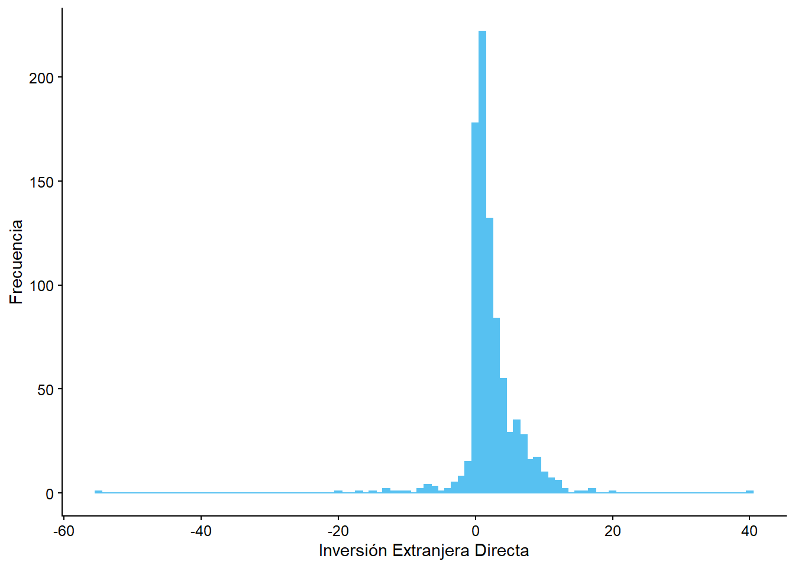

**Interpretación**: Del gráfico se aprecia que los datos se concentran entre -10 y 15% de la Inversión Extranjera Directa, en el eje X. La curva estálevemente sesgada hacia la izquierda, con una alta frecuencia de observaciones cuando la IED es pequeña (aproximadamente entre 0 y 5%). Se pueden ver también valores atípicos, uno cercano al -60% y otro al 40% de la IED.


```r
ggplot(bienestar, aes(x = inversion_extranjera, y = gini)) + 
  geom_point() + 
  labs(x = "Inversión Extranjera Directa",
       y = "Gini")
## Warning: Removed 665 rows containing missing values (geom_point).
```


**Interpretación**: Es difícil ver una correlación clara entre las variables de desigualdad económica e inversión extranjera directa. Esto, debido a que los puntos están repartidos verticualmente cerca del valor 0 del eje X. 

#### Ejercicio 5B {-}

> Utilizando los mismos datos, estima un modelo donde la variable independiente es Inversión Extranjera Directa (inversion_extranjera) y la variable dependiente es Desigualdad (gini) y exportarlo a un archivo .doc. ¿Es el efecto estadísticamente significativo?


```r
modelo_ied <- lm(gini ~ 1 + inversion_extranjera, data = bienestar)
```


```r
screenreg(modelo_ied,
          file = "modelo_1.doc",
          custom.header = list("Gini" = 1),
          custom.model.names = "Modelo 1",  
          custom.coef.names = c("Constante", "Inversión extranjera directa"),
          custom.gof.names = c("R^2", "R^2 Ajustado", "Nro. Observaciones"),
          doctype = T)
```


```{=html}
<table class="texreg" style="margin: 10px auto;border-collapse: collapse;border-spacing: 0px;caption-side: bottom;color: #000000;border-top: 2px solid #000000;">
<caption>Statistical models</caption>
<thead>
<tr>
<th>&nbsp;</th>
<th style="padding-left: 5px;padding-right: 5px;border-bottom: 1px solid #000000;" colspan="1">Gini</th>
</tr>
<tr>
<th style="padding-left: 5px;padding-right: 5px;">&nbsp;</th>
<th style="padding-left: 5px;padding-right: 5px;">Modelo 1</th>
</tr>
</thead>
<tbody>
<tr style="border-top: 1px solid #000000;">
<td style="padding-left: 5px;padding-right: 5px;">Constante</td>
<td style="padding-left: 5px;padding-right: 5px;">48.75<sup>***</sup></td>
</tr>
<tr>
<td style="padding-left: 5px;padding-right: 5px;">&nbsp;</td>
<td style="padding-left: 5px;padding-right: 5px;">(0.42)</td>
</tr>
<tr>
<td style="padding-left: 5px;padding-right: 5px;">Inversión extranjera directa</td>
<td style="padding-left: 5px;padding-right: 5px;">0.26<sup>**</sup></td>
</tr>
<tr>
<td style="padding-left: 5px;padding-right: 5px;">&nbsp;</td>
<td style="padding-left: 5px;padding-right: 5px;">(0.10)</td>
</tr>
<tr style="border-top: 1px solid #000000;">
<td style="padding-left: 5px;padding-right: 5px;">R^2</td>
<td style="padding-left: 5px;padding-right: 5px;">0.02</td>
</tr>
<tr>
<td style="padding-left: 5px;padding-right: 5px;">R^2 Ajustado</td>
<td style="padding-left: 5px;padding-right: 5px;">0.01</td>
</tr>
<tr style="border-bottom: 2px solid #000000;">
<td style="padding-left: 5px;padding-right: 5px;">Nro. Observaciones</td>
<td style="padding-left: 5px;padding-right: 5px;">409</td>
</tr>
</tbody>
<tfoot>
<tr>
<td style="font-size: 0.8em;" colspan="2"><sup>***</sup>p &lt; 0.001; <sup>**</sup>p &lt; 0.01; <sup>*</sup>p &lt; 0.05</td>
</tr>
</tfoot>
</table>

```

El efecto de la inversión extranjera directa sobre el Gini es estadísticamente significativo, a un nivel de confianza de 99%. Esto implicaría que un aumento en 1% de la IED tendría como efecto el aumento de 0.26 puntos en el índice de Gini de un país. 

#### Ejercicio 5C {-}

> Recuerda: incluir el 1 no es necesario para estimar el modelo (lo colocamos ahí sólo para recordarte que también estamos estimando la intercepción). Intente probar el modelo sin él, y verá que los resultados no cambian.

*Modelo original*


```r
modelo_2 <- lm(gini ~ 1 + gasto_educ + inversion_extranjera + gasto_salud + gasto_segsocial + 
                poblacion + dualismo_sectorial + diversidad_etnica + pib + 
                factor(tipo_regimen) + bal_legislativo,
              data = bienestar_no_na)
```


*Modelo sin `+ 1`*


```r
modelo_2_v2 <- lm(gini ~ gasto_educ + inversion_extranjera + gasto_salud + gasto_segsocial + 
                poblacion + dualismo_sectorial + diversidad_etnica + pib + 
                factor(tipo_regimen) + bal_legislativo,
              data = bienestar_no_na)
```

Si vemos ambos modelos en una misma tabla notamos que todos los valores coinciden!


```r
screenreg(list(modelo_2, modelo_2_v2),
          custom.header = list("Gini" = 1:2),
          custom.model.names = c("Modelo original", "Modelo sin +1"),
          custom.coef.names = c("Constante", "Gasto educación", "Inversión extranjera directa", "Gasto Salud", "Gasto seguridad social", "Población joven", "Dualismo en economía", "Diversidad étnica", "PIB p/c", "Régimen democrático", "Régimen mixto", "Régimen Autoritario", "Balance poderes estado"),
          custom.gof.names = c("R^2", "R^2 Ajustado", "Nro. Observaciones"))
```


```{=html}
<table class="texreg" style="margin: 10px auto;border-collapse: collapse;border-spacing: 0px;caption-side: bottom;color: #000000;border-top: 2px solid #000000;">
<caption>Statistical models</caption>
<thead>
<tr>
<th>&nbsp;</th>
<th style="padding-left: 5px;padding-right: 5px;border-bottom: 1px solid #000000;" colspan="2">Gini</th>
</tr>
<tr>
<th style="padding-left: 5px;padding-right: 5px;">&nbsp;</th>
<th style="padding-left: 5px;padding-right: 5px;">Modelo original</th>
<th style="padding-left: 5px;padding-right: 5px;">Modelo sin +1</th>
</tr>
</thead>
<tbody>
<tr style="border-top: 1px solid #000000;">
<td style="padding-left: 5px;padding-right: 5px;">Constante</td>
<td style="padding-left: 5px;padding-right: 5px;">85.94<sup>***</sup></td>
<td style="padding-left: 5px;padding-right: 5px;">85.94<sup>***</sup></td>
</tr>
<tr>
<td style="padding-left: 5px;padding-right: 5px;">&nbsp;</td>
<td style="padding-left: 5px;padding-right: 5px;">(8.73)</td>
<td style="padding-left: 5px;padding-right: 5px;">(8.73)</td>
</tr>
<tr>
<td style="padding-left: 5px;padding-right: 5px;">Gasto educación</td>
<td style="padding-left: 5px;padding-right: 5px;">1.59<sup>***</sup></td>
<td style="padding-left: 5px;padding-right: 5px;">1.59<sup>***</sup></td>
</tr>
<tr>
<td style="padding-left: 5px;padding-right: 5px;">&nbsp;</td>
<td style="padding-left: 5px;padding-right: 5px;">(0.45)</td>
<td style="padding-left: 5px;padding-right: 5px;">(0.45)</td>
</tr>
<tr>
<td style="padding-left: 5px;padding-right: 5px;">Inversión extranjera directa</td>
<td style="padding-left: 5px;padding-right: 5px;">0.24</td>
<td style="padding-left: 5px;padding-right: 5px;">0.24</td>
</tr>
<tr>
<td style="padding-left: 5px;padding-right: 5px;">&nbsp;</td>
<td style="padding-left: 5px;padding-right: 5px;">(0.18)</td>
<td style="padding-left: 5px;padding-right: 5px;">(0.18)</td>
</tr>
<tr>
<td style="padding-left: 5px;padding-right: 5px;">Gasto Salud</td>
<td style="padding-left: 5px;padding-right: 5px;">-0.83<sup>**</sup></td>
<td style="padding-left: 5px;padding-right: 5px;">-0.83<sup>**</sup></td>
</tr>
<tr>
<td style="padding-left: 5px;padding-right: 5px;">&nbsp;</td>
<td style="padding-left: 5px;padding-right: 5px;">(0.26)</td>
<td style="padding-left: 5px;padding-right: 5px;">(0.26)</td>
</tr>
<tr>
<td style="padding-left: 5px;padding-right: 5px;">Gasto seguridad social</td>
<td style="padding-left: 5px;padding-right: 5px;">-0.83<sup>***</sup></td>
<td style="padding-left: 5px;padding-right: 5px;">-0.83<sup>***</sup></td>
</tr>
<tr>
<td style="padding-left: 5px;padding-right: 5px;">&nbsp;</td>
<td style="padding-left: 5px;padding-right: 5px;">(0.20)</td>
<td style="padding-left: 5px;padding-right: 5px;">(0.20)</td>
</tr>
<tr>
<td style="padding-left: 5px;padding-right: 5px;">Población joven</td>
<td style="padding-left: 5px;padding-right: 5px;">-0.93<sup>***</sup></td>
<td style="padding-left: 5px;padding-right: 5px;">-0.93<sup>***</sup></td>
</tr>
<tr>
<td style="padding-left: 5px;padding-right: 5px;">&nbsp;</td>
<td style="padding-left: 5px;padding-right: 5px;">(0.17)</td>
<td style="padding-left: 5px;padding-right: 5px;">(0.17)</td>
</tr>
<tr>
<td style="padding-left: 5px;padding-right: 5px;">Dualismo en economía</td>
<td style="padding-left: 5px;padding-right: 5px;">-0.17<sup>***</sup></td>
<td style="padding-left: 5px;padding-right: 5px;">-0.17<sup>***</sup></td>
</tr>
<tr>
<td style="padding-left: 5px;padding-right: 5px;">&nbsp;</td>
<td style="padding-left: 5px;padding-right: 5px;">(0.03)</td>
<td style="padding-left: 5px;padding-right: 5px;">(0.03)</td>
</tr>
<tr>
<td style="padding-left: 5px;padding-right: 5px;">Diversidad étnica</td>
<td style="padding-left: 5px;padding-right: 5px;">3.68<sup>***</sup></td>
<td style="padding-left: 5px;padding-right: 5px;">3.68<sup>***</sup></td>
</tr>
<tr>
<td style="padding-left: 5px;padding-right: 5px;">&nbsp;</td>
<td style="padding-left: 5px;padding-right: 5px;">(1.04)</td>
<td style="padding-left: 5px;padding-right: 5px;">(1.04)</td>
</tr>
<tr>
<td style="padding-left: 5px;padding-right: 5px;">PIB p/c</td>
<td style="padding-left: 5px;padding-right: 5px;">-0.00<sup>**</sup></td>
<td style="padding-left: 5px;padding-right: 5px;">-0.00<sup>**</sup></td>
</tr>
<tr>
<td style="padding-left: 5px;padding-right: 5px;">&nbsp;</td>
<td style="padding-left: 5px;padding-right: 5px;">(0.00)</td>
<td style="padding-left: 5px;padding-right: 5px;">(0.00)</td>
</tr>
<tr>
<td style="padding-left: 5px;padding-right: 5px;">Régimen democrático</td>
<td style="padding-left: 5px;padding-right: 5px;">-2.29</td>
<td style="padding-left: 5px;padding-right: 5px;">-2.29</td>
</tr>
<tr>
<td style="padding-left: 5px;padding-right: 5px;">&nbsp;</td>
<td style="padding-left: 5px;padding-right: 5px;">(4.75)</td>
<td style="padding-left: 5px;padding-right: 5px;">(4.75)</td>
</tr>
<tr>
<td style="padding-left: 5px;padding-right: 5px;">Régimen mixto</td>
<td style="padding-left: 5px;padding-right: 5px;">-2.90</td>
<td style="padding-left: 5px;padding-right: 5px;">-2.90</td>
</tr>
<tr>
<td style="padding-left: 5px;padding-right: 5px;">&nbsp;</td>
<td style="padding-left: 5px;padding-right: 5px;">(4.70)</td>
<td style="padding-left: 5px;padding-right: 5px;">(4.70)</td>
</tr>
<tr>
<td style="padding-left: 5px;padding-right: 5px;">Régimen Autoritario</td>
<td style="padding-left: 5px;padding-right: 5px;">-5.14</td>
<td style="padding-left: 5px;padding-right: 5px;">-5.14</td>
</tr>
<tr>
<td style="padding-left: 5px;padding-right: 5px;">&nbsp;</td>
<td style="padding-left: 5px;padding-right: 5px;">(4.62)</td>
<td style="padding-left: 5px;padding-right: 5px;">(4.62)</td>
</tr>
<tr>
<td style="padding-left: 5px;padding-right: 5px;">Balance poderes estado</td>
<td style="padding-left: 5px;padding-right: 5px;">-10.40<sup>***</sup></td>
<td style="padding-left: 5px;padding-right: 5px;">-10.40<sup>***</sup></td>
</tr>
<tr>
<td style="padding-left: 5px;padding-right: 5px;">&nbsp;</td>
<td style="padding-left: 5px;padding-right: 5px;">(2.22)</td>
<td style="padding-left: 5px;padding-right: 5px;">(2.22)</td>
</tr>
<tr style="border-top: 1px solid #000000;">
<td style="padding-left: 5px;padding-right: 5px;">R^2</td>
<td style="padding-left: 5px;padding-right: 5px;">0.59</td>
<td style="padding-left: 5px;padding-right: 5px;">0.59</td>
</tr>
<tr>
<td style="padding-left: 5px;padding-right: 5px;">R^2 Ajustado</td>
<td style="padding-left: 5px;padding-right: 5px;">0.56</td>
<td style="padding-left: 5px;padding-right: 5px;">0.56</td>
</tr>
<tr style="border-bottom: 2px solid #000000;">
<td style="padding-left: 5px;padding-right: 5px;">Nro. Observaciones</td>
<td style="padding-left: 5px;padding-right: 5px;">167</td>
<td style="padding-left: 5px;padding-right: 5px;">167</td>
</tr>
</tbody>
<tfoot>
<tr>
<td style="font-size: 0.8em;" colspan="3"><sup>***</sup>p &lt; 0.001; <sup>**</sup>p &lt; 0.01; <sup>*</sup>p &lt; 0.05</td>
</tr>
</tfoot>
</table>

```

#### Ejercicio 5D {-}

> Exporta la tabla con ambos modelos (con y sin controles) a un archivo .doc, te esperamos.


```r
modelo_1 <- lm(gini ~ 1 + gasto_educ, data = bienestar)

modelos <- list(modelo_1, modelo_2)
```


```r
screenreg(modelos,
          custom.model.names = c("Modelo 1", "Modelo 2"),  
           custom.coef.names = c(
             "Constante", "Gasto en educación", "IED", 
             "Gasto en salud", "Gasto en seg. social", 
             "Población jóven", "Dualismo en economía",
             "División étnica", "PBI pc", "Reg. democrático", "Reg. mixto",
             "Reg. autoritario", "Balance entre poderes"),
          file = "modelos_capitulo5.doc", doctype = T)
```


```{=html}
<table class="texreg" style="margin: 10px auto;border-collapse: collapse;border-spacing: 0px;caption-side: bottom;color: #000000;border-top: 2px solid #000000;">
<caption>Statistical models</caption>
<thead>
<tr>
<th style="padding-left: 5px;padding-right: 5px;">&nbsp;</th>
<th style="padding-left: 5px;padding-right: 5px;">Modelo 1</th>
<th style="padding-left: 5px;padding-right: 5px;">Modelo 2</th>
</tr>
</thead>
<tbody>
<tr style="border-top: 1px solid #000000;">
<td style="padding-left: 5px;padding-right: 5px;">Constante</td>
<td style="padding-left: 5px;padding-right: 5px;">44.81<sup>***</sup></td>
<td style="padding-left: 5px;padding-right: 5px;">85.94<sup>***</sup></td>
</tr>
<tr>
<td style="padding-left: 5px;padding-right: 5px;">&nbsp;</td>
<td style="padding-left: 5px;padding-right: 5px;">(1.02)</td>
<td style="padding-left: 5px;padding-right: 5px;">(8.73)</td>
</tr>
<tr>
<td style="padding-left: 5px;padding-right: 5px;">Gasto en educación</td>
<td style="padding-left: 5px;padding-right: 5px;">1.23<sup>***</sup></td>
<td style="padding-left: 5px;padding-right: 5px;">1.59<sup>***</sup></td>
</tr>
<tr>
<td style="padding-left: 5px;padding-right: 5px;">&nbsp;</td>
<td style="padding-left: 5px;padding-right: 5px;">(0.25)</td>
<td style="padding-left: 5px;padding-right: 5px;">(0.45)</td>
</tr>
<tr>
<td style="padding-left: 5px;padding-right: 5px;">IED</td>
<td style="padding-left: 5px;padding-right: 5px;">&nbsp;</td>
<td style="padding-left: 5px;padding-right: 5px;">0.24</td>
</tr>
<tr>
<td style="padding-left: 5px;padding-right: 5px;">&nbsp;</td>
<td style="padding-left: 5px;padding-right: 5px;">&nbsp;</td>
<td style="padding-left: 5px;padding-right: 5px;">(0.18)</td>
</tr>
<tr>
<td style="padding-left: 5px;padding-right: 5px;">Gasto en salud</td>
<td style="padding-left: 5px;padding-right: 5px;">&nbsp;</td>
<td style="padding-left: 5px;padding-right: 5px;">-0.83<sup>**</sup></td>
</tr>
<tr>
<td style="padding-left: 5px;padding-right: 5px;">&nbsp;</td>
<td style="padding-left: 5px;padding-right: 5px;">&nbsp;</td>
<td style="padding-left: 5px;padding-right: 5px;">(0.26)</td>
</tr>
<tr>
<td style="padding-left: 5px;padding-right: 5px;">Gasto en seg. social</td>
<td style="padding-left: 5px;padding-right: 5px;">&nbsp;</td>
<td style="padding-left: 5px;padding-right: 5px;">-0.83<sup>***</sup></td>
</tr>
<tr>
<td style="padding-left: 5px;padding-right: 5px;">&nbsp;</td>
<td style="padding-left: 5px;padding-right: 5px;">&nbsp;</td>
<td style="padding-left: 5px;padding-right: 5px;">(0.20)</td>
</tr>
<tr>
<td style="padding-left: 5px;padding-right: 5px;">Población jóven</td>
<td style="padding-left: 5px;padding-right: 5px;">&nbsp;</td>
<td style="padding-left: 5px;padding-right: 5px;">-0.93<sup>***</sup></td>
</tr>
<tr>
<td style="padding-left: 5px;padding-right: 5px;">&nbsp;</td>
<td style="padding-left: 5px;padding-right: 5px;">&nbsp;</td>
<td style="padding-left: 5px;padding-right: 5px;">(0.17)</td>
</tr>
<tr>
<td style="padding-left: 5px;padding-right: 5px;">Dualismo en economía</td>
<td style="padding-left: 5px;padding-right: 5px;">&nbsp;</td>
<td style="padding-left: 5px;padding-right: 5px;">-0.17<sup>***</sup></td>
</tr>
<tr>
<td style="padding-left: 5px;padding-right: 5px;">&nbsp;</td>
<td style="padding-left: 5px;padding-right: 5px;">&nbsp;</td>
<td style="padding-left: 5px;padding-right: 5px;">(0.03)</td>
</tr>
<tr>
<td style="padding-left: 5px;padding-right: 5px;">División étnica</td>
<td style="padding-left: 5px;padding-right: 5px;">&nbsp;</td>
<td style="padding-left: 5px;padding-right: 5px;">3.68<sup>***</sup></td>
</tr>
<tr>
<td style="padding-left: 5px;padding-right: 5px;">&nbsp;</td>
<td style="padding-left: 5px;padding-right: 5px;">&nbsp;</td>
<td style="padding-left: 5px;padding-right: 5px;">(1.04)</td>
</tr>
<tr>
<td style="padding-left: 5px;padding-right: 5px;">PBI pc</td>
<td style="padding-left: 5px;padding-right: 5px;">&nbsp;</td>
<td style="padding-left: 5px;padding-right: 5px;">-0.00<sup>**</sup></td>
</tr>
<tr>
<td style="padding-left: 5px;padding-right: 5px;">&nbsp;</td>
<td style="padding-left: 5px;padding-right: 5px;">&nbsp;</td>
<td style="padding-left: 5px;padding-right: 5px;">(0.00)</td>
</tr>
<tr>
<td style="padding-left: 5px;padding-right: 5px;">Reg. democrático</td>
<td style="padding-left: 5px;padding-right: 5px;">&nbsp;</td>
<td style="padding-left: 5px;padding-right: 5px;">-2.29</td>
</tr>
<tr>
<td style="padding-left: 5px;padding-right: 5px;">&nbsp;</td>
<td style="padding-left: 5px;padding-right: 5px;">&nbsp;</td>
<td style="padding-left: 5px;padding-right: 5px;">(4.75)</td>
</tr>
<tr>
<td style="padding-left: 5px;padding-right: 5px;">Reg. mixto</td>
<td style="padding-left: 5px;padding-right: 5px;">&nbsp;</td>
<td style="padding-left: 5px;padding-right: 5px;">-2.90</td>
</tr>
<tr>
<td style="padding-left: 5px;padding-right: 5px;">&nbsp;</td>
<td style="padding-left: 5px;padding-right: 5px;">&nbsp;</td>
<td style="padding-left: 5px;padding-right: 5px;">(4.70)</td>
</tr>
<tr>
<td style="padding-left: 5px;padding-right: 5px;">Reg. autoritario</td>
<td style="padding-left: 5px;padding-right: 5px;">&nbsp;</td>
<td style="padding-left: 5px;padding-right: 5px;">-5.14</td>
</tr>
<tr>
<td style="padding-left: 5px;padding-right: 5px;">&nbsp;</td>
<td style="padding-left: 5px;padding-right: 5px;">&nbsp;</td>
<td style="padding-left: 5px;padding-right: 5px;">(4.62)</td>
</tr>
<tr>
<td style="padding-left: 5px;padding-right: 5px;">Balance entre poderes</td>
<td style="padding-left: 5px;padding-right: 5px;">&nbsp;</td>
<td style="padding-left: 5px;padding-right: 5px;">-10.40<sup>***</sup></td>
</tr>
<tr>
<td style="padding-left: 5px;padding-right: 5px;">&nbsp;</td>
<td style="padding-left: 5px;padding-right: 5px;">&nbsp;</td>
<td style="padding-left: 5px;padding-right: 5px;">(2.22)</td>
</tr>
<tr style="border-top: 1px solid #000000;">
<td style="padding-left: 5px;padding-right: 5px;">R<sup>2</sup></td>
<td style="padding-left: 5px;padding-right: 5px;">0.06</td>
<td style="padding-left: 5px;padding-right: 5px;">0.59</td>
</tr>
<tr>
<td style="padding-left: 5px;padding-right: 5px;">Adj. R<sup>2</sup></td>
<td style="padding-left: 5px;padding-right: 5px;">0.06</td>
<td style="padding-left: 5px;padding-right: 5px;">0.56</td>
</tr>
<tr style="border-bottom: 2px solid #000000;">
<td style="padding-left: 5px;padding-right: 5px;">Num. obs.</td>
<td style="padding-left: 5px;padding-right: 5px;">356</td>
<td style="padding-left: 5px;padding-right: 5px;">167</td>
</tr>
</tbody>
<tfoot>
<tr>
<td style="font-size: 0.8em;" colspan="3"><sup>***</sup>p &lt; 0.001; <sup>**</sup>p &lt; 0.01; <sup>*</sup>p &lt; 0.05</td>
</tr>
</tfoot>
</table>

```

#### Ejercicio 5E {-}

> Estime un modelo en el que excluya el gasto en salud (`gasto_salud`) y el gasto en seguridad social (`gasto_segsocial`), y compare su capacidad explicativa con el modelo completo. De acuerdo con los resultados, ¿deberíamos excluir estas variables del modelo?


```r
modelo_2restringido <- lm(gini ~ gasto_educ + inversion_extranjera  + 
                poblacion + dualismo_sectorial + diversidad_etnica + pib + 
                factor(tipo_regimen) + bal_legislativo,
              data = bienestar_no_na)

anova(modelo_2, modelo_2restringido)
## Analysis of Variance Table
## 
## Model 1: gini ~ 1 + gasto_educ + inversion_extranjera + gasto_salud + 
##     gasto_segsocial + poblacion + dualismo_sectorial + diversidad_etnica + 
##     pib + factor(tipo_regimen) + bal_legislativo
## Model 2: gini ~ gasto_educ + inversion_extranjera + poblacion + dualismo_sectorial + 
##     diversidad_etnica + pib + factor(tipo_regimen) + bal_legislativo
##   Res.Df  RSS Df Sum of Sq    F Pr(>F)    
## 1    154 3148                             
## 2    156 3928 -2      -780 19.1  4e-08 ***
## ---
## Signif. codes:  0 '***' 0.001 '**' 0.01 '*' 0.05 '.' 0.1 ' ' 1
```


```r
screenreg(list(modelo_2, modelo_2restringido),
          custom.model.names = c("Modelo 1", "Modelo 2 restringido"),  
          custom.coef.names = c(
            "Constante", "Gasto en educación", "IED", 
            "Gasto en salud", "Gasto en seg. social", 
            "Población jóven", "Dualismo en economía",
            "División étnica", "PBI pc", "Reg. democrático", "Reg. mixto",
            "Reg. autoritario", "Balance entre poderes"))

```


```{=html}
<table class="texreg" style="margin: 10px auto;border-collapse: collapse;border-spacing: 0px;caption-side: bottom;color: #000000;border-top: 2px solid #000000;">
<caption>Statistical models</caption>
<thead>
<tr>
<th style="padding-left: 5px;padding-right: 5px;">&nbsp;</th>
<th style="padding-left: 5px;padding-right: 5px;">Modelo 2</th>
<th style="padding-left: 5px;padding-right: 5px;">Modelo 2 restringido</th>
</tr>
</thead>
<tbody>
<tr style="border-top: 1px solid #000000;">
<td style="padding-left: 5px;padding-right: 5px;">Constante</td>
<td style="padding-left: 5px;padding-right: 5px;">85.94<sup>***</sup></td>
<td style="padding-left: 5px;padding-right: 5px;">54.43<sup>***</sup></td>
</tr>
<tr>
<td style="padding-left: 5px;padding-right: 5px;">&nbsp;</td>
<td style="padding-left: 5px;padding-right: 5px;">(8.73)</td>
<td style="padding-left: 5px;padding-right: 5px;">(6.55)</td>
</tr>
<tr>
<td style="padding-left: 5px;padding-right: 5px;">Gasto en educación</td>
<td style="padding-left: 5px;padding-right: 5px;">1.59<sup>***</sup></td>
<td style="padding-left: 5px;padding-right: 5px;">0.88</td>
</tr>
<tr>
<td style="padding-left: 5px;padding-right: 5px;">&nbsp;</td>
<td style="padding-left: 5px;padding-right: 5px;">(0.45)</td>
<td style="padding-left: 5px;padding-right: 5px;">(0.46)</td>
</tr>
<tr>
<td style="padding-left: 5px;padding-right: 5px;">IED</td>
<td style="padding-left: 5px;padding-right: 5px;">0.24</td>
<td style="padding-left: 5px;padding-right: 5px;">0.49<sup>*</sup></td>
</tr>
<tr>
<td style="padding-left: 5px;padding-right: 5px;">&nbsp;</td>
<td style="padding-left: 5px;padding-right: 5px;">(0.18)</td>
<td style="padding-left: 5px;padding-right: 5px;">(0.19)</td>
</tr>
<tr>
<td style="padding-left: 5px;padding-right: 5px;">Gasto en salud</td>
<td style="padding-left: 5px;padding-right: 5px;">-0.83<sup>**</sup></td>
<td style="padding-left: 5px;padding-right: 5px;">&nbsp;</td>
</tr>
<tr>
<td style="padding-left: 5px;padding-right: 5px;">&nbsp;</td>
<td style="padding-left: 5px;padding-right: 5px;">(0.26)</td>
<td style="padding-left: 5px;padding-right: 5px;">&nbsp;</td>
</tr>
<tr>
<td style="padding-left: 5px;padding-right: 5px;">Gasto en seg. social</td>
<td style="padding-left: 5px;padding-right: 5px;">-0.83<sup>***</sup></td>
<td style="padding-left: 5px;padding-right: 5px;">&nbsp;</td>
</tr>
<tr>
<td style="padding-left: 5px;padding-right: 5px;">&nbsp;</td>
<td style="padding-left: 5px;padding-right: 5px;">(0.20)</td>
<td style="padding-left: 5px;padding-right: 5px;">&nbsp;</td>
</tr>
<tr>
<td style="padding-left: 5px;padding-right: 5px;">Población jóven</td>
<td style="padding-left: 5px;padding-right: 5px;">-0.93<sup>***</sup></td>
<td style="padding-left: 5px;padding-right: 5px;">-0.28<sup>*</sup></td>
</tr>
<tr>
<td style="padding-left: 5px;padding-right: 5px;">&nbsp;</td>
<td style="padding-left: 5px;padding-right: 5px;">(0.17)</td>
<td style="padding-left: 5px;padding-right: 5px;">(0.11)</td>
</tr>
<tr>
<td style="padding-left: 5px;padding-right: 5px;">Dualismo en economía</td>
<td style="padding-left: 5px;padding-right: 5px;">-0.17<sup>***</sup></td>
<td style="padding-left: 5px;padding-right: 5px;">-0.20<sup>***</sup></td>
</tr>
<tr>
<td style="padding-left: 5px;padding-right: 5px;">&nbsp;</td>
<td style="padding-left: 5px;padding-right: 5px;">(0.03)</td>
<td style="padding-left: 5px;padding-right: 5px;">(0.04)</td>
</tr>
<tr>
<td style="padding-left: 5px;padding-right: 5px;">División étnica</td>
<td style="padding-left: 5px;padding-right: 5px;">3.68<sup>***</sup></td>
<td style="padding-left: 5px;padding-right: 5px;">5.92<sup>***</sup></td>
</tr>
<tr>
<td style="padding-left: 5px;padding-right: 5px;">&nbsp;</td>
<td style="padding-left: 5px;padding-right: 5px;">(1.04)</td>
<td style="padding-left: 5px;padding-right: 5px;">(1.08)</td>
</tr>
<tr>
<td style="padding-left: 5px;padding-right: 5px;">PBI pc</td>
<td style="padding-left: 5px;padding-right: 5px;">-0.00<sup>**</sup></td>
<td style="padding-left: 5px;padding-right: 5px;">-0.00</td>
</tr>
<tr>
<td style="padding-left: 5px;padding-right: 5px;">&nbsp;</td>
<td style="padding-left: 5px;padding-right: 5px;">(0.00)</td>
<td style="padding-left: 5px;padding-right: 5px;">(0.00)</td>
</tr>
<tr>
<td style="padding-left: 5px;padding-right: 5px;">Reg. democrático</td>
<td style="padding-left: 5px;padding-right: 5px;">-2.29</td>
<td style="padding-left: 5px;padding-right: 5px;">-0.77</td>
</tr>
<tr>
<td style="padding-left: 5px;padding-right: 5px;">&nbsp;</td>
<td style="padding-left: 5px;padding-right: 5px;">(4.75)</td>
<td style="padding-left: 5px;padding-right: 5px;">(5.23)</td>
</tr>
<tr>
<td style="padding-left: 5px;padding-right: 5px;">Reg. mixto</td>
<td style="padding-left: 5px;padding-right: 5px;">-2.90</td>
<td style="padding-left: 5px;padding-right: 5px;">-0.78</td>
</tr>
<tr>
<td style="padding-left: 5px;padding-right: 5px;">&nbsp;</td>
<td style="padding-left: 5px;padding-right: 5px;">(4.70)</td>
<td style="padding-left: 5px;padding-right: 5px;">(5.20)</td>
</tr>
<tr>
<td style="padding-left: 5px;padding-right: 5px;">Reg. autoritario</td>
<td style="padding-left: 5px;padding-right: 5px;">-5.14</td>
<td style="padding-left: 5px;padding-right: 5px;">-4.00</td>
</tr>
<tr>
<td style="padding-left: 5px;padding-right: 5px;">&nbsp;</td>
<td style="padding-left: 5px;padding-right: 5px;">(4.62)</td>
<td style="padding-left: 5px;padding-right: 5px;">(5.12)</td>
</tr>
<tr>
<td style="padding-left: 5px;padding-right: 5px;">Balance entre poderes</td>
<td style="padding-left: 5px;padding-right: 5px;">-10.40<sup>***</sup></td>
<td style="padding-left: 5px;padding-right: 5px;">-7.45<sup>**</sup></td>
</tr>
<tr>
<td style="padding-left: 5px;padding-right: 5px;">&nbsp;</td>
<td style="padding-left: 5px;padding-right: 5px;">(2.22)</td>
<td style="padding-left: 5px;padding-right: 5px;">(2.40)</td>
</tr>
<tr style="border-top: 1px solid #000000;">
<td style="padding-left: 5px;padding-right: 5px;">R<sup>2</sup></td>
<td style="padding-left: 5px;padding-right: 5px;">0.59</td>
<td style="padding-left: 5px;padding-right: 5px;">0.49</td>
</tr>
<tr>
<td style="padding-left: 5px;padding-right: 5px;">Adj. R<sup>2</sup></td>
<td style="padding-left: 5px;padding-right: 5px;">0.56</td>
<td style="padding-left: 5px;padding-right: 5px;">0.46</td>
</tr>
<tr style="border-bottom: 2px solid #000000;">
<td style="padding-left: 5px;padding-right: 5px;">Num. obs.</td>
<td style="padding-left: 5px;padding-right: 5px;">167</td>
<td style="padding-left: 5px;padding-right: 5px;">167</td>
</tr>
</tbody>
<tfoot>
<tr>
<td style="font-size: 0.8em;" colspan="3"><sup>***</sup>p &lt; 0.001; <sup>**</sup>p &lt; 0.01; <sup>*</sup>p &lt; 0.05</td>
</tr>
</tfoot>
</table>

```

Según los resultados, podemos ver que el excluir las variables del gasto en salud y en seguridad social disminuye el poder explicativo del modelo, por lo que se deberían mantener. Esto, debido a que con el comando anova se aprecia que se rechaza la hipótesis nula del test F. En la tabla se identifica que el modelo restringido tiene una bondad de ajuste menor que el modelo original, lo que implicaría que la variabilidad de la variable dependiente es explicada en menor manera que en el modelo original. 

#### Ejercicio 5F {-}

> Antes de pasar al siguiente capítulo, haz un gráfico de dispersión de la relación entre la variable `gini` y la variable `inversion_extranjera`. Añade el nombre del país a cada observación.  


```r
ggplot(bienestar, aes(x = inversion_extranjera, y = gini)) + 
  geom_point() + 
  labs(x = "Inversión Extranjera Directa",
       y = "Gini") + 
  geom_label_repel(aes(label = pais))
## Warning: Removed 665 rows containing missing values (geom_point).
## Warning: Removed 665 rows containing missing values (geom_label_repel).
```

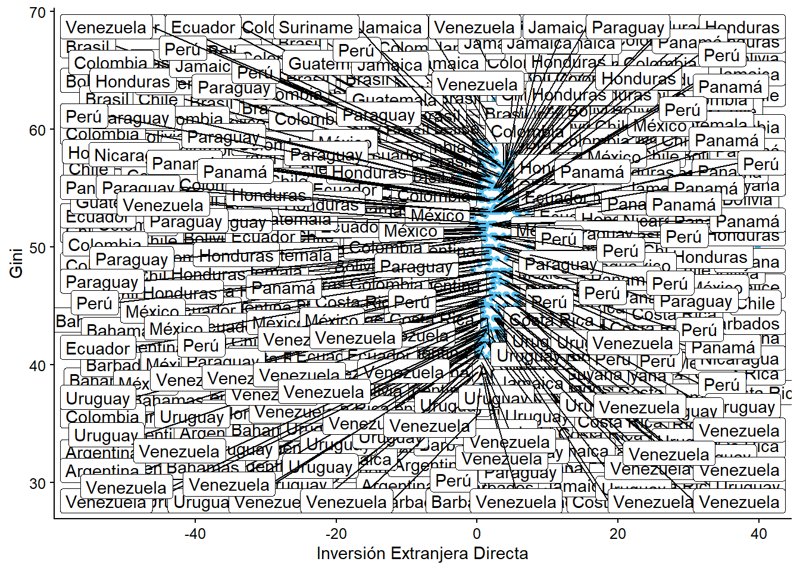

Podemos notar que añadir el nombre o código del país a las observaciones hace que el gráfico sea ilegible, por lo que sería mejor quedarnos con el gráfico sin etiquetas, o hacer un filtro y asignarla a algunos valores. Por ejemplo, podríamos querer ver aquellos países donde el índice de Gini es mayor a 60 y menor a 35:


```r
ggplot(bienestar, aes(x = inversion_extranjera, y = gini)) + 
  geom_point() + 
  labs(x = "Inversión Extranjera Directa",
       y = "Gini") + 
  geom_label_repel(data = bienestar %>%  filter(gini > 60 | gini < 35), 
                   aes(label = pais))
```

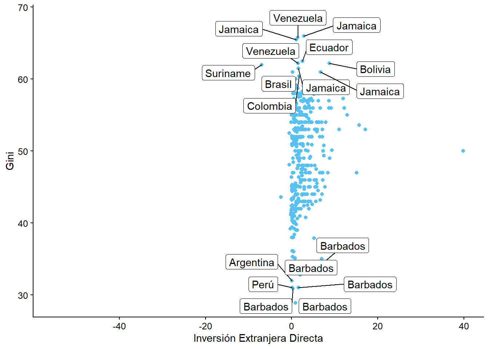

> Para el modelo 1, añade la variable `inversion_extranjera` como control e interpreta su coeficiente. 


```r
modelo_1_v2 <- lm(gini ~ 1 + gasto_educ + inversion_extranjera, data = bienestar) 

summary(modelo_1_v2)
## 
## Call:
## lm(formula = gini ~ 1 + gasto_educ + inversion_extranjera, data = bienestar)
## 
## Residuals:
##     Min      1Q  Median      3Q     Max 
## -21.583  -5.392   0.601   4.726  15.961 
## 
## Coefficients:
##                      Estimate Std. Error t value Pr(>|t|)    
## (Intercept)            44.173      1.022   43.22  < 2e-16 ***
## gasto_educ              1.157      0.270    4.29  2.4e-05 ***
## inversion_extranjera    0.400      0.174    2.29    0.022 *  
## ---
## Signif. codes:  0 '***' 0.001 '**' 0.01 '*' 0.05 '.' 0.1 ' ' 1
## 
## Residual standard error: 6.6 on 339 degrees of freedom
##   (732 observations deleted due to missingness)
## Multiple R-squared:  0.094,	Adjusted R-squared:  0.0887 
## F-statistic: 17.6 on 2 and 339 DF,  p-value: 5.41e-08
```

En el modelo 1, la inversión extranjera tiene un coeficiente de 0.3995, y es significativa a un nivel de confianza de 95%. Esto quiere decir que, manteniendo todas las demás variables constantes, el aumentar en un 1% la inversión extranjera tendrá como efecto el aumento de aproximadamente 0.4 puntos del coeficiente Gini. 

> Haz las pruebas correspondientes para comprobar que no se violan las suposiciones del MCO

- Linealidad de los parámetros


```r
ggplot(mapping = aes(x = modelo_1_v2$fitted.values, y = modelo_1_v2$residuals)) +
  labs(x = "Valores predichos", y = "Residuos", title = "Prueba de linealidad en valores predichos", subtitle = "Modelo 1 con inversioón extranjera como control") +
  geom_point() +
  geom_hline(mapping = aes(yintercept = 0), color = "red")
```


Del gráfico podemos ver que los residuos se encuentran distribuidos aleatoriamente por sobre y debajo de cero, por lo que **no habría un problema de linealidad**.


```r
library(car)
crPlots(modelo_1_v2)
```

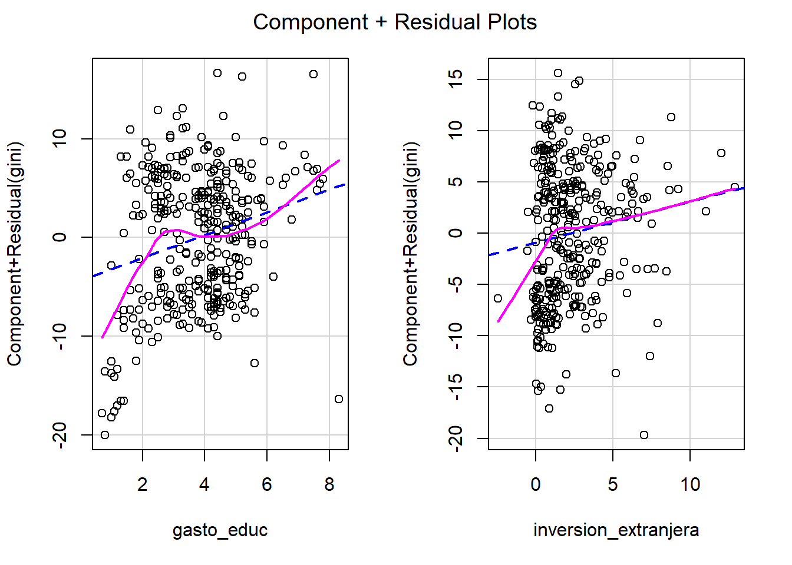

Se repite lo que ya se había visto en el capítulo respecto al gasto en educación. La relación entonces entre el índice de Gini y el gasto en educación podría ser cuadrática. Respecto a la inversión extranjera, se observa que si bien al principio está separada de la linea punteada, un poco más allá de 0 se alinea casi perfectamente con esta. Por esto, es posible que no deberíamos hacerle ninguna transformación a esta variable. 

Pasemos a hacer el test RESET y F:


```r
library(lmtest)
resettest(modelo_1, power = 2, type = "fitted", data = bienestar)
## 
## 	RESET test
## 
## data:  modelo_1
## RESET = 9, df1 = 1, df2 = 353, p-value = 0.004
```

Como se vio en el capítulo, se rechaza la hipótesis nula de que añadir un término cuadrático al gasto en educación no mejora la especificación del modelo.  


> Multicolinealidad

Primero vemos la relación entre las variables:


```r
library(ggcorrplot)

corr_modelo1 <- bienestar %>% 
  select(gini, gasto_educ, inversion_extranjera)  %>% 
  cor(use = "pairwise") %>% 
  round(1)

ggcorrplot(corr_modelo1, type = "lower", lab = T, show.legend = F)
```


Las correlaciones son mas bien bajas, siendo positivas pero no superando 0.5. Ahora pasemos a hacer el test VIF

- Test VIF


```r
vif(modelo_1_v2) 
##           gasto_educ inversion_extranjera 
##                  1.1                  1.1
sqrt(vif(modelo_1_v2)) > 2
##           gasto_educ inversion_extranjera 
##                FALSE                FALSE
```

Tanto el test VIF como la raíz cuadrada de este nos mostrarían que la varianza de ambas variables no es alta, y no habría problemas de multicolinealidad. 

- Homocedasticidad


```r
plot(modelo_1_v2, which = 1)
```

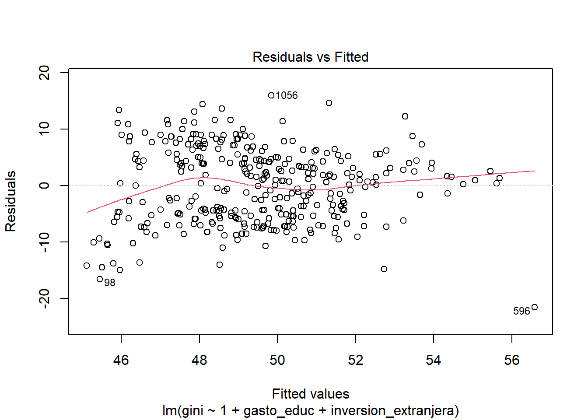

Los valores predichos no se distribuyen aleatoria e igualmente alrededor del eje X, por lo que se estaría violando el supuesto de homocedasticidad. La línea roja no coincide con la línea horizontal punteada, por lo que nuestro modelo presentaría heterocedasticidad. 


```r
car::residualPlots(modelo_1_v2)
##                      Test stat Pr(>|Test stat|)  
## gasto_educ               -2.52            0.012 *
## inversion_extranjera     -0.99            0.322  
## Tukey test               -2.07            0.038 *
## ---
## Signif. codes:  0 '***' 0.001 '**' 0.01 '*' 0.05 '.' 0.1 ' ' 1
```

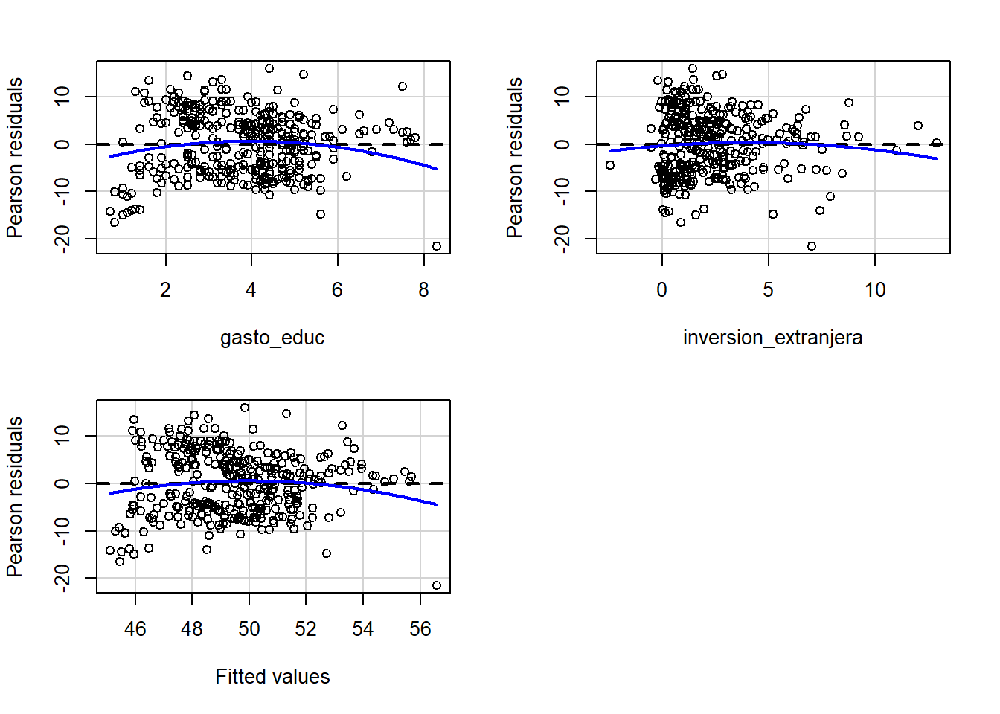

Ahora pasaremos a hacer el test estadístico de Breusch-Pagan:


```r
bptest(modelo_1_v2, studentize = T)
## 
## 	studentized Breusch-Pagan test
## 
## data:  modelo_1_v2
## BP = 18, df = 2, p-value = 1e-04
```

Debido a que el valor p es menor a 0.05, rechazamos la hipótesis nula, por lo que el modelo 1 que incluye la IED como control presentaría heterocedasticidad. 


```r
library(lmtest)
library(sandwich)

modelo_1_v2_robust_0 <- coeftest(modelo_1_v2, vcov = vcovHC(modelo_1_v2, "HC0"))
modelo_1_v2_robust_1 <- coeftest(modelo_1_v2, vcov = vcovHC(modelo_1_v2, "HC1"))
modelo_1_v2_robust_3 <- coeftest(modelo_1_v2, vcov = vcovHC(modelo_1_v2, "HC3"))

modelos_robustos <- list(modelo_1_v2, modelo_1_v2_robust_0, modelo_1_v2_robust_1, 
                      modelo_1_v2_robust_3)

screenreg(modelos_robustos,
          custom.model.names = c("sin ES robustos", 
                                 "robustos HC0", "robustos HC1", "robustos HC3"))
## 
## ===============================================================================
##                       sin ES robustos  robustos HC0  robustos HC1  robustos HC3
## -------------------------------------------------------------------------------
## (Intercept)            44.17 ***       44.17 ***     44.17 ***     44.17 ***   
##                        (1.02)          (1.31)        (1.31)        (1.33)      
## gasto_educ              1.16 ***        1.16 ***      1.16 ***      1.16 ***   
##                        (0.27)          (0.33)        (0.33)        (0.33)      
## inversion_extranjera    0.40 *          0.40 *        0.40 *        0.40 *     
##                        (0.17)          (0.16)        (0.16)        (0.16)      
## -------------------------------------------------------------------------------
## R^2                     0.09                                                   
## Adj. R^2                0.09                                                   
## Num. obs.             342                                                      
## ===============================================================================
## *** p < 0.001; ** p < 0.01; * p < 0.05
```

Tanto los coeficientes como los errores son similares, por lo que aún haciendo más exigente a los errores, igualmente en los modelos robustos de HC0 y HC1 los coeficientes siguen siendo estadísticamente significativos. 

- Normalidad en distribución del error


```r
qqPlot(modelo_1_v2$residuals)
## 596  98 
## 194  54
```

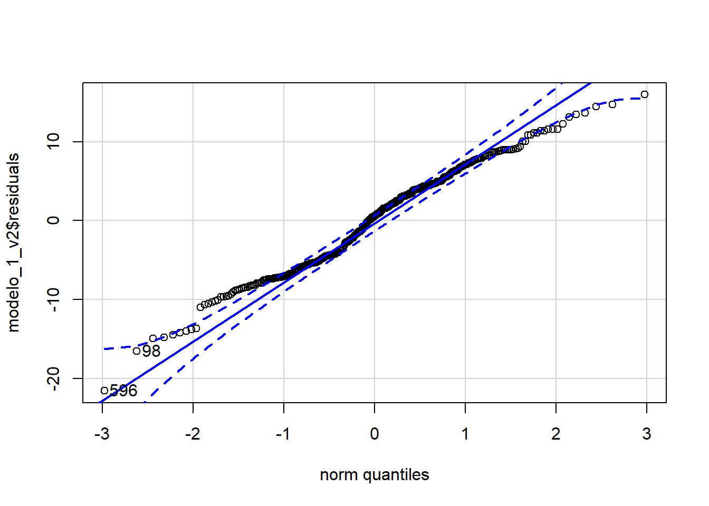

También podemos ver que los residuos se salen de las líneas punteadas, por lo que la distribución de estos no sería normal. Veamos cómo se ve en un gráfico de densidad:


```r
library(ggpubr)
ggdensity(modelo_1_v2$residuals, main = "Gráfico de densidad de los residuos")
```


Notamos que la distribución no es normal en forma acampanada, sino bimodal, con dos peaks alrededor de los valors 5 y -5 del eje X. 

En conclusión, nuestro modelo viola el supuesto de homocedasticidad y de distribución normal del error, por lo que sería útil pensar en otras variables que podrían afectar al Gini más allá del gasto en educación y la IED como variable de control. 

###### Usando htmlreg, exporta la tabla de regresión a Word {-}


```r
screenreg(modelo_1_v2,
          file = "modelo_1_v2.doc",
          custom.header = list("Gini" = 1),
          custom.model.names = "Modelo 1",  
          custom.coef.names = c("Constante", "Gasto educación", "Inversión extranjera directa"),
          custom.gof.names = c("R^2", "R^2 Ajustado", "Nro. Observaciones"),
          doctype = T)
```


## Capítulo 6: Selección de casos basada en regresiones {-}

#### Paquetes y carga de datos {-}


```r
library(tidyverse)
library(paqueteadp)
## install.packages("broom")
library(broom)

data("bienestar")
```

Primero crearemos el modelo:


```r
bienestar_sinna <- bienestar %>% 
  drop_na(gini, gasto_educ, inversion_extranjera, gasto_salud, gasto_segsocial, 
          poblacion, dualismo_sectorial, diversidad_etnica, pib, tipo_regimen, 
          bal_legislativo, represion)

modelo_2 <- lm(gini ~ 1 + gasto_educ + inversion_extranjera + gasto_salud + gasto_segsocial +
                 poblacion + dualismo_sectorial + diversidad_etnica + pib +  tipo_regimen +
                 bal_legislativo + represion,
               data = bienestar_sinna)

modelo_aug <- augment(modelo_2, data = bienestar_sinna)
modelo_aug
## # A tibble: 167 x 21
##   pais  codigo_pais  anio poblacion  gini dualismo_sector~   pib
##   <chr> <chr>       <dbl>     <dbl> <dbl>            <dbl> <dbl>
## 1 Arge~ ARG          1982      30.8  40.2             9.50 7711.
## 2 Arge~ ARG          1983      30.9  40.4             8.36 7907.
## 3 Arge~ ARG          1990      30.7  43.1             7.72 6823.
## # ... with 164 more rows, and 14 more variables
```


#### Ejercicio 6A {-}

> Seleccione los casos extremos para la variable independiente **Inversión Extranjera Directa** `inversion_extranjera`.

Vemos la distribución de la variable independiente (IED)


```r
ggplot(bienestar_sinna, aes(x = inversion_extranjera)) +
  geom_histogram(binwidth = 1,color="black", fill="white") +
  labs(
    title = "Ingresos netos de IED como % del PIB",
    x = "Inversión Extranjera Directa",
    y = "Frecuencia"
  )
```


Luego pasamos a calcular la diferencia entre el valor de cada observación y la media muestral de la IED:


```r
mean(modelo_aug$inversion_extranjera, na.rm = T)
## [1] 2.5

modelo_aug <- modelo_aug %>%
  mutate(dif_csied = abs(inversion_extranjera - mean(modelo_aug$inversion_extranjera, na.rm = T))) 

modelo_aug %>%
  top_n(3, dif_csied) %>%
  arrange(-dif_csied) %>%
  select(pais, anio, inversion_extranjera, dif_csied)
## # A tibble: 3 x 4
##   pais    anio inversion_extranjera dif_csied
##   <chr>  <dbl>                <dbl>     <dbl>
## 1 Panamá  1997                 12.9     10.4 
## 2 Chile   1999                 12.0      9.52
## 3 Panamá  1998                 11.0      8.52
```

Por último graficamos:


```r
ggplot(data = modelo_aug,
       mapping = aes(x = .fitted, y = dif_csied)) +
  geom_point() +
  geom_text(data = modelo_aug %>% top_n(3, dif_csied),
            mapping = aes(label = pais))
```

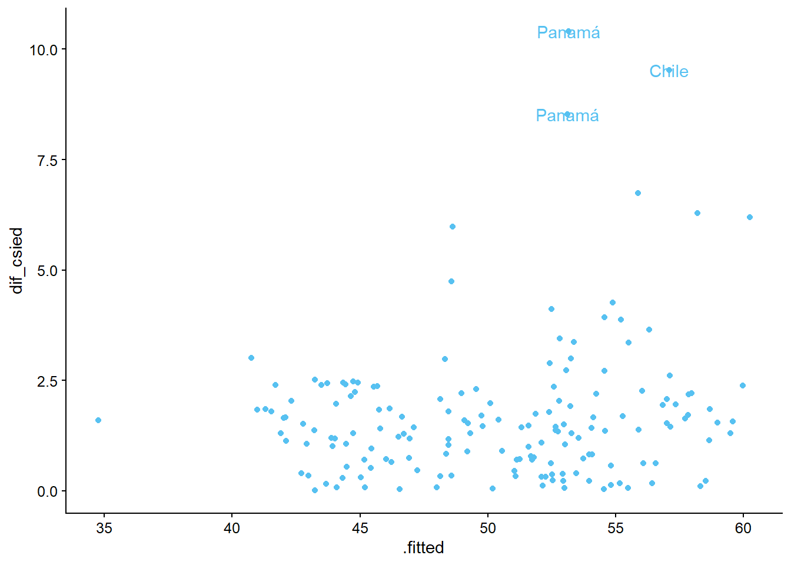

Tanto Panamá como Chile están bastante más arriba que la media (2.47).

#### Ejercicio 6B  {-}

> Seleccione pares de casos más similares tomando la **Inversión Extranjera Directa** `inversion_extranjera` como una variable independiente (tratamiento).

El primer paso es crear la variable dcotómica/dummy de tratamiento para la IED:


```r
bienestar_sinna <- bienestar_sinna %>% 
  mutate(tratamiento_ied = if_else(inversion_extranjera > mean(inversion_extranjera), 1, 0))
```

Luego pasamos a crear los modelos de logit y los valores aumentados:


```r
modelo_puntuacion_propension <- glm(tratamiento_ied ~ dualismo_sectorial + gasto_educ + 
                                      pib + poblacion + diversidad_etnica + tipo_regimen + 
                                      tipo_regimen * gasto_segsocial + gasto_salud +
                                      gasto_segsocial + bal_legislativo + represion, 
                                    data      = bienestar_sinna, 
                                    family    = binomial(link = logit), 
                                    na.action = na.exclude)

puntuaciones_propension <- augment(modelo_puntuacion_propension, data = bienestar_sinna,
                            type.predict = "response") %>%
  select(puntuaciones_propension = .fitted, pais, tratamiento_ied, anio, gini)
```


Por último, vemos los casos con puntuaciones de propensión bajas, en el grupo de países con inversiones superiores e inferiores a la media de la muestra:


```r
puntuaciones_propension %>%
  filter(tratamiento_ied == 1) %>%
  arrange(puntuaciones_propension) %>%
  select(pais, anio, puntuaciones_propension) %>%
  slice(1:2)
## # A tibble: 2 x 3
##   pais       anio puntuaciones_propension
##   <chr>     <dbl>                   <dbl>
## 1 Colombia   1985                  0.0678
## 2 Venezuela  1996                  0.0849

puntuaciones_propension %>%
  filter(tratamiento_ied == 0) %>%
  arrange(puntuaciones_propension) %>%
  select(pais, anio, puntuaciones_propension) %>%
  slice(1:2)
## # A tibble: 2 x 3
##   pais      anio puntuaciones_propension
##   <chr>    <dbl>                   <dbl>
## 1 Barbados  1981                0.000254
## 2 Bahamas   1989                0.0116
```

De acuerdo a los resultados, podríamos comparar Colombia o Venezuela con Barbados o Bahamas. 

#### Ejercicio 6C {-}

Estime de un modelo donde la variable dependiente es la puntuación de Gini (`gini`) y el gasto en educación de los independientes (`gasto_educ`), gasto en salud (`gasto_salud`), gasto en seguridad social (`gasto_segsocial`), PIB (`pib`), e inversión extranjera directa (`inversion_extranjera`). 


```r
library(texreg)

modelo_6c <- lm(gini ~ gasto_educ + gasto_salud + gasto_segsocial + pib + inversion_extranjera,
                data = bienestar_sinna)

modelo_6c_aug <- augment(modelo_6c, data = bienestar_sinna)
```


```r
screenreg(modelo_6c,
          custom.header = list("Gini" = 1),
          custom.model.names = "Modelo 6C",  
          custom.coef.names = c("Constante", "Gasto educación", "Gasto salud", "Gasto seguridad social", "PIB", "Inversión extranjera directa"),
          custom.gof.names = c("R^2", "R^2 Ajustado", "Nro. Observaciones"))
```


```{=html}
<table class="texreg" style="margin: 10px auto;border-collapse: collapse;border-spacing: 0px;caption-side: bottom;color: #000000;border-top: 2px solid #000000;">
<caption>Statistical models</caption>
<thead>
<tr>
<th>&nbsp;</th>
<th style="padding-left: 5px;padding-right: 5px;border-bottom: 1px solid #000000;" colspan="1">Gini</th>
</tr>
<tr>
<th style="padding-left: 5px;padding-right: 5px;">&nbsp;</th>
<th style="padding-left: 5px;padding-right: 5px;">Modelo 6C</th>
</tr>
</thead>
<tbody>
<tr style="border-top: 1px solid #000000;">
<td style="padding-left: 5px;padding-right: 5px;">Constante</td>
<td style="padding-left: 5px;padding-right: 5px;">53.64<sup>***</sup></td>
</tr>
<tr>
<td style="padding-left: 5px;padding-right: 5px;">&nbsp;</td>
<td style="padding-left: 5px;padding-right: 5px;">(2.28)</td>
</tr>
<tr>
<td style="padding-left: 5px;padding-right: 5px;">Gasto educación</td>
<td style="padding-left: 5px;padding-right: 5px;">0.72</td>
</tr>
<tr>
<td style="padding-left: 5px;padding-right: 5px;">&nbsp;</td>
<td style="padding-left: 5px;padding-right: 5px;">(0.52)</td>
</tr>
<tr>
<td style="padding-left: 5px;padding-right: 5px;">Gasto salud</td>
<td style="padding-left: 5px;padding-right: 5px;">-1.21<sup>***</sup></td>
</tr>
<tr>
<td style="padding-left: 5px;padding-right: 5px;">&nbsp;</td>
<td style="padding-left: 5px;padding-right: 5px;">(0.30)</td>
</tr>
<tr>
<td style="padding-left: 5px;padding-right: 5px;">Gasto seguridad social</td>
<td style="padding-left: 5px;padding-right: 5px;">-0.30<sup>*</sup></td>
</tr>
<tr>
<td style="padding-left: 5px;padding-right: 5px;">&nbsp;</td>
<td style="padding-left: 5px;padding-right: 5px;">(0.13)</td>
</tr>
<tr>
<td style="padding-left: 5px;padding-right: 5px;">PIB</td>
<td style="padding-left: 5px;padding-right: 5px;">-0.00<sup>***</sup></td>
</tr>
<tr>
<td style="padding-left: 5px;padding-right: 5px;">&nbsp;</td>
<td style="padding-left: 5px;padding-right: 5px;">(0.00)</td>
</tr>
<tr>
<td style="padding-left: 5px;padding-right: 5px;">Inversión extranjera directa</td>
<td style="padding-left: 5px;padding-right: 5px;">0.72<sup>***</sup></td>
</tr>
<tr>
<td style="padding-left: 5px;padding-right: 5px;">&nbsp;</td>
<td style="padding-left: 5px;padding-right: 5px;">(0.21)</td>
</tr>
<tr style="border-top: 1px solid #000000;">
<td style="padding-left: 5px;padding-right: 5px;">R^2</td>
<td style="padding-left: 5px;padding-right: 5px;">0.30</td>
</tr>
<tr>
<td style="padding-left: 5px;padding-right: 5px;">R^2 Ajustado</td>
<td style="padding-left: 5px;padding-right: 5px;">0.27</td>
</tr>
<tr style="border-bottom: 2px solid #000000;">
<td style="padding-left: 5px;padding-right: 5px;">Nro. Observaciones</td>
<td style="padding-left: 5px;padding-right: 5px;">167</td>
</tr>
</tbody>
<tfoot>
<tr>
<td style="font-size: 0.8em;" colspan="2"><sup>***</sup>p &lt; 0.001; <sup>**</sup>p &lt; 0.01; <sup>*</sup>p &lt; 0.05</td>
</tr>
</tfoot>
</table>

```

Seleccione los casos típicos, atípicos e influyentes para este modelo. ¿Qué variables pueden ser importantes para entender los valores atípicos?


```r
## Casos típicos

library(ggrepel)

ggplot(data = modelo_6c_aug, mapping = aes(x = .fitted, y = .resid)) +
  geom_point() +
  geom_hline(aes(yintercept = 0)) +
  geom_label_repel(data = modelo_6c_aug %>% 
                     mutate(.resid_abs = abs(.resid)) %>% 
                     top_n(-4, .resid_abs),
                   mapping = aes(label = pais)) + 
  labs(title = "Casos típicos",
       y = "Residuales",
       x = "Predichos")
```


```r
## Casos atípicos

ggplot(data = modelo_6c_aug, 
       mapping = aes(x = .fitted, y = .resid)) +
  geom_point() +
  geom_hline(aes(yintercept = 0)) +
  geom_label_repel(data = modelo_6c_aug %>% 
                    mutate(.resid_abs = abs(.resid)) %>% 
                    top_n(4, .resid_abs),
                  mapping = aes(label = pais))  + 
  labs(title = "Casos atípicos",
       y = "Residuales",
       x = "Predichos")
```


```r
## Casos influyentes

ggplot(data = modelo_6c_aug,
       mapping = aes(x = .fitted, y = .cooksd)) +
  geom_point() +
  geom_label_repel(data = modelo_6c_aug %>% top_n(3, .cooksd),
            mapping = aes(label = pais)) +
  labs(title = "Casos influyentes",
       y = "Distancia de Cook",
       x = "Predichos")
```


Tanto en los casos atípicos como influyentes se repiten los países de Jamaica y Barbados. Una variable que podría ser analizada es cómo influye el hecho de ser una colonia británica en el Gini. 

*Ahora, supongamos que su variable de interés independiente es la Inversión Extranjera Directa. Seleccione los casos extremos en x, los casos extremos en y, los casos más similares y más diferentes.*

Vamos a repetir los pasos hechos en el Ejercicio 6A


```r
ggplot(bienestar_sinna, aes(x = inversion_extranjera)) +
  geom_histogram(binwidth = 1,color="black", fill="white") +
  labs(
    title = "Ingresos netos de IED como % del PIB",
    x = "Inversión Extranjera Directa",
    y = "Frecuencia"
  )
```

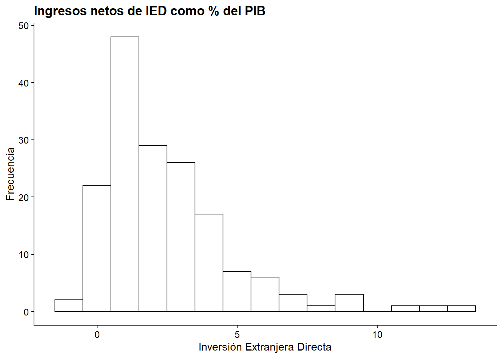


```r
## Casos extremos en x

modelo_6c_aug <- modelo_6c_aug %>% 
  mutate(dif_csied = abs(inversion_extranjera - mean(inversion_extranjera, na.rm = T)))

ggplot(data = modelo_6c_aug,
       mapping = aes(x = .fitted, y = dif_csied)) +
  geom_point() +
  geom_text_repel(data = modelo_6c_aug %>% top_n(3, dif_csied),
            mapping = aes(label = pais)) + 
  labs(title = "Casos extremos en X",
       x = "Predichos")
```

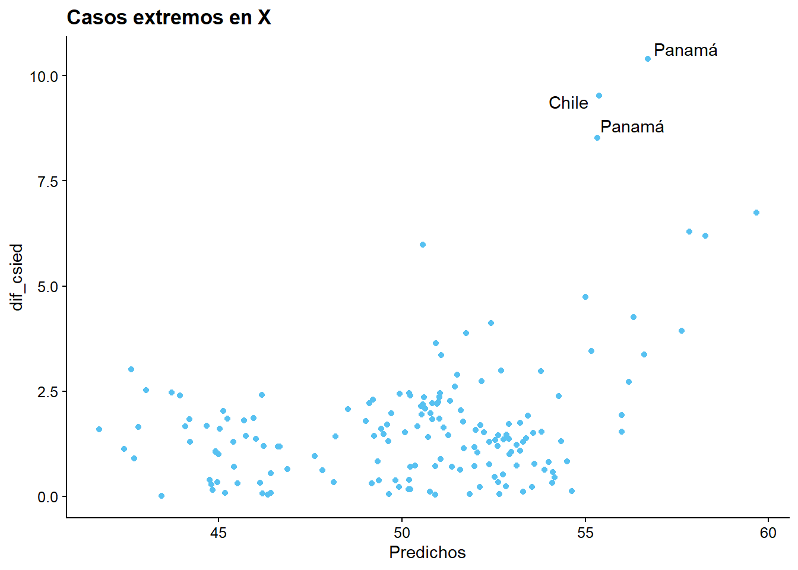

Al igual que en el ejercicio 6A, Chile y Panamá son casos extremos en X, es decir, en la variable de inversión extranjera. 


```r
## Casos extremos en Y

modelo_6c_aug <- modelo_6c_aug %>% 
  mutate(dif_gini = abs(gini - mean(gini, na.rm = T)))

ggplot(data = modelo_6c_aug, 
       mapping = aes(x = .fitted, y = dif_gini)) +
  geom_point() +
  geom_text_repel(data = modelo_6c_aug %>% top_n(2, dif_gini),
            mapping = aes(label = pais)) + 
  labs(title = "Casos extremos en Y",
       x = "Predichos")
```


Barbados y Jamaica nuevamente aparecen como posibles casos para analizar, ya que se presentan como observaciones que tienen valores extremos en la variable dependiente del Gini. 

Para los casos mas diferentes, ya creamos la variable de tratamiento de la IED en el primer paso del ejercicio 6B.


```r
## Casos mas diferentes

lm(gini ~ gasto_educ + gasto_salud + gasto_segsocial + pib + inversion_extranjera,
                data = bienestar_sinna)
## 
## Call:
## lm(formula = gini ~ gasto_educ + gasto_salud + gasto_segsocial + 
##     pib + inversion_extranjera, data = bienestar_sinna)
## 
## Coefficients:
##          (Intercept)            gasto_educ           gasto_salud  
##            53.636292              0.715726             -1.211135  
##      gasto_segsocial                   pib  inversion_extranjera  
##            -0.302074             -0.000444              0.718265

modelo6c_puntuacion_propension <- glm(tratamiento_ied ~ gasto_educ + gasto_salud +
                                        gasto_segsocial + pib , 
                                    data      = bienestar_sinna, 
                                    family    = binomial(link = logit), 
                                    na.action = na.exclude)

puntuaciones_propension_6c <- augment(modelo6c_puntuacion_propension, data = bienestar_sinna,
                            type.predict = "response") %>%
  select(puntuaciones_propension = .fitted, pais, tratamiento_ied, anio, gini) %>% 
  mutate(gini = if_else(gini > mean(gini, na.rm = T), 1, 0))
```

Ahora pasamos a ver los casos con puntuaciones de propensión más bajas y altas:


```r
puntuaciones_propension_6c %>%
  filter(gini == 1 & tratamiento_ied == 0) %>%
  arrange(puntuaciones_propension) %>%
  select(pais, anio, puntuaciones_propension) %>%
  slice(1:2)
## # A tibble: 2 x 3
##   pais     anio puntuaciones_propension
##   <chr>   <dbl>                   <dbl>
## 1 Ecuador  2000                   0.113
## 2 Brasil   1986                   0.120

puntuaciones_propension_6c %>%
  filter(gini == 1 & tratamiento_ied == 0) %>%
  arrange(-puntuaciones_propension) %>%
  select(pais, anio, puntuaciones_propension) %>%
  slice(1:2)
## # A tibble: 2 x 3
##   pais     anio puntuaciones_propension
##   <chr>   <dbl>                   <dbl>
## 1 Bolivia  1993                   0.735
## 2 Panamá   1989                   0.673
```

Los resultados indican que podríamos comparar Ecuador o Brasil con Bolivia o Panamá si quisieramos ver casos muy diferentes. 

## Capítulo 7: Modelos de panel {-}

#### Paquetes y carga de datos {-}


```r
library(tidyverse)
library(paqueteadp)
## install.packages("unvotes")
library(unvotes)
## install.packages("lubridate")
library(lubridate)
library(ggcorrplot)
## install.packages("plm")
library(plm)
library(lmtest)

data("bienestar")
```

#### Ejercicio 7A {-}

> Usando la base de datos del capítulo de MCO (Latin America Welfare Dataset, 1960-2014, Huber et al. 2006), grafica el comportamiento del Índice de Gini (`gini_slc`) en América Latina a lo largo del tiempo.

###### Alternativa 1: Gráfico de líneas {-}


```r
ggplot(data = bienestar) + 
  geom_line(aes(x = anio, y = gini, color = pais, linetype = pais, group = pais)) + 
  labs(x = "Anio",
       y = "Gini", color = "", linetype = "")
```


###### Alternativa 2: Gráfico de cajas (boxplot) {-}


```r
ggplot(bienestar, aes(x = factor(anio), y = gini)) +
  geom_boxplot() +
  scale_x_discrete(breaks = seq(1970, 2007, by = 5)) +
  labs(x = "Año", y = "Gini")
```

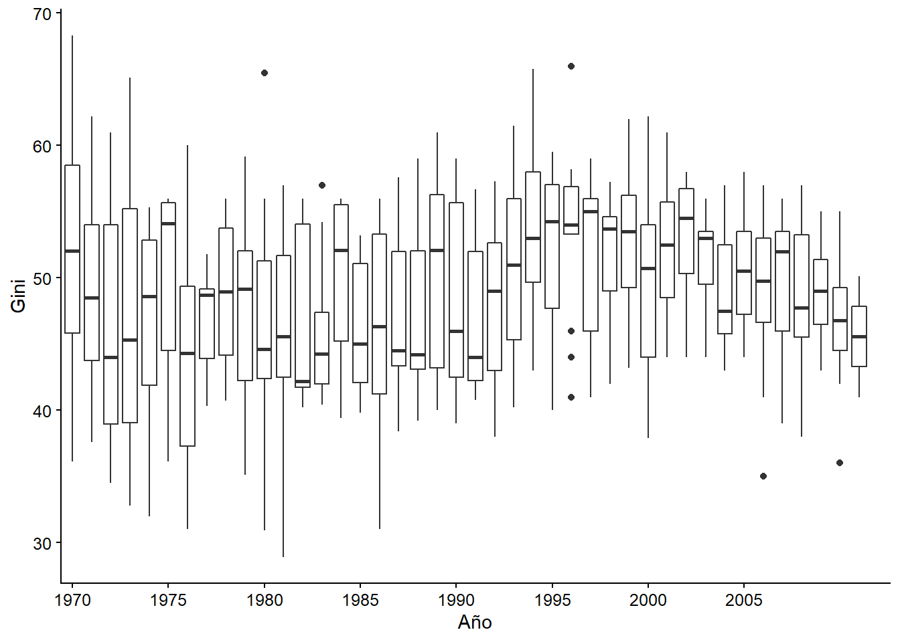

Del gráfico de líneas podemos ver que el índice de Gini no es uniforme entre los países de América Latina. De hecho, hay una gran cantidad de datos perdidos, sobre todo en países caribeños y centroamericanos. Esto también se refleja en el gráfico de cajas, se puede apreciar que las cajas son bastante largas, por lo que habría gran variación entre las observaciones. Esto tiende a disminuir con el tiempo, a partir de la década de los 90 las cajas y los bigotes empiezan a ser más cortos. 

Ahora que hemos visto el comportamiento del índice de Gini, pasaremos a ver nuestra variable independiente: el gasto en educación (`gasto_educ`). Recordemos que estamos siguiendo el ejemplo del [Capítulo 5](https://arcruz0.github.io/libroadp/linear.html#m%C3%ADnimos-cuadrados-ordinarios-en-r). 


```r
ggplot(bienestar, aes(x = anio, y = gasto_educ)) + 
  geom_line() +
  facet_wrap(~pais, nrow = 5) + 
  labs(x = "Año", y = "Gasto en educación") + 
  theme(axis.text.x = element_text(angle = 45, vjust = 0.7)) #Le cambiamos el ángulo y la separación a las etiquetas del eje X para que sea más fácil leerlas
```

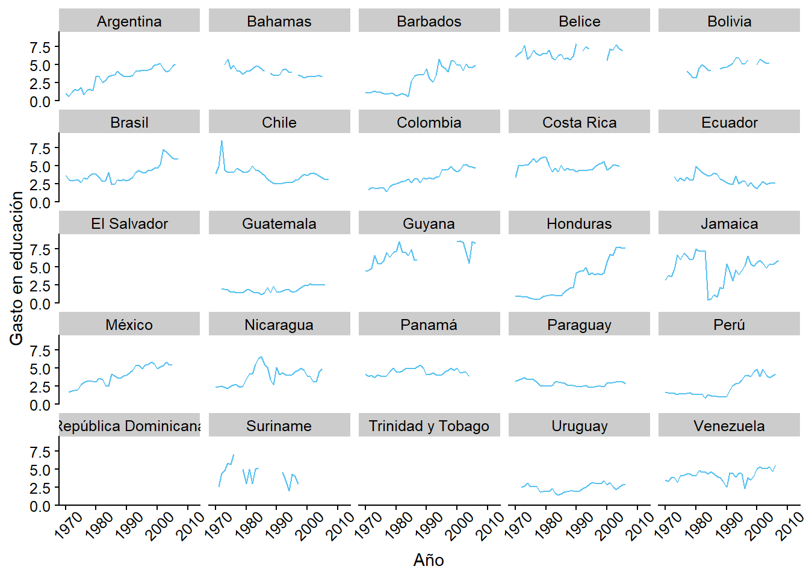

Se repite nuevamente que faltan algunos datos para los países. 

#### Ejercicio 7B {-}

Utilice la base de datos del capítulo de la MCO (Latin America Welfare Dataset, 1960-2014, de Evelyne Huber y John D. Stephens) para estimar un modelo de efectos fijos y otro de efectos aleatorios en el que su variable dependiente sea el índice de Gini (`gini`). 
A continuación, realice un test de especificación de Hausman.

###### Modelo de efectos fijos {-}


```r
##Alternativa 1: crearlo manualmente con comando lm

modelo7b_manual_fe <- lm(gini ~ gasto_educ + factor(pais), data = bienestar)

summary(modelo7b_manual_fe)
## 
## Call:
## lm(formula = gini ~ gasto_educ + factor(pais), data = bienestar)
## 
## Residuals:
##     Min      1Q  Median      3Q     Max 
## -18.340  -2.101  -0.092   2.262  20.783 
## 
## Coefficients:
##                        Estimate Std. Error t value Pr(>|t|)    
## (Intercept)              41.030      1.120   36.62  < 2e-16 ***
## gasto_educ                0.645      0.238    2.70  0.00720 ** 
## factor(pais)Bahamas       3.516      1.500    2.34  0.01963 *  
## factor(pais)Barbados     -6.163      1.803   -3.42  0.00071 ***
##  [ reached getOption("max.print") -- omitted 18 rows ]
## ---
## Signif. codes:  0 '***' 0.001 '**' 0.01 '*' 0.05 '.' 0.1 ' ' 1
## 
## Residual standard error: 4.6 on 334 degrees of freedom
##   (718 observations deleted due to missingness)
## Multiple R-squared:  0.588,	Adjusted R-squared:  0.562 
## F-statistic: 22.7 on 21 and 334 DF,  p-value: <2e-16

##Alternativa 2: crear el modelo ocupando plm

modelo7b_fe <- plm(gini ~ gasto_educ, data = bienestar, index = c("pais", "anio"))

summary(modelo7b_fe)
## Oneway (individual) effect Within Model
## 
## Call:
## plm(formula = gini ~ gasto_educ, data = bienestar, index = c("pais", 
##     "anio"))
## 
## Unbalanced Panel: n = 21, T = 1-34, N = 356
## 
## Residuals:
##     Min.  1st Qu.   Median  3rd Qu.     Max. 
## -18.3401  -2.1010  -0.0915   2.2625  20.7830 
## 
## Coefficients:
##            Estimate Std. Error t-value Pr(>|t|)   
## gasto_educ    0.645      0.238     2.7   0.0072 **
## ---
## Signif. codes:  0 '***' 0.001 '**' 0.01 '*' 0.05 '.' 0.1 ' ' 1
## 
## Total Sum of Squares:    7150
## Residual Sum of Squares: 7000
## R-Squared:      0.0214
## Adj. R-Squared: -0.0401
## F-statistic: 7.31195 on 1 and 334 DF, p-value: 0.0072
```

###### Modelo de efectos aleatorios {-}


```r
modelo7b_re <- plm(gini ~ gasto_educ, data = bienestar, index = c("pais", "anio"),
                   model = "random")

summary(modelo7b_re)
## Oneway (individual) effect Random Effect Model 
##    (Swamy-Arora's transformation)
## 
## Call:
## plm(formula = gini ~ gasto_educ, data = bienestar, model = "random", 
##     index = c("pais", "anio"))
## 
## Unbalanced Panel: n = 21, T = 1-34, N = 356
## 
## Effects:
##                 var std.dev share
## idiosyncratic 20.96    4.58  0.45
## individual    25.82    5.08  0.55
## theta:
##    Min. 1st Qu.  Median    Mean 3rd Qu.    Max. 
##    0.33    0.78    0.82    0.80    0.84    0.85 
## 
## Residuals:
##    Min. 1st Qu.  Median    Mean 3rd Qu.    Max. 
##  -17.97   -2.41    0.30    0.03    2.54   20.02 
## 
## Coefficients:
##             Estimate Std. Error z-value Pr(>|z|)    
## (Intercept)   46.953      1.483   31.67   <2e-16 ***
## gasto_educ     0.654      0.230    2.85   0.0044 ** 
## ---
## Signif. codes:  0 '***' 0.001 '**' 0.01 '*' 0.05 '.' 0.1 ' ' 1
## 
## Total Sum of Squares:    10500
## Residual Sum of Squares: 7510
## R-Squared:      0.288
## Adj. R-Squared: 0.286
## Chisq: 8.09928 on 1 DF, p-value: 0.00443
```

###### Test de Hausman {-}


```r
phtest(modelo7b_fe, modelo7b_re)
## 
## 	Hausman Test
## 
## data:  gini ~ gasto_educ
## chisq = 0.02, df = 1, p-value = 0.9
## alternative hypothesis: one model is inconsistent
```

Viendo el valor-p, no podemos rechazar la hipótesis nula de que los efectos fijos está siendo modelados adecuadamente, por lo que deberíamos ocupar el modelo de efectos aleatorios. 


#### Ejercicio 7C {-}

> Utiliza el Latin America Welfare Dataset para crear variables rezagadas en t-1 y t-10 del Índice Gini (`gini`). 

> Incorpore ambas variables en tu modelo y diagnostica las raíces unitarias.

**NOTA**: *El comando para hacer el test de raíces unitarias no funciona bien cuando hay valores perdidos, por lo que no presentamos la respuesta de este ejercicio.*


###### Tests para detectar raíces unitarias {-}


```r
##Test de Lavin et al. (2002)

purtest(gini ~ 1, data = bienestar, 
        index = c("pais", "anio"), pmax = 10, test = "levinlin", 
        lags = "AIC", exo = "intercept")
```

Cuando ejecutamos lo anterior nos da error, por lo que filtraremos la base para no tener valores perdidos en la variable dependiente (puedes revisar el capítulo 5, en que se realiza esta operación):


```r
bienestar_sin_na_ejercicio7 <- bienestar %>% 
  drop_na(gini, gasto_educ) %>% 
  ungroup()

## purtest(gini ~ 1, data = bienestar_sin_na_ejercicio7, 
##        index = c("pais", "anio"), pmax = 5, test = "ips", 
##        lags = "AIC", exo = "intercept")

## purtest(gini ~ 1, data = bienestar_sin_na_ejercicio7,
##        index = c("pais", "anio"), pmax = 10, test = "levinlin", 
##        lags = "AIC", exo = "intercept")


## purtest(gasto_educ ~ 1, data = bienestar_sin_na_ejercicio7,
##        index = c("pais", "anio"), pmax = 10, test = "levinlin", 
##        lags = "AIC", exo = "intercept")
```

###### Creación de variables rezagadas (lagged) {-}


```r
bienestar_sin_na_ejercicio7 <- bienestar_sin_na_ejercicio7 %>%
  arrange(pais, anio) %>% 
  group_by(pais) %>% 
  mutate(gini_lag1 = dplyr::lag(gini, 1),
         gini_lag10 = dplyr::lag(gini, 10),
         gasto_educ_lag1 = dplyr::lag(gasto_educ, 1),
         gasto_educ_lag10 = dplyr::lag(gasto_educ, 10)) %>% 
  ungroup()
```


###### Estimación de modelo con variables rezagadas {-}


```r
##Modelo dinámico

modelo7c_lag <- plm(gini ~ gini_lag1 + gini_lag10 + gasto_educ, 
                    data = bienestar_sin_na_ejercicio7, index = c("pais", "anio"), 
                    model = "random")

summary(modelo7c_lag)
## Oneway (individual) effect Random Effect Model 
##    (Swamy-Arora's transformation)
## 
## Call:
## plm(formula = gini ~ gini_lag1 + gini_lag10 + gasto_educ, data = bienestar_sin_na_ejercicio7, 
##     model = "random", index = c("pais", "anio"))
## 
## Unbalanced Panel: n = 16, T = 1-24, N = 171
## 
## Effects:
##                 var std.dev share
## idiosyncratic 14.67    3.83     1
## individual     0.00    0.00     0
## theta:
##    Min. 1st Qu.  Median    Mean 3rd Qu.    Max. 
##       0       0       0       0       0       0 
## 
## Residuals:
##     Min.  1st Qu.   Median  3rd Qu.     Max. 
## -13.0907  -1.9174  -0.0954   2.0603  19.8746 
## 
## Coefficients:
##             Estimate Std. Error z-value Pr(>|z|)    
## (Intercept)  11.5534     2.7153    4.25  2.1e-05 ***
## gini_lag1     0.5068     0.0641    7.90  2.7e-15 ***
## gini_lag10    0.2661     0.0551    4.83  1.4e-06 ***
## gasto_educ    0.0298     0.2820    0.11     0.92    
## ---
## Signif. codes:  0 '***' 0.001 '**' 0.01 '*' 0.05 '.' 0.1 ' ' 1
## 
## Total Sum of Squares:    6590
## Residual Sum of Squares: 2920
## R-Squared:      0.556
## Adj. R-Squared: 0.548
## Chisq: 209.512 on 3 DF, p-value: <2e-16
```

Al estimar el modelo dinámico con la variable de Gini rezagada en t-1 y t-10 vemos que el coeficiente de gasto en educación pierde significancia.

Pasemos a hacer el test Wooldridge de errores AR(1) 


```r
## pwartest(modelo7c_lag)
```


#### Ejercicio 7D {-}

En el modelo que estimaste en el ejercicio anterior, calcula los errores estándar corregidos para panel. 


```r
coeftest(modelo7c_lag, vcov. = function(x){vcovHC(x, type = "sss")})
## 
## t test of coefficients:
## 
##             Estimate Std. Error t value Pr(>|t|)    
## (Intercept)  11.5534     2.9297    3.94  0.00012 ***
## gini_lag1     0.5068     0.0894    5.67  6.1e-08 ***
## gini_lag10    0.2661     0.0470    5.66  6.5e-08 ***
## gasto_educ    0.0298     0.3059    0.10  0.92250    
## ---
## Signif. codes:  0 '***' 0.001 '**' 0.01 '*' 0.05 '.' 0.1 ' ' 1

## coeftest(modelo7c_lag, vcov. = NULL)

summary(modelo7c_lag)
## Oneway (individual) effect Random Effect Model 
##    (Swamy-Arora's transformation)
## 
## Call:
## plm(formula = gini ~ gini_lag1 + gini_lag10 + gasto_educ, data = bienestar_sin_na_ejercicio7, 
##     model = "random", index = c("pais", "anio"))
## 
## Unbalanced Panel: n = 16, T = 1-24, N = 171
## 
## Effects:
##                 var std.dev share
## idiosyncratic 14.67    3.83     1
## individual     0.00    0.00     0
## theta:
##    Min. 1st Qu.  Median    Mean 3rd Qu.    Max. 
##       0       0       0       0       0       0 
## 
## Residuals:
##     Min.  1st Qu.   Median  3rd Qu.     Max. 
## -13.0907  -1.9174  -0.0954   2.0603  19.8746 
## 
## Coefficients:
##             Estimate Std. Error z-value Pr(>|z|)    
## (Intercept)  11.5534     2.7153    4.25  2.1e-05 ***
## gini_lag1     0.5068     0.0641    7.90  2.7e-15 ***
## gini_lag10    0.2661     0.0551    4.83  1.4e-06 ***
## gasto_educ    0.0298     0.2820    0.11     0.92    
## ---
## Signif. codes:  0 '***' 0.001 '**' 0.01 '*' 0.05 '.' 0.1 ' ' 1
## 
## Total Sum of Squares:    6590
## Residual Sum of Squares: 2920
## R-Squared:      0.556
## Adj. R-Squared: 0.548
## Chisq: 209.512 on 3 DF, p-value: <2e-16
```


```r
summary(modelo7c_lag)
## Oneway (individual) effect Random Effect Model 
##    (Swamy-Arora's transformation)
## 
## Call:
## plm(formula = gini ~ gini_lag1 + gini_lag10 + gasto_educ, data = bienestar_sin_na_ejercicio7, 
##     model = "random", index = c("pais", "anio"))
## 
## Unbalanced Panel: n = 16, T = 1-24, N = 171
## 
## Effects:
##                 var std.dev share
## idiosyncratic 14.67    3.83     1
## individual     0.00    0.00     0
## theta:
##    Min. 1st Qu.  Median    Mean 3rd Qu.    Max. 
##       0       0       0       0       0       0 
## 
## Residuals:
##     Min.  1st Qu.   Median  3rd Qu.     Max. 
## -13.0907  -1.9174  -0.0954   2.0603  19.8746 
## 
## Coefficients:
##             Estimate Std. Error z-value Pr(>|z|)    
## (Intercept)  11.5534     2.7153    4.25  2.1e-05 ***
## gini_lag1     0.5068     0.0641    7.90  2.7e-15 ***
## gini_lag10    0.2661     0.0551    4.83  1.4e-06 ***
## gasto_educ    0.0298     0.2820    0.11     0.92    
## ---
## Signif. codes:  0 '***' 0.001 '**' 0.01 '*' 0.05 '.' 0.1 ' ' 1
## 
## Total Sum of Squares:    6590
## Residual Sum of Squares: 2920
## R-Squared:      0.556
## Adj. R-Squared: 0.548
## Chisq: 209.512 on 3 DF, p-value: <2e-16
```


```r
coeftest(modelo7c_lag, vcov = vcovBK, type = "HC1", cluster = "time")
## 
## t test of coefficients:
## 
##             Estimate Std. Error t value Pr(>|t|)    
## (Intercept)  11.5534     3.1098    3.72  0.00028 ***
## gini_lag1     0.5068     0.0979    5.18  6.4e-07 ***
## gini_lag10    0.2661     0.0778    3.42  0.00078 ***
## gasto_educ    0.0298     0.2737    0.11  0.91342    
## ---
## Signif. codes:  0 '***' 0.001 '**' 0.01 '*' 0.05 '.' 0.1 ' ' 1
```


## Capítulo 8: Modelos logísticos {-}

#### Paquetes y carga de datos {-}


```r
library(tidyverse)
library(paqueteadp)
## install.packages("ggcorrplot")
library(ggcorrplot)
## install.packages("margins")
library(margins)
## install.packages("prediction")
library(prediction)
library(texreg)
## install.packages("jtools")
library(jtools)
library(skimr)
## install.packages("pscl")
library(pscl)
## install.packages("DescTools")
library(DescTools)
library(broom)
## install.packages("plotROC")
library(plotROC)
## install.packages("separationplot")
library(separationplot)
```


#### Ejercicio 8A {-}

Tomate un minuto para hacer un ejercicio antes de continuar. 

> 1. Abre la base de datos `latinobarometro` del paquete del libro: data (latinobarometro). Esta es una encuesta de 2018 de la opinión pública latinoamericana sobre temas políticos. 


```r
data(latinobarometro)

latinobarometro
##   pais edad ideol ingresos educ pos_socioec pro_dem
## 1   32   46     4        3    8           4       0
## 2   32   79     5        3    8           3       1
##  [ reached 'max' / getOption("max.print") -- omitted 14473 rows ]
```


> 2. La variable `pro_dem` es 1 si la persona cree que la democracia es, a pesar de sus problemas, la mejor forma de gobierno existente. Calcula cuánto cambia la probabilidad de que esta respuesta sea 1 dependiendo de los años de educación del encuestado (`educ`). 


```r
modelo_8a <- glm(pro_dem ~ educ, 
                 data = latinobarometro,
                 family = binomial("logit"))

summary(modelo_8a)
## 
## Call:
## glm(formula = pro_dem ~ educ, family = binomial("logit"), data = latinobarometro)
## 
## Deviance Residuals: 
##    Min      1Q  Median      3Q     Max  
## -1.677  -1.423   0.806   0.887   1.084  
## 
## Coefficients:
##             Estimate Std. Error z value Pr(>|z|)    
## (Intercept)   0.1671     0.0464     3.6  0.00031 ***
## educ          0.0564     0.0042    13.4  < 2e-16 ***
## ---
## Signif. codes:  0 '***' 0.001 '**' 0.01 '*' 0.05 '.' 0.1 ' ' 1
## 
## (Dispersion parameter for binomial family taken to be 1)
## 
##     Null deviance: 18163  on 14474  degrees of freedom
## Residual deviance: 17982  on 14473  degrees of freedom
## AIC: 17986
## 
## Number of Fisher Scoring iterations: 4
```

El modelo binomial nos indica que la variable `educ` es estadísticamente significativa con un valor p menor a 2.2e-16 para explicar los sentimientos positivos hacia la democracia. Debido a que el coeficiente es positivo, mayor educación llevaría a mejores visiones de la democracia. Sin embargo, es importante recalcar que el coeficiente es bastante pequeño (0.05), por lo que el efecto no es muy grande. 

> 3. ¿Cuál es el odds ratio de un año más de educación? ¿En qué país es mayor el efecto, en Brasil o en México?

Recordemos cómo calcular el odds ratio:

$$ ln ({p \over p-1})=\beta_0 + \beta_1 x_1

$$

$$ \hat{p} = {e^{\beta_0 + \beta_1 x_1}\over 1 + e^{\beta_0 + \beta_1 x_1}}

$$

Ahora calculamos el primer $\hat{p}$ para $x=1$ y $x = 2$. Si reemplazamos con los valores calculados del modelo: 

$$ \hat{p_1} = {e^{0.167 + 0.056*1}\over 1 + e^{{0.167 + 0.056*1}}} $$

$$ \hat{p_1} = {e^{0.223}\over 1+e^{0.223}} $$
$$\hat{p_1} = {1.25 \over 1+1.25} = 0.556 $$

$$ \hat{p_2} = {e^{0.167 + 0.056*2}\over 1 + e^{{0.167 + 0.056*2}}} $$

$$ \hat{p_2} = {e^{0.279}\over 1+e^{0.279}} $$
$$ \hat{p_2}= {1.32\over 1 + 1.32} = 0.569 $$

Ya calculamos las probabilidades, ahora calculemos los odds ratio: 

$$ {0.556 \over 0.569}  = 0.977$$ 

El resultado es menor a 1, por lo que el cambio entre tener un año más de educación y estar a favor de la democracia es negativo. 

 ¿En qué país es mayor el efecto, en Brasil o en México?

Ahora bien, para calcular la diferencia entre México y Brasil debemos obtener los promedios de años de eduación para ambos países (el capítulo 2 de este libro hace una buena introducción a cómo utilizar las funciones de `dplyr` para el manejo de datos): 


```r
unique(latinobarometro$pais)
##  [1]  32  68  76 170 188 152 218 222 320 340 484 558 591 600 604 214 858
## [18] 862

latinobarometro %>% 
  filter(pais %in% c(76, 484)) %>% 
  group_by(pais) %>% 
  summarise(mean_educ = mean(educ))
## # A tibble: 2 x 2
##    pais mean_educ
##   <int>     <dbl>
## 1    76      9.89
## 2   484      9.64
```

Ahora ocuparemos estos promedios en vez de la $x$ en la fórmula para obtener $\hat{p}$:

$$ \hat{p}_B =  {e^{0.167 + 0.056*9.885}\over 1 + e^{{0.167 + 0.056*9.885}}} $$

$$ \hat{p}_B =  {e^{0.72}\over 1 + e^{{0.72}}} = {2.054 \over 1+2.054} = 0.673  $$

$$ \hat{p}_M =  {e^{0.167 + 0.056*9.638}\over 1 + e^{{0.167 + 0.056*9.638}}} $$

$$ \hat{p}_M =  {e^{0.707}\over 1 + e^{{0.707}}} = {2.028 \over 1+2.028} = 0.669 $$
$$ {0.673 \over 0.669} = 1.006$$

El *odds ratio* es ligeramente superior a uno, por lo que nos indicaría que hay un cambio positivo entre Brasil y México. El resultado de 1.006 nos dice que al comparar Brasil con México, en el primer país es 0.6% más probable que las personas tengan sentimientos más positivos a la democracia que en México. 


#### Ejercicio 8B {-}

> Usando la base de datos del Latinobarometro, escoge tres variables que creas que pueden predecir `pro_dem` e interpreta el modelo con `summary`. Si te atreves, crea tablas con `texreg`. Las variables disponibles son: `edad` (edad del encuestado), `ideol` (donde 1 es la extrema izquierda y 10 la extrema derecha), `educ` (años de educación del encuestado) y `pos_socioec` (1, muy bueno - 5, muy malo).


```r
modelo_8b <- glm(pro_dem ~ educ + ingresos + pos_socioec, 
                 data = latinobarometro,
                 family = binomial("logit"))

summary(modelo_8b)
## 
## Call:
## glm(formula = pro_dem ~ educ + ingresos + pos_socioec, family = binomial("logit"), 
##     data = latinobarometro)
## 
## Deviance Residuals: 
##    Min      1Q  Median      3Q     Max  
## -1.775  -1.394   0.803   0.891   1.197  
## 
## Coefficients:
##             Estimate Std. Error z value Pr(>|z|)    
## (Intercept)  0.73022    0.09504    7.68  1.6e-14 ***
## educ         0.04720    0.00444   10.64  < 2e-16 ***
## ingresos    -0.11905    0.02134   -5.58  2.4e-08 ***
## pos_socioec -0.06938    0.02275   -3.05   0.0023 ** 
## ---
## Signif. codes:  0 '***' 0.001 '**' 0.01 '*' 0.05 '.' 0.1 ' ' 1
## 
## (Dispersion parameter for binomial family taken to be 1)
## 
##     Null deviance: 18163  on 14474  degrees of freedom
## Residual deviance: 17931  on 14471  degrees of freedom
## AIC: 17939
## 
## Number of Fisher Scoring iterations: 4

tabla8b <- htmlreg(modelo_8b,
          custom.model.names = c("Modelo 1"),
          custom.coef.names = c("Intercepto", 
                                "Educación", 
                                "Ingresos",
                                "Posición Socioeconómica"),
          override.coef    = exp(coef(modelo_8b)),
          override.se      = odds_se(modelo_8b),
          override.pvalues = odds_pvalues(modelo_8b),
          omit.coef = "Inter")

htmltools::HTML(tabla8b)
```

```{=html}
<table class="texreg" style="margin: 10px auto;border-collapse: collapse;border-spacing: 0px;caption-side: bottom;color: #000000;border-top: 2px solid #000000;">
<caption>Statistical models</caption>
<thead>
<tr>
<th style="padding-left: 5px;padding-right: 5px;">&nbsp;</th>
<th style="padding-left: 5px;padding-right: 5px;">Modelo 1</th>
</tr>
</thead>
<tbody>
<tr style="border-top: 1px solid #000000;">
<td style="padding-left: 5px;padding-right: 5px;">Educación</td>
<td style="padding-left: 5px;padding-right: 5px;">1.05<sup>***</sup></td>
</tr>
<tr>
<td style="padding-left: 5px;padding-right: 5px;">&nbsp;</td>
<td style="padding-left: 5px;padding-right: 5px;">(0.00)</td>
</tr>
<tr>
<td style="padding-left: 5px;padding-right: 5px;">Ingresos</td>
<td style="padding-left: 5px;padding-right: 5px;">0.89<sup>***</sup></td>
</tr>
<tr>
<td style="padding-left: 5px;padding-right: 5px;">&nbsp;</td>
<td style="padding-left: 5px;padding-right: 5px;">(0.02)</td>
</tr>
<tr>
<td style="padding-left: 5px;padding-right: 5px;">Posición Socioeconómica</td>
<td style="padding-left: 5px;padding-right: 5px;">0.93<sup>***</sup></td>
</tr>
<tr>
<td style="padding-left: 5px;padding-right: 5px;">&nbsp;</td>
<td style="padding-left: 5px;padding-right: 5px;">(0.02)</td>
</tr>
<tr style="border-top: 1px solid #000000;">
<td style="padding-left: 5px;padding-right: 5px;">AIC</td>
<td style="padding-left: 5px;padding-right: 5px;">17939.27</td>
</tr>
<tr>
<td style="padding-left: 5px;padding-right: 5px;">BIC</td>
<td style="padding-left: 5px;padding-right: 5px;">17969.59</td>
</tr>
<tr>
<td style="padding-left: 5px;padding-right: 5px;">Log Likelihood</td>
<td style="padding-left: 5px;padding-right: 5px;">-8965.63</td>
</tr>
<tr>
<td style="padding-left: 5px;padding-right: 5px;">Deviance</td>
<td style="padding-left: 5px;padding-right: 5px;">17931.27</td>
</tr>
<tr style="border-bottom: 2px solid #000000;">
<td style="padding-left: 5px;padding-right: 5px;">Num. obs.</td>
<td style="padding-left: 5px;padding-right: 5px;">14475</td>
</tr>
</tbody>
<tfoot>
<tr>
<td style="font-size: 0.8em;" colspan="2"><sup>***</sup>p &lt; 0.001; <sup>**</sup>p &lt; 0.01; <sup>*</sup>p &lt; 0.05</td>
</tr>
</tfoot>
</table>

```

#### Ejercicio 8C {-}

> Con las regresiones que has corrido usando los datos del Latinobarometro, crea tres gráficos para visualizar los efectos, ya sean probabilidades predichas, efectos marginales o coeficientes expresados como odds ratios. ¿Sus hallazgos tienen una significancia sustantiva?

###### Probabilidades predichas para modelo 8B {-}


```r

cdat <- cplot(modelo_8b, "pos_socioec", what = "prediction",
              main = "Pr(Pro Democracia)", draw = F)

ggplot(cdat, aes(x = xvals)) +
  geom_line(aes(y = yvals)) +
  geom_line(aes(y = upper), linetype = 2)+
     geom_line(aes(y = lower), linetype = 2) +
  geom_hline(yintercept = 0) +
  labs(title = "Pr. Pro Democracia",
       x = "Posición Socioeconómica", y = "Prob. predicha")
```


###### Efectos marginales para modelo 8A {-}


```r
marginal_ef <- margins(modelo_8a)

plot(marginal_ef, 
     labels = c("Educación"),
     ylab = "AME")
```

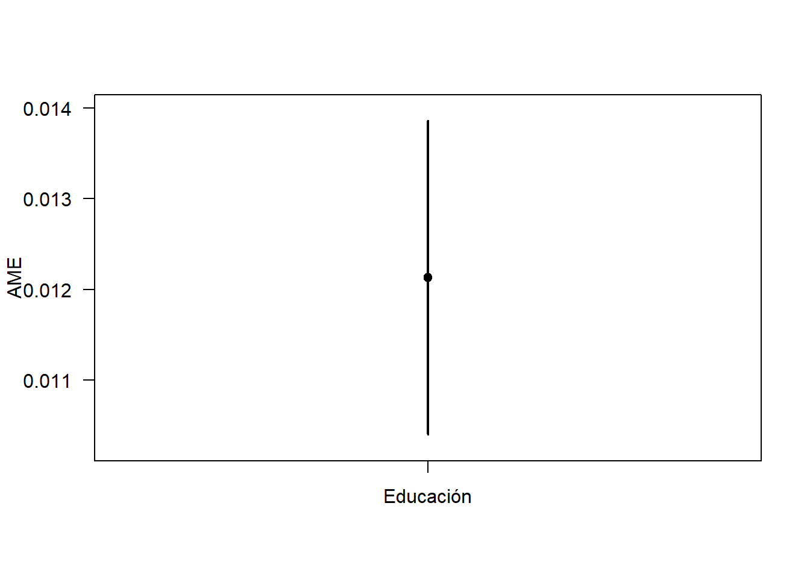

###### Odds ratios {-}


```r
## install.packages("ggstance")
## install.packages("huxtable")
## install.packages("broom.mixed")

nombres_modelos <- c("Modelo 8A", "Modelo 8B")

odds_ratios <- plot_summs(modelo_8a, modelo_8b, 
                          exp=T, 
                          scale = F,
                          inner_ci_level = .9,
                          coefs = c("Educación" =  "educ",
                                    "Ingresos" = "ingresos",
                                    "Posición Socioeconómica" = "pos_socioec"),
                          model.names = nombres_modelos)

odds_ratios + labs(x = "Coeficientes exponenciados", y = NULL)
```


La educación parece ser un factor importante en la visión positiva de la democracia. 

#### Ejercicio 8D {-}

1. Usa la base de datos latinobarometro del paquete del libro:`data(latinobarometro)`.  
2. La variable `pro_dem` asume 1 si la persona cree que la democracia es, a pesar de sus problemas, la mejor forma de gobierno existente. Dependiendo de los años de educación del encuestado `educ`, calcula cuánto cambia la probabilidad de que esta respuesta sea 1.  
3. Estima un modelo que prediga, lo mejor que puedas, la variable dependiente.  
4. Traza la curva ROC del modelo.

Este ejercicio es muy parecido al 8A, por lo que se procederá a ilustrar la curva ROC del modelo 8A:


```r
pred_modelo_8a <- bind_rows(augment(modelo_8a, response.type = "pred") %>%
                           mutate(model = "Modelo 1"))

roc <- ggplot(pred_modelo_8a, aes(d = pro_dem, 
                                  m = .fitted, 
                                  color = model)) +
  geom_roc(n.cuts = 0) + 
  geom_abline(slope = 1) +
  labs(x = "1 - especificidad", y = "Sensibilidad")

roc
```


#### Ejercicio 8E {-}

- Añade dos variables independientes al modelo 3 que revisamos en el capítulo e interpreta los coeficientes como odds ratios.  
- Gráfica estos coeficientes usando `ggplot2`.  
- Diagnostica el ajuste del modelo con un ROC y un plot de separación.


```r
data("quiebre_democracia")

modelo_3_cap8 <- glm(quiebre_democracia ~ poder_presid + edad_regimen +
                       calidad_democracia + crecim_10a + gini,
                     data   = quiebre_democracia,
                     family = binomial("logit"))
## Warning: glm.fit: algorithm did not converge
## Warning: glm.fit: fitted probabilities numerically 0 or 1 occurred

summary(modelo_3_cap8)
## 
## Call:
## glm(formula = quiebre_democracia ~ poder_presid + edad_regimen + 
##     calidad_democracia + crecim_10a + gini, family = binomial("logit"), 
##     data = quiebre_democracia)
## 
## Deviance Residuals: 
##       Min         1Q     Median         3Q        Max  
## -8.97e-05  -2.00e-08  -2.00e-08  -2.00e-08   7.65e-05  
## 
## Coefficients:
##                     Estimate Std. Error z value Pr(>|z|)
## (Intercept)         3.22e+00   7.87e+04       0        1
## poder_presid        2.65e+00   2.32e+03       0        1
## edad_regimen        7.75e-01   7.73e+02       0        1
## calidad_democracia -2.80e+01   6.31e+03       0        1
## crecim_10a         -9.64e+01   3.98e+05       0        1
##  [ reached getOption("max.print") -- omitted 1 row ]
## 
## (Dispersion parameter for binomial family taken to be 1)
## 
##     Null deviance: 6.2000e+01  on 389  degrees of freedom
## Residual deviance: 4.0353e-08  on 384  degrees of freedom
##   (1826 observations deleted due to missingness)
## AIC: 12
## 
## Number of Fisher Scoring iterations: 25

screenreg(modelo_3_cap8)
## 
## ===============================
##                     Model 1    
## -------------------------------
## (Intercept)               3.22 
##                      (78662.79)
## poder_presid              2.65 
##                       (2316.07)
## edad_regimen              0.78 
##                        (773.07)
## calidad_democracia      -27.95 
##                       (6311.39)
## crecim_10a              -96.35 
##                     (397585.34)
## gini                      1.33 
##                       (1129.55)
## -------------------------------
## AIC                      12.00 
## BIC                      35.80 
## Log Likelihood           -0.00 
## Deviance                  0.00 
## Num. obs.               390    
## ===============================
## *** p < 0.001; ** p < 0.01; * p < 0.05

tabla8d <- htmlreg(modelo_3_cap8,
                   custom.model.names = c("Modelo 3 Modificado"),
                   custom.coef.names = c("Poder Presidencial", 
                                         "Edad Régimen",
                                         "Calidad democracia",
                                         "Crecimiento 10 años",
                                         "Gini"),
                   override.coef    = exp(coef(modelo_3_cap8)),
                   override.se      = odds_se(modelo_3_cap8),
                   override.pvalues = odds_pvalues(modelo_3_cap8),
                   omit.coef = "Inter")

htmltools::HTML(tabla8d)
```

```{=html}
<table class="texreg" style="margin: 10px auto;border-collapse: collapse;border-spacing: 0px;caption-side: bottom;color: #000000;border-top: 2px solid #000000;">
<caption>Statistical models</caption>
<thead>
<tr>
<th style="padding-left: 5px;padding-right: 5px;">&nbsp;</th>
<th style="padding-left: 5px;padding-right: 5px;">Modelo 3 Modificado</th>
</tr>
</thead>
<tbody>
<tr style="border-top: 1px solid #000000;">
<td style="padding-left: 5px;padding-right: 5px;">Poder Presidencial</td>
<td style="padding-left: 5px;padding-right: 5px;">14.13</td>
</tr>
<tr>
<td style="padding-left: 5px;padding-right: 5px;">&nbsp;</td>
<td style="padding-left: 5px;padding-right: 5px;">(32723.42)</td>
</tr>
<tr>
<td style="padding-left: 5px;padding-right: 5px;">Edad Régimen</td>
<td style="padding-left: 5px;padding-right: 5px;">2.17</td>
</tr>
<tr>
<td style="padding-left: 5px;padding-right: 5px;">&nbsp;</td>
<td style="padding-left: 5px;padding-right: 5px;">(1678.06)</td>
</tr>
<tr>
<td style="padding-left: 5px;padding-right: 5px;">Calidad democracia</td>
<td style="padding-left: 5px;padding-right: 5px;">0.00</td>
</tr>
<tr>
<td style="padding-left: 5px;padding-right: 5px;">&nbsp;</td>
<td style="padding-left: 5px;padding-right: 5px;">(0.00)</td>
</tr>
<tr>
<td style="padding-left: 5px;padding-right: 5px;">Crecimiento 10 años</td>
<td style="padding-left: 5px;padding-right: 5px;">0.00</td>
</tr>
<tr>
<td style="padding-left: 5px;padding-right: 5px;">&nbsp;</td>
<td style="padding-left: 5px;padding-right: 5px;">(0.00)</td>
</tr>
<tr>
<td style="padding-left: 5px;padding-right: 5px;">Gini</td>
<td style="padding-left: 5px;padding-right: 5px;">3.80</td>
</tr>
<tr>
<td style="padding-left: 5px;padding-right: 5px;">&nbsp;</td>
<td style="padding-left: 5px;padding-right: 5px;">(4288.83)</td>
</tr>
<tr style="border-top: 1px solid #000000;">
<td style="padding-left: 5px;padding-right: 5px;">AIC</td>
<td style="padding-left: 5px;padding-right: 5px;">12.00</td>
</tr>
<tr>
<td style="padding-left: 5px;padding-right: 5px;">BIC</td>
<td style="padding-left: 5px;padding-right: 5px;">35.80</td>
</tr>
<tr>
<td style="padding-left: 5px;padding-right: 5px;">Log Likelihood</td>
<td style="padding-left: 5px;padding-right: 5px;">-0.00</td>
</tr>
<tr>
<td style="padding-left: 5px;padding-right: 5px;">Deviance</td>
<td style="padding-left: 5px;padding-right: 5px;">0.00</td>
</tr>
<tr style="border-bottom: 2px solid #000000;">
<td style="padding-left: 5px;padding-right: 5px;">Num. obs.</td>
<td style="padding-left: 5px;padding-right: 5px;">390</td>
</tr>
</tbody>
<tfoot>
<tr>
<td style="font-size: 0.8em;" colspan="2"><sup>***</sup>p &lt; 0.001; <sup>**</sup>p &lt; 0.01; <sup>*</sup>p &lt; 0.05</td>
</tr>
</tfoot>
</table>

```

Al Modelo 3 del capítulo 8 le agregamos las variables de crecimiento económico en los últimos 10 años y el coeficiente Gini. Ninguna de las variables es estadísticamente significativa. 


## Capítulo 9: Modelos de supervivencia {-}

#### Paquetes y carga de datos {-}


```r
library(tidyverse)
library(paqueteadp)
library(skimr)
## install.packages("countrycode")
library(countrycode)
## install.packages("ggalt")
library(ggalt)
## install.packages("survival")
library(survival)
## install.packages("survminer")
library(survminer)
library(texreg)

data("quiebre_democracia")
```

#### Ejercicio 9A {-}

> Tómese un minuto para hacer un ejercicio antes de continuar. En el capítulo anterior utilizamos la base de datos Democracies and Dictatorships in Latin America: Emergence, Survival, and Fall (Mainwaring and Pérez-Liñán 2013). Utiliza la base de datos para ver si está lista para ser usada con modelos de supervivencia o si necesitas transformarla.


```r
skim(quiebre_democracia)
```


Table: (\#tab:unnamed-chunk-118)Data summary

|                         |                   |
|:------------------------|:------------------|
|Name                     |quiebre_democracia |
|Number of rows           |2216               |
|Number of columns        |11                 |
|_______________________  |                   |
|Column type frequency:   |                   |
|character                |2                  |
|numeric                  |9                  |
|________________________ |                   |
|Group variables          |None               |


**Variable type: character**

|skim_variable     | n_missing| complete_rate| min| max| empty| n_unique| whitespace|
|:-----------------|---------:|-------------:|---:|---:|-----:|--------:|----------:|
|pais_nombre       |         0|             1|   4|  11|     0|       20|          0|
|presidente_nombre |         0|             1|  10| 216|     0|      540|          0|


**Variable type: numeric**

|skim_variable      | n_missing| complete_rate|    mean|    sd|      p0|     p25|     p50|     p75|    p100|hist                                     |
|:------------------|---------:|-------------:|-------:|-----:|-------:|-------:|-------:|-------:|-------:|:----------------------------------------|
|anio               |         0|          1.00| 1955.10| 32.00| 1900.00| 1927.00| 1955.00| 1983.00| 2010.00|▇▇▇▇▇ |
|quiebre_democracia |      1268|          0.43|    0.05|  0.21|    0.00|    0.00|    0.00|    0.00|    1.00|▇▁▁▁▁ |
|edad_regimen       |       896|          0.60|   15.37| 12.44|    1.00|    5.00|   12.00|   22.00|   61.00|▇▅▂▁▁ |
|calidad_democracia |      1436|          0.35|    7.16|  3.15|    0.00|    5.00|    8.00|    9.00|   12.00|▃▃▆▇▆ |
|crecim_10a         |         1|          1.00|    0.02|  0.03|   -0.14|    0.01|    0.02|    0.04|    0.14|▁▁▇▃▁ |
|x_miner_petrol     |      1508|          0.32|    0.05|  0.07|    0.00|    0.00|    0.01|    0.07|    0.44|▇▁▁▁▁ |
|gini               |      1551|          0.30|   51.18|  6.37|   29.96|   46.48|   51.85|   56.50|   67.83|▁▃▇▇▁ |
|poder_presid       |      1054|          0.52|   16.33|  3.30|    5.00|   15.00|   16.00|   18.00|   25.00|▁▃▇▅▁ |
|us_t               |        60|          0.97|    0.40|  0.33|    0.00|    0.12|    0.25|    0.75|    1.00|▇▆▂▃▅ |

En la base `quiebre_democracia` encontramos observaciones desde 1900 hasta 2010. En este ejercicio se hará el análisis de supervivencia en base a la ocurrencia de un quiebre democrático (`quiebre_democracia`). Si vemos en conjunto las variables de `quiebre_democracia` y `edad_regimen`, teóricamente debería cumplirse que cuando `quiebre_democracia` == 1, el año siguiente debería empezar de nuevo la cuenta de `edad_regimen`. No obstante, esto no se cumple para todas las observaciones. También podemos observar que para los países tenemos el caso que nacen y mueren más de alguna vez.  
Ya que durante el capítulo no se vió la probabilidad condicionada de morir por segunda vez reduciremos la base a un período más limitado de tiempo. Autores como Smith (*Democracy in Latin America. Political Change in Comparative Perspective*, 2005) y Mainwaring y Pérez-Liñán (*Democracies and Dictatorships in Latin America: Emergence, Survival, and Fall*, 2013; *Latin American Democratization since 1978*, 2005) definen grandes períodos de la democracia (denominadas 'olas democráticas'). En América Latina, el período de democratización más reciente comenzó en la década de 1970, por lo que vamos a analizar los quiebres democráticos desde 1950 hasta 2010, para tomar en consideración los regímenes militares de la región. Sin embargo, tú puedes elegir el período temporal que quieras!


```r
## Creamos la nueva base:
quiebre_democracia_b <- quiebre_democracia %>% 
  filter(anio >= 1950)

skim(quiebre_democracia_b)
```


Table: (\#tab:unnamed-chunk-119)Data summary

|                         |                     |
|:------------------------|:--------------------|
|Name                     |quiebre_democracia_b |
|Number of rows           |1220                 |
|Number of columns        |11                   |
|_______________________  |                     |
|Column type frequency:   |                     |
|character                |2                    |
|numeric                  |9                    |
|________________________ |                     |
|Group variables          |None                 |


**Variable type: character**

|skim_variable     | n_missing| complete_rate| min| max| empty| n_unique| whitespace|
|:-----------------|---------:|-------------:|---:|---:|-----:|--------:|----------:|
|pais_nombre       |         0|             1|   4|  11|     0|       20|          0|
|presidente_nombre |         0|             1|  10| 206|     0|      291|          0|


**Variable type: numeric**

|skim_variable      | n_missing| complete_rate|    mean|    sd|      p0|     p25|     p50|     p75|    p100|hist                                     |
|:------------------|---------:|-------------:|-------:|-----:|-------:|-------:|-------:|-------:|-------:|:----------------------------------------|
|anio               |         0|          1.00| 1980.00| 17.61| 1950.00| 1965.00| 1980.00| 1995.00| 2010.00|▇▇▇▇▇ |
|quiebre_democracia |       530|          0.57|    0.03|  0.18|    0.00|    0.00|    0.00|    0.00|    1.00|▇▁▁▁▁ |
|edad_regimen       |         0|          1.00|   15.71| 12.51|    1.00|    6.00|   13.00|   23.00|   61.00|▇▅▂▁▁ |
|calidad_democracia |       440|          0.64|    7.16|  3.15|    0.00|    5.00|    8.00|    9.00|   12.00|▃▃▆▇▆ |
|crecim_10a         |         0|          1.00|    0.01|  0.02|   -0.13|    0.00|    0.01|    0.03|    0.07|▁▁▁▇▂ |
|x_miner_petrol     |       512|          0.58|    0.05|  0.07|    0.00|    0.00|    0.01|    0.07|    0.44|▇▁▁▁▁ |
|gini               |       555|          0.55|   51.18|  6.37|   29.96|   46.48|   51.85|   56.50|   67.83|▁▃▇▇▁ |
|poder_presid       |       158|          0.87|   16.36|  3.30|    5.00|   15.00|   16.00|   18.00|   24.00|▁▁▇▅▂ |
|us_t               |        60|          0.95|    0.52|  0.33|    0.00|    0.25|    0.59|    0.88|    1.00|▅▇▁▆▇ |

Ahora vamos a cerciorarnos que se cumpla la condición de que las observaciones mueran una vez que haya sucedido el evento de interés, en este caso, que haya un quiebre democrático y luego no hayan más datos de un país:


```r
quiebre_democracia_b %>% 
  filter(quiebre_democracia == 1) %>% 
  dplyr::select(pais_nombre, anio, quiebre_democracia)
## # A tibble: 22 x 3
##   pais_nombre  anio quiebre_democracia
##   <chr>       <dbl>              <dbl>
## 1 Argentina    1951                  1
## 2 Argentina    1962                  1
## 3 Argentina    1966                  1
## # ... with 19 more rows
```

Notamos que hay varios países que se repiten y hay observaciones luego después de un quiebre democrático. Tenemos que cambiar esto:


```r
quiebre_democracia_b <- quiebre_democracia_b %>% 
  group_by(pais_nombre) %>% 
  filter(cumsum(quiebre_democracia) <= 1) %>% 
  ungroup()
```

Listo! Ya tenemos una base para utilizar a lo largo de los ejercicios. Recuerda que nosotros elegimos en este caso analizar los quiebres democráticos (`quiebre_democracia`) desde el año 1950, pero tu podrías elegir otro período de tiempo (por ejemplo, desde 1900 hasta 1980). 

#### Ejercicio 9B {-}

> Usando la base de datos de Mainwaring & Pérez-Liñán (2013) grafica un diagrama de Gantt como el anterior, mostrando las rupturas democráticas en México.

Primero creamos la base acotada con las rupturas democráticas de México: 


```r
quiebre_democracia_mx <- quiebre_democracia %>% 
  filter(pais_nombre == "México")

quiebre_dem_gantt_mx <- quiebre_democracia_mx %>% 
  dplyr::select(pais_nombre, anio, quiebre_democracia) %>%
  group_by(pais_nombre) %>%
  filter(quiebre_democracia <= 1 & anio <= 1950)  %>% 
  dplyr::select(pais_nombre, anio, quiebre_democracia) %>%
  filter(anio == min(anio) | anio == max(anio)) %>%
  filter(!(anio == min(anio) & quiebre_democracia == 1)) %>% 
  summarise(anio_enters = min(anio),
            anio_exits  = max(anio),
            exits_bc_dd = max(quiebre_democracia))
## Warning in min(anio): no non-missing arguments to min; returning Inf
## Warning in max(anio): no non-missing arguments to max; returning -Inf
## Warning in min(anio): no non-missing arguments to min; returning Inf

## Warning in min(anio): no non-missing arguments to min; returning Inf
## Warning in max(anio): no non-missing arguments to max; returning -Inf
## Warning in max(quiebre_democracia): no non-missing arguments to max;
## returning -Inf

quiebre_dem_gantt_mx
## # A tibble: 0 x 4
## # ... with 4 variables
```

Ahora que la tenemos lista pasamos a hacer el gráfico de Gantt:


```r
ggplot(data    = quiebre_dem_gantt_mx,
       mapping = aes(x     = anio_enters,
                     xend  = anio_exits,
                     y     = fct_rev(pais_nombre),
                     color = factor(exits_bc_dd))) +
  geom_dumbbell(size_x = 2, size_xend = 2) + 
  geom_label(aes(label = anio_enters), vjust = -0.4) +
  geom_label(aes(x = anio_exits, label = anio_exits), vjust = -0.4) +
  labs(x = "Año", y = "",
       title    = "Quiebres democráticos en México",
       subtitle = "Años de entrada y salida",
       color    = "¿Adoptan instancias de democracia directa?") +
  theme(axis.text.x = element_blank())
```

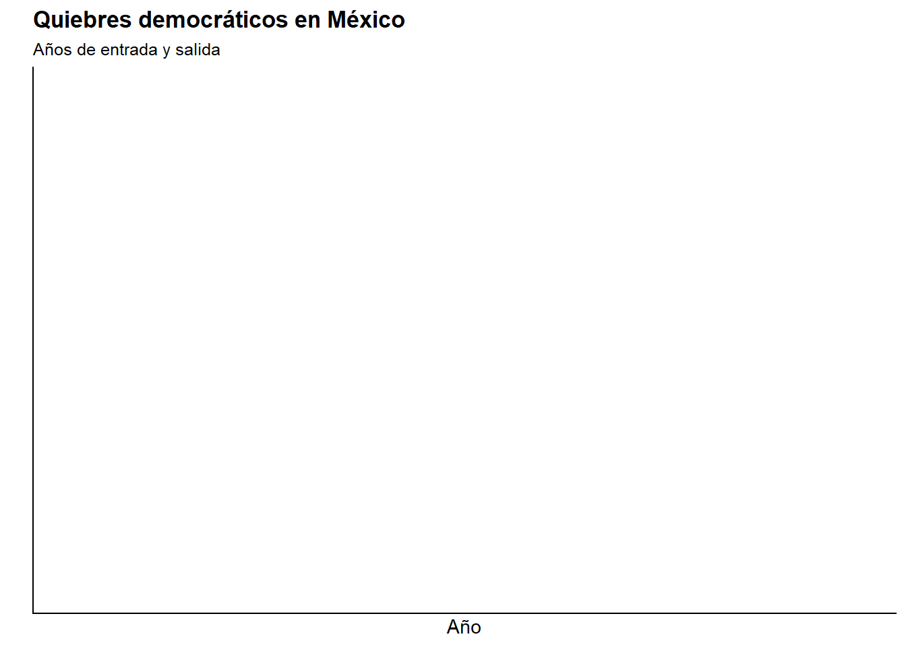

El gráfico queda en blanco debido a que México aparece en 1912 y sale en 1913. Quizás quieras probar otro país.

#### Ejercicio 9C {-}

> Utilizando los mismos datos del ejercicio anterior: ¿Cómo se compara la curva de Kaplan-Meier entre los países que recibieron un alto apoyo político de los Estados Unidos y los que recibieron un bajo apoyo político? Para ello, utilice la variable `us_t`, que es un índice de 0 a 1, donde 1 denota un apoyo constante de los Estados Unidos en un país, y 0 denota que no se ofreció ningún apoyo de los Estados Unidos. Para comparar los dos grupos de la curva de Kaplan-Meier, cree un dummy que asuma 1 si el apoyo es mayor que un 0.75 y 0 en caso contrario.

Primero vamos a crear una nueva base de datos con la variable dummy de apoyo de EEUU y vamos a filtrar las observaciones para quedarnos sólo con datos a partir de 1950 (tal como en el ejercicio anterior):


```r
quiebre_democracia_9c <- quiebre_democracia %>% 
  mutate(apoyo_us = if_else(us_t > 0.75, true = 1, false = 0)) %>% 
  filter(anio >= 1950)

head(quiebre_democracia_9c %>% 
  dplyr::select(pais_nombre, us_t, apoyo_us))
## # A tibble: 6 x 3
##   pais_nombre  us_t apoyo_us
##   <chr>       <dbl>    <dbl>
## 1 Argentina   0.375        0
## 2 Argentina   0.375        0
## 3 Argentina   0.375        0
## # ... with 3 more rows
```

Ahora podemos pasar a realizar las modificaciones para graficar la curva Kaplan-Meier: 


```r
quiebre_democracia_9c <- quiebre_democracia_9c %>%  
  group_by(pais_nombre) %>% 
  filter(cumsum(quiebre_democracia) <= 1) %>% 
  ungroup()

quiebre_democracia_9c_km <- quiebre_democracia_9c %>% 
  group_by(pais_nombre) %>%
  filter(anio != min(anio)) %>%
  mutate(risk_time_at_end   = c(1:n()),
         risk_time_at_start = c(0:(n() - 1))) %>%
  ungroup() %>%
  dplyr::select(pais_nombre, anio, risk_time_at_start, risk_time_at_end, everything())

km_9c <- survfit(Surv(time = risk_time_at_start, time2 = risk_time_at_end,
                   event = quiebre_democracia) ~ apoyo_us,
              type      = "kaplan-meier",
              conf.type = "log",
              data      = quiebre_democracia_9c_km)

ggsurvplot(km_9c, 
           conf.int = T, 
           risk.table=T,
           legend.title = "",
           break.x.by = 20,
           legend.labs = c("Alto apoyo político EEUU = 0",
                           "Alto apoyo político EEUU = 1"),
           data = quiebre_democracia_9c_km) +
  labs(title    = "Estimaciones de supervivencia de Kaplan-Meier ")
## Warning: Vectorized input to `element_text()` is not officially supported.
## Results may be unexpected or may change in future versions of ggplot2.
```


Hay una gran diferencia entre aquellos países que tienen alto apoyo político de Estados Unidos y aquellos que no. Los primeros tienen menos probabilidad de tener un quiebre demócratico, lo que se condice con la literatura e historia en América Latina. En la actualidad sabemos que Estados Unidos estuvo detrás de casi todos (sino todos) los golpes de estado previos a la tercera ola de democratización en la región. 


#### Ejercicio 9D {-}

> Utilizando `survminer` grafique una curva de Kaplan-Meier para la variable `colonia_gb`.

Primero creamos los objetos de democracia_directa tal como se hicieron en el capítulo


```r
data("democracia_directa") 

democracia_directa_b <- democracia_directa %>%
  group_by(pais_nombre) %>%
  filter(cumsum(dem_directa) <= 1) %>%
  ungroup()

democracia_directa_c <- democracia_directa_b %>%
  group_by(pais_nombre) %>%
  filter(anio != min(anio)) %>%
  mutate(risk_time_at_end   = c(1:n()),
         risk_time_at_start = c(0:(n() - 1))) %>%
  ungroup() %>%
  dplyr::select(pais_nombre, anio, risk_time_at_start, risk_time_at_end, 
                everything())
```


```r
km_colonia_gb <- survfit(Surv(time = risk_time_at_start, time2 = risk_time_at_end,
                              event = dem_directa) ~ colonia_gb,
                         type      = "kaplan-meier",
                         conf.type = "log",
                         data      = democracia_directa_c)

ggsurvplot(km_colonia_gb, conf.int = T, 
           risk.table=T,
           legend.title = "",
           break.x.by = 20,
           legend.labs = c("Colonia Gran Bretaña = 0",
                           "Colonia Gran Bretaña = 1"),
           data = democracia_directa_c) +
  labs(title    = "Estimaciones de supervivencia de Kaplan-Meier ")
## Warning: Vectorized input to `element_text()` is not officially supported.
## Results may be unexpected or may change in future versions of ggplot2.
```

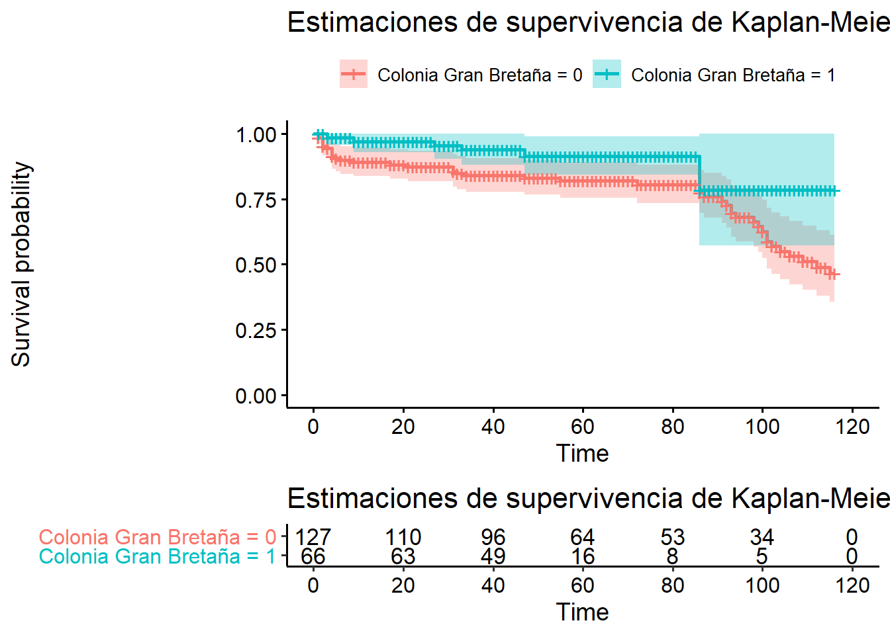

Los países que no fueron una colonia de Gran Bretaña son más rápidos en implementar mecanismos de democracia directa, aunque esta relación no es tan fuerte como la vista en el capítulo, donde se prueba el efecto de la democratización rápida en la variable dependiente. 

- La variable `colonia_urss` indica aquellos países que fueron parte de la Unión Soviética. Grafique una curva de Kaplan-Meier para la variable. Incorpore esta variable a un sexto modelo, haga su test de Grambsch y Therneau y rehaga la tabla de los modelos con `texreg`


```r
km_colonia_urss <- survfit(Surv(time = risk_time_at_start, time2 = risk_time_at_end,
                              event = dem_directa) ~ colonia_urss,
                         type      = "kaplan-meier",
                         conf.type = "log",
                         data      = democracia_directa_c)

ggsurvplot(km_colonia_urss, conf.int = T, 
           risk.table=T,
           legend.title = "",
           break.x.by = 20,
           legend.labs = c("Colonia URSS = 0",
                           "Colonia URSS = 1"),
           data = democracia_directa_c) +
  labs(title    = "Estimaciones de supervivencia de Kaplan-Meier ")

```

Ahora bien, los países que fueron parte de la Unión Soviética tienen una mayor probabilidad de implementar mecanismos de democracia directa. Esto contrasta fuertemente con el gráfico de las colonias británicas, en donde el efecto no es tan grande. Pasemos a crear el sexto modelo, incluyendo la variable de `colonia_urss`:


```r
cox_m6 <- coxph(Surv(risk_time_at_start, risk_time_at_end, dem_directa) ~
                  dem_rapida_positiva + dem_rapida_negativa + memoria + vdem +
                  difusion_cap + difusion_ocurr + log_poblacion + colonia_gb + colonia_urss,
                data   = democracia_directa_c,
                method ="breslow")

cox.zph(cox_m6)
##                        chisq df     p
## dem_rapida_positiva 1.76e+00  1 0.185
## dem_rapida_negativa 3.92e-01  1 0.531
## memoria             9.51e-01  1 0.330
## vdem                4.18e+00  1 0.041
## difusion_cap        4.31e+00  1 0.038
## difusion_ocurr      1.92e+00  1 0.166
##  [ reached getOption("max.print") -- omitted 4 rows ]
```

Por el test de riesgo proporcional notamos que las variables `vdem` y `difusion_cap` están violando el supuesto de proporcionalidad de los riesgos, con valores-p de 0.041 y 0.038 respectivamente. Sin embargo, el valor-p global está justo por encima de 0.05, por lo que podríamos no corregir las violaciones de las variables mencionadas. 

Ahora vamos a crear los modelos 1 a 5 para hacer la tabla con texreg. También haremos los test para ver si debemos hacer modificaciones:


```r
cox_m1 <- coxph(Surv(risk_time_at_start, risk_time_at_end, dem_directa) ~
                  dem_rapida_positiva + dem_rapida_negativa + memoria + vdem,
                data   = democracia_directa_c, 
                method ="breslow")

cox_m2 <- coxph(Surv(risk_time_at_start, risk_time_at_end, dem_directa) ~
                  dem_rapida_positiva + dem_rapida_negativa + memoria + vdem +
                  difusion_cap,
                data   = democracia_directa_c,
                method ="breslow")

cox_m3 <- coxph(Surv(risk_time_at_start, risk_time_at_end, dem_directa) ~
                  dem_rapida_positiva + dem_rapida_negativa + memoria + vdem +
                  difusion_cap + difusion_ocurr,
                data   = democracia_directa_c,
                method ="breslow")

cox_m4 <- coxph(Surv(risk_time_at_start, risk_time_at_end, dem_directa) ~
                  dem_rapida_positiva + dem_rapida_negativa + memoria + vdem +
                  difusion_cap + difusion_ocurr + log_poblacion,
                data   = democracia_directa_c,
                method = "breslow")


cox_m5 <- coxph(Surv(risk_time_at_start, risk_time_at_end, dem_directa) ~
                  dem_rapida_positiva + dem_rapida_negativa + memoria + vdem +
                  difusion_cap + difusion_ocurr + log_poblacion + colonia_gb,
                data   = democracia_directa_c,
                method ="breslow")

cox.zph(cox_m1)
##                     chisq df     p
## dem_rapida_positiva  2.33  1 0.127
## dem_rapida_negativa  0.45  1 0.502
## memoria              1.97  1 0.161
## vdem                 5.33  1 0.021
## GLOBAL               9.37  4 0.052
cox.zph(cox_m2)
##                      chisq df      p
## dem_rapida_positiva  1.693  1 0.1932
## dem_rapida_negativa  0.718  1 0.3968
## memoria              1.623  1 0.2026
## vdem                 6.594  1 0.0102
## difusion_cap         8.135  1 0.0043
## GLOBAL              14.825  5 0.0111
cox.zph(cox_m3)
##                      chisq df     p
## dem_rapida_positiva  2.092  1 0.148
## dem_rapida_negativa  0.473  1 0.491
## memoria              1.697  1 0.193
## vdem                 4.515  1 0.034
## difusion_cap         4.264  1 0.039
## difusion_ocurr       2.089  1 0.148
##  [ reached getOption("max.print") -- omitted 1 row ]
cox.zph(cox_m4)
##                      chisq df     p
## dem_rapida_positiva  2.084  1 0.149
## dem_rapida_negativa  0.445  1 0.505
## memoria              1.677  1 0.195
## vdem                 4.533  1 0.033
## difusion_cap         4.224  1 0.040
## difusion_ocurr       2.059  1 0.151
##  [ reached getOption("max.print") -- omitted 2 rows ]
cox.zph(cox_m5)
##                      chisq df     p
## dem_rapida_positiva  1.883  1 0.170
## dem_rapida_negativa  0.380  1 0.538
## memoria              1.274  1 0.259
## vdem                 4.640  1 0.031
## difusion_cap         3.960  1 0.047
## difusion_ocurr       1.798  1 0.180
##  [ reached getOption("max.print") -- omitted 3 rows ]
```

Los modelos 2, 3, 4 y 5 tienen un valor-p global menor a 0.05, por lo que pasaremos a interactuar las variables problemáticas: 


```r
cox_m2_int <- coxph(Surv(risk_time_at_start, risk_time_at_end, dem_directa) ~
                      dem_rapida_positiva + dem_rapida_negativa + memoria + vdem +
                      difusion_cap + vdem:log(risk_time_at_end),
                    data   = democracia_directa_c,
                    method ="breslow")
## Warning in coxph(Surv(risk_time_at_start, risk_time_at_end, dem_directa)
## ~ : a variable appears on both the left and right sides of the formula

cox.zph(cox_m2_int)
##                               chisq df     p
## dem_rapida_positiva         1.69660  1 0.193
## dem_rapida_negativa         0.36998  1 0.543
## memoria                     0.94922  1 0.330
## vdem                        0.00658  1 0.935
## difusion_cap                6.14249  1 0.013
## vdem:log(risk_time_at_end)  0.09026  1 0.764
##  [ reached getOption("max.print") -- omitted 1 row ]

cox_m3_int <- coxph(Surv(risk_time_at_start, risk_time_at_end, dem_directa) ~
                      dem_rapida_positiva + dem_rapida_negativa + memoria + vdem +
                      difusion_cap + difusion_ocurr + vdem:log(risk_time_at_end) +
                      difusion_cap:log(risk_time_at_end),
                    data   = democracia_directa_c,
                    method ="breslow")
## Warning in coxph(Surv(risk_time_at_start, risk_time_at_end, dem_directa)
## ~ : a variable appears on both the left and right sides of the formula

cox.zph(cox_m3_int)
##                                       chisq df     p
## dem_rapida_positiva                3.12e+00  1 0.077
## dem_rapida_negativa                9.92e-02  1 0.753
## memoria                            1.13e+00  1 0.287
## vdem                               2.17e-02  1 0.883
## difusion_cap                       6.03e-02  1 0.806
## difusion_ocurr                     2.64e-02  1 0.871
##  [ reached getOption("max.print") -- omitted 3 rows ]

cox_m4_int <- coxph(Surv(risk_time_at_start, risk_time_at_end, dem_directa) ~
                  dem_rapida_positiva + dem_rapida_negativa + memoria + vdem +
                  difusion_cap + difusion_ocurr + log_poblacion + vdem:log(risk_time_at_end) +
                      difusion_cap:log(risk_time_at_end),
                data   = democracia_directa_c,
                method = "breslow")
## Warning in coxph(Surv(risk_time_at_start, risk_time_at_end, dem_directa)
## ~ : a variable appears on both the left and right sides of the formula

cox.zph(cox_m4_int)
##                                       chisq df     p
## dem_rapida_positiva                3.12e+00  1 0.077
## dem_rapida_negativa                9.01e-02  1 0.764
## memoria                            1.12e+00  1 0.290
## vdem                               2.36e-02  1 0.878
## difusion_cap                       7.47e-02  1 0.785
## difusion_ocurr                     3.65e-02  1 0.848
##  [ reached getOption("max.print") -- omitted 4 rows ]

cox_m5_int <- coxph(Surv(risk_time_at_start, risk_time_at_end, dem_directa) ~
                      dem_rapida_positiva + dem_rapida_negativa + memoria + vdem +
                      difusion_cap + difusion_ocurr + log_poblacion + 
                      colonia_gb + vdem:log(risk_time_at_end) +
                      log_poblacion:log(risk_time_at_end),
                    data   = democracia_directa_c,
                    method = "breslow")
## Warning in coxph(Surv(risk_time_at_start, risk_time_at_end, dem_directa)
## ~ : a variable appears on both the left and right sides of the formula

cox.zph(cox_m5_int)
##                                        chisq df     p
## dem_rapida_positiva                 1.13e+00  1 0.287
## dem_rapida_negativa                 3.37e-01  1 0.562
## memoria                             5.39e-01  1 0.463
## vdem                                5.88e-05  1 0.994
## difusion_cap                        4.16e+00  1 0.041
## difusion_ocurr                      1.15e+00  1 0.284
##  [ reached getOption("max.print") -- omitted 5 rows ]
```

Por temas de espacio incluiremos sólo aquellos modelos con un valor-p global mayor o igual a 0.05:


```r
lista_modelos_9d <- list(cox_m1, cox_m2_int, cox_m3_int, cox_m4_int, cox_m5_int, cox_m6)

tabla9d_1 <- htmlreg(l = lista_modelos_9d,
                     custom.model.names = c("Modelo 1", "Modelo 2b", "Modelo 3b", "Modelo 4b", "Modelo 5b",
                                            "Modelo 6"),
                     custom.coef.names = c("Democratización Rápida", "Rápido Retroceso Democrático", "Memoria",
                                           "Democracia", "Difusión de Capacidades", 
                                           "Democracia x tiempo en riesgo(ln)",
                                           "Difusión capacidades x tiempo en riesgo(ln)", 
                                           "Difusión de Ocurrencias",  "Población(ln)", "Fue Colonia Británica",
                                           "Población(ln) x tiempo en riesgo(ln)", "Fue Colonia URSS"),
                     override.coef    = map(lista_modelos_9d, ~ exp(coef(.x))),
                     override.se      = map(lista_modelos_9d, ~ odds_se(.x)),
                     override.pvalues = map(lista_modelos_9d, ~ odds_pvalues(.x))
)

htmltools::HTML(tabla9d_1)   # Con este comando hacemos que nuestra tabla se pueda ver en formato html
```

```{=html}
<table class="texreg" style="margin: 10px auto;border-collapse: collapse;border-spacing: 0px;caption-side: bottom;color: #000000;border-top: 2px solid #000000;">
<caption>Statistical models</caption>
<thead>
<tr>
<th style="padding-left: 5px;padding-right: 5px;">&nbsp;</th>
<th style="padding-left: 5px;padding-right: 5px;">Modelo 1</th>
<th style="padding-left: 5px;padding-right: 5px;">Modelo 2b</th>
<th style="padding-left: 5px;padding-right: 5px;">Modelo 3b</th>
<th style="padding-left: 5px;padding-right: 5px;">Modelo 4b</th>
<th style="padding-left: 5px;padding-right: 5px;">Modelo 5b</th>
<th style="padding-left: 5px;padding-right: 5px;">Modelo 6</th>
</tr>
</thead>
<tbody>
<tr style="border-top: 1px solid #000000;">
<td style="padding-left: 5px;padding-right: 5px;">Democratización Rápida</td>
<td style="padding-left: 5px;padding-right: 5px;">5.48<sup>*</sup></td>
<td style="padding-left: 5px;padding-right: 5px;">4.54<sup>*</sup></td>
<td style="padding-left: 5px;padding-right: 5px;">4.82<sup>*</sup></td>
<td style="padding-left: 5px;padding-right: 5px;">4.75<sup>*</sup></td>
<td style="padding-left: 5px;padding-right: 5px;">3.93<sup>*</sup></td>
<td style="padding-left: 5px;padding-right: 5px;">5.22<sup>*</sup></td>
</tr>
<tr>
<td style="padding-left: 5px;padding-right: 5px;">&nbsp;</td>
<td style="padding-left: 5px;padding-right: 5px;">(2.28)</td>
<td style="padding-left: 5px;padding-right: 5px;">(1.95)</td>
<td style="padding-left: 5px;padding-right: 5px;">(2.11)</td>
<td style="padding-left: 5px;padding-right: 5px;">(2.10)</td>
<td style="padding-left: 5px;padding-right: 5px;">(1.81)</td>
<td style="padding-left: 5px;padding-right: 5px;">(2.27)</td>
</tr>
<tr>
<td style="padding-left: 5px;padding-right: 5px;">Rápido Retroceso Democrático</td>
<td style="padding-left: 5px;padding-right: 5px;">2.26</td>
<td style="padding-left: 5px;padding-right: 5px;">2.37</td>
<td style="padding-left: 5px;padding-right: 5px;">2.38</td>
<td style="padding-left: 5px;padding-right: 5px;">2.37</td>
<td style="padding-left: 5px;padding-right: 5px;">2.30</td>
<td style="padding-left: 5px;padding-right: 5px;">2.11</td>
</tr>
<tr>
<td style="padding-left: 5px;padding-right: 5px;">&nbsp;</td>
<td style="padding-left: 5px;padding-right: 5px;">(1.69)</td>
<td style="padding-left: 5px;padding-right: 5px;">(1.77)</td>
<td style="padding-left: 5px;padding-right: 5px;">(1.79)</td>
<td style="padding-left: 5px;padding-right: 5px;">(1.79)</td>
<td style="padding-left: 5px;padding-right: 5px;">(1.74)</td>
<td style="padding-left: 5px;padding-right: 5px;">(1.59)</td>
</tr>
<tr>
<td style="padding-left: 5px;padding-right: 5px;">Memoria</td>
<td style="padding-left: 5px;padding-right: 5px;">5.79<sup>**</sup></td>
<td style="padding-left: 5px;padding-right: 5px;">5.45<sup>**</sup></td>
<td style="padding-left: 5px;padding-right: 5px;">5.89<sup>**</sup></td>
<td style="padding-left: 5px;padding-right: 5px;">5.85<sup>**</sup></td>
<td style="padding-left: 5px;padding-right: 5px;">5.17<sup>**</sup></td>
<td style="padding-left: 5px;padding-right: 5px;">4.68<sup>**</sup></td>
</tr>
<tr>
<td style="padding-left: 5px;padding-right: 5px;">&nbsp;</td>
<td style="padding-left: 5px;padding-right: 5px;">(2.07)</td>
<td style="padding-left: 5px;padding-right: 5px;">(1.97)</td>
<td style="padding-left: 5px;padding-right: 5px;">(2.16)</td>
<td style="padding-left: 5px;padding-right: 5px;">(2.15)</td>
<td style="padding-left: 5px;padding-right: 5px;">(1.90)</td>
<td style="padding-left: 5px;padding-right: 5px;">(1.77)</td>
</tr>
<tr>
<td style="padding-left: 5px;padding-right: 5px;">Democracia</td>
<td style="padding-left: 5px;padding-right: 5px;">4.03</td>
<td style="padding-left: 5px;padding-right: 5px;">100.91</td>
<td style="padding-left: 5px;padding-right: 5px;">108.09</td>
<td style="padding-left: 5px;padding-right: 5px;">116.50</td>
<td style="padding-left: 5px;padding-right: 5px;">379.22</td>
<td style="padding-left: 5px;padding-right: 5px;">4.60</td>
</tr>
<tr>
<td style="padding-left: 5px;padding-right: 5px;">&nbsp;</td>
<td style="padding-left: 5px;padding-right: 5px;">(2.45)</td>
<td style="padding-left: 5px;padding-right: 5px;">(143.61)</td>
<td style="padding-left: 5px;padding-right: 5px;">(165.46)</td>
<td style="padding-left: 5px;padding-right: 5px;">(183.82)</td>
<td style="padding-left: 5px;padding-right: 5px;">(636.11)</td>
<td style="padding-left: 5px;padding-right: 5px;">(3.23)</td>
</tr>
<tr>
<td style="padding-left: 5px;padding-right: 5px;">Difusión de Capacidades</td>
<td style="padding-left: 5px;padding-right: 5px;">&nbsp;</td>
<td style="padding-left: 5px;padding-right: 5px;">1.78<sup>***</sup></td>
<td style="padding-left: 5px;padding-right: 5px;">4.68<sup>**</sup></td>
<td style="padding-left: 5px;padding-right: 5px;">4.67<sup>**</sup></td>
<td style="padding-left: 5px;padding-right: 5px;">2.70<sup>**</sup></td>
<td style="padding-left: 5px;padding-right: 5px;">2.77<sup>**</sup></td>
</tr>
<tr>
<td style="padding-left: 5px;padding-right: 5px;">&nbsp;</td>
<td style="padding-left: 5px;padding-right: 5px;">&nbsp;</td>
<td style="padding-left: 5px;padding-right: 5px;">(0.38)</td>
<td style="padding-left: 5px;padding-right: 5px;">(1.56)</td>
<td style="padding-left: 5px;padding-right: 5px;">(1.56)</td>
<td style="padding-left: 5px;padding-right: 5px;">(0.88)</td>
<td style="padding-left: 5px;padding-right: 5px;">(0.90)</td>
</tr>
<tr>
<td style="padding-left: 5px;padding-right: 5px;">Democracia x tiempo en riesgo(ln)</td>
<td style="padding-left: 5px;padding-right: 5px;">&nbsp;</td>
<td style="padding-left: 5px;padding-right: 5px;">0.32<sup>*</sup></td>
<td style="padding-left: 5px;padding-right: 5px;">0.35<sup>*</sup></td>
<td style="padding-left: 5px;padding-right: 5px;">0.35<sup>*</sup></td>
<td style="padding-left: 5px;padding-right: 5px;">0.26<sup>*</sup></td>
<td style="padding-left: 5px;padding-right: 5px;">&nbsp;</td>
</tr>
<tr>
<td style="padding-left: 5px;padding-right: 5px;">&nbsp;</td>
<td style="padding-left: 5px;padding-right: 5px;">&nbsp;</td>
<td style="padding-left: 5px;padding-right: 5px;">(0.13)</td>
<td style="padding-left: 5px;padding-right: 5px;">(0.15)</td>
<td style="padding-left: 5px;padding-right: 5px;">(0.15)</td>
<td style="padding-left: 5px;padding-right: 5px;">(0.12)</td>
<td style="padding-left: 5px;padding-right: 5px;">&nbsp;</td>
</tr>
<tr>
<td style="padding-left: 5px;padding-right: 5px;">Difusión capacidades x tiempo en riesgo(ln)</td>
<td style="padding-left: 5px;padding-right: 5px;">&nbsp;</td>
<td style="padding-left: 5px;padding-right: 5px;">&nbsp;</td>
<td style="padding-left: 5px;padding-right: 5px;">0.23</td>
<td style="padding-left: 5px;padding-right: 5px;">0.23</td>
<td style="padding-left: 5px;padding-right: 5px;">0.04</td>
<td style="padding-left: 5px;padding-right: 5px;">0.02</td>
</tr>
<tr>
<td style="padding-left: 5px;padding-right: 5px;">&nbsp;</td>
<td style="padding-left: 5px;padding-right: 5px;">&nbsp;</td>
<td style="padding-left: 5px;padding-right: 5px;">&nbsp;</td>
<td style="padding-left: 5px;padding-right: 5px;">(0.40)</td>
<td style="padding-left: 5px;padding-right: 5px;">(0.40)</td>
<td style="padding-left: 5px;padding-right: 5px;">(0.08)</td>
<td style="padding-left: 5px;padding-right: 5px;">(0.04)</td>
</tr>
<tr>
<td style="padding-left: 5px;padding-right: 5px;">Difusión de Ocurrencias</td>
<td style="padding-left: 5px;padding-right: 5px;">&nbsp;</td>
<td style="padding-left: 5px;padding-right: 5px;">&nbsp;</td>
<td style="padding-left: 5px;padding-right: 5px;">0.77<sup>***</sup></td>
<td style="padding-left: 5px;padding-right: 5px;">0.77<sup>***</sup></td>
<td style="padding-left: 5px;padding-right: 5px;">&nbsp;</td>
<td style="padding-left: 5px;padding-right: 5px;">&nbsp;</td>
</tr>
<tr>
<td style="padding-left: 5px;padding-right: 5px;">&nbsp;</td>
<td style="padding-left: 5px;padding-right: 5px;">&nbsp;</td>
<td style="padding-left: 5px;padding-right: 5px;">&nbsp;</td>
<td style="padding-left: 5px;padding-right: 5px;">(0.09)</td>
<td style="padding-left: 5px;padding-right: 5px;">(0.09)</td>
<td style="padding-left: 5px;padding-right: 5px;">&nbsp;</td>
<td style="padding-left: 5px;padding-right: 5px;">&nbsp;</td>
</tr>
<tr>
<td style="padding-left: 5px;padding-right: 5px;">Población(ln)</td>
<td style="padding-left: 5px;padding-right: 5px;">&nbsp;</td>
<td style="padding-left: 5px;padding-right: 5px;">&nbsp;</td>
<td style="padding-left: 5px;padding-right: 5px;">&nbsp;</td>
<td style="padding-left: 5px;padding-right: 5px;">1.02<sup>***</sup></td>
<td style="padding-left: 5px;padding-right: 5px;">1.57<sup>***</sup></td>
<td style="padding-left: 5px;padding-right: 5px;">0.99<sup>***</sup></td>
</tr>
<tr>
<td style="padding-left: 5px;padding-right: 5px;">&nbsp;</td>
<td style="padding-left: 5px;padding-right: 5px;">&nbsp;</td>
<td style="padding-left: 5px;padding-right: 5px;">&nbsp;</td>
<td style="padding-left: 5px;padding-right: 5px;">&nbsp;</td>
<td style="padding-left: 5px;padding-right: 5px;">(0.10)</td>
<td style="padding-left: 5px;padding-right: 5px;">(0.37)</td>
<td style="padding-left: 5px;padding-right: 5px;">(0.10)</td>
</tr>
<tr>
<td style="padding-left: 5px;padding-right: 5px;">Fue Colonia Británica</td>
<td style="padding-left: 5px;padding-right: 5px;">&nbsp;</td>
<td style="padding-left: 5px;padding-right: 5px;">&nbsp;</td>
<td style="padding-left: 5px;padding-right: 5px;">&nbsp;</td>
<td style="padding-left: 5px;padding-right: 5px;">&nbsp;</td>
<td style="padding-left: 5px;padding-right: 5px;">0.49<sup>*</sup></td>
<td style="padding-left: 5px;padding-right: 5px;">0.48<sup>*</sup></td>
</tr>
<tr>
<td style="padding-left: 5px;padding-right: 5px;">&nbsp;</td>
<td style="padding-left: 5px;padding-right: 5px;">&nbsp;</td>
<td style="padding-left: 5px;padding-right: 5px;">&nbsp;</td>
<td style="padding-left: 5px;padding-right: 5px;">&nbsp;</td>
<td style="padding-left: 5px;padding-right: 5px;">&nbsp;</td>
<td style="padding-left: 5px;padding-right: 5px;">(0.24)</td>
<td style="padding-left: 5px;padding-right: 5px;">(0.23)</td>
</tr>
<tr>
<td style="padding-left: 5px;padding-right: 5px;">Población(ln) x tiempo en riesgo(ln)</td>
<td style="padding-left: 5px;padding-right: 5px;">&nbsp;</td>
<td style="padding-left: 5px;padding-right: 5px;">&nbsp;</td>
<td style="padding-left: 5px;padding-right: 5px;">&nbsp;</td>
<td style="padding-left: 5px;padding-right: 5px;">&nbsp;</td>
<td style="padding-left: 5px;padding-right: 5px;">0.88<sup>***</sup></td>
<td style="padding-left: 5px;padding-right: 5px;">&nbsp;</td>
</tr>
<tr>
<td style="padding-left: 5px;padding-right: 5px;">&nbsp;</td>
<td style="padding-left: 5px;padding-right: 5px;">&nbsp;</td>
<td style="padding-left: 5px;padding-right: 5px;">&nbsp;</td>
<td style="padding-left: 5px;padding-right: 5px;">&nbsp;</td>
<td style="padding-left: 5px;padding-right: 5px;">&nbsp;</td>
<td style="padding-left: 5px;padding-right: 5px;">(0.06)</td>
<td style="padding-left: 5px;padding-right: 5px;">&nbsp;</td>
</tr>
<tr>
<td style="padding-left: 5px;padding-right: 5px;">Fue Colonia URSS</td>
<td style="padding-left: 5px;padding-right: 5px;">&nbsp;</td>
<td style="padding-left: 5px;padding-right: 5px;">&nbsp;</td>
<td style="padding-left: 5px;padding-right: 5px;">&nbsp;</td>
<td style="padding-left: 5px;padding-right: 5px;">&nbsp;</td>
<td style="padding-left: 5px;padding-right: 5px;">&nbsp;</td>
<td style="padding-left: 5px;padding-right: 5px;">1.63<sup>*</sup></td>
</tr>
<tr>
<td style="padding-left: 5px;padding-right: 5px;">&nbsp;</td>
<td style="padding-left: 5px;padding-right: 5px;">&nbsp;</td>
<td style="padding-left: 5px;padding-right: 5px;">&nbsp;</td>
<td style="padding-left: 5px;padding-right: 5px;">&nbsp;</td>
<td style="padding-left: 5px;padding-right: 5px;">&nbsp;</td>
<td style="padding-left: 5px;padding-right: 5px;">&nbsp;</td>
<td style="padding-left: 5px;padding-right: 5px;">(0.83)</td>
</tr>
<tr style="border-top: 1px solid #000000;">
<td style="padding-left: 5px;padding-right: 5px;">AIC</td>
<td style="padding-left: 5px;padding-right: 5px;">377.71</td>
<td style="padding-left: 5px;padding-right: 5px;">368.19</td>
<td style="padding-left: 5px;padding-right: 5px;">363.77</td>
<td style="padding-left: 5px;padding-right: 5px;">365.67</td>
<td style="padding-left: 5px;padding-right: 5px;">365.19</td>
<td style="padding-left: 5px;padding-right: 5px;">372.57</td>
</tr>
<tr>
<td style="padding-left: 5px;padding-right: 5px;">R<sup>2</sup></td>
<td style="padding-left: 5px;padding-right: 5px;">0.00</td>
<td style="padding-left: 5px;padding-right: 5px;">0.01</td>
<td style="padding-left: 5px;padding-right: 5px;">0.01</td>
<td style="padding-left: 5px;padding-right: 5px;">0.01</td>
<td style="padding-left: 5px;padding-right: 5px;">0.01</td>
<td style="padding-left: 5px;padding-right: 5px;">0.01</td>
</tr>
<tr>
<td style="padding-left: 5px;padding-right: 5px;">Max. R<sup>2</sup></td>
<td style="padding-left: 5px;padding-right: 5px;">0.04</td>
<td style="padding-left: 5px;padding-right: 5px;">0.04</td>
<td style="padding-left: 5px;padding-right: 5px;">0.04</td>
<td style="padding-left: 5px;padding-right: 5px;">0.04</td>
<td style="padding-left: 5px;padding-right: 5px;">0.04</td>
<td style="padding-left: 5px;padding-right: 5px;">0.04</td>
</tr>
<tr>
<td style="padding-left: 5px;padding-right: 5px;">Num. events</td>
<td style="padding-left: 5px;padding-right: 5px;">47</td>
<td style="padding-left: 5px;padding-right: 5px;">47</td>
<td style="padding-left: 5px;padding-right: 5px;">47</td>
<td style="padding-left: 5px;padding-right: 5px;">47</td>
<td style="padding-left: 5px;padding-right: 5px;">47</td>
<td style="padding-left: 5px;padding-right: 5px;">47</td>
</tr>
<tr>
<td style="padding-left: 5px;padding-right: 5px;">Num. obs.</td>
<td style="padding-left: 5px;padding-right: 5px;">11441</td>
<td style="padding-left: 5px;padding-right: 5px;">11269</td>
<td style="padding-left: 5px;padding-right: 5px;">11260</td>
<td style="padding-left: 5px;padding-right: 5px;">11229</td>
<td style="padding-left: 5px;padding-right: 5px;">11229</td>
<td style="padding-left: 5px;padding-right: 5px;">11229</td>
</tr>
<tr>
<td style="padding-left: 5px;padding-right: 5px;">Missings</td>
<td style="padding-left: 5px;padding-right: 5px;">554</td>
<td style="padding-left: 5px;padding-right: 5px;">726</td>
<td style="padding-left: 5px;padding-right: 5px;">735</td>
<td style="padding-left: 5px;padding-right: 5px;">766</td>
<td style="padding-left: 5px;padding-right: 5px;">766</td>
<td style="padding-left: 5px;padding-right: 5px;">766</td>
</tr>
<tr style="border-bottom: 2px solid #000000;">
<td style="padding-left: 5px;padding-right: 5px;">PH test</td>
<td style="padding-left: 5px;padding-right: 5px;">0.05</td>
<td style="padding-left: 5px;padding-right: 5px;">0.08</td>
<td style="padding-left: 5px;padding-right: 5px;">0.56</td>
<td style="padding-left: 5px;padding-right: 5px;">0.19</td>
<td style="padding-left: 5px;padding-right: 5px;">0.19</td>
<td style="padding-left: 5px;padding-right: 5px;">0.05</td>
</tr>
</tbody>
<tfoot>
<tr>
<td style="font-size: 0.8em;" colspan="7"><sup>***</sup>p &lt; 0.001; <sup>**</sup>p &lt; 0.01; <sup>*</sup>p &lt; 0.05</td>
</tr>
</tfoot>
</table>

```

> ¿Tenés tu propia base de datos de supervivencia? Sería genial que repitieras todo el ejercicio usando tus datos y compartas dudas en nuestro GitHub. Si no tienes base, usa la de Mainwaring y Pérez-Liñán (2013) para intentar identificar la variable que más aumenta los riesgos de quiebre democrático en América Latina.

Haremos el ejercicio con la base de Mainwaring y Pérez-Liñan que acotamos en el ejercicio 9A paraanalizar a partir de 1950. Recuerda que tu podrías hacerlo con otro período temporal o con tu propia base de datos!


```r
quiebre_democracia_c <- quiebre_democracia_b %>% group_by(pais_nombre) %>%
  filter(anio != min(anio)) %>%
  mutate(risk_time_at_end   = c(1:n()),
         risk_time_at_start = c(0:(n() - 1))) %>%
  ungroup() %>%
  dplyr::select(pais_nombre, anio, risk_time_at_start, risk_time_at_end, everything())
```

Haremos distintos modelos. En el primero incluiremos como variables explicativas el índice de poder presidencial y la edad del régimen (tal como se vió en el capítulo 8):


```r
cox_quiebre_m1 <- coxph(Surv(risk_time_at_start, risk_time_at_end, quiebre_democracia) ~
                  poder_presid + edad_regimen ,
                data   = quiebre_democracia_c,
                method ="breslow")

cox.zph(cox_quiebre_m1)
##               chisq df    p
## poder_presid 0.0246  1 0.88
## edad_regimen 0.2267  1 0.63
## GLOBAL       0.2280  2 0.89
```

Todas las variables cumplen con el supuesto de de proporcionalidad. Sigamos con el siguiente modelo, en el cual agregaremos una variable económica (`crecim_10a`: crecimiento económico en los diez años anteriores al quiebre democrático). 


```r
cox_quiebre_m2 <- coxph(Surv(risk_time_at_start, risk_time_at_end, quiebre_democracia) ~
                  poder_presid + edad_regimen + crecim_10a,
                data   = quiebre_democracia_c,
                method ="breslow")

cox.zph(cox_quiebre_m2)
##                 chisq df    p
## poder_presid 0.000218  1 0.99
## edad_regimen 0.197345  1 0.66
## crecim_10a   0.315957  1 0.57
## GLOBAL       0.340278  3 0.95
```

Nuevamente las variables no presentan problemas de proporcionalidad. Pasemos a hacer una tabla:


```r
modelos_quiebre_dem <- list(cox_quiebre_m1, cox_quiebre_m2)

screenreg(modelos_quiebre_dem)
## 
## ==============================
##               Model 1  Model 2
## ------------------------------
## poder_presid   -0.14    -0.17 
##                (0.19)   (0.21)
## edad_regimen    0.03     0.05 
##                (0.06)   (0.08)
## crecim_10a              12.73 
##                        (29.72)
## ------------------------------
## AIC            25.40    27.22 
## R^2             0.00     0.01 
## Max. R^2        0.15     0.15 
## Num. events     7        7    
## Num. obs.     135      135    
## Missings        5        5    
## PH test         0.89     0.95 
## ==============================
## *** p < 0.001; ** p < 0.01; * p < 0.05

tabla9d_2 <- htmlreg(l = modelos_quiebre_dem,
                     custom.model.names = c("Modelo 1", "Modelo 2"),
                     custom.coef.names = c("Poder presidencial", "Edad régimen", 
                                           "Crecimiento Económico 10 años antes"),
                     override.coef    = map(modelos_quiebre_dem, ~ exp(coef(.x))),
                     override.se      = map(modelos_quiebre_dem, ~ odds_se(.x)),
                     override.pvalues = map(modelos_quiebre_dem, ~ odds_pvalues(.x)))

htmltools::HTML(tabla9d_2)
```

```{=html}
<table class="texreg" style="margin: 10px auto;border-collapse: collapse;border-spacing: 0px;caption-side: bottom;color: #000000;border-top: 2px solid #000000;">
<caption>Statistical models</caption>
<thead>
<tr>
<th style="padding-left: 5px;padding-right: 5px;">&nbsp;</th>
<th style="padding-left: 5px;padding-right: 5px;">Modelo 1</th>
<th style="padding-left: 5px;padding-right: 5px;">Modelo 2</th>
</tr>
</thead>
<tbody>
<tr style="border-top: 1px solid #000000;">
<td style="padding-left: 5px;padding-right: 5px;">Poder presidencial</td>
<td style="padding-left: 5px;padding-right: 5px;">0.87<sup>***</sup></td>
<td style="padding-left: 5px;padding-right: 5px;">0.84<sup>***</sup></td>
</tr>
<tr>
<td style="padding-left: 5px;padding-right: 5px;">&nbsp;</td>
<td style="padding-left: 5px;padding-right: 5px;">(0.16)</td>
<td style="padding-left: 5px;padding-right: 5px;">(0.17)</td>
</tr>
<tr>
<td style="padding-left: 5px;padding-right: 5px;">Edad régimen</td>
<td style="padding-left: 5px;padding-right: 5px;">1.03<sup>***</sup></td>
<td style="padding-left: 5px;padding-right: 5px;">1.05<sup>***</sup></td>
</tr>
<tr>
<td style="padding-left: 5px;padding-right: 5px;">&nbsp;</td>
<td style="padding-left: 5px;padding-right: 5px;">(0.06)</td>
<td style="padding-left: 5px;padding-right: 5px;">(0.08)</td>
</tr>
<tr>
<td style="padding-left: 5px;padding-right: 5px;">Crecimiento Económico 10 años antes</td>
<td style="padding-left: 5px;padding-right: 5px;">&nbsp;</td>
<td style="padding-left: 5px;padding-right: 5px;">337537.26</td>
</tr>
<tr>
<td style="padding-left: 5px;padding-right: 5px;">&nbsp;</td>
<td style="padding-left: 5px;padding-right: 5px;">&nbsp;</td>
<td style="padding-left: 5px;padding-right: 5px;">(10032846.00)</td>
</tr>
<tr style="border-top: 1px solid #000000;">
<td style="padding-left: 5px;padding-right: 5px;">AIC</td>
<td style="padding-left: 5px;padding-right: 5px;">25.40</td>
<td style="padding-left: 5px;padding-right: 5px;">27.22</td>
</tr>
<tr>
<td style="padding-left: 5px;padding-right: 5px;">R<sup>2</sup></td>
<td style="padding-left: 5px;padding-right: 5px;">0.00</td>
<td style="padding-left: 5px;padding-right: 5px;">0.01</td>
</tr>
<tr>
<td style="padding-left: 5px;padding-right: 5px;">Max. R<sup>2</sup></td>
<td style="padding-left: 5px;padding-right: 5px;">0.15</td>
<td style="padding-left: 5px;padding-right: 5px;">0.15</td>
</tr>
<tr>
<td style="padding-left: 5px;padding-right: 5px;">Num. events</td>
<td style="padding-left: 5px;padding-right: 5px;">7</td>
<td style="padding-left: 5px;padding-right: 5px;">7</td>
</tr>
<tr>
<td style="padding-left: 5px;padding-right: 5px;">Num. obs.</td>
<td style="padding-left: 5px;padding-right: 5px;">135</td>
<td style="padding-left: 5px;padding-right: 5px;">135</td>
</tr>
<tr>
<td style="padding-left: 5px;padding-right: 5px;">Missings</td>
<td style="padding-left: 5px;padding-right: 5px;">5</td>
<td style="padding-left: 5px;padding-right: 5px;">5</td>
</tr>
<tr style="border-bottom: 2px solid #000000;">
<td style="padding-left: 5px;padding-right: 5px;">PH test</td>
<td style="padding-left: 5px;padding-right: 5px;">0.89</td>
<td style="padding-left: 5px;padding-right: 5px;">0.95</td>
</tr>
</tbody>
<tfoot>
<tr>
<td style="font-size: 0.8em;" colspan="3"><sup>***</sup>p &lt; 0.001; <sup>**</sup>p &lt; 0.01; <sup>*</sup>p &lt; 0.05</td>
</tr>
</tfoot>
</table>

```

## Capítulo 10: Inferencia causal {-}

#### Paquetes y carga de datos {-}


```r
library(tidyverse)
library(paqueteadp)
## install.packages("ggdag")
library(ggdag)
## install.packages("dagitty")
library(dagitty)
## install.packages("MatchIt")
library(MatchIt)
library(broom)
library(texreg)
```

#### Ejercicio 10A {-}

> Consulta el [manual en línea](http://www.dagitty.net/learn/index.html) para obtener más detalles sobre las características de [DAGitty](http://www.dagitty.net/), o pasa unos minutos jugando para acostumbrarte a agregar y conectar nodos.

A continuación hay un ejemplo muy básico de un tema que está surgiendo últimamente sobre la relación de China y países en desarrollo. Flores-Macías y Kreps (2013) investigan la relación que existe entre el comercio de un país con China y la relación que hay con la convergencia en política exterior. Se incluye como variable de control la relación del país con Estados Unidos, ya que esta podría influir tanto en el comercio como en la política exterior. 


#### Ejercicio 10B {-}

> En el Capítulo 6, hiciste una regresión múltiple para estimar los determinantes de la desigualdad en América Latina y el Caribe (Huber et al. (2006)). Para este ejercicio, dibujarás un DAG que modele el efecto causal de la diversidad étnica sobre la desigualdad social. Haz lo siguiente:


```r
## Primero cargamos la base de datos utilizada en el capitulo 6: 

data("bienestar")
```

> Enumera todas las variables que utilizaste en ese capítulo (PIB, inversión extranjera directa, gasto en salud, etc.) y cualquier otra variable que parezca relevante para explicar la desigualdad social. 

| Variable | Nombre variable |
| ----------- | --------- |
| Diversidad étnica | diversidad_etnica |
| Desigualdad social | gini |
| PIB | pib |
| Tipo de régimen | tipo_regimen |
| Gasto en salud  | gasto_salud |
| Gasto en educación | gasto_educ | 
| Gasto en seguridad social | gasto_segsocial |
| Población | poblacion |

> Dibuja un DAG inicial a mano en papel o en una pizarra y considera cuidadosamente las relaciones causales entre los diferentes nodos.  

> Dibuja el DAG con DAGitty. Asigne la desigualdad como el resultado y la diversidad étnica como la variable independiente. Si alguno de tus nodos no es observado, asígnelos como latentes. Determine para qué nodos deben ajustarse.  

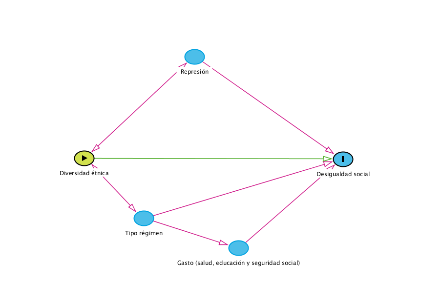


> Dibuja el DAG en R con ggdag().


```r
ejercicio10b_dag1 <- dagify(
  gini ~ diversidad_etnica + tipo_regimen + gasto + represion, 
  diversidad_etnica ~ represion + tipo_regimen, 
  tipo_regimen ~ diversidad_etnica,
  gasto ~ tipo_regimen,
  exposure = "diversidad_etnica",
  outcome = "gini",
  labels = c(gini = "Desigualdad Social", diversidad_etnica = "Diversidad étnica", 
             tipo_regimen = "Tipo de régimen", gasto = "Gasto (salud, educación y seguridad social)", represion = "Represión"),
  coords = list(x = c(gini = 5, diversidad_etnica = 0, tipo_regimen = 1, gasto = 3, represion = 3),
                y = c(gini = 3, diversidad_etnica = 3, tipo_regimen = 1, gasto = 0, represion = 5))
  
)


ggdag_status(ejercicio10b_dag1, 
             use_labels = "label", text = FALSE) +
  guides(fill = FALSE, color = FALSE) + 
  theme_dag()
```

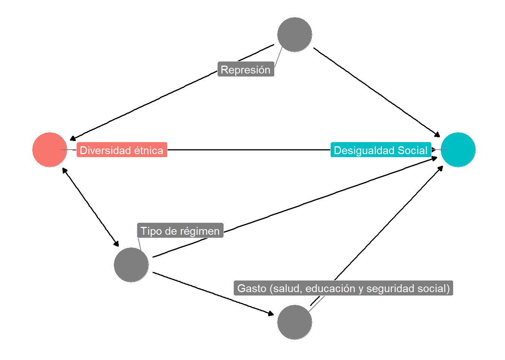

#### Ejercicio 10C {-}

> En el ejercicio 10B, dibujaste un DAG que modeló la relación causal entre la diversidad étnica y la desigualdad social. En este ejercicio utilizarás el set de ajustes de ese DAG para intentar estimar el efecto causal de esa relación. Haz lo siguiente:

> 1. Carga la base de datos de bienestar del paquete del libro:


```r
library(paqueteadp)
data("bienestar")
```

> 2. Use el DAG que hiciste anteriormente para determinar el ajuste mínimo suficiente. ¿Qué nodos deben ser ajustados para asegurar que se identifique el camino entre la diversidad étnica y la desigualdad?


```r
ggdag_status(ejercicio10b_dag1, 
             use_labels = "label", text = FALSE) +
  guides(fill = FALSE, color = FALSE) + 
  theme_dag()
```


Se debería controlar por represión, tipo de régimen y gastos en salud, educación y seguridad social. 

> 3. Construye un modelo de correlación no causal (que llamamos de ingenuo o naive) para probar la relación entre la diversidad y la desigualdad (es decir, `lm(gini ~ diversidad_etnica, data = bienestar)`).  
¿Cómo se asocia la diversidad con la desigualdad? ¿Por qué esta estimación no es causal?


```r
bienestar_cap10 <- bienestar %>% 
  drop_na(gini,  gasto_salud, gasto_segsocial, diversidad_etnica, pib, tipo_regimen)

modelo10_naive <- lm(gini ~ diversidad_etnica, data = bienestar_cap10)

screenreg(modelo10_naive)
## 
## =============================
##                    Model 1   
## -----------------------------
## (Intercept)         46.54 ***
##                     (0.48)   
## diversidad_etnica    7.64 ***
##                     (0.87)   
## -----------------------------
## R^2                  0.23    
## Adj. R^2             0.23    
## Num. obs.          258       
## =============================
## *** p < 0.001; ** p < 0.01; * p < 0.05
```


El coeficiente para diversidad étnica es positivo, por lo que pasar de una sociedad no diversa a unaque sí lo es aumenta en 7.64 puntos el coeficiente de Gini. Sin embargo, esta estimación no es causal debido a que pueden haber muchas otras variables que afectan a la medida de desigualdad. 

> 4. Usar una regresión múltiple para cerrar las puertas traseras. Incluya las variables de tu set de ajuste como variables explicativas en un modelo de regresión.


```r
modelo10_gini <- lm(gini ~ diversidad_etnica + represion + tipo_regimen + gasto_educ +
                      gasto_salud + gasto_segsocial, 
                    data = bienestar_cap10)

screenreg(modelo10_gini)
## 
## =============================
##                    Model 1   
## -----------------------------
## (Intercept)         45.81 ***
##                     (2.26)   
## diversidad_etnica    6.23 ***
##                     (0.92)   
## represion           -0.39    
##                     (1.40)   
## tipo_regimen        -1.43 ** 
##                     (0.54)   
## gasto_educ           2.00 ***
##                     (0.35)   
## gasto_salud         -0.38    
##                     (0.29)   
## gasto_segsocial     -0.13    
##                     (0.12)   
## -----------------------------
## R^2                  0.35    
## Adj. R^2             0.34    
## Num. obs.          258       
## =============================
## *** p < 0.001; ** p < 0.01; * p < 0.05
```

Ahora el coeficiente de diversidad étnica disminuye levemente.

> 5. Usa matching para cerrar las puertas traseras. Usa las variables de tu set de ajuste para hacer coincidir la asignación de las observaciones con el tratamiento, luego usa las observaciones emparejadas en un modelo de regresión.

Primero creamos un objeto llamado `matched`, en donde ocupamos la función `matchit` y donde la variable dependiente es el tratamiento. En este caso vendría a ser diversidad_etnica, y como variables independientes todas las demás. 


```r
matched <- matchit(diversidad_etnica ~ represion + tipo_regimen + gasto_educ +
                     gasto_salud + gasto_segsocial, 
                   data = bienestar_cap10,
                   method = "nearest", 
                   distance = "mahalanobis", 
                   replace = TRUE)
```

Con este modelo matcheado pasamos a crear un modelo de regresión lineal en donde ocuparemos los datos ya pareados. Es decir, debemos guardar los datos y ocuparlos en una nueva regresión:


```r
bienestar_matched <- match.data(matched)

modelo10_matched <- lm(gini ~ diversidad_etnica + represion + tipo_regimen + 
                         gasto_educ + gasto_salud + gasto_segsocial, 
                      data = bienestar_matched, 
                    weights = weights)

screenreg(modelo10_matched)
## 
## =============================
##                    Model 1   
## -----------------------------
## (Intercept)         42.26 ***
##                     (3.46)   
## diversidad_etnica    5.94 ***
##                     (1.25)   
## represion            2.09    
##                     (2.11)   
## tipo_regimen         1.59    
##                     (1.17)   
## gasto_educ          -0.30    
##                     (0.74)   
## gasto_salud          1.08    
##                     (0.86)   
## gasto_segsocial      0.13    
##                     (0.32)   
## -----------------------------
## R^2                  0.21    
## Adj. R^2             0.16    
## Num. obs.          108       
## =============================
## *** p < 0.001; ** p < 0.01; * p < 0.05
```

Y voilà, ya tenemos nuestro modelo matcheado! 

> 6. Usa la ponderación de probabilidad inversa para cerrar las puertas traseras. Usa las variables de tu conjunto de ajustes para generar puntuaciones de propensión para la asignación al tratamiento, y luego crea ponderaciones de probabilidad inversas y usa esas ponderaciones en un modelo de regresión.


```r
bienestar_10c <- bienestar %>% 
  mutate(tratamiento_divetn = if_else(diversidad_etnica == 0, "Control", "Tratamiento"),
         tratamiento_divetn = factor(tratamiento_divetn))

modelo10_tratamiento <- glm(tratamiento_divetn ~ represion + tipo_regimen + 
                         gasto_educ + gasto_salud + gasto_segsocial,
                         data = bienestar_10c,
                         family = binomial(link = "logit"))

propensiones_10c <- broom::augment_columns(modelo10_tratamiento, 
                                               bienestar_10c, 
                                               type.predict = "response") %>% 
  rename(propension = .fitted)

bienestar_10c_peso_invertido <- propensiones_10c %>% 
  mutate(peso_invertido = (diversidad_etnica / propension) + 
           (1 - diversidad_etnica) / (1 - propension))
```

Ahora que creamos los valores de probabilidad inversa los añadimos a un modelo de regresión: 


```r
modelo10_prob_inv <- lm(gini ~ diversidad_etnica, 
                      data = bienestar_10c_peso_invertido,
                      weights = peso_invertido)

screenreg(modelo10_prob_inv)
## 
## =============================
##                    Model 1   
## -----------------------------
## (Intercept)         47.09 ***
##                     (0.50)   
## diversidad_etnica    7.71 ***
##                     (0.78)   
## -----------------------------
## R^2                  0.28    
## Adj. R^2             0.27    
## Num. obs.          258       
## =============================
## *** p < 0.001; ** p < 0.01; * p < 0.05
```

> 7. ¿Cómo se comparan estos efectos ajustados con el modelo “ingenuo”? ¿Cuánta confianza tienes en que estos son efectos causales? ¿Por qué? ¿Qué podría hacer para mejorar su identificación causal?


```r
screenreg(list(modelo10_naive, modelo10_gini, modelo10_matched, modelo10_prob_inv),
          custom.model.names = c("Naive/Ingenuo", "Regresión", "Matching", "IPW"))
## 
## ====================================================================
##                    Naive/Ingenuo  Regresión   Matching    IPW       
## --------------------------------------------------------------------
## (Intercept)         46.54 ***      45.81 ***   42.26 ***   47.09 ***
##                     (0.48)         (2.26)      (3.46)      (0.50)   
## diversidad_etnica    7.64 ***       6.23 ***    5.94 ***    7.71 ***
##                     (0.87)         (0.92)      (1.25)      (0.78)   
## represion                          -0.39        2.09                
##                                    (1.40)      (2.11)               
## tipo_regimen                       -1.43 **     1.59                
##                                    (0.54)      (1.17)               
## gasto_educ                          2.00 ***   -0.30                
##                                    (0.35)      (0.74)               
## gasto_salud                        -0.38        1.08                
##                                    (0.29)      (0.86)               
## gasto_segsocial                    -0.13        0.13                
##                                    (0.12)      (0.32)               
## --------------------------------------------------------------------
## R^2                  0.23           0.35        0.21        0.28    
## Adj. R^2             0.23           0.34        0.16        0.27    
## Num. obs.          258            258         108         258       
## ====================================================================
## *** p < 0.001; ** p < 0.01; * p < 0.05
```

En este ejemplo, el modelo ingenuo se acercó bastante al valor, y la diversidad étnica se mantiene en todos los modelos como una variable estadísticamente significativa. 

## Capítulo 11: Manejo avanzado de datos políticos {-}

#### Paquetes y carga de datos {-}


```r
library(tidyverse)
library(paqueteadp)
library(skimr)
## install.packages("countrycode")
library(countrycode)
## install.packages("stringdist")
library(stringdist)
## install.packages("naniar")
library(naniar)
## install.packages("mice")
library(mice)
library(remotes)
library(texreg)


data("tratados")
data("pib_pc_america")
```

#### Ejercicio 11A {-}

> Descargue el [World Economics and Politics (WEP) Dataverse](https://ncgg.princeton.edu/wep/dataverse.html)  y elija diez variables de país-año, incluyendo tanto las características institucionales como económicas de los estados como nuevas variables que se añadirán a `tratados_con_pib` y unirlas.  
¿Fue fácil encontrar los identificadores únicos (códigos, nombres)?

En primer lugar cargamos la base `tratados` del paquete `paqueteadp` y la exploramos con skimr:


```r
data("tratados")

skim(tratados)
```


Table: (\#tab:unnamed-chunk-149)Data summary

|                         |         |
|:------------------------|:--------|
|Name                     |tratados |
|Number of rows           |248      |
|Number of columns        |5        |
|_______________________  |         |
|Column type frequency:   |         |
|character                |3        |
|numeric                  |2        |
|________________________ |         |
|Group variables          |None     |


**Variable type: character**

|skim_variable  | n_missing| complete_rate| min| max| empty| n_unique| whitespace|
|:--------------|---------:|-------------:|---:|---:|-----:|--------:|----------:|
|nombre_tratado |         0|             1|  48| 163|     0|        4|          0|
|pais_nombre    |         0|             1|   4|  36|     0|       31|          0|
|accion_tipo    |         0|             1|   5|  12|     0|        2|          0|


**Variable type: numeric**

|skim_variable | n_missing| complete_rate| mean|   sd|   p0|  p25|  p50|  p75| p100|hist                                     |
|:-------------|---------:|-------------:|----:|----:|----:|----:|----:|----:|----:|:----------------------------------------|
|anio_adopcion |         0|          1.00| 1997| 0.83| 1996| 1997| 1998| 1998| 1998|▃▁▃▁▇ |
|accion_anio   |        82|          0.67| 2000| 3.32| 1996| 1998| 1999| 2001| 2012|▇▅▁▁▁ |

```r

head(tratados, n = 10)
## # A tibble: 10 x 5
##   nombre_tratado       anio_adopcion pais_nombre  accion_tipo accion_anio
##   <chr>                        <dbl> <chr>        <chr>             <dbl>
## 1 Tratado de Prohibic~          1996 Antigua y B~ Ratificaci~        2006
## 2 Tratado de Prohibic~          1996 Antigua y B~ Firma              1997
## 3 Tratado de Prohibic~          1996 Argentina    Ratificaci~        1998
## # ... with 7 more rows
```

Luego descargamos la base de [World Economics and Politics (WEP) Dataverse](https://ncgg.princeton.edu/wep/dataverse.html) y la guardamos en la carpeta donde estemos trabajando el proyecto:


```r
df_wep <- read_csv("00-archivos/ejercicios/datos/wep_data.csv")

glimpse(df_wep)
## Rows: 1,037
## Columns: 46
## $ country                <chr> "United States of America", "United Stat~
## $ year                   <dbl> 1990, 1991, 1992, 1993, 1994, 1995, 1996~
## $ gwno                   <dbl> 2, 2, 2, 2, 2, 2, 2, 2, 2, 2, 2, 2, 2, 2~
## $ ccode                  <dbl> 2, 2, 2, 2, 2, 2, 2, 2, 2, 2, 2, 2, 2, 2~
## $ ifscode                <dbl> 111, 111, 111, 111, 111, 111, 111, 111, ~
## $ ifs                    <chr> "USA", "USA", "USA", "USA", "USA", "USA"~
## $ gwabbrev               <chr> "USA", "USA", "USA", "USA", "USA", "USA"~
## $ fdiflows_UNCTAD        <dbl> 48422, 22799, 19222, 50663, 45095, 58772~
## $ fdistocks_UNCTAD       <dbl> 539601, 669137, 696177, 768398, 757853, ~
## $ pl_FH                  <dbl> 1, 1, 1, 1, 1, 1, 1, 1, 1, 1, 1, 1, 1, 1~
## $ cl_FH                  <dbl> 1, 1, 1, 1, 1, 1, 1, 1, 1, 1, 1, 1, 1, 1~
## $ rulelaw_FH             <dbl> NA, NA, NA, NA, NA, NA, NA, NA, NA, NA, ~
## $ exselec_DD             <dbl> 1, 1, 1, 1, 1, 1, 1, 1, 1, 1, 1, 1, 1, 1~
## $ legselec_DD            <dbl> 2, 2, 2, 2, 2, 2, 2, 2, 2, 2, 2, 2, 2, 2~
## $ closed_DD              <dbl> 2, 2, 2, 2, 2, 2, 2, 2, 2, 2, 2, 2, 2, 2~
## $ dejure_DD              <dbl> 2, 2, 2, 2, 2, 2, 2, 2, 2, 2, 2, 2, 2, 2~
## $ defacto_DD             <dbl> 2, 2, 2, 2, 2, 2, 2, 2, 2, 2, 2, 2, 2, 2~
## $ defacto2_DD            <dbl> 2, 2, 2, 2, 2, 2, 2, 2, 2, 2, 2, 2, 2, 2~
## $ democracy_DD           <dbl> 1, 1, 1, 1, 1, 1, 1, 1, 1, 1, 1, 1, 1, 1~
## $ regime_DD              <dbl> 2, 2, 2, 2, 2, 2, 2, 2, 2, 2, 2, 2, 2, 2~
## $ ttd_DD                 <dbl> 0, 0, 0, 0, 0, 0, 0, 0, 0, 0, 0, 0, 0, 0~
## $ tta_DD                 <dbl> 0, 0, 0, 0, 0, 0, 0, 0, 0, 0, 0, 0, 0, 0~
## $ transparencyindex_HR   <dbl> 3.3, 3.4, 3.2, 3.5, 3.9, 4.0, 3.9, 3.7, ~
## $ transparencyindexub_HR <dbl> 2.7, 2.7, 2.6, 2.9, 3.3, 3.4, 3.2, 3.1, ~
## $ transparencyindexlb_HR <dbl> 3.9, 3.9, 3.8, 4.2, 4.6, 4.7, 4.5, 4.4, ~
## $ transparencyindexsd_HR <dbl> 0.30, 0.31, 0.30, 0.32, 0.33, 0.35, 0.33~
## $ transdiff_HR           <dbl> 0.236, 0.019, -0.153, 0.292, 0.441, 0.10~
## $ transdifflb_HR         <dbl> -0.43, -0.60, -0.76, -0.37, -0.27, -0.59~
## $ transdiffub_HR         <dbl> 0.92, 0.66, 0.53, 1.00, 1.11, 0.83, 0.54~
## $ fragment_P4            <dbl> NA, NA, NA, NA, NA, NA, NA, NA, NA, NA, ~
## $ democ_P4               <dbl> 10, 10, 10, 10, 10, 10, 10, 10, 10, 10, ~
## $ autoc_P4               <dbl> 0, 0, 0, 0, 0, 0, 0, 0, 0, 0, 0, 0, 0, 0~
## $ polity_P4              <dbl> 10, 10, 10, 10, 10, 10, 10, 10, 10, 10, ~
## $ polity2_P4             <dbl> 10, 10, 10, 10, 10, 10, 10, 10, 10, 10, ~
## $ durable_P4             <dbl> 181, 182, 183, 184, 185, 186, 187, 188, ~
## $ xconst_P4              <dbl> 7, 7, 7, 7, 7, 7, 7, 7, 7, 7, 7, 7, 7, 7~
## $ parreg_P4              <dbl> 5, 5, 5, 5, 5, 5, 5, 5, 5, 5, 5, 5, 5, 5~
## $ parcomp_P4             <dbl> 5, 5, 5, 5, 5, 5, 5, 5, 5, 5, 5, 5, 5, 5~
## $ polcomp_P4             <dbl> 10, 10, 10, 10, 10, 10, 10, 10, 10, 10, ~
## $ change_P4              <dbl> NA, NA, NA, NA, NA, NA, NA, NA, NA, NA, ~
## $ sf_P4                  <dbl> NA, NA, NA, NA, NA, NA, NA, NA, NA, NA, ~
## $ regtrans_P4            <dbl> NA, NA, NA, NA, NA, NA, NA, NA, NA, NA, ~
## $ corrupprev_SGI         <dbl> NA, NA, NA, NA, NA, NA, NA, NA, NA, NA, ~
## $ democracy_share_DE     <dbl> 0.42, 0.46, 0.51, 0.53, 0.54, 0.55, 0.54~
## $ democracy_count_DE     <dbl> 69, 84, 93, 99, 103, 104, 103, 106, 105,~
## $ lndemsys_DE            <dbl> 4.2, 4.4, 4.5, 4.6, 4.6, 4.6, 4.6, 4.7, ~
```

En esta base tenemos 46 variables, pero tú podrías tener más o menos dependiendo de qué variables hayas elegido en la página Web. 

Notamos que las primeras 7 variables son datos de identificación. Por ejemplo, tenemos el país ( y distintos códigos para este), y el año. A continuación vamos a seleccionar algunas variables para unirla a la base de `tratados`:


```r
df_wep_reducido <- df_wep %>% 
  dplyr::select(1:9, rulelaw_FH, transparencyindex_HR, polity_P4, polity2_P4,corrupprev_SGI)

head(df_wep_reducido)
## # A tibble: 6 x 14
##   country  year  gwno ccode ifscode ifs   gwabbrev fdiflows_UNCTAD
##   <chr>   <dbl> <dbl> <dbl>   <dbl> <chr> <chr>              <dbl>
## 1 United~  1990     2     2     111 USA   USA                48422
## 2 United~  1991     2     2     111 USA   USA                22799
## 3 United~  1992     2     2     111 USA   USA                19222
## # ... with 3 more rows, and 6 more variables
```

Por último, pasaremos a unir las bases: 


```r
data("pib_pc_america")

## Primero creamos tratados_con_pib

tratados_con_pib <- left_join(x = tratados, 
                              y = pib_pc_america, 
                              by = c("pais_nombre", "anio_adopcion" = "anio"))
  

tratados_con_pib %>% 
  dplyr::select(pais_nombre, anio_adopcion, pib_pc)
## # A tibble: 248 x 3
##   pais_nombre       anio_adopcion pib_pc
##   <chr>                     <dbl>  <dbl>
## 1 Antigua y Barbuda          1996    NA 
## 2 Antigua y Barbuda          1996    NA 
## 3 Argentina                  1996 14557.
## # ... with 245 more rows

## Luego le agregamos los datos de WEP


tratados_pib_wep <- left_join(x = tratados_con_pib,
                              y = df_wep_reducido,
                              by = c("pais_nombre" = "country", 
                                     "anio_adopcion" = "year"))
 
```


#### Ejercicio 11B {-}

> En vez de cinco imputaciones, repite el ejercicio de regresión usando diez imputaciones.


```r
library(mice)

data("indice_cinc")

indice_cinc2 <- indice_cinc %>%
  mutate(indice_capacidades = if_else(pais_iso3c == "USA" & anio %in% 1950:1970, 
                                      NA_real_, indice_capacidades))
```

Ahora que tenemos la base de datos pasamos a hacer los pasos para la imputación:


```r
imputacion_inicial <- mice(indice_cinc2, maxit = 0)
## Warning: Number of logged events: 1

predictor <- imputacion_inicial$predictorMatrix

predictor[, "pais_cown"] <- -2 

predictor[, "anio"] <- 2

metodo_1 <- imputacion_inicial$method
metodo_1[which(metodo_1 == "pmm")] <- "2l.lmer"   # Nuevamente ocupamos pmm

imputacion_mice10 <- mice(indice_cinc2, m = 10, seed = 1, 
                      method = metodo_1, predictorMatrix = predictor)
## 
##  iter imp variable
##   1   1  gasto_militar  poblacion_urb  indice_capacidades
##   1   2  gasto_militar  poblacion_urb  indice_capacidades
##   1   3  gasto_militar  poblacion_urb  indice_capacidades
##   1   4  gasto_militar  poblacion_urb  indice_capacidades
##   1   5  gasto_militar  poblacion_urb  indice_capacidades
##   1   6  gasto_militar  poblacion_urb  indice_capacidades
##   1   7  gasto_militar  poblacion_urb  indice_capacidades
##   1   8  gasto_militar  poblacion_urb  indice_capacidades
##   1   9  gasto_militar  poblacion_urb  indice_capacidades
##   1   10  gasto_militar  poblacion_urb  indice_capacidades
##   2   1  gasto_militar  poblacion_urb  indice_capacidades
##   2   2  gasto_militar  poblacion_urb  indice_capacidades
##   2   3  gasto_militar  poblacion_urb  indice_capacidades
##   2   4  gasto_militar  poblacion_urb  indice_capacidades
##   2   5  gasto_militar  poblacion_urb  indice_capacidades
##   2   6  gasto_militar  poblacion_urb  indice_capacidades
##   2   7  gasto_militar  poblacion_urb  indice_capacidades
##   2   8  gasto_militar  poblacion_urb  indice_capacidades
##   2   9  gasto_militar  poblacion_urb  indice_capacidades
##   2   10  gasto_militar  poblacion_urb  indice_capacidades
##   3   1  gasto_militar  poblacion_urb  indice_capacidades
##   3   2  gasto_militar  poblacion_urb  indice_capacidades
##   3   3  gasto_militar  poblacion_urb  indice_capacidades
##   3   4  gasto_militar  poblacion_urb  indice_capacidades
##   3   5  gasto_militar  poblacion_urb  indice_capacidades
##   3   6  gasto_militar  poblacion_urb  indice_capacidades
##   3   7  gasto_militar  poblacion_urb  indice_capacidades
##   3   8  gasto_militar  poblacion_urb  indice_capacidades
##   3   9  gasto_militar  poblacion_urb  indice_capacidades
##   3   10  gasto_militar  poblacion_urb  indice_capacidades
##   4   1  gasto_militar  poblacion_urb  indice_capacidades
##   4   2  gasto_militar  poblacion_urb  indice_capacidades
##   4   3  gasto_militar  poblacion_urb  indice_capacidades
##   4   4  gasto_militar  poblacion_urb  indice_capacidades
##   4   5  gasto_militar  poblacion_urb  indice_capacidades
##   4   6  gasto_militar  poblacion_urb  indice_capacidades
##   4   7  gasto_militar  poblacion_urb  indice_capacidades
##   4   8  gasto_militar  poblacion_urb  indice_capacidades
##   4   9  gasto_militar  poblacion_urb  indice_capacidades
##   4   10  gasto_militar  poblacion_urb  indice_capacidades
##   5   1  gasto_militar  poblacion_urb  indice_capacidades
##   5   2  gasto_militar  poblacion_urb  indice_capacidades
##   5   3  gasto_militar  poblacion_urb  indice_capacidades
##   5   4  gasto_militar  poblacion_urb  indice_capacidades
##   5   5  gasto_militar  poblacion_urb  indice_capacidades
##   5   6  gasto_militar  poblacion_urb  indice_capacidades
##   5   7  gasto_militar  poblacion_urb  indice_capacidades
##   5   8  gasto_militar  poblacion_urb  indice_capacidades
##   5   9  gasto_militar  poblacion_urb  indice_capacidades
##   5   10  gasto_militar  poblacion_urb  indice_capacidades

imputacion_mice10$imp$indice_capacidades
##     1  2  3  4  5  6  7  8  9 10
## 91 24 21 17 22 24 17 22 25 24 22
## 92 20 27 23 21 19 15 26 19 27 25
##  [ reached 'max' / getOption("max.print") -- omitted 19 rows ]
```

Veamos los datos:


```r
stripplot(imputacion_mice10, indice_capacidades, pch = 20)
```

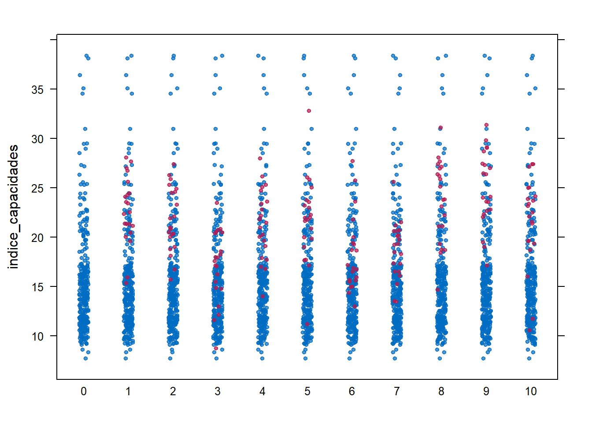

Y las extraemos...


```r
datos_completos <- bind_rows(
  mice::complete(imputacion_mice10, 1) %>% mutate(num_imp = 1),
  mice::complete(imputacion_mice10, 2) %>% mutate(num_imp = 2),
  mice::complete(imputacion_mice10, 3) %>% mutate(num_imp = 3),
  mice::complete(imputacion_mice10, 4) %>% mutate(num_imp = 4),
  mice::complete(imputacion_mice10, 5) %>% mutate(num_imp = 5),
  mice::complete(imputacion_mice10, 5) %>% mutate(num_imp = 5),
  mice::complete(imputacion_mice10, 6) %>% mutate(num_imp = 6),
  mice::complete(imputacion_mice10, 7) %>% mutate(num_imp = 7),
  mice::complete(imputacion_mice10, 8) %>% mutate(num_imp = 8),
  mice::complete(imputacion_mice10, 9) %>% mutate(num_imp = 9),
  mice::complete(imputacion_mice10, 10) %>% mutate(num_imp = 10)
) %>% 
  dplyr::select(num_imp, everything()) %>% 
  mutate(fuente = "Imputación específica") %>% 
  filter(pais_iso3c == "USA" & anio %in% 1950:1970)
```


```r
media_imp <- datos_completos %>% 
  group_by(pais_iso3c, pais_cown, anio) %>% 
  dplyr::summarize(indice_capacidades = mean(indice_capacidades)) %>% 
  ungroup() %>% 
  mutate(fuente = "Average Imp.") %>% 
  filter(pais_iso3c == "USA" & anio %in% 1950:1970)

ggplot(mapping = aes(x = anio, y = indice_capacidades, 
                     group = pais_iso3c, color = pais_iso3c)) + 
  geom_point(data = indice_cinc2) +
  geom_point(data = datos_completos, color = "darkgray") +
  geom_point(data = media_imp, color = "black") +
  geom_vline(xintercept = c(1950, 1970), linetype = "dashed") +
  scale_x_continuous(breaks = seq(1860, 2020, 10)) +
  scale_color_manual(values = c("lightgray", "black")) +
  theme(axis.text.x = element_text(angle = 90, hjust = 1)) + 
  labs(x = "Año", y = "Índice CINC")
## Warning: Removed 21 rows containing missing values (geom_point).
```

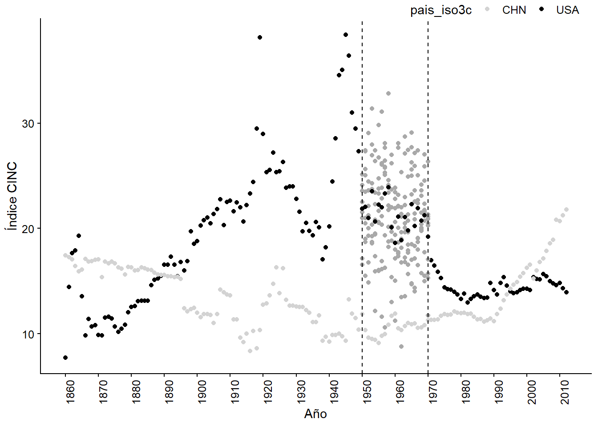

Ahora creamos los 10 modelos de regresión con imputaciones y el modelo incompleto:


```r
modelo_incompleto <- lm(indice_capacidades ~ cons_energia + poblacion_urb, 
                        data = indice_cinc2)

modelo_imp1 <- lm(indice_capacidades ~ cons_energia + poblacion_urb, 
                  data = mice::complete(imputacion_mice10, 1))

modelo_imp2 <- lm(indice_capacidades ~ cons_energia + poblacion_urb, 
                  data = mice::complete(imputacion_mice10, 2))

modelo_imp3 <- lm(indice_capacidades ~ cons_energia + poblacion_urb,
                  data = mice::complete(imputacion_mice10, 3))

modelo_imp4 <- lm(indice_capacidades ~ cons_energia + poblacion_urb, 
                  data = mice::complete(imputacion_mice10, 4))

modelo_imp5 <- lm(indice_capacidades ~ cons_energia + poblacion_urb, 
                  data = mice::complete(imputacion_mice10, 5))

modelo_imp6 <- lm(indice_capacidades ~ cons_energia + poblacion_urb, 
                  data = mice::complete(imputacion_mice10, 6))

modelo_imp7 <- lm(indice_capacidades ~ cons_energia + poblacion_urb, 
                  data = mice::complete(imputacion_mice10, 7))

modelo_imp8 <- lm(indice_capacidades ~ cons_energia + poblacion_urb, 
                  data = mice::complete(imputacion_mice10, 8))

modelo_imp9 <- lm(indice_capacidades ~ cons_energia + poblacion_urb, 
                  data = mice::complete(imputacion_mice10, 9))

modelo_imp10 <- lm(indice_capacidades ~ cons_energia + poblacion_urb, 
                  data = mice::complete(imputacion_mice10, 10))

modelos_imputados <- list(modelo_incompleto, modelo_imp1, modelo_imp2, modelo_imp3, modelo_imp4, 
                          modelo_imp5, modelo_imp6, modelo_imp7, modelo_imp8, modelo_imp9,
                          modelo_imp10)

tabla11c <- htmlreg(modelos_imputados, 
                    custom.model.names = c("M incomp", "M imp 1", "M imp 2", "M imp 3", 
                                           "M imp 4", "M imp 5", "M imp 6", "M imp 7", 
                                           "M imp 8", "M imp 9", "M imp 10")
)

htmltools::HTML(tabla11c)
```

```{=html}
<table class="texreg" style="margin: 10px auto;border-collapse: collapse;border-spacing: 0px;caption-side: bottom;color: #000000;border-top: 2px solid #000000;">
<caption>Statistical models</caption>
<thead>
<tr>
<th style="padding-left: 5px;padding-right: 5px;">&nbsp;</th>
<th style="padding-left: 5px;padding-right: 5px;">M incomp</th>
<th style="padding-left: 5px;padding-right: 5px;">M imp 1</th>
<th style="padding-left: 5px;padding-right: 5px;">M imp 2</th>
<th style="padding-left: 5px;padding-right: 5px;">M imp 3</th>
<th style="padding-left: 5px;padding-right: 5px;">M imp 4</th>
<th style="padding-left: 5px;padding-right: 5px;">M imp 5</th>
<th style="padding-left: 5px;padding-right: 5px;">M imp 6</th>
<th style="padding-left: 5px;padding-right: 5px;">M imp 7</th>
<th style="padding-left: 5px;padding-right: 5px;">M imp 8</th>
<th style="padding-left: 5px;padding-right: 5px;">M imp 9</th>
<th style="padding-left: 5px;padding-right: 5px;">M imp 10</th>
</tr>
</thead>
<tbody>
<tr style="border-top: 1px solid #000000;">
<td style="padding-left: 5px;padding-right: 5px;">(Intercept)</td>
<td style="padding-left: 5px;padding-right: 5px;">15.32<sup>***</sup></td>
<td style="padding-left: 5px;padding-right: 5px;">15.60<sup>***</sup></td>
<td style="padding-left: 5px;padding-right: 5px;">15.31<sup>***</sup></td>
<td style="padding-left: 5px;padding-right: 5px;">14.84<sup>***</sup></td>
<td style="padding-left: 5px;padding-right: 5px;">15.63<sup>***</sup></td>
<td style="padding-left: 5px;padding-right: 5px;">15.51<sup>***</sup></td>
<td style="padding-left: 5px;padding-right: 5px;">15.06<sup>***</sup></td>
<td style="padding-left: 5px;padding-right: 5px;">15.10<sup>***</sup></td>
<td style="padding-left: 5px;padding-right: 5px;">15.54<sup>***</sup></td>
<td style="padding-left: 5px;padding-right: 5px;">15.36<sup>***</sup></td>
<td style="padding-left: 5px;padding-right: 5px;">15.27<sup>***</sup></td>
</tr>
<tr>
<td style="padding-left: 5px;padding-right: 5px;">&nbsp;</td>
<td style="padding-left: 5px;padding-right: 5px;">(0.54)</td>
<td style="padding-left: 5px;padding-right: 5px;">(0.41)</td>
<td style="padding-left: 5px;padding-right: 5px;">(0.39)</td>
<td style="padding-left: 5px;padding-right: 5px;">(0.37)</td>
<td style="padding-left: 5px;padding-right: 5px;">(0.42)</td>
<td style="padding-left: 5px;padding-right: 5px;">(0.41)</td>
<td style="padding-left: 5px;padding-right: 5px;">(0.38)</td>
<td style="padding-left: 5px;padding-right: 5px;">(0.37)</td>
<td style="padding-left: 5px;padding-right: 5px;">(0.41)</td>
<td style="padding-left: 5px;padding-right: 5px;">(0.40)</td>
<td style="padding-left: 5px;padding-right: 5px;">(0.39)</td>
</tr>
<tr>
<td style="padding-left: 5px;padding-right: 5px;">cons_energia</td>
<td style="padding-left: 5px;padding-right: 5px;">0.00<sup>**</sup></td>
<td style="padding-left: 5px;padding-right: 5px;">0.00<sup>***</sup></td>
<td style="padding-left: 5px;padding-right: 5px;">0.00<sup>***</sup></td>
<td style="padding-left: 5px;padding-right: 5px;">0.00<sup>***</sup></td>
<td style="padding-left: 5px;padding-right: 5px;">0.00<sup>***</sup></td>
<td style="padding-left: 5px;padding-right: 5px;">0.00<sup>***</sup></td>
<td style="padding-left: 5px;padding-right: 5px;">0.00<sup>***</sup></td>
<td style="padding-left: 5px;padding-right: 5px;">0.00<sup>***</sup></td>
<td style="padding-left: 5px;padding-right: 5px;">0.00<sup>***</sup></td>
<td style="padding-left: 5px;padding-right: 5px;">0.00<sup>***</sup></td>
<td style="padding-left: 5px;padding-right: 5px;">0.00<sup>***</sup></td>
</tr>
<tr>
<td style="padding-left: 5px;padding-right: 5px;">&nbsp;</td>
<td style="padding-left: 5px;padding-right: 5px;">(0.00)</td>
<td style="padding-left: 5px;padding-right: 5px;">(0.00)</td>
<td style="padding-left: 5px;padding-right: 5px;">(0.00)</td>
<td style="padding-left: 5px;padding-right: 5px;">(0.00)</td>
<td style="padding-left: 5px;padding-right: 5px;">(0.00)</td>
<td style="padding-left: 5px;padding-right: 5px;">(0.00)</td>
<td style="padding-left: 5px;padding-right: 5px;">(0.00)</td>
<td style="padding-left: 5px;padding-right: 5px;">(0.00)</td>
<td style="padding-left: 5px;padding-right: 5px;">(0.00)</td>
<td style="padding-left: 5px;padding-right: 5px;">(0.00)</td>
<td style="padding-left: 5px;padding-right: 5px;">(0.00)</td>
</tr>
<tr>
<td style="padding-left: 5px;padding-right: 5px;">poblacion_urb</td>
<td style="padding-left: 5px;padding-right: 5px;">-0.01<sup>*</sup></td>
<td style="padding-left: 5px;padding-right: 5px;">-0.01<sup>***</sup></td>
<td style="padding-left: 5px;padding-right: 5px;">-0.01<sup>**</sup></td>
<td style="padding-left: 5px;padding-right: 5px;">-0.01<sup>*</sup></td>
<td style="padding-left: 5px;padding-right: 5px;">-0.01<sup>**</sup></td>
<td style="padding-left: 5px;padding-right: 5px;">-0.01<sup>**</sup></td>
<td style="padding-left: 5px;padding-right: 5px;">-0.01<sup>*</sup></td>
<td style="padding-left: 5px;padding-right: 5px;">-0.01<sup>*</sup></td>
<td style="padding-left: 5px;padding-right: 5px;">-0.01<sup>**</sup></td>
<td style="padding-left: 5px;padding-right: 5px;">-0.01<sup>**</sup></td>
<td style="padding-left: 5px;padding-right: 5px;">-0.01<sup>*</sup></td>
</tr>
<tr>
<td style="padding-left: 5px;padding-right: 5px;">&nbsp;</td>
<td style="padding-left: 5px;padding-right: 5px;">(0.00)</td>
<td style="padding-left: 5px;padding-right: 5px;">(0.00)</td>
<td style="padding-left: 5px;padding-right: 5px;">(0.00)</td>
<td style="padding-left: 5px;padding-right: 5px;">(0.00)</td>
<td style="padding-left: 5px;padding-right: 5px;">(0.00)</td>
<td style="padding-left: 5px;padding-right: 5px;">(0.00)</td>
<td style="padding-left: 5px;padding-right: 5px;">(0.00)</td>
<td style="padding-left: 5px;padding-right: 5px;">(0.00)</td>
<td style="padding-left: 5px;padding-right: 5px;">(0.00)</td>
<td style="padding-left: 5px;padding-right: 5px;">(0.00)</td>
<td style="padding-left: 5px;padding-right: 5px;">(0.00)</td>
</tr>
<tr style="border-top: 1px solid #000000;">
<td style="padding-left: 5px;padding-right: 5px;">R<sup>2</sup></td>
<td style="padding-left: 5px;padding-right: 5px;">0.04</td>
<td style="padding-left: 5px;padding-right: 5px;">0.08</td>
<td style="padding-left: 5px;padding-right: 5px;">0.07</td>
<td style="padding-left: 5px;padding-right: 5px;">0.05</td>
<td style="padding-left: 5px;padding-right: 5px;">0.07</td>
<td style="padding-left: 5px;padding-right: 5px;">0.08</td>
<td style="padding-left: 5px;padding-right: 5px;">0.05</td>
<td style="padding-left: 5px;padding-right: 5px;">0.06</td>
<td style="padding-left: 5px;padding-right: 5px;">0.08</td>
<td style="padding-left: 5px;padding-right: 5px;">0.08</td>
<td style="padding-left: 5px;padding-right: 5px;">0.06</td>
</tr>
<tr>
<td style="padding-left: 5px;padding-right: 5px;">Adj. R<sup>2</sup></td>
<td style="padding-left: 5px;padding-right: 5px;">0.03</td>
<td style="padding-left: 5px;padding-right: 5px;">0.07</td>
<td style="padding-left: 5px;padding-right: 5px;">0.06</td>
<td style="padding-left: 5px;padding-right: 5px;">0.04</td>
<td style="padding-left: 5px;padding-right: 5px;">0.06</td>
<td style="padding-left: 5px;padding-right: 5px;">0.07</td>
<td style="padding-left: 5px;padding-right: 5px;">0.04</td>
<td style="padding-left: 5px;padding-right: 5px;">0.05</td>
<td style="padding-left: 5px;padding-right: 5px;">0.07</td>
<td style="padding-left: 5px;padding-right: 5px;">0.07</td>
<td style="padding-left: 5px;padding-right: 5px;">0.06</td>
</tr>
<tr style="border-bottom: 2px solid #000000;">
<td style="padding-left: 5px;padding-right: 5px;">Num. obs.</td>
<td style="padding-left: 5px;padding-right: 5px;">217</td>
<td style="padding-left: 5px;padding-right: 5px;">306</td>
<td style="padding-left: 5px;padding-right: 5px;">306</td>
<td style="padding-left: 5px;padding-right: 5px;">306</td>
<td style="padding-left: 5px;padding-right: 5px;">306</td>
<td style="padding-left: 5px;padding-right: 5px;">306</td>
<td style="padding-left: 5px;padding-right: 5px;">306</td>
<td style="padding-left: 5px;padding-right: 5px;">306</td>
<td style="padding-left: 5px;padding-right: 5px;">306</td>
<td style="padding-left: 5px;padding-right: 5px;">306</td>
<td style="padding-left: 5px;padding-right: 5px;">306</td>
</tr>
</tbody>
<tfoot>
<tr>
<td style="font-size: 0.8em;" colspan="12"><sup>***</sup>p &lt; 0.001; <sup>**</sup>p &lt; 0.01; <sup>*</sup>p &lt; 0.05</td>
</tr>
</tfoot>
</table>

```


Por útlimo, creamos los pasos para ver el modelo combinado de las 10 imputaciones:


```r
modelo_combinado_form <- with(
  imputacion_mice10, 
  lm(indice_capacidades ~ cons_energia + poblacion_urb)
)

modelo_combinado <- summary(pool(modelo_combinado_form))

modelo_combinado
##            term estimate std.error statistic  df p.value
## 1   (Intercept)  15.3230   0.48069      31.9  61 0.00000
## 2  cons_energia   0.0015   0.00036       4.1 108 0.00009
## 3 poblacion_urb  -0.0104   0.00405      -2.6 107 0.01138

tr_modelo_combinado <- texreg::createTexreg(
  # nombres de los coeficientes:
  coef.names = as.character(modelo_combinado$term), 
  # coeficientes, errores estándar y valores-p:
  coef = modelo_combinado$estimate, 
  se = modelo_combinado$std.error, 
  pvalues = modelo_combinado$p.value,
  # R^2 y número de observaciones:
  gof.names = c("R^2", "Num. obs."),
  gof = c(pool.r.squared(modelo_combinado_form)[1, 1], nrow(imputacion_mice10$data)),
  gof.decimal = c(T, F)
)


tabla11c_2 <- htmlreg(list(modelo_incompleto, tr_modelo_combinado),
                  custom.model.names = c("M incomp", "M combinado"))

htmltools::HTML(tabla11c_2)
```

```{=html}
<table class="texreg" style="margin: 10px auto;border-collapse: collapse;border-spacing: 0px;caption-side: bottom;color: #000000;border-top: 2px solid #000000;">
<caption>Statistical models</caption>
<thead>
<tr>
<th style="padding-left: 5px;padding-right: 5px;">&nbsp;</th>
<th style="padding-left: 5px;padding-right: 5px;">M incomp</th>
<th style="padding-left: 5px;padding-right: 5px;">M combinado</th>
</tr>
</thead>
<tbody>
<tr style="border-top: 1px solid #000000;">
<td style="padding-left: 5px;padding-right: 5px;">(Intercept)</td>
<td style="padding-left: 5px;padding-right: 5px;">15.32<sup>***</sup></td>
<td style="padding-left: 5px;padding-right: 5px;">15.32<sup>***</sup></td>
</tr>
<tr>
<td style="padding-left: 5px;padding-right: 5px;">&nbsp;</td>
<td style="padding-left: 5px;padding-right: 5px;">(0.54)</td>
<td style="padding-left: 5px;padding-right: 5px;">(0.48)</td>
</tr>
<tr>
<td style="padding-left: 5px;padding-right: 5px;">cons_energia</td>
<td style="padding-left: 5px;padding-right: 5px;">0.00<sup>**</sup></td>
<td style="padding-left: 5px;padding-right: 5px;">0.00<sup>***</sup></td>
</tr>
<tr>
<td style="padding-left: 5px;padding-right: 5px;">&nbsp;</td>
<td style="padding-left: 5px;padding-right: 5px;">(0.00)</td>
<td style="padding-left: 5px;padding-right: 5px;">(0.00)</td>
</tr>
<tr>
<td style="padding-left: 5px;padding-right: 5px;">poblacion_urb</td>
<td style="padding-left: 5px;padding-right: 5px;">-0.01<sup>*</sup></td>
<td style="padding-left: 5px;padding-right: 5px;">-0.01<sup>*</sup></td>
</tr>
<tr>
<td style="padding-left: 5px;padding-right: 5px;">&nbsp;</td>
<td style="padding-left: 5px;padding-right: 5px;">(0.00)</td>
<td style="padding-left: 5px;padding-right: 5px;">(0.00)</td>
</tr>
<tr style="border-top: 1px solid #000000;">
<td style="padding-left: 5px;padding-right: 5px;">R<sup>2</sup></td>
<td style="padding-left: 5px;padding-right: 5px;">0.04</td>
<td style="padding-left: 5px;padding-right: 5px;">&nbsp;</td>
</tr>
<tr>
<td style="padding-left: 5px;padding-right: 5px;">Adj. R<sup>2</sup></td>
<td style="padding-left: 5px;padding-right: 5px;">0.03</td>
<td style="padding-left: 5px;padding-right: 5px;">&nbsp;</td>
</tr>
<tr>
<td style="padding-left: 5px;padding-right: 5px;">Num. obs.</td>
<td style="padding-left: 5px;padding-right: 5px;">217</td>
<td style="padding-left: 5px;padding-right: 5px;">306</td>
</tr>
<tr style="border-bottom: 2px solid #000000;">
<td style="padding-left: 5px;padding-right: 5px;">R^2</td>
<td style="padding-left: 5px;padding-right: 5px;">&nbsp;</td>
<td style="padding-left: 5px;padding-right: 5px;">0.07</td>
</tr>
</tbody>
<tfoot>
<tr>
<td style="font-size: 0.8em;" colspan="3"><sup>***</sup>p &lt; 0.001; <sup>**</sup>p &lt; 0.01; <sup>*</sup>p &lt; 0.05</td>
</tr>
</tfoot>
</table>

```


## Capítulo 12: Minería de datos web {-}

#### Paquetes y carga de datos {-}


```r
library(tidyverse)
library(paqueteadp)
library(glue)
library(rvest)
## install.packages("rtweet")
library(rtweet)
## install.packages("curl")
library(curl)
library(xml2)
```

#### Ejercicio 12A {-}

> Consigue la fecha de cada comunicado de prensa de la OEA para octubre de 2019. Llama al vector “web_date_releases_10_2019”.


```r
## Cuando pegues los links ten cuidado de no saltarte una línea si es que es muy largo

download_html("http://www.oas.org/es/centro_noticias/comunicados_prensa.asp?nMes=10&nAnio=2019", 
              "webs/comunicados_oea_10_2019.html") # carpeta a la que va el archivo html y nombre que tendrá

## Cargamos el archivo:

web_comunicados_10_2019 <- read_html("webs/comunicados_oea_10_2019.html", 
                                     encoding = "UTF-8")
```

Antes de pasar a crear el objeto para leer las fechas de las noticias debemos ocupar [Selector Gadget](https://selectorgadget.com/) para saber cómo se llama el nodo que nos interesa:


Resaltado en verde se ve el elemento que nos interesa (que pinchamos con el mouse), y en el cuadrado azul de abajo aparece el nombre que utilizaremos (.headlinelink):


```r
web_date_releases_10_2019 <- web_comunicados_10_2019 %>% 
  html_nodes(".headlinelink") %>% 
  html_text()

## Podemos ver las fechas de publicaciones con la función head. n indica cuántas observaciones queremos que muestre

head(web_date_releases_10_2019, n = 16)
##  [1] "C-09231 de octubre de 2019"          
##  [2] "C-09131 de octubre de 2019"          
##  [3] "FNC-9790531 de octubre de 2019"      
##  [4] "D-023/1931 de octubre de 2019"       
##  [5] "D-022/1931 de octubre de 2019"       
##  [6] "C-09030 de octubre de 2019"          
##  [7] "D-021/1930 de octubre de 2019"       
##  [8] "D-020/1929 de octubre de 2019"       
##  [9] "C-08928 de octubre de 2019"          
## [10] "Aviso de Prensa28 de octubre de 2019"
## [11] "Aviso de Prensa28 de octubre de 2019"
## [12] "C-08724 de octubre de 2019"          
## [13] "FNC-9784723 de octubre de 2019"      
## [14] "D-019/1923 de octubre de 2019"       
## [15] "Aviso de Prensa23 de octubre de 2019"
## [16] "C-08622 de octubre de 2019"
```

#### Ejercicio 12B {-}

> Consigue los títulos de las noticias de la página web de la revista The Economist como su [sección internacional](https://www.economist.com/international/?page=1)

Repetimos los mismos pasos del ejercicio anterior: 


```r

download_html("https://www.economist.com/international/?page=1", 
              "webs/economist_internacional.html") 

economist_internacional <- read_html("webs/economist_internacional.html", 
                                     encoding = "UTF-8")
```


```r
economist_titulos <- economist_internacional %>% 
  html_nodes(".headline-link") %>% 
  html_text()

head(economist_titulos, n = 16)
##  [1] "Women in warFemale soldiers are changing how armed forces work"                      
##  [2] "India IncIndia has proved to be a popular—and clever—investor in poor countries"     
##  [3] "Here’s looking at meCovid-19 is fuelling a Zoom-boom in cosmetic surgery"            
##  [4] "Virtual insanityLove them or hate them, virtual meetings are here to stay"           
##  [5] "Tardius, Inferior, InfirmiorWhen brawn and technology ruin the spectacle of sports"  
##  [6] "Spreading the needleAlmost one billion doses of covid-19 vaccines have been produced"
##  [7] "Banged upBrain injuries are startlingly common among those who have committed crimes"
##  [8] "Blue-helmet bluesUN peacekeeping is hamstrung by national rules for its troops"      
##  [9] "It might seem crazyThe pandemic has changed the shape of global happiness"           
## [10] "Hope for tomorrowNicaragua shows how poor countries can reduce domestic violence"    
## [11] "A terrible tollViolence against women is a scourge on poor countries"                
## [12] "Default optionPoor countries struggling with debt fight to get help"
```

#### Ejercicio 12C {-}

> En lugar de usar AND, usa OR entre los diferentes términos de búsqueda. Ambas búsquedas devolverán tweets muy diferentes.


```r

## Primero vemos la consulta con las menciones de Piñera Y Bachelet (como en la sección 12.4.2.1)

consulta_3 <- search_tweets(q = "piñera AND bachelet", n = 20)

head(consulta_3)

## Ahora ocupamos OR para ver las menciones de Piñera O Bachelet

consulta_12c <- search_tweets(q = "piñera OR bachelet", n = 20)

head(consulta_12c)
```


#### Ejercicio 12D {-}

> Buscar tweets en español que no sean retweets


```r
## Ocupamos el código de la sección 12.4.2.3

consulta_12d_pinera <- search_tweets("piñera", lang = "es", include_rts = FALSE, n=20)

consulta_12d_bachelet <- search_tweets("bachelet", lang = "es", include_rts = FALSE, n=20)

head(consulta_12d_pinera)

head(consulta_12d_bachelet)
```

## Capítulo 13: Análisis cuantitativo de textos políticos {-}

(Este capítulo ha quedado en blanco, pues no fue factible adaptar las respuestas al formato de este documento. De todas formas, te sugerimos probar los ejercicios por tu cuenta.)

## Capítulo 14: Análisis de redes {-}

#### Paquetes y carga de datos {-}


```r
library(tidyverse)
library(paqueteadp)
## install.packages("tidygraph")
library(tidygraph)
library(ggraph)
library(ggcorrplot)

data("copatrocinio_arg")
data("senadores_arg")

tg_copatrocinio_arg <- tbl_graph(nodes = senadores_arg, edges = copatrocinio_arg,
                                 directed = T)

tg_copatrocinio_arg <- tg_copatrocinio_arg %>% 
  activate("edges") %>%
  mutate(d_copatrocinio = if_else(n_copatrocinio >= 1, 1, 0),
         n_copatrocinio_inv = 1 / n_copatrocinio)
```


#### Ejercicio 14A {-}

> Prueba la función `geom_edge_link()` en lugar de `geom_edge_arc()`. ¿Cuál es la diferencia? ¿Qué visualización crees que es más clara?

Creamos el diseño gráfico:


```r

set.seed(1)
layout_fr <- create_layout(tg_copatrocinio_arg, "fr", weights = n_copatrocinio)
```

Gráfico con `geom_edge_link()`:


```r
ggraph(layout_fr) +
  geom_edge_link(arrow = arrow(length = unit(3, 'mm')),
                 color = "lightgrey") +
  geom_node_point(size = 5) +
  theme_void()
```


Gráfico con `geom_edge_arc()`:


```r
ggraph(layout_fr) +
  geom_edge_arc(arrow = arrow(length = unit(3, 'mm')),
                 color = "black") +
  geom_node_point(size = 5, color = "grey") +
  theme_void()
```

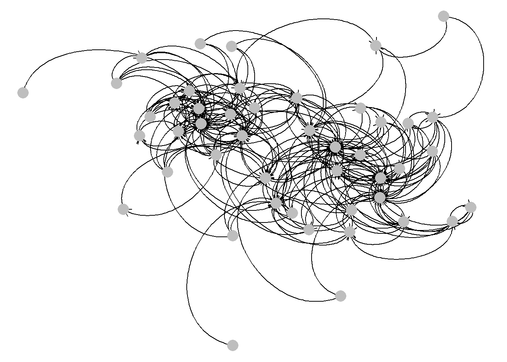

Con `geom_edge_arc()` notamos que las líneas que conectan los nodos ya no son rectas, sino arqueadas y además podemos ver que se puede distinguir más la flecha de la dirección. 

#### Ejercicio 14B {-}

> Edita la base de datos del nodo en el objeto `tidygraph`, con una columna que distinga los senadores metropolitanos (provincias `CAP FEDERAL` y `BUENOS AIRES`) del resto. Luego, usa esta nueva variable para colorear los nodos de la representación visual de la red.


```r
## Creamos la variable dummy en la base de senadores, el nuevo objeto tidygraph...

senadores_arg_14b <- senadores_arg %>% 
  mutate(d_metropolitano = case_when(provincia %in% c("CAP FEDERAL", "BUENOS AIRES") ~ 1,
                                     TRUE ~ 0),
         d_metropolitano = as.factor(d_metropolitano)) 
  


tg_copatrocinio_arg_14b <- tbl_graph(nodes = senadores_arg_14b, edges = copatrocinio_arg,
                                 directed = T)

tg_copatrocinio_arg_14b <- tg_copatrocinio_arg_14b %>% 
  activate("edges") %>%
  mutate(d_copatrocinio = if_else(n_copatrocinio >= 1, 1, 0),
         n_copatrocinio_inv = 1 / n_copatrocinio)

## y el diseño gráfico

layout_fr <- create_layout(tg_copatrocinio_arg_14b, "fr", weights = n_copatrocinio)
```

Ya tenemos un nuevo objeto `tidygraph` listo, ahora veremos cómo se ve resaltando aquellos senadores metropolitanos:


```r
ggraph(layout_fr) +
  geom_edge_link(mapping = aes(alpha = n_copatrocinio)) +
  geom_node_point(mapping = aes(color = d_metropolitano, shape = bloque_politico), size = 5) +
  scale_shape_manual(values = 15:18) + # Editar ligeramente las formas
  theme_void()
```


Y listo! Ya tenemos nuestra red con los senadores metropolitanos diferenciados de aquellos de otras provincias.


#### Ejercicio 14C {-}

> Crea un gráfico para comparar algún puntaje de centralidad por si el legislador es del área metropolitana (como en el ejercicio anterior).

Ocuparemos el objeto tidygraph del ejercicio anterior ya que tiene creada la dummy de metropolitano:


```r
tg_copatrocinio_arg_centr14c <- tg_copatrocinio_arg_14b %>% 
  activate("nodes") %>% 
  mutate(
    c_in_degree = centrality_degree(mode = "in"),
    c_out_degree = centrality_degree(mode = "out"),
   
    c_in_strength = centrality_degree(mode = "in", weights = n_copatrocinio),
    c_out_strength = centrality_degree(mode = "out", weights = n_copatrocinio),
    
    c_pagerank = centrality_pagerank(weights = n_copatrocinio),
    
    c_betweenness = centrality_betweenness(),
    c_betweenness_w = centrality_betweenness(weights = n_copatrocinio_inv),
   
    c_closeness = centrality_closeness(),
    c_closeness_w = centrality_closeness(weights = n_copatrocinio_inv)
  )
## Warning: Problem with `mutate()` input `c_closeness`.
## i At centrality.c:2784 :closeness centrality is not well-defined for disconnected graphs
## i Input `c_closeness` is `centrality_closeness()`.
## Warning in closeness(graph = graph, vids = V(graph), mode = mode, weights
## = weights, : At centrality.c:2784 :closeness centrality is not well-
## defined for disconnected graphs
## Warning: Problem with `mutate()` input `c_closeness_w`.
## i At centrality.c:2617 :closeness centrality is not well-defined for disconnected graphs
## i Input `c_closeness_w` is `centrality_closeness(weights = n_copatrocinio_inv)`.
## Warning in closeness(graph = graph, vids = V(graph), mode = mode, weights
## = weights, : At centrality.c:2617 :closeness centrality is not well-
## defined for disconnected graphs
```

Veamos la correlación entre las medidas de centralidad: 


```r
library(ggcorrplot)

corr_centralidad14c <- tg_copatrocinio_arg_centr14c %>% 
  select(starts_with("c_")) %>% 
  as.data.frame() %>% 
  cor(use = "pairwise") %>% 
  round(1)
  
ggcorrplot(corr_centralidad14c, type = "lower", lab = T, show.legend = F)
```

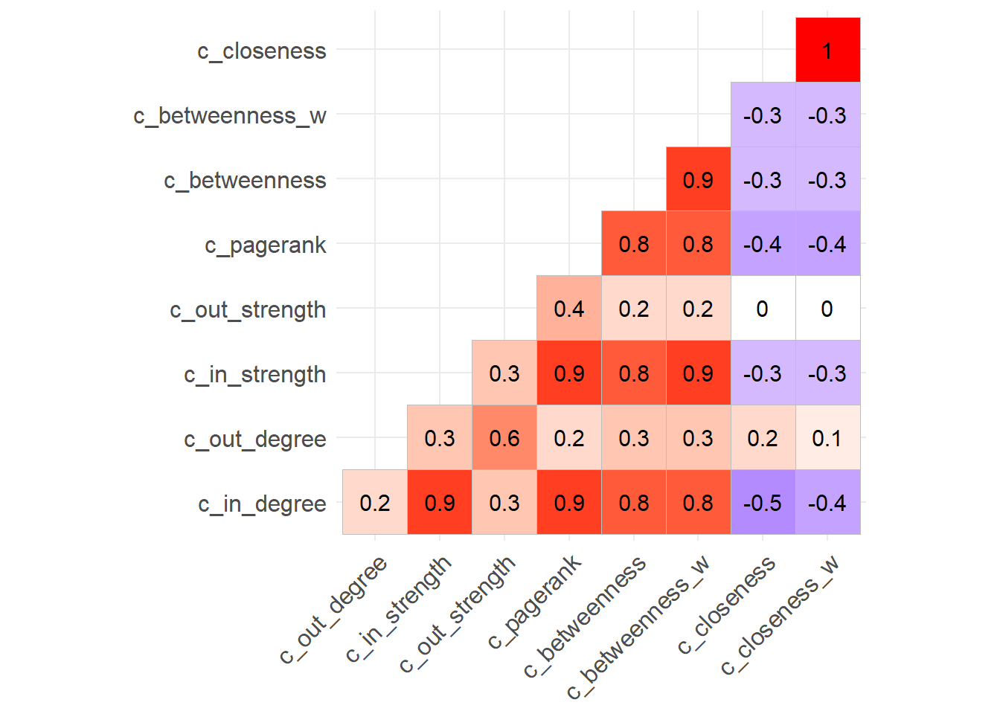

Por último, graficamos algunas medidas de centralidad:


```r
##PageRank

ggplot(data = tg_copatrocinio_arg_centr14c %>% 
         as_tibble(), 
       aes(x = d_metropolitano, y = c_pagerank)) +
  geom_boxplot() + 
  labs(x = "Metropolitano",
       y = "PageRank",
       title = "PageRank por área")


## Betweenness

ggplot(data = tg_copatrocinio_arg_centr14c %>% 
         as_tibble(), 
       aes(x = d_metropolitano, y = c_betweenness)) +
  geom_boxplot() + 
  labs(x = "Metropolitano",
       y = "Betweenness",
       title = "Betweenness por área")
```

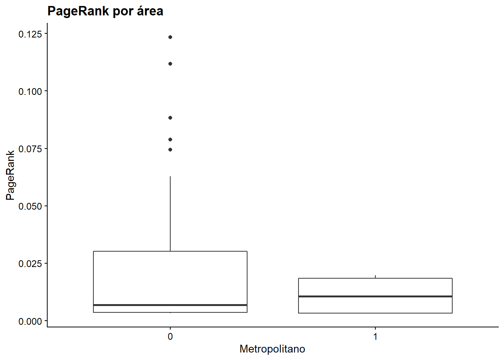

## Capítulo 15: Análisis de componentes principales {-}

#### Paquetes y carga de datos {-}


```r
library(tidyverse)
library(paqueteadp)
## install.packages("FactoMineR")
library(FactoMineR)
## install.packages("factoextra")
library(factoextra)
library(GGally)
library(ggcorrplot)
library(skimr)

data("lapop")
```


#### Ejercicio 15A {-}

> Asumamos que se te pide que midas la valoración del autoritarismo en América Latina. ¿Cómo medirías este concepto? Elije 5 o más preguntas de la encuesta LAPOP (puedes consultar el libro de códigos [aquí](https://www.vanderbilt.edu/lapop/ab2016/AB2017-v18.0-Spa-170202_W.pdf)) que usarías para medir el antiamericanismo.

*Nota: ocuparemos algunas de las variables que se vieron a lo largo del capítulo en los ejercicios* 

Algunas preguntas que podrían servir para medir la valoración del autoritarismo:

| Código variable | Pregunta | Medición | 
| --- | --- | --- | 
| **JC10** | Alguna gente dice que en ciertas circunstancias se justificaría que los militares de este país tomen el poder por un golpe de Estado. En su opinión se justificaría que hubiera un golpe de estado por los militares frente a mucha delincuencia | Variable dicotómica |
| **JC13** |  Alguna gente dice que en ciertas circunstancias se justificaría que los militares de este país tomen el poder por un golpe de Estado. En su opinión se justificaría que hubiera un golpe de estado por los militares frente a mucha corrupción | Variable dicotómica |
| **JC15A** | ¿Cree usted que cuando el país enfrenta momentos muy difíciles, se justifica que el presidente del país cierre el Congreso/Asamblea y gobierne sin Congreso/Asamblea? | Variable dicotómica |
| **B12** | ¿Hasta qué punto tiene confianza usted en las Fuerzas Armadas o Ejército? | Escala de 1 a 7, donde 1 es *nada* y 7 *mucho* | 
| **B18** | ¿Hasta qué punto tiene confianza usted en la Policía Nacional? | Escala de 1 a 7, donde 1 es *nada* y 7 *mucho* | 
| **B47A** | ¿Hasta qué punto tiene usted confianza en las elecciones en este país? | Escala de 1 a 7, donde 1 es *nada* y 7 *mucho* | 
| **ING4** | Puede que la democracia tenga problemas, pero es mejor que cualquier otra forma de gobierno. ¿Hasta qué punto está de acuerdo o en desacuerdo con esta frase? | Escala de 1 a 7, donde el número 1 representa “muy en desacuerdo” y el número 7 representa “muy de acuerdo” |
| **PN4** |  En general, ¿usted diría que está muy satisfecho(a), satisfecho(a), insatisfecho(a) o muy insatisfecho(a) con la forma en que la democracia funciona en su país? | Escala del 1 al 4, en donde 1 es Muy satisfecho(a) y 4 Muy insatisfecho(a) |
| **L1** |  Según el sentido que tengan para usted los términos "izquierda" y "derecha" cuando piensa sobre su punto de vista político, ¿dónde se encontraría usted en esta escala? | Escala del 1 al 10, donde 1 es izquierda y 10 derecha | 

Para crear nuestro índice de valorización del autoritarismo ocuparemos las variables *jc15a*, *b12*, *b18*, *ing4* y *l1* pero tú puedes elegir las que te parezcan más apropiadas1


#### Ejercicio 15B {-}

> Estandariza y omite las NAs de las preguntas que elegiste en la primera parte para el sentimiento antiamericano.  
>
> Realiza un Análisis de Componentes Principales y responde las siguientes preguntas: 
>
> - ¿Cuáles son los componentes más importantes?  
>
> - ¿Qué variables los componen?  
>
> -  ¿Qué dimensiones están involucradas en el concepto de valorización del autoritarismo que estás realizando?


```r
skim(lapop)
```


Table: (\#tab:unnamed-chunk-177)Data summary

|                         |      |
|:------------------------|:-----|
|Name                     |lapop |
|Number of rows           |7655  |
|Number of columns        |14    |
|_______________________  |      |
|Column type frequency:   |      |
|character                |1     |
|numeric                  |13    |
|________________________ |      |
|Group variables          |None  |


**Variable type: character**

|skim_variable | n_missing| complete_rate| min| max| empty| n_unique| whitespace|
|:-------------|---------:|-------------:|---:|---:|-----:|--------:|----------:|
|pais_nombre   |         0|             1|   4|   9|     0|       10|          0|


**Variable type: numeric**

|skim_variable         | n_missing| complete_rate|    mean|      sd| p0|  p25|  p50|  p75| p100|hist                                     |
|:---------------------|---------:|-------------:|-------:|-------:|--:|----:|----:|----:|----:|:----------------------------------------|
|id                    |         0|             1| 3828.00| 2209.95|  1| 1914| 3828| 5742| 7655|▇▇▇▇▇ |
|justifica_golpe       |         0|             1|    0.38|    0.49|  0|    0|    0|    1|    1|▇▁▁▁▅ |
|justifica_cierre_cong |         0|             1|    0.21|    0.41|  0|    0|    0|    0|    1|▇▁▁▁▂ |
|conf_cortes           |         0|             1|    3.27|    1.58|  1|    2|    3|    4|    7|▇▆▅▃▂ |
|conf_instit           |         0|             1|    4.40|    1.92|  1|    3|    5|    6|    7|▅▃▅▅▇ |
|conf_congreso         |         0|             1|    3.44|    1.84|  1|    2|    3|    5|    7|▇▃▅▃▃ |
|conf_presidente       |         0|             1|    3.30|    2.05|  1|    1|    3|    5|    7|▇▂▂▂▃ |
|conf_partidos         |         0|             1|    2.65|    1.65|  1|    1|    2|    4|    7|▇▂▂▁▁ |
|conf_medios           |         0|             1|    4.26|    1.80|  1|    3|    4|    6|    7|▆▃▆▆▇ |
|conf_elecciones       |         0|             1|    3.87|    1.91|  1|    2|    4|    5|    7|▇▅▆▅▆ |
|satisfecho_dem        |         0|             1|    0.38|    0.48|  0|    0|    0|    1|    1|▇▁▁▁▅ |
|voto_opositor         |         0|             1|    6.07|    2.73|  1|    4|    6|    8|   10|▃▅▇▆▆ |
|manifestaciones       |         0|             1|    6.66|    2.74|  1|    5|    7|    9|   10|▂▃▆▆▇ |

Vamos a descargar la base desde la [página oficial](http://datasets.americasbarometer.org/database/login.php) y elegiremos la primera opción: 


Luego guardamos el archivo y lo extraemos en la carpeta donde estemos trabajando. 


```r
library(janitor)
```

*Nota*: Si te costó mucho cargar el dataset tenemos una versión mas acotada. De aquí en adelante puedes ocupar la base `lapop2` que se encuentra en el `paqueteadp`. 


```r
lapop2 <- read_csv("00-archivos/ejercicios/capitulo 15/lapop2.csv")

## data("lapop2")
```

La base `lapop2` contiene las siguientes variables, puedes ver lo que mide cada una en la respuesta del ejercicio 15A: 

| Variable | Código original | 
| --- | --- |
| pos_ideologica | l1 | 
| conf_ffaa | b12 | 
| conf_policia | b18 | 
| conf_elecciones | b47a |
| satisfaccion_dem | pn4 |
| preferencia_dem | ing4 | 
| justifica_golpe_delincuencia | jc10 | 
| justifica_golpe_corrupcion | jc13 |
| justifica_cierre_cong | jc15a | 

Ahora si pasemos a quitar los NA de nuestra base: 


```r
## Primero seleccionamos las variables de nuestro interés:

lapop2_num <- lapop2 %>% 
  select(pos_ideologica, 
         conf_ffaa, 
         conf_policia, 
         preferencia_dem,
         justifica_cierre_cong) %>%  
  mutate_all(as.numeric)

lapop2_num <- lapop2_num %>% 
  scale() %>% 
  na.omit() %>% 
  as_tibble()
```

Primero veamos las correlaciones entre las variables elegidas:


```r
corr_lapop2 <- lapop2_num %>% 
  cor(use = "pairwise") %>% 
  round(1)
  
ggcorrplot(corr_lapop2, type = "lower", lab = T, show.legend = F)
```

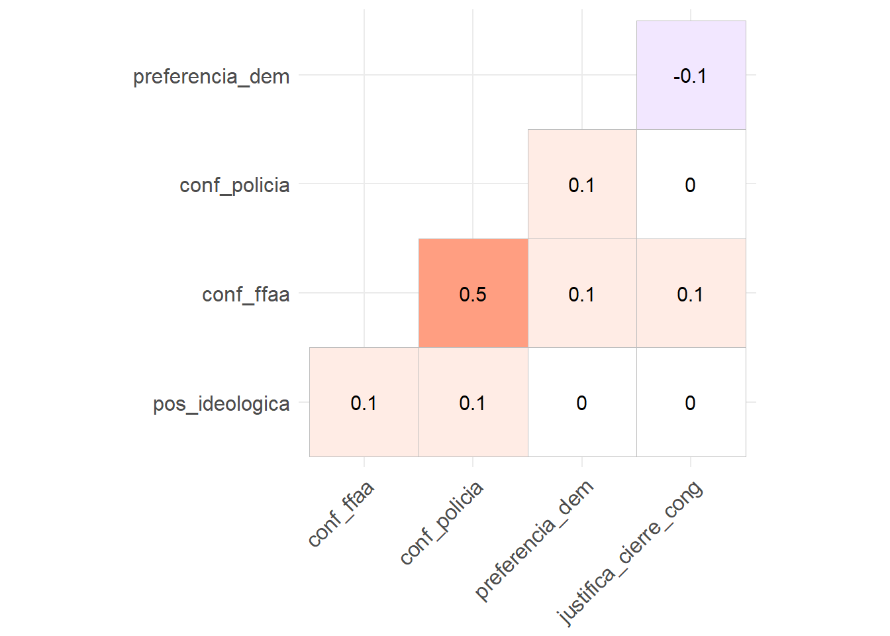

Salta a la vista que las variables con mayor correlación son aquellas referentes a la confianza en las FFAA y la policía nacional. También hay una correlación negativa entre aquellos que prefieren la democracia y quienes justifican un cierre del congreso a manos del presidente. 

Ahora creamos el PCA:


```r
pca_15b <- princomp(lapop2_num)

summary(pca_15b, loadings = T, cutoff = 0.3)
## Importance of components:
##                        Comp.1 Comp.2 Comp.3 Comp.4 Comp.5
## Standard deviation        1.2   1.05   0.98   0.93   0.71
## Proportion of Variance    0.3   0.22   0.19   0.17   0.10
## Cumulative Proportion     0.3   0.53   0.72   0.90   1.00
## 
## Loadings:
##                       Comp.1 Comp.2 Comp.3 Comp.4 Comp.5
## pos_ideologica                       0.966              
## conf_ffaa              0.653                       0.692
## conf_policia           0.672                      -0.708
## preferencia_dem               0.587        -0.761       
##  [ reached getOption("max.print") -- omitted 1 row ]

eig_val <- get_eigenvalue(pca_15b)
eig_val
##       eigenvalue variance.percent cumulative.variance.percent
## Dim.1       1.50               30                          30
## Dim.2       1.11               22                          53
## Dim.3       0.95               19                          72
## Dim.4       0.86               17                          90
## Dim.5       0.51               10                         100
```

Según lo anterior nos quedaríamos con el primer y segundo componente. 

Ahora para saber qué variables los componentes ocupamos los siguientes comandos: 


```r
fviz_pca_biplot(pca_15b, repel = F, col.var = "black", col.ind = "gray")

fviz_contrib(pca_15b, choice = "var", axes = 1, top = 10)
fviz_contrib(pca_15b, choice = "var", axes = 2, top = 10)
```

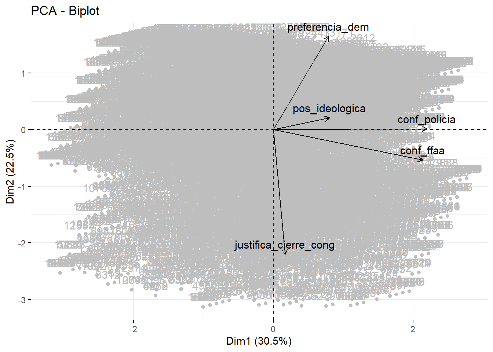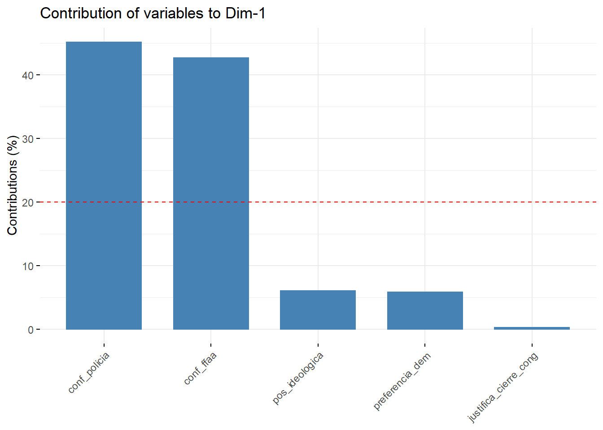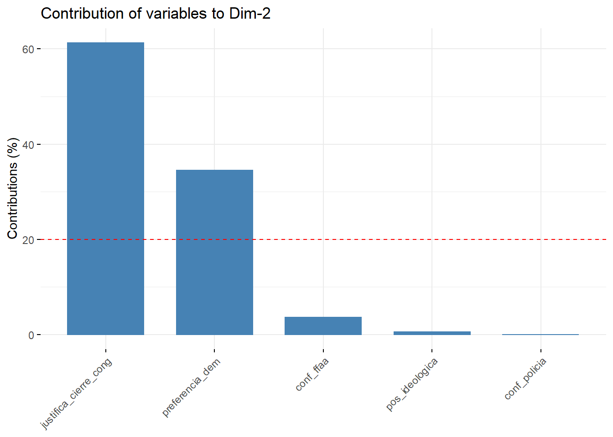

Para el primer componente las variables que más aportan son la confianza en la policía y en las Fuerzas Armadas. Para el segundo son si se justifica el cierre del congreso y la preferencia por la democracia. 

Respecto a las dimensiones medidas, el primer componente se relaciona más con la confianza en las fuerzas del orden y armadas, mientras que el segundo está mas relacionado con los sentimientos hacia las instituciones políticas y la percepción de la democracia. 

#### Ejercicio 15C {-}

> Utilizando el índice de confianza en la democracia en América Latina que acabamos de crear, analiza con modelos de regresión lineal qué variables tienen un alto poder explicativo sobre esta variable, son las variables de ideología, ingresos o edad importantes?

En primer lugar hacemos las modificaciones que se vieron durante el capítulo: 


```r
data("lapop")

## Creamos la media de confianza en elecciones por país

lapop <- lapop %>% 
  group_by(pais_nombre) %>% 
  mutate(conf_elecciones_prom = mean(conf_elecciones)) %>% 
  ungroup()

## Modificamos las variables para que sean numéricas

lapop_num <- lapop %>% 
  select(justifica_golpe, justifica_cierre_cong, conf_cortes, conf_instit, conf_congreso,
         conf_presidente, conf_partidos, conf_medios, conf_elecciones, satisfecho_dem, 
         voto_opositor, manifestaciones) %>% 
  mutate_all(as.numeric)

## y quitamos los valores perdidos

lapop_num <- lapop_num %>% 
  scale() %>% 
  na.omit() %>% 
  as_tibble()


## Generamos valores PCA

pca <- princomp(lapop_num)
summary(pca, loadings = T, cutoff = 0.3)
## Importance of components:
##                        Comp.1 Comp.2 Comp.3 Comp.4 Comp.5 Comp.6 Comp.7
## Standard deviation       1.86   1.22   1.11  0.976  0.893  0.882  0.827
##                        Comp.8 Comp.9 Comp.10 Comp.11 Comp.12
## Standard deviation      0.800  0.750   0.725   0.686   0.657
##  [ reached getOption("max.print") -- omitted 2 rows ]
## 
## Loadings:
##                       Comp.1 Comp.2 Comp.3 Comp.4 Comp.5 Comp.6 Comp.7
## justifica_golpe                      0.693                0.501       
##                       Comp.8 Comp.9 Comp.10 Comp.11 Comp.12
## justifica_golpe               0.304                        
##  [ reached getOption("max.print") -- omitted 11 rows ]

pca_1 <- PCA(lapop_num, graph = F)


## Obtenemos los Eigenvalores

eig <- get_eigenvalue(pca)

eig_1 <- get_eig(pca_1)


## Añadimos los valores de PCA a la base original

lapop <- bind_cols(lapop, as_tibble(pca$scores))

data_pca <- pca_1$ind$coord%>%
 as_tibble() %>%
 mutate(pca_01 = (Dim.1 * 28.7 + Dim.2 * 12.3 + Dim.3 * 10.3 + 
                    Dim.4 * 7.9) / 60)

lapop <- bind_cols(lapop, data_pca %>% select(pca_01))


## Por último reescalamos el índice de democracia

lapop <- lapop %>%
  mutate(democracy_index = GGally::rescale01(pca_01) * 100)%>%
  select(democracy_index, everything())

```

Teniendo el índice de democracia pasamos a crear un modelo de regresión. La variable dependiente en este caso sería `democracy_index`


```r
modelo_15c <- lm(democracy_index ~ justifica_golpe + justifica_cierre_cong +
                   conf_cortes + conf_instit + conf_congreso +
                   conf_presidente + conf_partidos + conf_medios + conf_elecciones +
                   satisfecho_dem + voto_opositor + manifestaciones,
                 data = lapop)

library(texreg)

screenreg(modelo_15c)
## 
## ==================================
##                        Model 1    
## ----------------------------------
## (Intercept)             -13.28 ***
##                          (0.00)   
## justifica_golpe           1.35 ***
##                          (0.00)   
## justifica_cierre_cong     5.88 ***
##                          (0.00)   
## conf_cortes               1.81 ***
##                          (0.00)   
## conf_instit               1.23 ***
##                          (0.00)   
## conf_congreso             1.41 ***
##                          (0.00)   
## conf_presidente           1.61 ***
##                          (0.00)   
## conf_partidos             1.96 ***
##                          (0.00)   
## conf_medios               0.94 ***
##                          (0.00)   
## conf_elecciones           1.91 ***
##                          (0.00)   
## satisfecho_dem            5.88 ***
##                          (0.00)   
## voto_opositor             1.26 ***
##                          (0.00)   
## manifestaciones           1.14 ***
##                          (0.00)   
## ----------------------------------
## R^2                       1.00    
## Adj. R^2                  1.00    
## Num. obs.              7655       
## ==================================
## *** p < 0.001; ** p < 0.01; * p < 0.05
```

## Capítulo 16: Mapas y datos espaciales {-}

#### Paquetes y carga de datos {-}


```r
library(tidyverse)
library(paqueteadp)
## install.packages("sf")
library(sf)
library(ggrepel)
library(gridExtra)
## install.packages("devtools")
library(devtools)
## install.packages("cli")
library(cli)
## install_github("ropensci/rnaturalearthhires")    # para instalar rnaturalearthhires
library(rnaturalearthhires)
## install.packages("spdep")
library(spdep)
```


#### Ejercicio 16A {-}

> 1. Descarga el shapefile de Sudamérica de [ArcGIS](https://www.arcgis.com/home/item.html?id=d3d2bae5413845b193d038e4912d3da9) y cárgalo en R usando `read_sf()`. Selecciona sólo las variables “CNTRY_NAME”, “ISO_3DIGIT” y “geometry”.

Primero descargamos el shapefile, haciendo clic en el botón de "Descargar", como se ve en la imagen


Luego lo cargamos en R y seleccionamos las variables de interés:


```r
shp_sudamerica <- read_sf("00-archivos/ejercicios/capitulo 16/SouthAmerica/SouthAmerica.shp")

shp_sudamerica <- shp_sudamerica %>% 
  select(CNTRY_NAME, ISO_3DIGIT, geometry)
```


> 2. Filtra la base de datos por la variable ‘CNTRY_NAME’ para eliminar las observaciones de “South Georgia & the South Sandwich Is.” y “Falkland Is.”.


```r
shp_sudamerica <- shp_sudamerica %>% 
  filter(CNTRY_NAME != "South Georgia & the South Sandwich Is." & CNTRY_NAME != "Falkland Is.")

shp_sudamerica
## Simple feature collection with 13 features and 2 fields
## geometry type:  MULTIPOLYGON
## dimension:      XY
## bbox:           xmin: -1e+07 ymin: -7500000 xmax: -3900000 ymax: 1400000
## projected CRS:  Sphere_Mercator
## # A tibble: 13 x 3
##   CNTRY_NAME   ISO_3DIGIT                                        geometry
## * <chr>        <chr>                                   <MULTIPOLYGON [m]>
## 1 French Guia~ GUF        (((-5747006 448950, -5820491 351265, -5848237 ~
## 2 Guyana       GUY        (((-6279248 216260, -6375021 219344, -6396829 ~
## 3 Suriname     SUR        (((-6279248 216260, -6302761 225413, -6360443 ~
## # ... with 10 more rows
```


> 3. Trazar el shapefile usando `ggplot()` y `geom_sf()`.


```r
ggplot(data = shp_sudamerica) +
  geom_sf()
```


#### Ejercicio 16B {-}

> 1. Selecciona los países del Cono Sur (Chile, Argentina y Uruguay) y grafícalos.


```r
shp_conosur <- shp_sudamerica %>% 
  filter(CNTRY_NAME == "Chile" | CNTRY_NAME == "Argentina" | CNTRY_NAME == "Uruguay")

ggplot(data = shp_conosur) +
  geom_sf() + 
  theme_bw()      #Podemos cambiar el tema de fondo
  
```


> 2. Genera un nuevo shapefile con las subregiones de América del Sur. Sugerimos lo siguiente:

> * Mar Caribe, correspondiente a Colombia, Venezuela, Surinam, Guayana y Guayana Francesa. 

> * Región Andina, correspondiente a Bolivia, Ecuador, Perú y Colombia. 

> * Región Oriental, correspondiente a Brasil y a Paraguay. 

> * Cono Sur, correspondiente a Chile, Argentina y Uruguay.  


Siguiendo las indicaciones creamos el nuevo shapefile con las nuevas subregiones:


```r

## Vemos cómo están escritos los nombres de los países para que no hayan errores al clasificarlos

shp_sudamerica$CNTRY_NAME
##  [1] "French Guiana" "Guyana"        "Suriname"      "Venezuela"    
##  [5] "Argentina"     "Bolivia"       "Brazil"        "Chile"        
##  [9] "Ecuador"       "Paraguay"      "Peru"          "Uruguay"      
## [13] "Colombia"

shp_subregiones <- shp_sudamerica %>%
  mutate(subregion = case_when(
    CNTRY_NAME %in% c("Colombia", 
                      "Venezuela", 
                      "Suriname", 
                      "Guyana", 
                      "French Guiana") ~ "Mar Caribe",
    CNTRY_NAME %in% c("Bolivia", 
                      "Ecuador", 
                      "Peru", 
                      "Colombia") ~ "Región Andina",
    CNTRY_NAME %in% c("Brazil", 
                      "Paraguay") ~ "Región Oriental",
    CNTRY_NAME %in% c("Chile", 
                      "Argentina", 
                      "Uruguay") ~ "Cono Sur"
  ))
```


> 3. Descarga la base de datos ampliada (‘Country-Year: V-Dem Full+Others’) de [V-Dem](https://www.v-dem.net/en/data/archive/previous-data/data-version-9/) y selecciona sólo las siguientes variables: ‘country_name’, ‘country_text_id’, ‘year’, ‘v2x_polyarchy’,’ e_migdppc’. Fíltralas para considerar sólo el período entre 1996 y 2016 (los últimos 20 años, para los que hay datos disponibles para todas las variables).


```r
v_dem <- read_rds("00-archivos/ejercicios/capitulo 16/V-Dem/V-Dem-CY-Full+Others-v9.rds")

v_dem_reducida <- v_dem %>% 
  select(country_name, country_text_id, year, v2x_polyarchy, e_migdppc) %>% 
  filter(year >= 1996 & year <= 2016)
```


> 4. Usando `left_join()`, añade el shapefile original a la base de datos cargada del ejercicio anterior. Consejo: utiliza los argumentos `by.x="ISO_3DIGIT"` y `by.y="country_text_id"`. Revisa la base de datos. Notarás que falta un país. ¿Cuál es?


```r
shp_sudamerica_data <- shp_sudamerica %>% 
  left_join(v_dem_reducida,
            by = c("ISO_3DIGIT" = "country_text_id"))

head(shp_sudamerica_data)
## Simple feature collection with 6 features and 6 fields
## geometry type:  MULTIPOLYGON
## dimension:      XY
## bbox:           xmin: -6800000 ymin: 130000 xmax: -5700000 ymax: 950000
## projected CRS:  Sphere_Mercator
## # A tibble: 6 x 7
##   CNTRY_NAME ISO_3DIGIT                  geometry country_name  year
##   <chr>      <chr>             <MULTIPOLYGON [m]> <chr>        <dbl>
## 1 French Gu~ GUF        (((-5747006 448950, -582~ <NA>            NA
## 2 Guyana     GUY        (((-6279248 216260, -637~ Guyana        1996
## 3 Guyana     GUY        (((-6279248 216260, -637~ Guyana        1997
## # ... with 3 more rows, and 2 more variables

unique(shp_sudamerica_data$CNTRY_NAME)
##  [1] "French Guiana" "Guyana"        "Suriname"      "Venezuela"    
##  [5] "Argentina"     "Bolivia"       "Brazil"        "Chile"        
##  [9] "Ecuador"       "Paraguay"      "Peru"          "Uruguay"      
## [13] "Colombia"
```


#### Ejercicio 16C {-}

> 1. Generar centroides para los países (Tip: usar `CNTRY_NAME`).


```r
shp_sudamerica_16c <- shp_sudamerica %>% 
  mutate(centroid = map(geometry, st_centroid), 
    coords = map(centroid, st_coordinates), coords_x = map_dbl(coords, 1), 
    coords_y = map_dbl(coords, 2))


ggplot(data = shp_sudamerica_16c) +
  geom_sf()+
  geom_text_repel(mapping = aes(coords_x, coords_y, label = CNTRY_NAME), 
                  size = 4, min.segment.length = 0)+
  labs(x = "", y = "")
```


> 2. Generar un mapa usando el argumento `fill` de `ggplot()` para usar un color diferente para cada país.


```r

## Mapa simple, sin ningún tema

ggplot(data = shp_sudamerica_16c) +
  geom_sf(aes(fill = CNTRY_NAME)) +
  labs(x = "", 
       y = "",
       fill = "")    # Le quitamos la etiqueta de la leyenda del argumento  `fill`

## Mapa con tema de `ggthemes`

library(maps)
library(ggthemes)

ggplot(data = shp_sudamerica_16c) +
  geom_sf(aes(fill = CNTRY_NAME)) +
  labs(x = "", 
       y = "",
       fill = "") + 
  theme_map()
```


El paquete `ggthemes` tiene muchos fondos y temas que son compatibles con gráficos creados con ggplot. Puedes explorar más en este [link](https://yutannihilation.github.io/allYourFigureAreBelongToUs/ggthemes/).


> 3. Grafique un mapa combinando los atributos de los dos ejercicios anteriores.

Ahora creamos un mapa con etiquetas para los distintos países en conjunto con diferentes colores:


```r
## Mapa con `geom_text_repel`

ggplot(data = shp_sudamerica_16c) +
  geom_sf(aes(fill = CNTRY_NAME)) +
  geom_text_repel(mapping = aes(coords_x, 
                                coords_y, 
                                label = CNTRY_NAME), 
                  size = 4, 
                  min.segment.length = 0)+
  labs(x = "", 
       y = "",
       fill = "") + 
  theme_bw()

## Mapa con `geom_label_repel`

ggplot(data = shp_sudamerica_16c) +
  geom_sf(aes(fill = CNTRY_NAME),
          show.legend = FALSE) +            # Le quitamos la leyenda del significado de `fill`
  geom_label_repel(mapping = aes(coords_x, 
                                 coords_y, 
                                 label = CNTRY_NAME), 
                  size = 3, 
                  min.segment.length = 0)+
  labs(x = "", 
       y = "",
       fill = "") + 
  theme_bw()

```


> 4. Crear un mapa con el PIB per cápita (`e_migdppc`) de cada país en el año 2016. ¿Cuáles son los países que no tienen datos para el 2016?


```r
## Primero revisamos nuestros datos:

shp_sudamerica_data %>% 
  filter(year == 2016) %>% 
  dplyr::select(CNTRY_NAME, e_migdppc)
## Simple feature collection with 12 features and 2 fields
## geometry type:  MULTIPOLYGON
## dimension:      XY
## bbox:           xmin: -1e+07 ymin: -7500000 xmax: -3900000 ymax: 1400000
## projected CRS:  Sphere_Mercator
## # A tibble: 12 x 3
##   CNTRY_NAME e_migdppc                                           geometry
##   <chr>          <dbl>                                 <MULTIPOLYGON [m]>
## 1 Guyana            NA (((-6279248 216260, -6375021 219344, -6396829 190~
## 2 Suriname          NA (((-6279248 216260, -6302761 225413, -6360443 314~
## 3 Venezuela      13159 (((-7e+06 1134769, -7e+06 1129739, -7e+06 1129492~
## # ... with 9 more rows
```

Guayana y Surinam son los países que no tienen información sobre el PIB per cápita para el año 2016. 


```r

ggplot(data = shp_sudamerica_data %>% 
         filter(year == 2016)) +
  geom_sf(aes(fill = e_migdppc)) +      
  labs(x = "", 
       y = "",
       fill = "PIB p/c") + 
  theme_bw()

```


> 5. Crear una tabla con el valor de Democracia (`v2x_polyarchy`) de cada país en los años 2013, 2014, 2015 y 2016.


```r

## Primero seleccionamos los datos que nos interesan

datos_16c <- shp_sudamerica_data %>% 
  filter(year <= 2016 & year >= 2013) %>% 
  dplyr::select(CNTRY_NAME, year, v2x_polyarchy) %>% 
  arrange(CNTRY_NAME)                                  # Ordenamos por nombre del país

datos_16c
## Simple feature collection with 48 features and 3 fields
## geometry type:  MULTIPOLYGON
## dimension:      XY
## bbox:           xmin: -1e+07 ymin: -7500000 xmax: -3900000 ymax: 1400000
## projected CRS:  Sphere_Mercator
## # A tibble: 48 x 4
##   CNTRY_NAME  year v2x_polyarchy                                 geometry
##   <chr>      <dbl>         <dbl>                       <MULTIPOLYGON [m]>
## 1 Argentina   2013         0.778 (((-8e+06 -5438740, -8e+06 -5422816, -8~
## 2 Argentina   2014         0.792 (((-8e+06 -5438740, -8e+06 -5422816, -8~
## 3 Argentina   2015         0.811 (((-8e+06 -5438740, -8e+06 -5422816, -8~
## # ... with 45 more rows
```

Notamos que la última columna contiene la información de las geometrías. No queremos incluirla en nuestra tabla, por lo que tendremos que eliminar esta columna. 

Para crear la tabla ocuparemos los paquetes `knitr` y `kableExtra`, que funcionan muy bien con `RMarkdown` para hacer tablas simples.


```r
library(knitr)
##install.packages("kableExtra")
library(kableExtra)

kable(datos_16c)
```

<table>
 <thead>
  <tr>
   <th style="text-align:left;"> CNTRY_NAME </th>
   <th style="text-align:right;"> year </th>
   <th style="text-align:right;"> v2x_polyarchy </th>
   <th style="text-align:left;"> geometry </th>
  </tr>
 </thead>
<tbody>
  <tr>
   <td style="text-align:left;"> Argentina </td>
   <td style="text-align:right;"> 2013 </td>
   <td style="text-align:right;"> 0.78 </td>
   <td style="text-align:left;"> MULTIPOLYGON (((-8e+06 -543... </td>
  </tr>
  <tr>
   <td style="text-align:left;"> Argentina </td>
   <td style="text-align:right;"> 2014 </td>
   <td style="text-align:right;"> 0.79 </td>
   <td style="text-align:left;"> MULTIPOLYGON (((-8e+06 -543... </td>
  </tr>
  <tr>
   <td style="text-align:left;"> Argentina </td>
   <td style="text-align:right;"> 2015 </td>
   <td style="text-align:right;"> 0.81 </td>
   <td style="text-align:left;"> MULTIPOLYGON (((-8e+06 -543... </td>
  </tr>
  <tr>
   <td style="text-align:left;"> Argentina </td>
   <td style="text-align:right;"> 2016 </td>
   <td style="text-align:right;"> 0.78 </td>
   <td style="text-align:left;"> MULTIPOLYGON (((-8e+06 -543... </td>
  </tr>
  <tr>
   <td style="text-align:left;"> Bolivia </td>
   <td style="text-align:right;"> 2013 </td>
   <td style="text-align:right;"> 0.66 </td>
   <td style="text-align:left;"> MULTIPOLYGON (((-7728017 -2... </td>
  </tr>
  <tr>
   <td style="text-align:left;"> Bolivia </td>
   <td style="text-align:right;"> 2014 </td>
   <td style="text-align:right;"> 0.65 </td>
   <td style="text-align:left;"> MULTIPOLYGON (((-7728017 -2... </td>
  </tr>
  <tr>
   <td style="text-align:left;"> Bolivia </td>
   <td style="text-align:right;"> 2015 </td>
   <td style="text-align:right;"> 0.63 </td>
   <td style="text-align:left;"> MULTIPOLYGON (((-7728017 -2... </td>
  </tr>
  <tr>
   <td style="text-align:left;"> Bolivia </td>
   <td style="text-align:right;"> 2016 </td>
   <td style="text-align:right;"> 0.65 </td>
   <td style="text-align:left;"> MULTIPOLYGON (((-7728017 -2... </td>
  </tr>
  <tr>
   <td style="text-align:left;"> Brazil </td>
   <td style="text-align:right;"> 2013 </td>
   <td style="text-align:right;"> 0.89 </td>
   <td style="text-align:left;"> MULTIPOLYGON (((-5e+06 -2e+... </td>
  </tr>
  <tr>
   <td style="text-align:left;"> Brazil </td>
   <td style="text-align:right;"> 2014 </td>
   <td style="text-align:right;"> 0.89 </td>
   <td style="text-align:left;"> MULTIPOLYGON (((-5e+06 -2e+... </td>
  </tr>
  <tr>
   <td style="text-align:left;"> Brazil </td>
   <td style="text-align:right;"> 2015 </td>
   <td style="text-align:right;"> 0.87 </td>
   <td style="text-align:left;"> MULTIPOLYGON (((-5e+06 -2e+... </td>
  </tr>
  <tr>
   <td style="text-align:left;"> Brazil </td>
   <td style="text-align:right;"> 2016 </td>
   <td style="text-align:right;"> 0.81 </td>
   <td style="text-align:left;"> MULTIPOLYGON (((-5e+06 -2e+... </td>
  </tr>
  <tr>
   <td style="text-align:left;"> Chile </td>
   <td style="text-align:right;"> 2013 </td>
   <td style="text-align:right;"> 0.90 </td>
   <td style="text-align:left;"> MULTIPOLYGON (((-8246122 -5... </td>
  </tr>
  <tr>
   <td style="text-align:left;"> Chile </td>
   <td style="text-align:right;"> 2014 </td>
   <td style="text-align:right;"> 0.90 </td>
   <td style="text-align:left;"> MULTIPOLYGON (((-8246122 -5... </td>
  </tr>
  <tr>
   <td style="text-align:left;"> Chile </td>
   <td style="text-align:right;"> 2015 </td>
   <td style="text-align:right;"> 0.87 </td>
   <td style="text-align:left;"> MULTIPOLYGON (((-8246122 -5... </td>
  </tr>
  <tr>
   <td style="text-align:left;"> Chile </td>
   <td style="text-align:right;"> 2016 </td>
   <td style="text-align:right;"> 0.86 </td>
   <td style="text-align:left;"> MULTIPOLYGON (((-8246122 -5... </td>
  </tr>
  <tr>
   <td style="text-align:left;"> Colombia </td>
   <td style="text-align:right;"> 2013 </td>
   <td style="text-align:right;"> 0.64 </td>
   <td style="text-align:left;"> MULTIPOLYGON (((-8371404 -1... </td>
  </tr>
  <tr>
   <td style="text-align:left;"> Colombia </td>
   <td style="text-align:right;"> 2014 </td>
   <td style="text-align:right;"> 0.66 </td>
   <td style="text-align:left;"> MULTIPOLYGON (((-8371404 -1... </td>
  </tr>
  <tr>
   <td style="text-align:left;"> Colombia </td>
   <td style="text-align:right;"> 2015 </td>
   <td style="text-align:right;"> 0.65 </td>
   <td style="text-align:left;"> MULTIPOLYGON (((-8371404 -1... </td>
  </tr>
  <tr>
   <td style="text-align:left;"> Colombia </td>
   <td style="text-align:right;"> 2016 </td>
   <td style="text-align:right;"> 0.69 </td>
   <td style="text-align:left;"> MULTIPOLYGON (((-8371404 -1... </td>
  </tr>
  <tr>
   <td style="text-align:left;"> Ecuador </td>
   <td style="text-align:right;"> 2013 </td>
   <td style="text-align:right;"> 0.63 </td>
   <td style="text-align:left;"> MULTIPOLYGON (((-8763241 15... </td>
  </tr>
  <tr>
   <td style="text-align:left;"> Ecuador </td>
   <td style="text-align:right;"> 2014 </td>
   <td style="text-align:right;"> 0.62 </td>
   <td style="text-align:left;"> MULTIPOLYGON (((-8763241 15... </td>
  </tr>
  <tr>
   <td style="text-align:left;"> Ecuador </td>
   <td style="text-align:right;"> 2015 </td>
   <td style="text-align:right;"> 0.60 </td>
   <td style="text-align:left;"> MULTIPOLYGON (((-8763241 15... </td>
  </tr>
  <tr>
   <td style="text-align:left;"> Ecuador </td>
   <td style="text-align:right;"> 2016 </td>
   <td style="text-align:right;"> 0.58 </td>
   <td style="text-align:left;"> MULTIPOLYGON (((-8763241 15... </td>
  </tr>
  <tr>
   <td style="text-align:left;"> Guyana </td>
   <td style="text-align:right;"> 2013 </td>
   <td style="text-align:right;"> 0.57 </td>
   <td style="text-align:left;"> MULTIPOLYGON (((-6279248 21... </td>
  </tr>
  <tr>
   <td style="text-align:left;"> Guyana </td>
   <td style="text-align:right;"> 2014 </td>
   <td style="text-align:right;"> 0.55 </td>
   <td style="text-align:left;"> MULTIPOLYGON (((-6279248 21... </td>
  </tr>
  <tr>
   <td style="text-align:left;"> Guyana </td>
   <td style="text-align:right;"> 2015 </td>
   <td style="text-align:right;"> 0.56 </td>
   <td style="text-align:left;"> MULTIPOLYGON (((-6279248 21... </td>
  </tr>
  <tr>
   <td style="text-align:left;"> Guyana </td>
   <td style="text-align:right;"> 2016 </td>
   <td style="text-align:right;"> 0.60 </td>
   <td style="text-align:left;"> MULTIPOLYGON (((-6279248 21... </td>
  </tr>
  <tr>
   <td style="text-align:left;"> Paraguay </td>
   <td style="text-align:right;"> 2013 </td>
   <td style="text-align:right;"> 0.60 </td>
   <td style="text-align:left;"> MULTIPOLYGON (((-7e+06 -253... </td>
  </tr>
  <tr>
   <td style="text-align:left;"> Paraguay </td>
   <td style="text-align:right;"> 2014 </td>
   <td style="text-align:right;"> 0.60 </td>
   <td style="text-align:left;"> MULTIPOLYGON (((-7e+06 -253... </td>
  </tr>
  <tr>
   <td style="text-align:left;"> Paraguay </td>
   <td style="text-align:right;"> 2015 </td>
   <td style="text-align:right;"> 0.62 </td>
   <td style="text-align:left;"> MULTIPOLYGON (((-7e+06 -253... </td>
  </tr>
  <tr>
   <td style="text-align:left;"> Paraguay </td>
   <td style="text-align:right;"> 2016 </td>
   <td style="text-align:right;"> 0.62 </td>
   <td style="text-align:left;"> MULTIPOLYGON (((-7e+06 -253... </td>
  </tr>
  <tr>
   <td style="text-align:left;"> Peru </td>
   <td style="text-align:right;"> 2013 </td>
   <td style="text-align:right;"> 0.79 </td>
   <td style="text-align:left;"> MULTIPOLYGON (((-7735554 -1... </td>
  </tr>
  <tr>
   <td style="text-align:left;"> Peru </td>
   <td style="text-align:right;"> 2014 </td>
   <td style="text-align:right;"> 0.78 </td>
   <td style="text-align:left;"> MULTIPOLYGON (((-7735554 -1... </td>
  </tr>
  <tr>
   <td style="text-align:left;"> Peru </td>
   <td style="text-align:right;"> 2015 </td>
   <td style="text-align:right;"> 0.78 </td>
   <td style="text-align:left;"> MULTIPOLYGON (((-7735554 -1... </td>
  </tr>
  <tr>
   <td style="text-align:left;"> Peru </td>
   <td style="text-align:right;"> 2016 </td>
   <td style="text-align:right;"> 0.77 </td>
   <td style="text-align:left;"> MULTIPOLYGON (((-7735554 -1... </td>
  </tr>
  <tr>
   <td style="text-align:left;"> Suriname </td>
   <td style="text-align:right;"> 2013 </td>
   <td style="text-align:right;"> 0.80 </td>
   <td style="text-align:left;"> MULTIPOLYGON (((-6279248 21... </td>
  </tr>
  <tr>
   <td style="text-align:left;"> Suriname </td>
   <td style="text-align:right;"> 2014 </td>
   <td style="text-align:right;"> 0.80 </td>
   <td style="text-align:left;"> MULTIPOLYGON (((-6279248 21... </td>
  </tr>
  <tr>
   <td style="text-align:left;"> Suriname </td>
   <td style="text-align:right;"> 2015 </td>
   <td style="text-align:right;"> 0.80 </td>
   <td style="text-align:left;"> MULTIPOLYGON (((-6279248 21... </td>
  </tr>
  <tr>
   <td style="text-align:left;"> Suriname </td>
   <td style="text-align:right;"> 2016 </td>
   <td style="text-align:right;"> 0.81 </td>
   <td style="text-align:left;"> MULTIPOLYGON (((-6279248 21... </td>
  </tr>
  <tr>
   <td style="text-align:left;"> Uruguay </td>
   <td style="text-align:right;"> 2013 </td>
   <td style="text-align:right;"> 0.90 </td>
   <td style="text-align:left;"> MULTIPOLYGON (((-5934951 -4... </td>
  </tr>
  <tr>
   <td style="text-align:left;"> Uruguay </td>
   <td style="text-align:right;"> 2014 </td>
   <td style="text-align:right;"> 0.90 </td>
   <td style="text-align:left;"> MULTIPOLYGON (((-5934951 -4... </td>
  </tr>
  <tr>
   <td style="text-align:left;"> Uruguay </td>
   <td style="text-align:right;"> 2015 </td>
   <td style="text-align:right;"> 0.85 </td>
   <td style="text-align:left;"> MULTIPOLYGON (((-5934951 -4... </td>
  </tr>
  <tr>
   <td style="text-align:left;"> Uruguay </td>
   <td style="text-align:right;"> 2016 </td>
   <td style="text-align:right;"> 0.87 </td>
   <td style="text-align:left;"> MULTIPOLYGON (((-5934951 -4... </td>
  </tr>
  <tr>
   <td style="text-align:left;"> Venezuela </td>
   <td style="text-align:right;"> 2013 </td>
   <td style="text-align:right;"> 0.36 </td>
   <td style="text-align:left;"> MULTIPOLYGON (((-7e+06 1134... </td>
  </tr>
  <tr>
   <td style="text-align:left;"> Venezuela </td>
   <td style="text-align:right;"> 2014 </td>
   <td style="text-align:right;"> 0.33 </td>
   <td style="text-align:left;"> MULTIPOLYGON (((-7e+06 1134... </td>
  </tr>
  <tr>
   <td style="text-align:left;"> Venezuela </td>
   <td style="text-align:right;"> 2015 </td>
   <td style="text-align:right;"> 0.31 </td>
   <td style="text-align:left;"> MULTIPOLYGON (((-7e+06 1134... </td>
  </tr>
  <tr>
   <td style="text-align:left;"> Venezuela </td>
   <td style="text-align:right;"> 2016 </td>
   <td style="text-align:right;"> 0.30 </td>
   <td style="text-align:left;"> MULTIPOLYGON (((-7e+06 1134... </td>
  </tr>
</tbody>
</table>

```r

## Le cambiamos los nombres a las columnas 

kable(datos_16c, col.names = c("Pais", "Año", "Democracia (V-Dem)", "Geometría"))
```

<table>
 <thead>
  <tr>
   <th style="text-align:left;"> Pais </th>
   <th style="text-align:right;"> Año </th>
   <th style="text-align:right;"> Democracia (V-Dem) </th>
   <th style="text-align:left;"> Geometría </th>
  </tr>
 </thead>
<tbody>
  <tr>
   <td style="text-align:left;"> Argentina </td>
   <td style="text-align:right;"> 2013 </td>
   <td style="text-align:right;"> 0.78 </td>
   <td style="text-align:left;"> MULTIPOLYGON (((-8e+06 -543... </td>
  </tr>
  <tr>
   <td style="text-align:left;"> Argentina </td>
   <td style="text-align:right;"> 2014 </td>
   <td style="text-align:right;"> 0.79 </td>
   <td style="text-align:left;"> MULTIPOLYGON (((-8e+06 -543... </td>
  </tr>
  <tr>
   <td style="text-align:left;"> Argentina </td>
   <td style="text-align:right;"> 2015 </td>
   <td style="text-align:right;"> 0.81 </td>
   <td style="text-align:left;"> MULTIPOLYGON (((-8e+06 -543... </td>
  </tr>
  <tr>
   <td style="text-align:left;"> Argentina </td>
   <td style="text-align:right;"> 2016 </td>
   <td style="text-align:right;"> 0.78 </td>
   <td style="text-align:left;"> MULTIPOLYGON (((-8e+06 -543... </td>
  </tr>
  <tr>
   <td style="text-align:left;"> Bolivia </td>
   <td style="text-align:right;"> 2013 </td>
   <td style="text-align:right;"> 0.66 </td>
   <td style="text-align:left;"> MULTIPOLYGON (((-7728017 -2... </td>
  </tr>
  <tr>
   <td style="text-align:left;"> Bolivia </td>
   <td style="text-align:right;"> 2014 </td>
   <td style="text-align:right;"> 0.65 </td>
   <td style="text-align:left;"> MULTIPOLYGON (((-7728017 -2... </td>
  </tr>
  <tr>
   <td style="text-align:left;"> Bolivia </td>
   <td style="text-align:right;"> 2015 </td>
   <td style="text-align:right;"> 0.63 </td>
   <td style="text-align:left;"> MULTIPOLYGON (((-7728017 -2... </td>
  </tr>
  <tr>
   <td style="text-align:left;"> Bolivia </td>
   <td style="text-align:right;"> 2016 </td>
   <td style="text-align:right;"> 0.65 </td>
   <td style="text-align:left;"> MULTIPOLYGON (((-7728017 -2... </td>
  </tr>
  <tr>
   <td style="text-align:left;"> Brazil </td>
   <td style="text-align:right;"> 2013 </td>
   <td style="text-align:right;"> 0.89 </td>
   <td style="text-align:left;"> MULTIPOLYGON (((-5e+06 -2e+... </td>
  </tr>
  <tr>
   <td style="text-align:left;"> Brazil </td>
   <td style="text-align:right;"> 2014 </td>
   <td style="text-align:right;"> 0.89 </td>
   <td style="text-align:left;"> MULTIPOLYGON (((-5e+06 -2e+... </td>
  </tr>
  <tr>
   <td style="text-align:left;"> Brazil </td>
   <td style="text-align:right;"> 2015 </td>
   <td style="text-align:right;"> 0.87 </td>
   <td style="text-align:left;"> MULTIPOLYGON (((-5e+06 -2e+... </td>
  </tr>
  <tr>
   <td style="text-align:left;"> Brazil </td>
   <td style="text-align:right;"> 2016 </td>
   <td style="text-align:right;"> 0.81 </td>
   <td style="text-align:left;"> MULTIPOLYGON (((-5e+06 -2e+... </td>
  </tr>
  <tr>
   <td style="text-align:left;"> Chile </td>
   <td style="text-align:right;"> 2013 </td>
   <td style="text-align:right;"> 0.90 </td>
   <td style="text-align:left;"> MULTIPOLYGON (((-8246122 -5... </td>
  </tr>
  <tr>
   <td style="text-align:left;"> Chile </td>
   <td style="text-align:right;"> 2014 </td>
   <td style="text-align:right;"> 0.90 </td>
   <td style="text-align:left;"> MULTIPOLYGON (((-8246122 -5... </td>
  </tr>
  <tr>
   <td style="text-align:left;"> Chile </td>
   <td style="text-align:right;"> 2015 </td>
   <td style="text-align:right;"> 0.87 </td>
   <td style="text-align:left;"> MULTIPOLYGON (((-8246122 -5... </td>
  </tr>
  <tr>
   <td style="text-align:left;"> Chile </td>
   <td style="text-align:right;"> 2016 </td>
   <td style="text-align:right;"> 0.86 </td>
   <td style="text-align:left;"> MULTIPOLYGON (((-8246122 -5... </td>
  </tr>
  <tr>
   <td style="text-align:left;"> Colombia </td>
   <td style="text-align:right;"> 2013 </td>
   <td style="text-align:right;"> 0.64 </td>
   <td style="text-align:left;"> MULTIPOLYGON (((-8371404 -1... </td>
  </tr>
  <tr>
   <td style="text-align:left;"> Colombia </td>
   <td style="text-align:right;"> 2014 </td>
   <td style="text-align:right;"> 0.66 </td>
   <td style="text-align:left;"> MULTIPOLYGON (((-8371404 -1... </td>
  </tr>
  <tr>
   <td style="text-align:left;"> Colombia </td>
   <td style="text-align:right;"> 2015 </td>
   <td style="text-align:right;"> 0.65 </td>
   <td style="text-align:left;"> MULTIPOLYGON (((-8371404 -1... </td>
  </tr>
  <tr>
   <td style="text-align:left;"> Colombia </td>
   <td style="text-align:right;"> 2016 </td>
   <td style="text-align:right;"> 0.69 </td>
   <td style="text-align:left;"> MULTIPOLYGON (((-8371404 -1... </td>
  </tr>
  <tr>
   <td style="text-align:left;"> Ecuador </td>
   <td style="text-align:right;"> 2013 </td>
   <td style="text-align:right;"> 0.63 </td>
   <td style="text-align:left;"> MULTIPOLYGON (((-8763241 15... </td>
  </tr>
  <tr>
   <td style="text-align:left;"> Ecuador </td>
   <td style="text-align:right;"> 2014 </td>
   <td style="text-align:right;"> 0.62 </td>
   <td style="text-align:left;"> MULTIPOLYGON (((-8763241 15... </td>
  </tr>
  <tr>
   <td style="text-align:left;"> Ecuador </td>
   <td style="text-align:right;"> 2015 </td>
   <td style="text-align:right;"> 0.60 </td>
   <td style="text-align:left;"> MULTIPOLYGON (((-8763241 15... </td>
  </tr>
  <tr>
   <td style="text-align:left;"> Ecuador </td>
   <td style="text-align:right;"> 2016 </td>
   <td style="text-align:right;"> 0.58 </td>
   <td style="text-align:left;"> MULTIPOLYGON (((-8763241 15... </td>
  </tr>
  <tr>
   <td style="text-align:left;"> Guyana </td>
   <td style="text-align:right;"> 2013 </td>
   <td style="text-align:right;"> 0.57 </td>
   <td style="text-align:left;"> MULTIPOLYGON (((-6279248 21... </td>
  </tr>
  <tr>
   <td style="text-align:left;"> Guyana </td>
   <td style="text-align:right;"> 2014 </td>
   <td style="text-align:right;"> 0.55 </td>
   <td style="text-align:left;"> MULTIPOLYGON (((-6279248 21... </td>
  </tr>
  <tr>
   <td style="text-align:left;"> Guyana </td>
   <td style="text-align:right;"> 2015 </td>
   <td style="text-align:right;"> 0.56 </td>
   <td style="text-align:left;"> MULTIPOLYGON (((-6279248 21... </td>
  </tr>
  <tr>
   <td style="text-align:left;"> Guyana </td>
   <td style="text-align:right;"> 2016 </td>
   <td style="text-align:right;"> 0.60 </td>
   <td style="text-align:left;"> MULTIPOLYGON (((-6279248 21... </td>
  </tr>
  <tr>
   <td style="text-align:left;"> Paraguay </td>
   <td style="text-align:right;"> 2013 </td>
   <td style="text-align:right;"> 0.60 </td>
   <td style="text-align:left;"> MULTIPOLYGON (((-7e+06 -253... </td>
  </tr>
  <tr>
   <td style="text-align:left;"> Paraguay </td>
   <td style="text-align:right;"> 2014 </td>
   <td style="text-align:right;"> 0.60 </td>
   <td style="text-align:left;"> MULTIPOLYGON (((-7e+06 -253... </td>
  </tr>
  <tr>
   <td style="text-align:left;"> Paraguay </td>
   <td style="text-align:right;"> 2015 </td>
   <td style="text-align:right;"> 0.62 </td>
   <td style="text-align:left;"> MULTIPOLYGON (((-7e+06 -253... </td>
  </tr>
  <tr>
   <td style="text-align:left;"> Paraguay </td>
   <td style="text-align:right;"> 2016 </td>
   <td style="text-align:right;"> 0.62 </td>
   <td style="text-align:left;"> MULTIPOLYGON (((-7e+06 -253... </td>
  </tr>
  <tr>
   <td style="text-align:left;"> Peru </td>
   <td style="text-align:right;"> 2013 </td>
   <td style="text-align:right;"> 0.79 </td>
   <td style="text-align:left;"> MULTIPOLYGON (((-7735554 -1... </td>
  </tr>
  <tr>
   <td style="text-align:left;"> Peru </td>
   <td style="text-align:right;"> 2014 </td>
   <td style="text-align:right;"> 0.78 </td>
   <td style="text-align:left;"> MULTIPOLYGON (((-7735554 -1... </td>
  </tr>
  <tr>
   <td style="text-align:left;"> Peru </td>
   <td style="text-align:right;"> 2015 </td>
   <td style="text-align:right;"> 0.78 </td>
   <td style="text-align:left;"> MULTIPOLYGON (((-7735554 -1... </td>
  </tr>
  <tr>
   <td style="text-align:left;"> Peru </td>
   <td style="text-align:right;"> 2016 </td>
   <td style="text-align:right;"> 0.77 </td>
   <td style="text-align:left;"> MULTIPOLYGON (((-7735554 -1... </td>
  </tr>
  <tr>
   <td style="text-align:left;"> Suriname </td>
   <td style="text-align:right;"> 2013 </td>
   <td style="text-align:right;"> 0.80 </td>
   <td style="text-align:left;"> MULTIPOLYGON (((-6279248 21... </td>
  </tr>
  <tr>
   <td style="text-align:left;"> Suriname </td>
   <td style="text-align:right;"> 2014 </td>
   <td style="text-align:right;"> 0.80 </td>
   <td style="text-align:left;"> MULTIPOLYGON (((-6279248 21... </td>
  </tr>
  <tr>
   <td style="text-align:left;"> Suriname </td>
   <td style="text-align:right;"> 2015 </td>
   <td style="text-align:right;"> 0.80 </td>
   <td style="text-align:left;"> MULTIPOLYGON (((-6279248 21... </td>
  </tr>
  <tr>
   <td style="text-align:left;"> Suriname </td>
   <td style="text-align:right;"> 2016 </td>
   <td style="text-align:right;"> 0.81 </td>
   <td style="text-align:left;"> MULTIPOLYGON (((-6279248 21... </td>
  </tr>
  <tr>
   <td style="text-align:left;"> Uruguay </td>
   <td style="text-align:right;"> 2013 </td>
   <td style="text-align:right;"> 0.90 </td>
   <td style="text-align:left;"> MULTIPOLYGON (((-5934951 -4... </td>
  </tr>
  <tr>
   <td style="text-align:left;"> Uruguay </td>
   <td style="text-align:right;"> 2014 </td>
   <td style="text-align:right;"> 0.90 </td>
   <td style="text-align:left;"> MULTIPOLYGON (((-5934951 -4... </td>
  </tr>
  <tr>
   <td style="text-align:left;"> Uruguay </td>
   <td style="text-align:right;"> 2015 </td>
   <td style="text-align:right;"> 0.85 </td>
   <td style="text-align:left;"> MULTIPOLYGON (((-5934951 -4... </td>
  </tr>
  <tr>
   <td style="text-align:left;"> Uruguay </td>
   <td style="text-align:right;"> 2016 </td>
   <td style="text-align:right;"> 0.87 </td>
   <td style="text-align:left;"> MULTIPOLYGON (((-5934951 -4... </td>
  </tr>
  <tr>
   <td style="text-align:left;"> Venezuela </td>
   <td style="text-align:right;"> 2013 </td>
   <td style="text-align:right;"> 0.36 </td>
   <td style="text-align:left;"> MULTIPOLYGON (((-7e+06 1134... </td>
  </tr>
  <tr>
   <td style="text-align:left;"> Venezuela </td>
   <td style="text-align:right;"> 2014 </td>
   <td style="text-align:right;"> 0.33 </td>
   <td style="text-align:left;"> MULTIPOLYGON (((-7e+06 1134... </td>
  </tr>
  <tr>
   <td style="text-align:left;"> Venezuela </td>
   <td style="text-align:right;"> 2015 </td>
   <td style="text-align:right;"> 0.31 </td>
   <td style="text-align:left;"> MULTIPOLYGON (((-7e+06 1134... </td>
  </tr>
  <tr>
   <td style="text-align:left;"> Venezuela </td>
   <td style="text-align:right;"> 2016 </td>
   <td style="text-align:right;"> 0.30 </td>
   <td style="text-align:left;"> MULTIPOLYGON (((-7e+06 1134... </td>
  </tr>
</tbody>
</table>

```r


## Indicamos que queremos eliminar la columna numero 4

remove_column(kable(datos_16c), 4)
```

<table>
 <thead>
  <tr>
   <th style="text-align:left;"> CNTRY_NAME </th>
   <th style="text-align:right;"> year </th>
   <th style="text-align:right;"> v2x_polyarchy </th>
   
  </tr>
 </thead>
<tbody>
  <tr>
   <td style="text-align:left;"> Argentina </td>
   <td style="text-align:right;"> 2013 </td>
   <td style="text-align:right;"> 0.78 </td>
   
  </tr>
  <tr>
   <td style="text-align:left;"> Argentina </td>
   <td style="text-align:right;"> 2014 </td>
   <td style="text-align:right;"> 0.79 </td>
   
  </tr>
  <tr>
   <td style="text-align:left;"> Argentina </td>
   <td style="text-align:right;"> 2015 </td>
   <td style="text-align:right;"> 0.81 </td>
   
  </tr>
  <tr>
   <td style="text-align:left;"> Argentina </td>
   <td style="text-align:right;"> 2016 </td>
   <td style="text-align:right;"> 0.78 </td>
   
  </tr>
  <tr>
   <td style="text-align:left;"> Bolivia </td>
   <td style="text-align:right;"> 2013 </td>
   <td style="text-align:right;"> 0.66 </td>
   
  </tr>
  <tr>
   <td style="text-align:left;"> Bolivia </td>
   <td style="text-align:right;"> 2014 </td>
   <td style="text-align:right;"> 0.65 </td>
   
  </tr>
  <tr>
   <td style="text-align:left;"> Bolivia </td>
   <td style="text-align:right;"> 2015 </td>
   <td style="text-align:right;"> 0.63 </td>
   
  </tr>
  <tr>
   <td style="text-align:left;"> Bolivia </td>
   <td style="text-align:right;"> 2016 </td>
   <td style="text-align:right;"> 0.65 </td>
   
  </tr>
  <tr>
   <td style="text-align:left;"> Brazil </td>
   <td style="text-align:right;"> 2013 </td>
   <td style="text-align:right;"> 0.89 </td>
   
  </tr>
  <tr>
   <td style="text-align:left;"> Brazil </td>
   <td style="text-align:right;"> 2014 </td>
   <td style="text-align:right;"> 0.89 </td>
   
  </tr>
  <tr>
   <td style="text-align:left;"> Brazil </td>
   <td style="text-align:right;"> 2015 </td>
   <td style="text-align:right;"> 0.87 </td>
   
  </tr>
  <tr>
   <td style="text-align:left;"> Brazil </td>
   <td style="text-align:right;"> 2016 </td>
   <td style="text-align:right;"> 0.81 </td>
   
  </tr>
  <tr>
   <td style="text-align:left;"> Chile </td>
   <td style="text-align:right;"> 2013 </td>
   <td style="text-align:right;"> 0.90 </td>
   
  </tr>
  <tr>
   <td style="text-align:left;"> Chile </td>
   <td style="text-align:right;"> 2014 </td>
   <td style="text-align:right;"> 0.90 </td>
   
  </tr>
  <tr>
   <td style="text-align:left;"> Chile </td>
   <td style="text-align:right;"> 2015 </td>
   <td style="text-align:right;"> 0.87 </td>
   
  </tr>
  <tr>
   <td style="text-align:left;"> Chile </td>
   <td style="text-align:right;"> 2016 </td>
   <td style="text-align:right;"> 0.86 </td>
   
  </tr>
  <tr>
   <td style="text-align:left;"> Colombia </td>
   <td style="text-align:right;"> 2013 </td>
   <td style="text-align:right;"> 0.64 </td>
   
  </tr>
  <tr>
   <td style="text-align:left;"> Colombia </td>
   <td style="text-align:right;"> 2014 </td>
   <td style="text-align:right;"> 0.66 </td>
   
  </tr>
  <tr>
   <td style="text-align:left;"> Colombia </td>
   <td style="text-align:right;"> 2015 </td>
   <td style="text-align:right;"> 0.65 </td>
   
  </tr>
  <tr>
   <td style="text-align:left;"> Colombia </td>
   <td style="text-align:right;"> 2016 </td>
   <td style="text-align:right;"> 0.69 </td>
   
  </tr>
  <tr>
   <td style="text-align:left;"> Ecuador </td>
   <td style="text-align:right;"> 2013 </td>
   <td style="text-align:right;"> 0.63 </td>
   
  </tr>
  <tr>
   <td style="text-align:left;"> Ecuador </td>
   <td style="text-align:right;"> 2014 </td>
   <td style="text-align:right;"> 0.62 </td>
   
  </tr>
  <tr>
   <td style="text-align:left;"> Ecuador </td>
   <td style="text-align:right;"> 2015 </td>
   <td style="text-align:right;"> 0.60 </td>
   
  </tr>
  <tr>
   <td style="text-align:left;"> Ecuador </td>
   <td style="text-align:right;"> 2016 </td>
   <td style="text-align:right;"> 0.58 </td>
   
  </tr>
  <tr>
   <td style="text-align:left;"> Guyana </td>
   <td style="text-align:right;"> 2013 </td>
   <td style="text-align:right;"> 0.57 </td>
   
  </tr>
  <tr>
   <td style="text-align:left;"> Guyana </td>
   <td style="text-align:right;"> 2014 </td>
   <td style="text-align:right;"> 0.55 </td>
   
  </tr>
  <tr>
   <td style="text-align:left;"> Guyana </td>
   <td style="text-align:right;"> 2015 </td>
   <td style="text-align:right;"> 0.56 </td>
   
  </tr>
  <tr>
   <td style="text-align:left;"> Guyana </td>
   <td style="text-align:right;"> 2016 </td>
   <td style="text-align:right;"> 0.60 </td>
   
  </tr>
  <tr>
   <td style="text-align:left;"> Paraguay </td>
   <td style="text-align:right;"> 2013 </td>
   <td style="text-align:right;"> 0.60 </td>
   
  </tr>
  <tr>
   <td style="text-align:left;"> Paraguay </td>
   <td style="text-align:right;"> 2014 </td>
   <td style="text-align:right;"> 0.60 </td>
   
  </tr>
  <tr>
   <td style="text-align:left;"> Paraguay </td>
   <td style="text-align:right;"> 2015 </td>
   <td style="text-align:right;"> 0.62 </td>
   
  </tr>
  <tr>
   <td style="text-align:left;"> Paraguay </td>
   <td style="text-align:right;"> 2016 </td>
   <td style="text-align:right;"> 0.62 </td>
   
  </tr>
  <tr>
   <td style="text-align:left;"> Peru </td>
   <td style="text-align:right;"> 2013 </td>
   <td style="text-align:right;"> 0.79 </td>
   
  </tr>
  <tr>
   <td style="text-align:left;"> Peru </td>
   <td style="text-align:right;"> 2014 </td>
   <td style="text-align:right;"> 0.78 </td>
   
  </tr>
  <tr>
   <td style="text-align:left;"> Peru </td>
   <td style="text-align:right;"> 2015 </td>
   <td style="text-align:right;"> 0.78 </td>
   
  </tr>
  <tr>
   <td style="text-align:left;"> Peru </td>
   <td style="text-align:right;"> 2016 </td>
   <td style="text-align:right;"> 0.77 </td>
   
  </tr>
  <tr>
   <td style="text-align:left;"> Suriname </td>
   <td style="text-align:right;"> 2013 </td>
   <td style="text-align:right;"> 0.80 </td>
   
  </tr>
  <tr>
   <td style="text-align:left;"> Suriname </td>
   <td style="text-align:right;"> 2014 </td>
   <td style="text-align:right;"> 0.80 </td>
   
  </tr>
  <tr>
   <td style="text-align:left;"> Suriname </td>
   <td style="text-align:right;"> 2015 </td>
   <td style="text-align:right;"> 0.80 </td>
   
  </tr>
  <tr>
   <td style="text-align:left;"> Suriname </td>
   <td style="text-align:right;"> 2016 </td>
   <td style="text-align:right;"> 0.81 </td>
   
  </tr>
  <tr>
   <td style="text-align:left;"> Uruguay </td>
   <td style="text-align:right;"> 2013 </td>
   <td style="text-align:right;"> 0.90 </td>
   
  </tr>
  <tr>
   <td style="text-align:left;"> Uruguay </td>
   <td style="text-align:right;"> 2014 </td>
   <td style="text-align:right;"> 0.90 </td>
   
  </tr>
  <tr>
   <td style="text-align:left;"> Uruguay </td>
   <td style="text-align:right;"> 2015 </td>
   <td style="text-align:right;"> 0.85 </td>
   
  </tr>
  <tr>
   <td style="text-align:left;"> Uruguay </td>
   <td style="text-align:right;"> 2016 </td>
   <td style="text-align:right;"> 0.87 </td>
   
  </tr>
  <tr>
   <td style="text-align:left;"> Venezuela </td>
   <td style="text-align:right;"> 2013 </td>
   <td style="text-align:right;"> 0.36 </td>
   
  </tr>
  <tr>
   <td style="text-align:left;"> Venezuela </td>
   <td style="text-align:right;"> 2014 </td>
   <td style="text-align:right;"> 0.33 </td>
   
  </tr>
  <tr>
   <td style="text-align:left;"> Venezuela </td>
   <td style="text-align:right;"> 2015 </td>
   <td style="text-align:right;"> 0.31 </td>
   
  </tr>
  <tr>
   <td style="text-align:left;"> Venezuela </td>
   <td style="text-align:right;"> 2016 </td>
   <td style="text-align:right;"> 0.30 </td>
   
  </tr>
</tbody>
</table>

```r


## Creamos la tabla como objeto y eliminamos la Geometría y añadimos nombres a las columnas

tabla_16c <- remove_column(kable(datos_16c,
                                 col.names = c("Pais", 
                                               "Año", 
                                               "Democracia (V-Dem)", 
                                               "Geometria")),
                           4)

tabla_16c
```

<table>
 <thead>
  <tr>
   <th style="text-align:left;"> Pais </th>
   <th style="text-align:right;"> Año </th>
   <th style="text-align:right;"> Democracia (V-Dem) </th>
   
  </tr>
 </thead>
<tbody>
  <tr>
   <td style="text-align:left;"> Argentina </td>
   <td style="text-align:right;"> 2013 </td>
   <td style="text-align:right;"> 0.78 </td>
   
  </tr>
  <tr>
   <td style="text-align:left;"> Argentina </td>
   <td style="text-align:right;"> 2014 </td>
   <td style="text-align:right;"> 0.79 </td>
   
  </tr>
  <tr>
   <td style="text-align:left;"> Argentina </td>
   <td style="text-align:right;"> 2015 </td>
   <td style="text-align:right;"> 0.81 </td>
   
  </tr>
  <tr>
   <td style="text-align:left;"> Argentina </td>
   <td style="text-align:right;"> 2016 </td>
   <td style="text-align:right;"> 0.78 </td>
   
  </tr>
  <tr>
   <td style="text-align:left;"> Bolivia </td>
   <td style="text-align:right;"> 2013 </td>
   <td style="text-align:right;"> 0.66 </td>
   
  </tr>
  <tr>
   <td style="text-align:left;"> Bolivia </td>
   <td style="text-align:right;"> 2014 </td>
   <td style="text-align:right;"> 0.65 </td>
   
  </tr>
  <tr>
   <td style="text-align:left;"> Bolivia </td>
   <td style="text-align:right;"> 2015 </td>
   <td style="text-align:right;"> 0.63 </td>
   
  </tr>
  <tr>
   <td style="text-align:left;"> Bolivia </td>
   <td style="text-align:right;"> 2016 </td>
   <td style="text-align:right;"> 0.65 </td>
   
  </tr>
  <tr>
   <td style="text-align:left;"> Brazil </td>
   <td style="text-align:right;"> 2013 </td>
   <td style="text-align:right;"> 0.89 </td>
   
  </tr>
  <tr>
   <td style="text-align:left;"> Brazil </td>
   <td style="text-align:right;"> 2014 </td>
   <td style="text-align:right;"> 0.89 </td>
   
  </tr>
  <tr>
   <td style="text-align:left;"> Brazil </td>
   <td style="text-align:right;"> 2015 </td>
   <td style="text-align:right;"> 0.87 </td>
   
  </tr>
  <tr>
   <td style="text-align:left;"> Brazil </td>
   <td style="text-align:right;"> 2016 </td>
   <td style="text-align:right;"> 0.81 </td>
   
  </tr>
  <tr>
   <td style="text-align:left;"> Chile </td>
   <td style="text-align:right;"> 2013 </td>
   <td style="text-align:right;"> 0.90 </td>
   
  </tr>
  <tr>
   <td style="text-align:left;"> Chile </td>
   <td style="text-align:right;"> 2014 </td>
   <td style="text-align:right;"> 0.90 </td>
   
  </tr>
  <tr>
   <td style="text-align:left;"> Chile </td>
   <td style="text-align:right;"> 2015 </td>
   <td style="text-align:right;"> 0.87 </td>
   
  </tr>
  <tr>
   <td style="text-align:left;"> Chile </td>
   <td style="text-align:right;"> 2016 </td>
   <td style="text-align:right;"> 0.86 </td>
   
  </tr>
  <tr>
   <td style="text-align:left;"> Colombia </td>
   <td style="text-align:right;"> 2013 </td>
   <td style="text-align:right;"> 0.64 </td>
   
  </tr>
  <tr>
   <td style="text-align:left;"> Colombia </td>
   <td style="text-align:right;"> 2014 </td>
   <td style="text-align:right;"> 0.66 </td>
   
  </tr>
  <tr>
   <td style="text-align:left;"> Colombia </td>
   <td style="text-align:right;"> 2015 </td>
   <td style="text-align:right;"> 0.65 </td>
   
  </tr>
  <tr>
   <td style="text-align:left;"> Colombia </td>
   <td style="text-align:right;"> 2016 </td>
   <td style="text-align:right;"> 0.69 </td>
   
  </tr>
  <tr>
   <td style="text-align:left;"> Ecuador </td>
   <td style="text-align:right;"> 2013 </td>
   <td style="text-align:right;"> 0.63 </td>
   
  </tr>
  <tr>
   <td style="text-align:left;"> Ecuador </td>
   <td style="text-align:right;"> 2014 </td>
   <td style="text-align:right;"> 0.62 </td>
   
  </tr>
  <tr>
   <td style="text-align:left;"> Ecuador </td>
   <td style="text-align:right;"> 2015 </td>
   <td style="text-align:right;"> 0.60 </td>
   
  </tr>
  <tr>
   <td style="text-align:left;"> Ecuador </td>
   <td style="text-align:right;"> 2016 </td>
   <td style="text-align:right;"> 0.58 </td>
   
  </tr>
  <tr>
   <td style="text-align:left;"> Guyana </td>
   <td style="text-align:right;"> 2013 </td>
   <td style="text-align:right;"> 0.57 </td>
   
  </tr>
  <tr>
   <td style="text-align:left;"> Guyana </td>
   <td style="text-align:right;"> 2014 </td>
   <td style="text-align:right;"> 0.55 </td>
   
  </tr>
  <tr>
   <td style="text-align:left;"> Guyana </td>
   <td style="text-align:right;"> 2015 </td>
   <td style="text-align:right;"> 0.56 </td>
   
  </tr>
  <tr>
   <td style="text-align:left;"> Guyana </td>
   <td style="text-align:right;"> 2016 </td>
   <td style="text-align:right;"> 0.60 </td>
   
  </tr>
  <tr>
   <td style="text-align:left;"> Paraguay </td>
   <td style="text-align:right;"> 2013 </td>
   <td style="text-align:right;"> 0.60 </td>
   
  </tr>
  <tr>
   <td style="text-align:left;"> Paraguay </td>
   <td style="text-align:right;"> 2014 </td>
   <td style="text-align:right;"> 0.60 </td>
   
  </tr>
  <tr>
   <td style="text-align:left;"> Paraguay </td>
   <td style="text-align:right;"> 2015 </td>
   <td style="text-align:right;"> 0.62 </td>
   
  </tr>
  <tr>
   <td style="text-align:left;"> Paraguay </td>
   <td style="text-align:right;"> 2016 </td>
   <td style="text-align:right;"> 0.62 </td>
   
  </tr>
  <tr>
   <td style="text-align:left;"> Peru </td>
   <td style="text-align:right;"> 2013 </td>
   <td style="text-align:right;"> 0.79 </td>
   
  </tr>
  <tr>
   <td style="text-align:left;"> Peru </td>
   <td style="text-align:right;"> 2014 </td>
   <td style="text-align:right;"> 0.78 </td>
   
  </tr>
  <tr>
   <td style="text-align:left;"> Peru </td>
   <td style="text-align:right;"> 2015 </td>
   <td style="text-align:right;"> 0.78 </td>
   
  </tr>
  <tr>
   <td style="text-align:left;"> Peru </td>
   <td style="text-align:right;"> 2016 </td>
   <td style="text-align:right;"> 0.77 </td>
   
  </tr>
  <tr>
   <td style="text-align:left;"> Suriname </td>
   <td style="text-align:right;"> 2013 </td>
   <td style="text-align:right;"> 0.80 </td>
   
  </tr>
  <tr>
   <td style="text-align:left;"> Suriname </td>
   <td style="text-align:right;"> 2014 </td>
   <td style="text-align:right;"> 0.80 </td>
   
  </tr>
  <tr>
   <td style="text-align:left;"> Suriname </td>
   <td style="text-align:right;"> 2015 </td>
   <td style="text-align:right;"> 0.80 </td>
   
  </tr>
  <tr>
   <td style="text-align:left;"> Suriname </td>
   <td style="text-align:right;"> 2016 </td>
   <td style="text-align:right;"> 0.81 </td>
   
  </tr>
  <tr>
   <td style="text-align:left;"> Uruguay </td>
   <td style="text-align:right;"> 2013 </td>
   <td style="text-align:right;"> 0.90 </td>
   
  </tr>
  <tr>
   <td style="text-align:left;"> Uruguay </td>
   <td style="text-align:right;"> 2014 </td>
   <td style="text-align:right;"> 0.90 </td>
   
  </tr>
  <tr>
   <td style="text-align:left;"> Uruguay </td>
   <td style="text-align:right;"> 2015 </td>
   <td style="text-align:right;"> 0.85 </td>
   
  </tr>
  <tr>
   <td style="text-align:left;"> Uruguay </td>
   <td style="text-align:right;"> 2016 </td>
   <td style="text-align:right;"> 0.87 </td>
   
  </tr>
  <tr>
   <td style="text-align:left;"> Venezuela </td>
   <td style="text-align:right;"> 2013 </td>
   <td style="text-align:right;"> 0.36 </td>
   
  </tr>
  <tr>
   <td style="text-align:left;"> Venezuela </td>
   <td style="text-align:right;"> 2014 </td>
   <td style="text-align:right;"> 0.33 </td>
   
  </tr>
  <tr>
   <td style="text-align:left;"> Venezuela </td>
   <td style="text-align:right;"> 2015 </td>
   <td style="text-align:right;"> 0.31 </td>
   
  </tr>
  <tr>
   <td style="text-align:left;"> Venezuela </td>
   <td style="text-align:right;"> 2016 </td>
   <td style="text-align:right;"> 0.30 </td>
   
  </tr>
</tbody>
</table>


#### Ejercicio 16D {-}

> 1. Genera y objeta con las coordenadas del shapefile usando la función `coordinates()`.


```r
coords <- coordinates(as((shp_sudamerica), 'Spatial'))
```


> 2. Filtra la base de datos para usar sólo los datos del 2018.


```r
data16d <- v_dem_reducida %>% filter(year == 2016)


shp_sudamerica_data16d  <- shp_sudamerica %>%
  left_join(data16d,
            by = c("CNTRY_NAME" = "country_name"))

## Quitamos los NA de democracia electoral

shp_sudamerica_data16d <- shp_sudamerica_data16d %>% 
  filter(!is.na(v2x_polyarchy))
```


> 3. Genera una matriz de peso siguiendo el criterio Queen usando poly2nb. Genera el marco de datos usando nb_to_df() y grafícalo usando geom_point() y geom_segment().


```r
nb_to_df <- function(nb, coords){
  x <- coords[, 1]
  y <- coords[, 2]
  n <- length(nb)

  cardnb <- card(nb)
  i <- rep(1:n, cardnb)
  j <- unlist(nb)
  return(data.frame(x = x[i], xend = x[j],
                    y = y[i], yend = y[j]))
}

queen_sudamerica <- poly2nb(as(shp_sudamerica_data16d, 'Spatial'), queen = TRUE)

queen_sudamerica_df <- nb_to_df(queen_sudamerica, coords)
```

Graficamos:


```r
ggplot(shp_sudamerica_data16d) +
  geom_sf()+
  geom_point(data = queen_sudamerica_df,
             mapping = aes(x = x, y = y))+
  geom_segment(data = queen_sudamerica_df,
               mapping = aes(x = x, xend = xend, y = y, yend = yend))+
  labs(x = "", y = "")
```


> 4. Realiza el test I de Moran con el comando moran.test() usando la base de datos y la variable de Democracia Electoral. Grafícalo usando moran.plot().


```r
queen_sudamerica_lw <- nb2listw(queen_sudamerica)

moran.test(shp_sudamerica_data16d$v2x_polyarchy, listw = queen_sudamerica_lw)
## 
## 	Moran I test under randomisation
## 
## data:  shp_sudamerica_data16d$v2x_polyarchy  
## weights: queen_sudamerica_lw    
## 
## Moran I statistic standard deviate = 1, p-value = 0.1
## alternative hypothesis: greater
## sample estimates:
## Moran I statistic       Expectation          Variance 
##             0.079            -0.091             0.024
```

El valor-p del test I de Moran es superior a 0.05, por lo que habría un grado de autocorrelación espacial a nivel de democracia electoral por país en Sudamérica. 


```r
moran.plot(shp_sudamerica_data16d$v2x_polyarchy, listw = queen_sudamerica_lw,
           xlab = "Democracia Electoral", 
           ylab = "Democracia Electoral (con corr. espacial)")
```


> 5. Realiza el test I de Moran local con el comando localmoran (usa los parámetros del ejercicio anterior), Átalo al conjunto de datos con cbind() y grafica el resultado con ggplot().


```r
queen_sudamerica_b_lw <- nb2listw(queen_sudamerica, style = "B")

shp_sudamerica_data16d <- shp_sudamerica_data16d %>% 
  mutate(lmoran = localmoran(x = v2x_polyarchy, listw = queen_sudamerica_b_lw)[, 1],
         lmoran_pval = localmoran(x = v2x_polyarchy, listw = queen_sudamerica_b_lw)[, 5]
  )

ggplot(shp_sudamerica_data16d) +
  geom_sf(aes(fill = lmoran))+
  labs(fill = "Estadística local de Moran") +
  scale_fill_viridis_c()
```

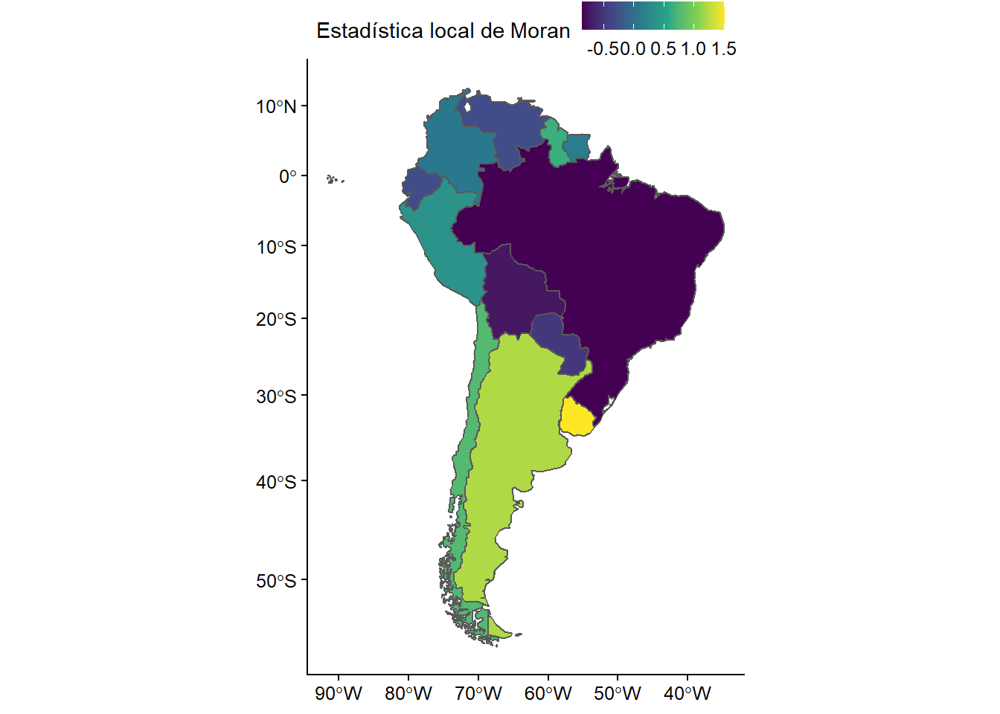

