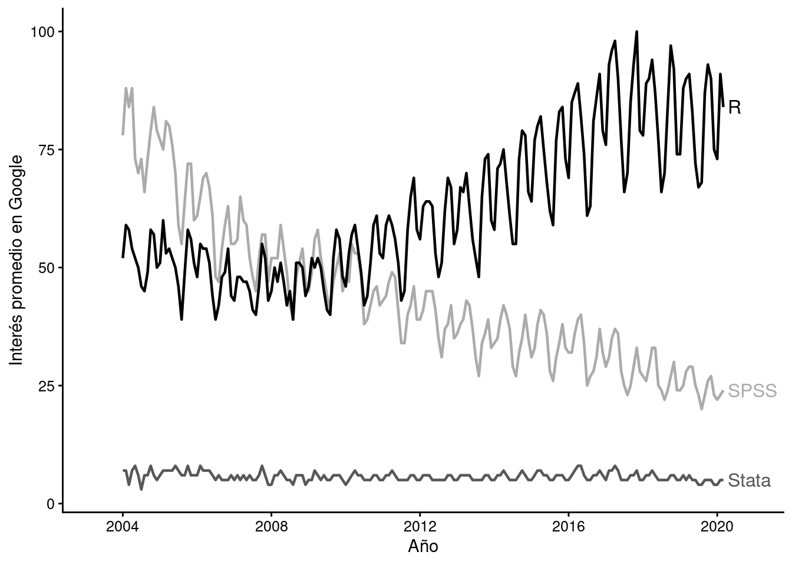

--- 
title: "AnalizaR Datos Políticos"
author: "Francisco Urdinez y Andrés Cruz Labrín (editores)"
date: "15 de abril de 2019; versión 0.1"
site: bookdown::bookdown_site
output:
  bookdown::gitbook:
    split_by: chapter
    includes:
      in_header: style.html
  # bookdown::pdf_book:
  #   keep_tex: yes
  #   includes: 
  #     in_header: preamble.tex
documentclass: book
bibliography: [book.bib, packages.bib]
biblio-style: apalike
link-citations: yes
description: "Manual aplicado para politólogos y relacionistas internacionales en R"
favicon: "favicon.ico"
---

# Introducción

## Inicio

**AnalizaR Datos Políticos** es un libro que podrás usar como manual de referencia cuando estés quebrandote la cabeza usando `R`. Por eso, decidimos que sea más aplicado que teórico, y hemos considerado tanto temas de ciencia política como de relaciones internacionales. De ahí el subtítulo del libro: "Manual aplicado para politólogos y relacionistas internacionales en R". Una gran ventaja del libro es que utiliza para cada tarea la opción más actualizada y sencilla disponible en la red. ¡Además, ocupa cada vez que es posible el `tidyverse`, el grupo de paquetes que ha revolucionado el uso de `R` recientemente por su sencillez!

Inspirado por el concepto de libro digital llamado [bookdown](https://github.com/rstudio/bookdown) y la filosofía de software libre y de código abierto, este libro es de uso libre y gratuito. Esto garantiza que sus contenidos sean reproducibles y accesibles públicamente para personas de todo el mundo. La versión del libro que estás leyendo ahora (0.1) se construyó el 15 de abril de 2019. A medida que el libro reciba retroalimentación de los usuarios, iremos actualizando los contenidos. 

## ¿Cómo contribuir?

`bookdown` hace que la edición de un libro sea tan fácil como editar un wiki, siempre que tengas una cuenta de [GitHub](https://github.com/). Puedes proponer cambios en el libro desde el foro "Issues" en [el repositorio del libro en GitHub](https://github.com/arcruz0/libroadp), que contiene todo el código utilizado para generarlo. 

Adicionalmente, si tienes más experiencia con GitHub y git, también puedes proponer *pull requests*.  Haciendo click en el ícono de edición, como se aprecia en la siguiente figura, puedes rápidamente crear un fork del repositorio y comenzar a editar. ¡Creemos que las contribuciones --a través de *issues* o *pull requests*-- nos ayudarán muchísimo a mejorar el libro!

(\#fig:edit-bookdown)Botón de 'Editar' en cada capítulo

Adicionalmente, si encuentras el libro útil, por favor apóyalo de alguna de estas formas:

- Leyéndolo.

- Recomendándolo o compartiéndolo en redes sociales.

### Sobre los autores y autoras

Todos los autores son politólogos pertenecientes al [Instituto de Ciencia Política](www.cienciapolitica.uc.cl/) de la Pontificia Universidad Católica de Chile, e investigadores y colaboradores del [Instituto Milenio de Fundamento de los Datos](https://imfd.cl/es/).

## Prefacio

Este libro nació haciendo análisis de datos políticos. Es decir, es hijo de la praxis. Por ello su naturaleza es aplicada, y tiene su foco puesto en ser una caja de herramientas para el lector. **AnalizaR Datos Políticos** está pensado para ser un manual de referencia que podrá ser consultado tanto por un estudiante universitario viviendo en Bogotá, como por un consultor político viviendo en México D.F. o un o funcionario público en Brasilia, todos con la necesidad de transformar sus bases de datos en conclusiones sustantivas y fácilmente interpretables.

Trabajando juntos en la cátedra de Análisis Cuantitativo de Datos II del Instituto de Ciencia Política de la Universidad Católica de Chile encontramos que ni aquí, ni en otras universidades de la región, había material didáctico y aplicado hecho en casa para enseñar a nuestros alumnos de ciencia política cómo extraer conclusiones a partir de datos duros. Todo el material utilizado en nuestra cátedra era publicado en inglés, por politólogos anglosajones trabajando en universidades anglosajonas. Por ello **AnalizaR Datos Políticos** tiene como público imaginario al politólogo latinoamericano, ya sea alumno de pregrado o posgrado, o ya en el mercado. Hemos querido que nuestro libro esté disponible en español y portugués, y esto lo hace extensible a otras universidades de realidades similares fuera de América Latina, como en los países lusófonos de África y en la región ibérica.

Los autores son todos politólogos que tuvieron que enfrentarse a problemas aplicados y tuvieron curvas de aprendizaje, más o menos empinadas, en el uso de `R`. Algunos han migrado de otros software de análisis de datos, otros han comenzado su experiencia directamente en `R`. Algunos son hábiles usuarios, otros, usuarios funcionales, pero todos tienen en común que tienen conocimiento aplicado que será de utilidad a quien quiera tener material de apoyo. 

Las universidades latinoamericanas han hecho grandes esfuerzos en que sus alumnos de politología se alfabeticen en herramientas estadísticas y de análisis de datos, algo que hasta hace diez años era algo poco frecuente. Hoy las cinco mejores universidades de la región, según el ranking de [*Times Higher Education*](https://www.timeshighereducation.com/digital-editions/latin-america-university-rankings-2018-digital-edition), tienen cursos de análisis cuantitativo de datos en sus programas de ciencia política. Algunos departamentos, como el Departamento de Ciencia Política de la Universidad de São Paulo, que co-organiza la escuela de verano de IPSA en métodos, el Instituto de Ciencia Política de la Universidad Católica de Chile, que organiza su escuela de verano en Métodos Mixtos, o la División de Estudios Políticos del CIDE, han hecho esfuerzos por exponer a sus alumnos a profesores norteamericanos y europeos que cuentan con muchas décadas de tradición cuantitativa en sus programas. Lo bueno es que poco a poco comienzan a aparecer metodólogos nacidos y formados en América Latina. Entendemos que, hoy por hoy, ningún politólogo puede salir al mercado laboral sin saber utilizar con holgura software de análisis cuantitativo, y es a esa demanda a la que apuntamos aquí.

Ahora mismo, `R` es probablemente la mejor opción que el mercado provee para análisis estadístico de datos. Esto puede ser sorpresivo para un lector recién salido de una máquina del tiempo: hace diez años, o tal vez menos, R era simplemente mirado como la alternativa gratis a los programas comerciales de verdad, que sí podían realizar análisis cuantitativo serio. Sin embargo, esto ha cambiado drásticamente en los últimos años. La Figura \@ref(fig:pref-gtrends) muestra las tendencias de búsqueda en Google en América Latina para los programas más comúnmente utilizados en ciencia. `R` ha pasado a ocupar un lugar en el mercado que hace 15 años le correspondía a SPSS, y los programas de nicho -como Stata y Minitab- son cada vez menos buscados. La tendencia sugiere que `R` será cada vez más popular en la ciencia latinoamericana, siguiendo una tendencia global. 

(\#fig:pref-gtrends)Elaborada por los autores usando el paquete ggplot2 de R, y datos extraídos de Google Trends. Los datos corresponden a promedios anuales para países latinoamericanos en el sector 'ciencia'

El modelo de software libre en el que se basa `R` —con licencias de derechos de autor permisivas, que ponen prácticamente todas las herramientas en forma gratuita a disposición del público, tanto para su uso como para su reformulación— finalmente rindió frutos. Una activa comunidad de desarrolladores se ha anclado en `R`, añadiéndole nuevas funcionalidades que lo han dotado de elegancia, simplicidad y flexibilidad. `R` ya no solo brilla en la generación de modelos estadísticos, sino que hoy es hogar de un vasto universo de herramientas que permite al usuario importar, ordenar, transformar, visualizar, modelar y comunicar los datos que le interesen, sin tener que cambiar de herramienta. 

Es esta la novedad tecnológica que queremos acercar al lector interesado en el análisis político, con la esperanza de que contribuya a optimizar el proceso entre la pregunta que le quita el sueño (y/o le promete el pan) y su solución. Esto sin desconocer, claro está, que el beneficio inicial de `R`, el que estaba incluso cuando nadie quisiera usarlo si no era a regañadientes, permanece. Sabemos que el lector —y tal vez su casa de estudios— agradecerá la amable coincidencia de que el mejor software disponible en términos de calidad es también el mejor para su bolsillo.

Francisco Urdinez y Andrés Cruz.

Santiago de Chile, 2019.

### Agradecimientos

Queremos agradecerle al [Instituto Milenio Fundamentos de los Datos](https://imfd.cl/) por apoyar este proyecto.

## Qué esperar del libro

El análisis cuantitativo de datos es una de las tantas herramientas que los investigadores tenemos para abordar las preguntas que nos interesan, ya sea en el mundo profesional o en la academia (o “por amor al arte” en muy encendidas noches de viernes, por qué no). Es por esto que **AnalizaR Datos Políticos** tiene un fuerte énfasis en ejemplos politológicos aplicados. Utilizar ejemplos de texto trillados e idealizados sobre autitos o islas imaginarias sería una falta de respeto para el lector, a quien sabemos ávido por ocupar las herramientas de este libro en las preguntas de investigación política que le parecen importantes. Por el contrario, queremos mostrar el potencial de dichas herramientas metiendo las manos en la masa, con datos de verdad, investigaciones que colegas ya han realizado y dificultades particulares de llevar el análisis de datos a preguntas políticas. Será bueno que nos acompañe a lo largo del libro con `RStudio` abierto en su computador, nada mejor que aprender juntos. 

El libro se alimenta del avance enorme que se ha hecho en los últimos años a partir de la creación del lenguaje de [`tidyverse`](https://www.tidyverse.org/) y de la publicación de *R for Data Science*, el cual puede ser accedido de manera gratuita en español gracias al trabajo colaborativo de sus usuarios en el siguiente [link](http://es.r4ds.hadley.nz/). Todo el trabajo hecho por Garrett Grolemund y Hadley Wickham por facilitar la sintaxis de `R` es una excelente invitación para quienes nunca han utilizado software estadístico o para quienes quieren mudarse de otras alternativas como Stata o SPSS. 

## Estructura del libro

<table class="table table-striped" style="margin-left: auto; margin-right: auto;">
 <thead>
  <tr>
   <th style="text-align:right;"> # </th>
   <th style="text-align:left;"> Capítulo </th>
   <th style="text-align:left;"> Autor(es) </th>
  </tr>
 </thead>
<tbody>
  <tr>
   <td style="text-align:right;"> 1 </td>
   <td style="text-align:left;"> Introducción </td>
   <td style="text-align:left;">  </td>
  </tr>
  <tr>
   <td style="text-align:right;"> 2 </td>
   <td style="text-align:left;"> R Básico </td>
   <td style="text-align:left;"> Andrés Cruz </td>
  </tr>
  <tr grouplength="4"><td colspan="3" style="text-align:center"><strong>I. Introducción a R</strong></td></tr>
<tr>
   <td style="text-align:right; padding-left: 2em;" indentlevel="1"> 3 </td>
   <td style="text-align:left;"> Manejo de datos </td>
   <td style="text-align:left;"> Andrés Cruz </td>
  </tr>
  <tr>
   <td style="text-align:right; padding-left: 2em;" indentlevel="1"> 4 </td>
   <td style="text-align:left;"> Visualización de datos </td>
   <td style="text-align:left;"> Soledad Araya </td>
  </tr>
  <tr>
   <td style="text-align:right; padding-left: 2em;" indentlevel="1"> 5 </td>
   <td style="text-align:left;"> Carga de bases </td>
   <td style="text-align:left;"> Soledad Araya y Andrés Cruz </td>
  </tr>
  <tr>
   <td style="text-align:right; padding-left: 2em;" indentlevel="1"> 6 </td>
   <td style="text-align:left;"> Modelos lineales </td>
   <td style="text-align:left;"> Inés Fynn y Lihuen Nocetto </td>
  </tr>
  <tr grouplength="3"><td colspan="3" style="text-align:center"><strong>II. Modelos</strong></td></tr>
<tr>
   <td style="text-align:right; padding-left: 2em;" indentlevel="1"> 7 </td>
   <td style="text-align:left;"> Modelos binarios </td>
   <td style="text-align:left;"> Francisco Urdinez </td>
  </tr>
  <tr>
   <td style="text-align:right; padding-left: 2em;" indentlevel="1"> 8 </td>
   <td style="text-align:left;"> Modelos de supervivencia </td>
   <td style="text-align:left;"> Francisco Urdinez </td>
  </tr>
  <tr>
   <td style="text-align:right; padding-left: 2em;" indentlevel="1"> 9 </td>
   <td style="text-align:left;"> Manejo avanzado de datos políticos </td>
   <td style="text-align:left;"> Andrés Cruz y Francisco Urdinez </td>
  </tr>
  <tr grouplength="6"><td colspan="3" style="text-align:center"><strong>III. Aplicaciones</strong></td></tr>
<tr>
   <td style="text-align:right; padding-left: 2em;" indentlevel="1"> 10 </td>
   <td style="text-align:left;"> Creación de índices con PCA </td>
   <td style="text-align:left;"> Caterina Labrín y Francisco Urdinez </td>
  </tr>
  <tr>
   <td style="text-align:right; padding-left: 2em;" indentlevel="1"> 11 </td>
   <td style="text-align:left;"> Selección de casos a partir de regresiones </td>
   <td style="text-align:left;"> Inés Fynn y Lihuen Nocetto </td>
  </tr>
  <tr>
   <td style="text-align:right; padding-left: 2em;" indentlevel="1"> 12 </td>
   <td style="text-align:left;"> Minería de datos </td>
   <td style="text-align:left;"> Gonzalo Barría </td>
  </tr>
  <tr>
   <td style="text-align:right; padding-left: 2em;" indentlevel="1"> 13 </td>
   <td style="text-align:left;"> Análisis de redes </td>
   <td style="text-align:left;"> Andrés Cruz </td>
  </tr>
  <tr>
   <td style="text-align:right; padding-left: 2em;" indentlevel="1"> 14 </td>
   <td style="text-align:left;"> Análisis cuantitativo de textos </td>
   <td style="text-align:left;"> Sebastián Huneeus </td>
  </tr>
  <tr>
   <td style="text-align:right; padding-left: 2em;" indentlevel="1"> 15 </td>
   <td style="text-align:left;"> Generación de mapas </td>
   <td style="text-align:left;"> Andrea Escobar y Gabriel Ortiz </td>
  </tr>
</tbody>
</table>

El libro está organizado en tres secciones temáticas. Dentro de las secciones, cada capítulo se esfuerza por resolver problemas puntuales, balanceando teoría y práctica en `R`. Al iniciar el capítulo recomendamos literatura que te ayudará a profundizar en el tema si es que te interesó. También te invitamos a que reproduzcas los capítulos con tus propios datos a modo de ejercicio práctico.

<Descripción de los capítulos de la sección I>
La sección I está dedicada al manejo de datos. Lo ideal es que el lector consiga algo más que mirar una base de datos con cara de “no entiendo nada”. Introduciremos `R` desde su instalación y aprenderemos a sacarle el jugo para obtener datos, conocerlos en profundidad, transformarlos de acuerdo a las preguntas que nos interesan y representarlos gráficamente en formas tanto funcionales como atractivas.

<Descripción de los capítulos de la sección II>
En la sección II está el corazón del libro. Veremos cómo responder a preguntas políticas desde una perspectiva estadística —siempre podemos contestar desde nuestra intuición aunque esto suela ser menos serio y poco científico—. En general, la sección trata modelos estadísticos, que intentan explicar y predecir la variación de ciertas variables (dependientes) de acuerdo a cómo varía otras variables (independientes). Exploraremos distintos tipos de modelos de acuerdo a las distintas formas de variables dependientes que se encuentran comúnmente en la arena de lo político. Revisaremos cómo interpretar resultados y presentarlos en forma clara y atractiva, cómo elegir entre modelos competidores y cómo comprobar simplemente algunos de los supuestos estadísticos necesarios para que los modelos funcionen. Debemos notar que este no es un libro de econometría, claro está, por lo que para cada modelo haremos referencia a trabajos más avanzados en términos teóricos, con el fin de que el lector pueda profundizar por su cuenta si cree que debe utilizar algún modelo en específico para responder a sus preguntas de interés.

<Descripción de los capítulos de la sección III>
Por último, en la sección III dejaremos el mundo ideal y nos adentraremos en la resolución de problemas. Ya sea porque un colega nos prestó su base de datos y se ve más bien como una obra de arte surrealista, o simplemente porque la dificultad de los problemas a los que nos enfrentamos deja corto lo que aprendimos al principio del libro, aquí presentaremos un popurrí de herramientas para que el lector integre en su flujo de trabajo cotidiano. Estas han sido seleccionadas desde nuestra experiencia y son cuáles creemos las más requeridas en la práctica del análisis de datos políticos.

## Prerrequisitos

Este libro está pensado para alumnos que más que brillantes son motivados: el análisis cuantitativo de datos exige sobre todo tenacidad y curiosidad. Es altamente deseable que el lector tenga nociones básicas de matemática, probabilidad y/o estadística universitaria antes de leer este libro, aun cuando nos esforzamos por mantenerlo lo más simple que pudimos en dichas materias. En términos de hardware, prácticamente cualquier computador moderno con acceso a internet será suficiente, pues las herramientas que utilizaremos son más bien livianas. Todo el software que utilizaremos es gratuito.

En el Capítulo \@ref(rbas), de R Básico, se explica cómo instalar todo el software que se utilizará en el libro. Si ya sabes un poco sobre el funcionamiento de R, debes saber que en la subsección \@ref(rbas-paquetes) instalaremos dos paquetes que luego asumiremos instalados en el resto del libro: `tidyverse` y `paqueteadp` (un paquete especialmente creado para apoyar al libro). 
