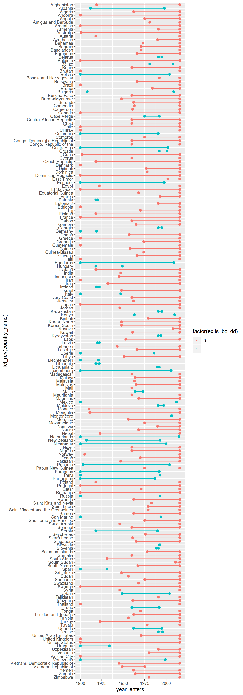
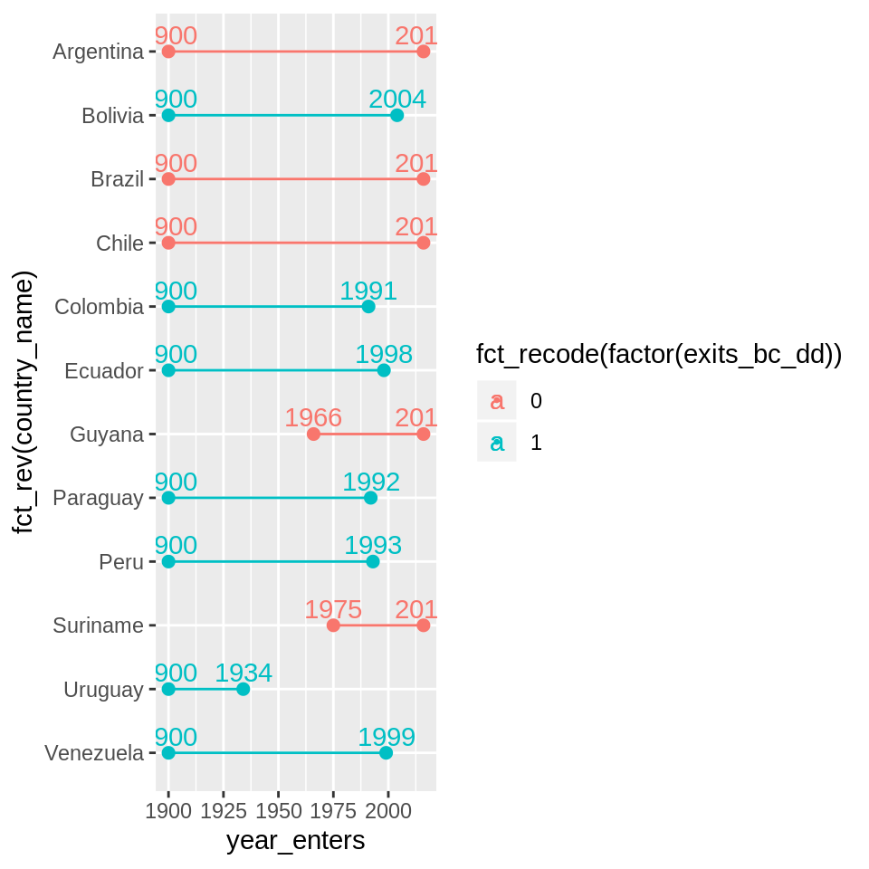
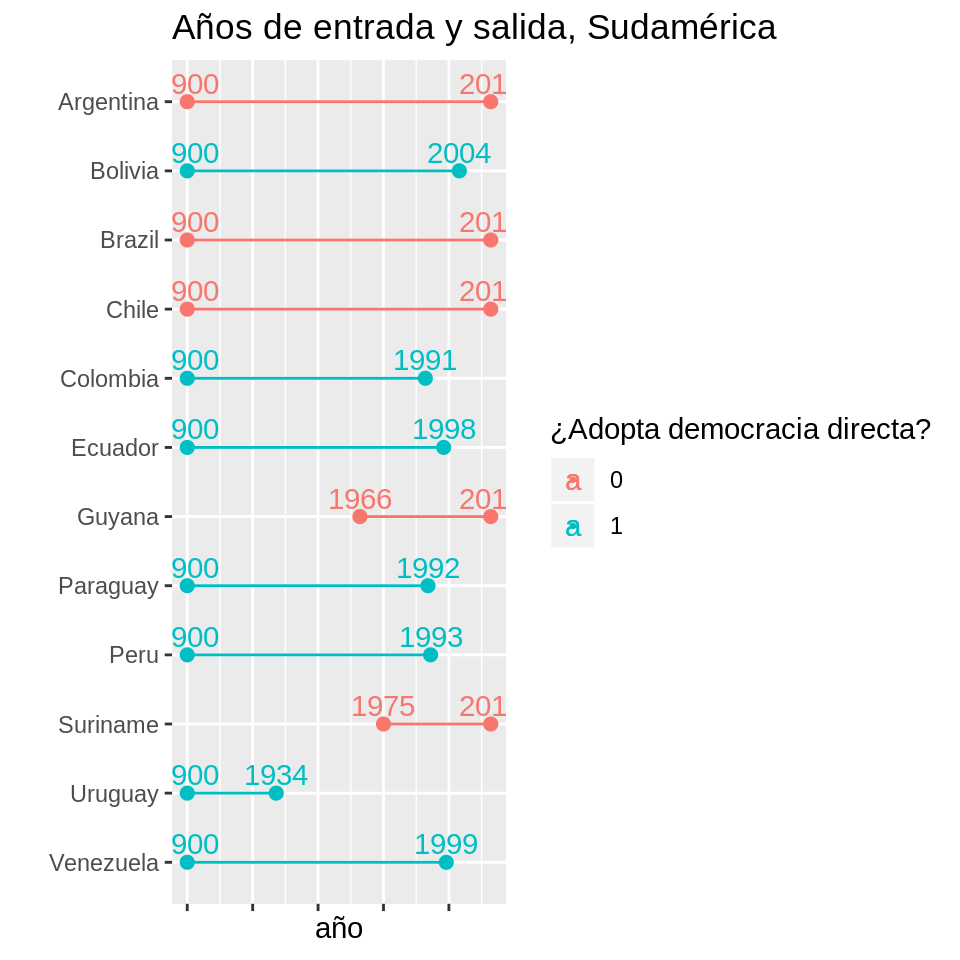
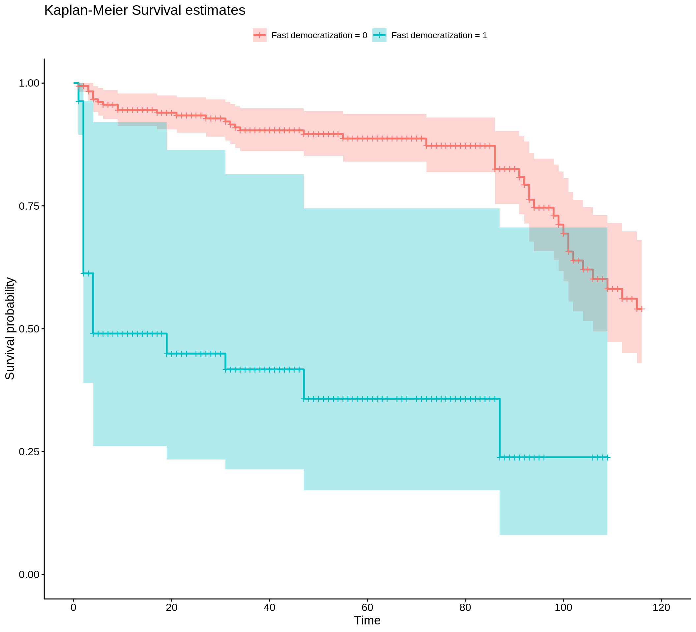

# Modelos de supervivencia {#surv}

***

**Lecturas de referencia**

- Box-Steffensmeier, J. M. & Jones, B. S. (2004). *Event history modeling: A guide for social scientists*. Cambridge: Cambridge University Press.

- Box-Steffensmeier, J. M., & Jones, B. S. (1997). Time is of the essence: Event history models in political science. *American Journal of Political Science*, 41(4), 1414-1461.

- Allison, P. D. (2014). *Event history and survival analysis: Regression for longitudinal event data* (2nd edition). Thousand Oaks, CA: SAGE publications.

- Box-Steffensmeier, J. M., Brady, H. E., & Collier, D. (Eds.). (2008). *The Oxford handbook of political methodology* (Vol. 10). Oxford: Oxford University Press.

***

Hay una serie de preguntas recurrentes al análisis de datos políticos que aún no hemos cubierto. Muchas veces nos interesa saber por qué ciertos eventos duran lo que duran, o porqué tardan más que otros en ocurrir ¿Por qué la paz es tan duradera entre algunos países mientras que otros guerrean con frecuencia? ¿Cuál era la probabilidad de que Turquía ingresara a la Unión Europea en 2018? ¿Por qué algunos legisladores permanecen en sus cargos por varios periodos consecutivos mientras que otros no logran reelegirse tan solo una vez? ¿Cuánto demora un sindicato en entrar en huelga durante una crisis económica? 

## Nociones básicas

Todas estas preguntas son sobre la duración de un evento. El momento de ocurrencia de un evento es parte de la respuesta que buscamos, necesitamos de un modelo que nos permita llegar a esta respuesta. [Janet Box-Steffensmeier](https://polisci.osu.edu/people/steffensmeier.2), una de las principales referencias en Ciencia Política de este método, se refiere a ellos como “modelos de eventos históricos” aunque buena parte de la literatura los llama modelos de supervivencia o modelos de duración. Si bien en la Ciencia Política no son modelos tan utilizados como uno creería (en el fondo, casi todas las preguntas que nos hacemos pueden ser reformuladas en una pregunta sobre la duración del evento), las ciencias médicas han explorado estos métodos en profundidad, y muchas las referencias que uno encuentra en `R` sobre paquetes accesorios a estos modelos son de departamentos bioestadísticos y médicos. De allí que “modelos de supervivencia” sea el nombre más frecuentemente utilizado para estos modelos, ya que en medicina comenzó a utilizárselos para modelar qué variables afectaban la sobrevida de sus pacientes enfermos.  

Podemos tener dos tipos de bases de datos para estos problemas. Por un lado podemos tener una base en formato de panel en el que para un momento dado nuestra variable dependiente codifica si el evento ha ocurrido ($=1$) o no ($=0$). Así, por ejemplo, podemos tener una muestra de veinte países para cincuenta años (1965-2015) en los que nuestra variable de interés es si el país ha implementado una reforma constitucional. La variable independiente asumirá el valor 1 para el año 1994 en Argentina, pero será 0 para el resto de los años en este país. Por otro lado, podemos tener una base de datos transversal en la que cada observación aparece codificada apenas una vez. En este caso necesitamos, además de la variable que nos dirá si en el periodo de interés el evento ocurrió o no para cada observación (por ejemplo, Argentina debería ser codificada como “1”), una variable extra que codifique el tiempo de “supervivencia” de cada observación, es decir, cuánto tiempo pasó hasta que finalmente el evento sucedió. Para el caso de Argentina, esta variable codificará 29 (años), que es lo que demoró en implementarse una reforma constitucional desde 1965. La elección del año de partida, como podrá sospechar, es decisión del investigador, pero tiene un efecto enorme sobre nuestros resultados. Además, muchas veces la fecha de inicio acaba determinada por la disponibilidad de datos y se alejan del ideal que quisieramos modelar. 

Supongamos que nos hacemos la pregunta que se hizo [David Altman](https://www.cambridge.org/core/books/citizenship-and-contemporary-direct-democracy/5F2081B8D1FD8AE7C7B9D784D272ED33): “¿Por qué algunos países demoran menos que otros en implementar instancias de democracia directa?”. Para ello tenemos una base de datos en formato de panel que parte del año 1900 y que llega a 2016 para 202 países (algunas observaciones, como la Unión Soviética se transforman en otras observaciones a partir de un determinado año en que dejan de existir). Al observar sus datos uno nota algo que probablemente también te suceda en tu base de datos. Para el año 2016 apenas un pequeño porcentaje de países había implementado este tipo de mecanismos (27% para ser más precisos) pero la base está censurada ya que a partir de ese año no sabemos que ha ocurrido con los países que aún no han implementado mecanismos de democracia directa. No todas las observaciones han “muerto” aún, ¿cómo saber cuándo lo harán? Ésta es una pregunta válida, que podremos responder con este tipo de modelos, ya que podemos calcular el tiempo que demorará cada uno de los países censurados en nuestra muestra (con la información que le damos al modelo, que siempre es incompleta). 

En nuestra base de datos tendremos, al menos, cuatro tipos de observaciones (ver figura \@ref(fig:surv)): (a) aquellas que, para el momento en que tenemos datos ya estaban en la muestra, aunque no siempre sabremos hace cuanto que “existen”. Son, en la figura, las observaciones B y C. En la base de datos de Altman, por ejemplo, México ya existía como entidad política en 1900, cuando su base de datos parte (sabemos que la Primera República Federal existió como entidad política desde octubre de 1824, por lo que México sería codificado como existente a partir de esa fecha). También sabemos que en 2012, por primera vez, México implementó una iniciativa de democracia directa, lo que define como positiva la ocurrencia del evento que nos interesa medir. Así, México sería como la observación B de la figura; (b) Algunas observaciones estarán desde el comienzo de la muestra, y existirán hasta el último momento sin haber registrado el evento de interés. Tal es el caso, de la observación C en la figura. En la muestra de Altman un ejemplo sería Argentina, que desde 1900 está registrado en la base (ya había "nacido"), y hasta el último año de la muestra no había registrado instancias de democracia directa (no "murió"), lo que la transforma en una observación censurada. A los fines prácticos no cambia saber qué ocurrió a partir del año en que nuestra base termina. Por ejemplo, en la figura, nuestra base cubre hast $t_7$, y sabemos que en $t_8$ la observación C aún no había muerto, y la observación D lo había hecho en $t_8$. En nuestra base, C y D serán ambas observaciones censuradas en $t_7$; (c) Algunas observaciones pueden entrar “tarde” en la muestra, como es el caso de las observaciones A y D. Por ejemplo, Eslovenia entra a la muestra de Altman en 1991, que es cuando se independiza de Yugoslavia y "nace" como país; (d) Algunas observaciones, independientemente de cuando entren a la muestra, "moriran" durante el periodo analizado. Por ejemplo, A y B mueren dentro del periodo que hemos medido entrte $t_1$ y $t_7$. Ya para la observación D, no registramos su muerte. Hay un caso no considerado en el ejemplo, de observaciones que nacen y mueren sucesivamente a lo largo del periodo de estudio. Para ellas, deberemos decidir si las tratamos como observaciones independientes, o si modelamos la posibilidad de morir más de una vez. Si es así, la probabilidad de morir por segunda vez deberá estar condicionada por la probabilidad de haber muerto (y cuando!) por primera vez. Este es un tipo de caso algo más complejo que no cubriremos en este caoítulo.

<div class="figure" style="text-align: center">

<p class="caption">(\#fig:surv)Ejemplos de observaciones presentes en una base de datos de supervivencia</p>
</div>

Los modelos de supervivencia se interpretan a partir de la probabilidad de que en un momento dado el evento de interés ocurra siendo que que no ha ocurrido aun. Esta probabilidad recibe el nombre de tasa de riesgo. Partimos sabiendo que tenemos una variable, que llamaremos $T$, y que representa un valor aleatorio positivo y que tiene una distribución de probabilidades (correspondiente a la probabilidad del evento ocurrir en cada uno de los momentos posibles) que llamaremos $f(t)$. Esta probabilidad se puede expresar de manera acumulada, como una densidad acumulada $F(t)$. Com, en la que vemos que $F(t)$ viene dada por la probabilidad de que el tiempo de supervivencia $T$ sea menor o igual a un tiempo específico $t$ :

$$F(t)=\int\limits_0^t f(u)d(u)=Pr(T)\leq t)$$

La función de supervivencia $\hat S(t)$, que es un concepto clave en estos modelos, está relacionada a $F(t)$, ya que 

$$\hat S(t)= 1-F(t)=Pr(T\geq t)$$


Es decir, la función de supervivencia es la probabilidad inversa de $F(t)$, pues dice respecto a la probabilidad de que el tiempo de supervivencia $T$ sea mayor o igual un tiempo $t$ de interés. Para el ejemplo concreto de Altman, uno podría preguntarse cuál es la probabilidad de que un país no implemente un mecanismo de democracia directa (lo que sería equivalente a “sobrevivir” a dicha implementación) siendo que ya ha sobrevivido a los mismos por 30 años. A medida que más y más países en la muestra van implementando iniciativas de democracia directa, la probabilidad de supervivencia va disminuyendo. 

Los coeficientes de los modelos de supervivencia se suelen interpretar como tasas de riesgo (o “hazard rates” en inglés), que es el cociente de la probabilidad de que el evento suceda y la función de supervivencia

$$h(t)=\frac{f(t)}{S(t)}$$

Así, la tasa de riesgo indica la tasa a la que las observaciones “mueren” en nuestra muestra en el momento $t$, considerando que la observación ha sobrevivido hasta el momento $t$. Veremos más adelante como en el ejemplo de Altman podemos interpretar los coeficientes de nuestras regresiones como tasas de riesgo. En definitiva, la tasa de riesgo $h(t)$ es el riesgo de que el evento ocurra en un intervalo de tiempo determinado, que viene dado por 

$$f(t)=\lim_{\bigtriangleup x \to 0} \frac {P(t+\bigtriangleup t > T \geq t)}{\bigtriangleup t}$$

## El modelo Cox de riesgos proporcionales

Hay dos tipos de modelos de supervivencia, los llamados modelos paramétricos y los llamados semi-parametricos. Los primeros son aquellos que hacen supuestos sobre las características de la población a la que la muestra pertenece. En este caso, los supuestos son sobre el “baseline hazard”, es decir, sobre el riesgo de que el evento ocurra cuando todas nuestras variables independientes sean iguales a cero. El tipo de modelo de surpervivencia más común para esta categoría es el modelo de Weibull. Por otro lado, los modelos semi-parametricos no hacen ningún tipo de supuestos sobre la función de base, ya que ésta es estimada a partir de los datos. El ejemplo más famoso de ésta especificación es la del modelo de Cox. 

El *Oxford Handbook* sobre metodología política dedica un capítulo entero a discutir modelos de supervivencia, y en el se toma una posición fuerte en favor de los modelos semi-parametricos. Aquí seguiremos dicha recomendación ya que las ventajas son varias. Por un lado, como no se hacen presupustos sobre la función del riesgo de base, su estimación es mucho más precisa. En una estimación paramétrica, elegir un “baseline hazard” equivocado siginificará que todo nuestro trabajo analítico estará sesgado. La decisión de la forma que adopta la curva de base en un modelo de Weibull debería estar orientado por razones teóricas de cuál es el efecto de nuestra variable independiente sobre la probabilidad de supervivencia de la observación (ver figura \@ref(fig:weibull)). Sin embargo, no siempre nuestra teoría define tales presupuestos. Elegir una especificación por Cox nos ahorra tomar una decisión tan costosa.


<div class="figure" style="text-align: center">

<p class="caption">(\#fig:weibull)Diferentes riesgos de base en el modelo de Weibull</p>
</div>


Una segunda ventaja de los modelos semi-parametricos sobre los paramétricos tiene que ver con el presupuesto de riesgos proporcionales. Ambos, modelos paramétricos y semi-parametricos, asumen que los riesgos entre dos individuos cualquiera de la muestra se mantienen constantes a lo largo de todo su periodo de supervivencia. Es decir, se asume que la curva de riesgo de cada individuo sigue la misma curva en el tiempo. Este es un presupuesto fuerte para trabajos en ciencia política, ya que las observaciones cambian en el tiempo y se diferencian unas de otras. Piénsense en el trabajo de Altman, por ejemplo. Uno puede teorizar que la probabilidad de una iniciativa de democracia directa en un determinado año en un determinado país estará afectada por el nivel de solidez de las instituciones democráticas, que podemos medir con algún tipo de variable estándar como los 21 puntos de [Polity IV](https://www.systemicpeace.org/polity/polity4.htm) o la más reciente medición de [V-Dem](https://www.v-dem.net). Podemos, entonces, teorizar que a mayor solidez institucional mayor probabilidad de implementar mecanismos de democracia directa. 

Sin embargo, los valores de estas variables no solo difieren ente países, sino que a lo largo del tiempo estas variables cambian mucho para un mismo país. Piénsese en Colombia, por ejemplo, en que la variable de V-Dem “v2x_polyarchy” sufrió avances y retrocesos entre 1900 y 2016 (ver figura 3). Cada vez que el valor de esta variable cambia, necesariamente cambia la tasa de riesgo de democracia directa para Colombia, rompiendo el presupuesto de proporcionalidad de los riesgos.

<div class="figure" style="text-align: center">

<p class="caption">(\#fig:unnamed-chunk-2)Valores de poliarquía para Colombia según V-Dem</p>
</div>

La ventaja del modelo de Cox sobre sus contrapartes paramétricas es que existen tests para saber si alguna variable de nuestro modelo rompe el presupuesto de proporcionalidad de los riesgos, y de esa forma podremos corregirlo generando interacciones entre estas variables y variables temporales. De esta forma, permitimos que en nuestro modelo haya dos tipos de coeficientes: coeficientes constantes en el tiempo, y coeficientes cambiantes en el tiempo. Por ejemplo, podemos imaginar que ante un aumento brusco en la calidad de las instituciones democráticas de un país la tasa de riesgo de implementar democracia directa se dispare, pero que dicho efecto de desvanezca en el lapso de cuatro o cinco años. Cuando definas tu modelo, es importante que reflexiones sobre qué variables puede asumirse que permanezcan constantes en los riesgos y cuales no. 

La recomendación dada por el *Oxford Handbook* para una buena implementación de modelos de supervivencia es la siguiente: (a) Primero, dada las ventajas de los modelos semi-paramétricos sobre los paramétricos, se recomienda el uso de Cox por sobre Weibull u otro modelo paramétrico. (b) Una vez que hemos definido nuestra variable dependiente (el evento), el tiempo de “nacimiento” y de “muerte” de cada observación, podemos especificar nuestro modelo. (c) Los coeficientes deben ser interpretados en tasas de riesgo (hazard rates), lo que exige exponenciar los coeficientes brutos que obtenemos en `R`.  (d) Una vez que tenemos el modelo que creemos correcto, en función de nuestras intuiciones teóricas, es necesario testear que ninguno de los coeficientes viole el presupuesto de proporcionalidad de los riesgos. Para ello ejecutamos un test de Grambsch y Therneau, o mediante el análisis de los residuos de Schoenfeld. (e) Una vez identificados los coeficientes problemáticos, permitimos que estos interactúen con el logaritmo natural de la variable que mide la duración del evento. De esta forma, permitimos que haya coeficientes cuyo efecto se desvanece o se potencia con el tiempo. Una vez corregidos los coeficientes problemáticos, podemos si, proceder a interpretar nuestro modelo y la función de supervivencia del modelo. 

## Aplicación en `R`

Volvamos, entonces, a la pregunta que se hizo David Altman en el capítulo 3 de [Citizenship and Contemporary Direct Democracy (2019)](https://www.cambridge.org/core/books/citizenship-and-contemporary-direct-democracy/5F2081B8D1FD8AE7C7B9D784D272ED33), "Catching on: waves of adoption of citizen-initiated mechanisms of direct democracy since World War I": “¿Por qué algunos países demoran menos que otros en implementar instancias de democracia directa?”. Para poder responder a esta pregunta, uno debe correr modelos de supervivencia. Comencemos por cargar el `tidyverse` y nuestra base (esta última, desde nuestro paquete `paqueteadp`):


```r
library(tidyverse)
```


```r
library(paqueteadp)
```


```r
data(dem_directa)
```

Ahora la base se ha cargado en nuestra sesión de R:


```r
ls()
## [1] "dem_directa"
```


Las variables que tenemos en la base son las siguientes:
+ Variable dependiente. Registra la ocurrencia del evento, que en este caso es la adopción de un mecanismo de democracia directa - `cic_dummy`
+ Año - `year`  
+ Nombre del país - `country_name` 
+ El país sufre un proceso de rápida democratización - `dem_positive`
+ El país sufre un proceso rápido de deterioro de la democracia - `dem_negative`
+ Memoria de instancias previas de democracia directa - `memory`
+ Score de democracia del país - `v2x_polyarchy`
+ Efecto de la difusion de capacidades - `capabilities_geo_ide`
+ Efecto de la difusión de ocurrencias - `occur_geo_ide`
+ Logaritmo natural de la población total del país - `log_pop`
+ Dummy para ex colonias británicas - `c_gbr`
+ Dummy para ex miembros de la URSS - `c_ussr`


A lo largo del ejemplo usaremos los paquetes `skimr`, `countrycode`, `survival`, `rms`, `survminer`, `ggalt`, `tidyverse`y `texreg`, pero los iremos cargando uno a uno para que veas para que sirven. 
Si utilizamos `skim`, como ya hicimos en otros capítulos, podemos ver que es una base en formato de panel balanceado. Es decir, tenemos una variable "país" (`country_name`), que se repite a lo largo de una variable "año" (`year`).


```r
skim(dem_directa)
## Skim summary statistics
##  n obs: 13885 
##  n variables: 23 
## 
## ── Variable type:character ──────────────────
##      variable missing complete     n min max empty n_unique
##  country_name       0    13885 13885   4  32     0      202
## 
## ── Variable type:numeric ────────────────────
##              variable missing complete     n      mean    sd        p0
##        p25     p50      p75    p100     hist
##  [ reached getOption("max.print") -- omitted 22 rows ]
```
Los países ""entran" a la base cuando comienzan a existir como países independientes. Veamos el caso de Albania, por ejemplo, que nace como país en 1912 luego de las [Guerras los Balcanes](https://es.wikipedia.org/wiki/Guerras_de_los_Balcanes):


```r
dem_directa %>% 
  filter(country_name == "Albania")
## # A tibble: 105 x 23
##    country_name  year cic_dummy dem_positive dem_negative memory
##    <chr>        <dbl>     <dbl>        <dbl>        <dbl>  <dbl>
##  1 Albania       1912         0            0            0      0
##  2 Albania       1913         0            0            0      0
##  3 Albania       1914         0            0            0      0
##  4 Albania       1915         0            0            0      0
##  5 Albania       1916         0            0            0      0
##  6 Albania       1917         0            0            0      0
##  7 Albania       1918         0            0            0      0
##  8 Albania       1919         0            0            0      0
##  9 Albania       1920         0            0            0      0
## 10 Albania       1921         0            0            0      0
## # … with 95 more rows, and 17 more variables: v2x_polyarchy <dbl>,
## #   capabilities_geo_ide <dbl>, occur_geo_ide <dbl>,
## #   c_pos_capabilities <dbl>, c_pos_occurrences <dbl>, c_pos_memory <dbl>,
## #   log_pop <dbl>, c_gbr <dbl>, c_fra <dbl>, c_ussr <dbl>, c_spa <dbl>,
## #   c_usa <dbl>, c_ned <dbl>, c_prt <dbl>, c_bel <dbl>, c_ahe <dbl>,
## #   c_ote <dbl>
```

Para que los modelos funcionen correctamente en `R`, los países deberían salir del análisis (¡y de la base!) cuando "mueren". En este caso la muerte se da cuando los países adoptan mecanismos de democracia directa. Albania, siguiendo el ejemplo, debería dejar de existir en 1998, y no perdurar en la base hasta 2016 como sucede ahora. Entonces crearemos una segunda versión de nuestra base de datos donde esto ya ha sido corregido: 
<div class="books">
<p>Si tu base de datos está en este formato desde el comienzo, entonces podrás saltarte este paso.</p>
</div>


```r
dem_directa_b <- dem_directa %>%
  group_by(country_name) %>%
  # que la suma acumulada de la dummy sea como máximo 1
  filter(cumsum(cic_dummy) <= 1) %>%
  ungroup()
```
Lo que estamos haciendo es filtrar de tal forma que al registrar el primer evento de interés (en este caso es la variable `cic_dummy`) el resto es dejado a un lado. Si comparamos el caso de Albania para la base original  y para la base actual veremos la diferencia: 

```r
dem_directa %>%
  filter(country_name == "Albania" & cic_dummy == 1)
## # A tibble: 19 x 23
##    country_name  year cic_dummy dem_positive dem_negative memory
##    <chr>        <dbl>     <dbl>        <dbl>        <dbl>  <dbl>
##  1 Albania       1998         1            0            0  1    
##  2 Albania       1999         1            0            0  1    
##  3 Albania       2000         1            0            0  1    
##  4 Albania       2001         1            0            0  1    
##  5 Albania       2002         1            0            0  0.94 
##  6 Albania       2003         1            0            0  0.88 
##  7 Albania       2004         1            0            0  0.82 
##  8 Albania       2005         1            0            0  0.76 
##  9 Albania       2006         1            0            0  0.7  
## 10 Albania       2007         1            0            0  0.64 
## 11 Albania       2008         1            0            0  0.580
## 12 Albania       2009         1            0            0  0.52 
## 13 Albania       2010         1            0            0  0.46 
## 14 Albania       2011         1            0            0  0.4  
## 15 Albania       2012         1            0            0  0.34 
## 16 Albania       2013         1            0            0  0.28 
## 17 Albania       2014         1            0            0  0.22 
## 18 Albania       2015         1            0            0  0.16 
## 19 Albania       2016         1            0            0  0.1  
## # … with 17 more variables: v2x_polyarchy <dbl>,
## #   capabilities_geo_ide <dbl>, occur_geo_ide <dbl>,
## #   c_pos_capabilities <dbl>, c_pos_occurrences <dbl>, c_pos_memory <dbl>,
## #   log_pop <dbl>, c_gbr <dbl>, c_fra <dbl>, c_ussr <dbl>, c_spa <dbl>,
## #   c_usa <dbl>, c_ned <dbl>, c_prt <dbl>, c_bel <dbl>, c_ahe <dbl>,
## #   c_ote <dbl>

dem_directa_b %>% 
  filter(country_name == "Albania" & cic_dummy == 1)
## # A tibble: 1 x 23
##   country_name  year cic_dummy dem_positive dem_negative memory
##   <chr>        <dbl>     <dbl>        <dbl>        <dbl>  <dbl>
## 1 Albania       1998         1            0            0      1
## # … with 17 more variables: v2x_polyarchy <dbl>,
## #   capabilities_geo_ide <dbl>, occur_geo_ide <dbl>,
## #   c_pos_capabilities <dbl>, c_pos_occurrences <dbl>, c_pos_memory <dbl>,
## #   log_pop <dbl>, c_gbr <dbl>, c_fra <dbl>, c_ussr <dbl>, c_spa <dbl>,
## #   c_usa <dbl>, c_ned <dbl>, c_prt <dbl>, c_bel <dbl>, c_ahe <dbl>,
## #   c_ote <dbl>
```
En resumen, ahora tenemos un panel desbalanceado, en el que los países entran a la base cuando comienzan a existir como tales y salen, o bien cuando adoptan mecanismos de democracia directa, o bien cuando la base termina en su extensión temporal (en 2016). De esta forma nuestra base se acerca mucho a la figura 1 con la que ejemplificamos los distintos tipos de observaciones. ¿Qué tal si probamos hacer algo similar a la figura 1 pero con los datos de David Altman? Este tipo de figuras se llaman gráficos de Gantt, y pueden recrearse con `ggplot2` aunque es justo decir que hay que seguir unos cuantos pasos, y puede ser algo dificil. Ojalá que con este ejemplo puedas recrearlo con tus propios datos porque una figura así es de mucha utlidad para el lector. 

Primero debemos crear una base de datos que, para cada país, registre el año de entrada y el año de salida. También nos interesa por qué sale el país: ¿adopta democracia directa o la base termina? Vamos a crear un subonjunto que llamaremos `gantt_plot_df` donde nos quedamos solamente con tres variables de la base, que son el nombre del país `country_name`, el año `year`, y la variable dependiente `cic_dummy`. También quitaremos de la base aquellas observaciones que para el primer año de la base ya han "muerto". Por ejemplo, Suiza había implementado mecanismos de democracia directa mucho antes que 1900, así que desde el primer año de la base hasta el último la variable dependiente será "1":

```r
gantt_plot_df <- dem_directa_b %>%
  # las variables que nos interesan
  dplyr::select(country_name, year, cic_dummy) %>%
  group_by(country_name) %>%
  filter(year == min(year) | year == max(year)) %>%
  # debemos sacar las observaciones para países que "nacen" (para nuestra base) con democracia directa:
  filter(!(year == min(year) & cic_dummy == 1)) %>%
  summarise(year_enters = min(year),
            year_exits  = max(year),
            exits_bc_dd = max(cic_dummy)) %>%
  ungroup()
gantt_plot_df
## # A tibble: 194 x 4
##    country_name        year_enters year_exits exits_bc_dd
##    <chr>                     <dbl>      <dbl>       <dbl>
##  1 Afghanistan                1919       2016           0
##  2 Albania                    1912       1998           1
##  3 Algeria                    1962       2016           0
##  4 Andorra                    1900       2016           0
##  5 Angola                     1975       2016           0
##  6 Antigua and Barbuda        1981       2016           0
##  7 Argentina                  1900       2016           0
##  8 Armenia                    1991       2016           0
##  9 Australia                  1901       2016           0
## 10 Austria                    1918       2016           0
## # … with 184 more rows
```
Los países que salen por democracia directa ("mueren") son:

```r
gantt_plot_df %>% filter(exits_bc_dd == 1)
## # A tibble: 49 x 4
##    country_name year_enters year_exits exits_bc_dd
##    <chr>              <dbl>      <dbl>       <dbl>
##  1 Albania             1912       1998           1
##  2 Belarus             1991       1995           1
##  3 Belize              1981       2008           1
##  4 Bolivia             1900       2004           1
##  5 Bulgaria            1908       2009           1
##  6 Cape Verde          1975       1992           1
##  7 Colombia            1900       1991           1
##  8 Costa Rica          1900       2002           1
##  9 Croatia             1992       2001           1
## 10 Ecuador             1900       1998           1
## # … with 39 more rows
```
Podemos identificar en una nueva variable la región geopolítica de cada país, gracias a la función `countrycode::countrycode()` (Esto lo explicamos en detalle en el Capítulo \@ref(manejo-av)). Este paquete es de gran utilidad para quienes hacen política comparada o relaciones internacionales porque facilita mucho darle códigos a los países. Lo que nos permite el paquete es asignar a cada país su región de pertenencia de manera casi automática:

```r
library(countrycode)
gantt_plot_df_region <- gantt_plot_df %>%
  mutate(region = countrycode(country_name, origin = "country.name", dest = "region"))
## Warning in countrycode(country_name, origin = "country.name", dest = "region"): Some values were not matched unambiguously: Kosovo, South Yemen, Vietnam, Democratic Republic of, Vietnam, Republic of

gantt_plot_df_region
## # A tibble: 194 x 5
##    country_name      year_enters year_exits exits_bc_dd region             
##    <chr>                   <dbl>      <dbl>       <dbl> <chr>              
##  1 Afghanistan              1919       2016           0 Southern Asia      
##  2 Albania                  1912       1998           1 Southern Europe    
##  3 Algeria                  1962       2016           0 Northern Africa    
##  4 Andorra                  1900       2016           0 Southern Europe    
##  5 Angola                   1975       2016           0 Middle Africa      
##  6 Antigua and Barb…        1981       2016           0 Caribbean          
##  7 Argentina                1900       2016           0 South America      
##  8 Armenia                  1991       2016           0 Western Asia       
##  9 Australia                1901       2016           0 Australia and New …
## 10 Austria                  1918       2016           0 Western Europe     
## # … with 184 more rows
```
Como dice el warning, algunos países no fueron encontrados. Estos son los países que `countrycode` no pudo encontrar, seguramente porque los países están escritos de otra manera:

```r
gantt_plot_df_region %>%
  filter(is.na(region))
## # A tibble: 4 x 5
##   country_name                    year_enters year_exits exits_bc_dd region
##   <chr>                                 <dbl>      <dbl>       <dbl> <chr> 
## 1 Kosovo                                 2008       2016           0 <NA>  
## 2 South Yemen                            1967       2016           0 <NA>  
## 3 Vietnam, Democratic Republic of        1945       2016           0 <NA>  
## 4 Vietnam, Republic of                   1949       1975           0 <NA>
```
Podemos corregir esto a mano ex-post o correr `countrycode::countrycode()` de nuevo, pero con el argumento `custom_match`:


```r
gantt_plot_df_region <- gantt_plot_df %>%
  mutate(region = countrycode(country_name, 
                              origin       = "country.name", 
                              dest         = "region",
                              custom_match = c("Korea, North" = "Eastern Asia",
                                               "Kosovo" = "Eastern Europe",
                                               "South Yemen" = "Western Asia",
                                               "Vietnam, Democratic Republic of" = "South-Eastern Asia",
                                               "Vietnam, Republic of" = "South-Eastern Asia")))
gantt_plot_df_region
## # A tibble: 194 x 5
##    country_name      year_enters year_exits exits_bc_dd region             
##    <chr>                   <dbl>      <dbl>       <dbl> <chr>              
##  1 Afghanistan              1919       2016           0 Southern Asia      
##  2 Albania                  1912       1998           1 Southern Europe    
##  3 Algeria                  1962       2016           0 Northern Africa    
##  4 Andorra                  1900       2016           0 Southern Europe    
##  5 Angola                   1975       2016           0 Middle Africa      
##  6 Antigua and Barb…        1981       2016           0 Caribbean          
##  7 Argentina                1900       2016           0 South America      
##  8 Armenia                  1991       2016           0 Western Asia       
##  9 Australia                1901       2016           0 Australia and New …
## 10 Austria                  1918       2016           0 Western Europe     
## # … with 184 more rows
```
Ahora no tenemos NA! Hemos logrado asignar una región a cada país de la muestra.

```r
gantt_plot_df_region %>%
  filter(is.na(region))
## # A tibble: 0 x 5
## # … with 5 variables: country_name <chr>, year_enters <dbl>,
## #   year_exits <dbl>, exits_bc_dd <dbl>, region <chr>
```
Con nuestra base ya armada, podemos hacer el plot con facilidad, gracias a `ggalt::geom_dumbbell()`:

```r
library(ggalt)
gantt_plot <- ggplot(data    = gantt_plot_df_region, 
                     mapping = aes(x     = year_enters, 
                                   xend  = year_exits, 
                                   y     = fct_rev(country_name), 
                                   color = factor(exits_bc_dd))) +
  geom_dumbbell(size_x = 2, size_xend = 2)

gantt_plot
```

<div class="figure" style="text-align: center">

<p class="caption">(\#fig:unnamed-chunk-19)Diagrama de Gantt para todas las observaciones</p>
</div>
En el eje vertical tenemos los países ordenados alfabeticamente, y en el eje x hay dos variables que informan al gráfico, por un lado el comienzo de la línea (`year_enters`) y por otro su fin (`year_exits`). Además, hay una tercer variable informativa que es el color de la línea, que denota si el país implementó o no una instancia de democracia directa (`exits_bc_dd`). Los países en azul son los que implementaron dicha instancia entre 1900 y 2016.  

Si bien la figura es de una enorme utilidad visual, hay que reconocer que son demasiados países para incluirla en el cuerpo de un artículo. Un enfoque posible es concentrarnos en ciertas regiones. Recordarás la función `filter`del Capítulo \@ref(manejo-de-datos). Filtremos Sudamérica, por ejemplo:

```r
gantt_plot_sa <- ggplot(data    = gantt_plot_df_region %>% filter(region == "South America"), 
                     mapping = aes(x     = year_enters, 
                                   xend  = year_exits, 
                                   y     = fct_rev(country_name), 
                                   color = fct_recode(factor(exits_bc_dd)))) +
  geom_dumbbell(size_x = 2, size_xend = 2)

gantt_plot_sa
```

<div class="figure" style="text-align: center">

<p class="caption">(\#fig:unnamed-chunk-20)Diagrama de Gantt para América del Sur</p>
</div>
Podemos agregarle los años como texto para mejorar aún más la lectura de la figura:

```r
gantt_plot_sa <- gantt_plot_sa + 
  geom_text(aes(label = year_enters), vjust = -.4) +
  geom_text(aes(x = year_exits, label = year_exits), vjust = -.4)

gantt_plot_sa
```

<div class="figure" style="text-align: center">

<p class="caption">(\#fig:unnamed-chunk-21)Diagrama de Gantt para América del Sur con todas las mejoras</p>
</div>
Finalmente, algunos retoques estéticos, con todo lo que hemos aprendido en el Capítulo \@ref(dataviz):

```r
library(ggplot2)
gantt_plot_sa <- gantt_plot_sa +
  labs(x     = "año", y = "",
       title = "Años de entrada y salida, Sudamérica",
       color = "¿Adopta democracia directa?") +
    theme(axis.text.x = element_blank())

gantt_plot_sa
```

<div class="figure" style="text-align: center">

<p class="caption">(\#fig:unnamed-chunk-22)Diagrama de Gantt para todas las observaciones</p>
</div>

Además de gráficos de Gantt, es muy común que quien trabaja con modelos de supervivencia muestre gráficos con las curvas de supervivencia comparando dos grupos de interés. Por ejemplo, David Altman se pregunta si hubo una diferencia en el siglo XX entre países que se democratizaron rápidamente y aquellos que demoraron décadas en hacerlo respecto a la rapidez con que implementaron mecanismos de democracia directa. Este tipo de figuras no tiene valor inferencial, pero si gran valor decriptivo. Tenemos que estimar una curva de supervivencia no paramétrica, usando el método de Kaplan-Meier. 

A partir de este punto debemos hacer una modificación más a nuestra base. Seguramente tu también debas hacerlo con tus propios datos, así que presta atención. Los modelos de supervivencia no trabajan con datos de panel tradicionales, como el de nuestra base. Tenemos que convertirlos a "tiempo en riesgo". ¿Qué quiere decir esto? Quiere decir que necesitamos dos variables nuevas, una que nos diga el tiempo que la observación lleva en riesgo de morir al inicio de cada t `risk_time_at_start`y otra variable que haga lo mismo al final de cada t `risk_time_at_end`. Estas dos variables serán utilizadas a partir de ahora en los scripts del análisis de supervivencia: 


```r
dem_directa_c <- dem_directa_b %>%
  group_by(country_name) %>%
  # vamos a eliminar el primer año para cada país. no está en riesgo, por definición!
  filter(year != min(year)) %>%
  mutate(risk_time_at_end   = c(1:n()),
         risk_time_at_start = c(0:(n() - 1))) %>%
  ungroup() %>%
  dplyr::select(country_name, year, risk_time_at_start, risk_time_at_end, everything())
```


```r
dem_directa_c
## # A tibble: 12,014 x 25
##    country_name  year risk_time_at_st… risk_time_at_end cic_dummy
##    <chr>        <dbl>            <int>            <int>     <dbl>
##  1 Afghanistan   1920                0                1         0
##  2 Afghanistan   1921                1                2         0
##  3 Afghanistan   1922                2                3         0
##  4 Afghanistan   1923                3                4         0
##  5 Afghanistan   1924                4                5         0
##  6 Afghanistan   1925                5                6         0
##  7 Afghanistan   1926                6                7         0
##  8 Afghanistan   1927                7                8         0
##  9 Afghanistan   1928                8                9         0
## 10 Afghanistan   1929                9               10         0
## # … with 12,004 more rows, and 20 more variables: dem_positive <dbl>,
## #   dem_negative <dbl>, memory <dbl>, v2x_polyarchy <dbl>,
## #   capabilities_geo_ide <dbl>, occur_geo_ide <dbl>,
## #   c_pos_capabilities <dbl>, c_pos_occurrences <dbl>, c_pos_memory <dbl>,
## #   log_pop <dbl>, c_gbr <dbl>, c_fra <dbl>, c_ussr <dbl>, c_spa <dbl>,
## #   c_usa <dbl>, c_ned <dbl>, c_prt <dbl>, c_bel <dbl>, c_ahe <dbl>,
## #   c_ote <dbl>
```

Corramos la curva de  supervivencia no paramétrica, usando el método de Kaplan-Meier:


```r
library(survival)

km <- survfit(Surv(time = risk_time_at_start, time2 = risk_time_at_end,
                   event = cic_dummy) ~ dem_positive,
              type      = "kaplan-meier", 
              conf.type = "log", 
              data      = dem_directa_c)
```

Ahora podemos armar nuestro plot con `survminer::ggsurvplot()`

```r
library(survminer)
## Loading required package: ggpubr
## Loading required package: magrittr
## 
## Attaching package: 'magrittr'
## The following object is masked from 'package:purrr':
## 
##     set_names
## The following object is masked from 'package:tidyr':
## 
##     extract
ggsurvplot(km, conf.int = T, legend.title = "",
           break.x.by = 20,
           legend.labs = c("Fast democratization = 0", "Fast democratization = 1"), 
           data = dem_directa_c) +
            labs(title    = "Kaplan-Meier Survival estimates")
```

<div class="figure" style="text-align: center">

<p class="caption">(\#fig:kaplan)Curva de Kaplan-Meier</p>
</div>

Altman tiene la hipótesis de que países que sufrieron "shocks" democratizadores fueron mucho más rápidos en implementar mecanismos directos. La figura confirma su intuición, pues vemos que la probabilidad de supervivencia de un país (léase como la probabilidad de que persista sin implementar mecanismos de democracia directa) se reduce a la mitad en los primeros cuatro años que siguien al shock democratizador. Por el contrario, países que se democratizan de a poco, no sufren este efecto. 


### Modelos de supervivencia e interpretación sus coeficientes como Hazard Ratios.

Vamos a usar la base de Altman para estimar algunos modelos como ejemplo y correr los tests de Grambsch y Therneau para testear que ninguno de los coeficientes viole el presupuesto de proporcionalidad de los riesgos. No estamos replicando los modelos de su capítulo porque son algo más complejos (incluyen varias interacciones), simplemente usamos su base como referencia. Aquí vale la pena hacer una aclaración respecto a replicabilidad: Si el autor utiliza Stata (por ejemplo con el comando `stcox`) van a haber algunas diferencias menores en los resultados obtenidos utilizando `R`. 

Primer modelo:

```r
cox_m1 <- coxph(Surv(risk_time_at_start, risk_time_at_end, cic_dummy) ~ 
                  dem_positive + dem_negative + memory + v2x_polyarchy, 
                data   = dem_directa_c, 
                robust = T, 
                method ="breslow")
```
Su test de riesgos proporcionales:

```r
cox.zph(cox_m1)
##                   rho chisq     p
## dem_positive  -0.0786 0.310 0.578
## dem_negative   0.0482 0.108 0.743
## memory        -0.1065 0.785 0.376
## v2x_polyarchy -0.2978 3.170 0.075
## GLOBAL             NA 4.909 0.297
```
Miremos el valor global del test. Su p-valor es superior al punto de corte de 0.05. 

Segundo modelo:

```r
cox_m2 <- coxph(Surv(risk_time_at_start, risk_time_at_end, cic_dummy) ~ 
                  dem_positive + dem_negative + memory + v2x_polyarchy + 
                  capabilities_geo_ide, 
                data   = dem_directa_c, 
                robust = TRUE, 
                method ="breslow")
```
Su test de riesgos proporcionales:

```r
cox.zph(cox_m2)
##                          rho   chisq      p
## dem_positive         -0.0549  0.1514 0.6972
## dem_negative          0.0445  0.0979 0.7544
## memory               -0.0801  0.4505 0.5021
## v2x_polyarchy        -0.2974  3.2226 0.0726
## capabilities_geo_ide -0.2892  4.9878 0.0255
## GLOBAL                    NA 10.3957 0.0648
```
En este caso, el test global no llega al valor p de corte de 0.05. Sin embargo, hay una variable significativa en su Chi cuadrado:`capabilities_geo_ide`.

El tercer modelo:

```r
cox_m3 <- coxph(Surv(risk_time_at_start, risk_time_at_end, cic_dummy) ~ 
                  dem_positive + dem_negative + memory + v2x_polyarchy + 
                  capabilities_geo_ide + occur_geo_ide, 
                data   = dem_directa_c, 
                robust = TRUE, 
                method ="breslow")
```
Su test de riesgos proporcionales:

```r
cox.zph(cox_m3)
##                          rho  chisq      p
## dem_positive         -0.1234 0.7250 0.3945
## dem_negative          0.0147 0.0106 0.9178
## memory               -0.1059 0.7539 0.3852
## v2x_polyarchy        -0.2826 3.1303 0.0769
## capabilities_geo_ide -0.1881 2.6878 0.1011
## occur_geo_ide         0.0919 0.6365 0.4250
## GLOBAL                    NA 7.8623 0.2484
```
Aquí, el test revela un escenario similar al del primer modelo, sin grandes problemas.

El cuarto modelo:

```r
cox_m4 <- coxph(Surv(risk_time_at_start, risk_time_at_end, cic_dummy) ~ 
                  dem_positive + dem_negative + memory + v2x_polyarchy + 
                  capabilities_geo_ide + occur_geo_ide + log_pop, 
                data   = dem_directa_c, 
                robust = TRUE, 
                method = "breslow")
```
Su test de riesgos proporcionales:

```r
cox.zph(cox_m4)
##                          rho  chisq      p
## dem_positive         -0.1132  0.601 0.4383
## dem_negative          0.0602  0.187 0.6655
## memory               -0.1051  0.740 0.3898
## v2x_polyarchy        -0.3694  5.586 0.0181
## capabilities_geo_ide -0.1936  2.858 0.0909
## occur_geo_ide         0.0973  0.718 0.3967
## log_pop              -0.3457  5.104 0.0239
## GLOBAL                    NA 12.859 0.0756
```
Note como el p-valor global está muy cerca del punto de corte y las variables `v2x_polyarchy` y `log_pop` están violando el presupuesto de proporcionalidad de los riesgos. 

El quinto modelo:

```r
cox_m5 <- coxph(Surv(risk_time_at_start, risk_time_at_end, cic_dummy) ~ 
                  dem_positive + dem_negative + memory + v2x_polyarchy + 
                  capabilities_geo_ide + occur_geo_ide + log_pop + c_gbr, 
                data   = dem_directa_c, 
                robust = TRUE, 
                method ="breslow")
```
Su test de riesgos proporcionales:

```r
cox.zph(cox_m5)
##                          rho  chisq      p
## dem_positive         -0.0910  0.415 0.5196
## dem_negative          0.0722  0.272 0.6023
## memory               -0.0915  0.739 0.3900
## v2x_polyarchy        -0.3369  4.451 0.0349
## capabilities_geo_ide -0.1889  2.499 0.1139
## occur_geo_ide         0.0860  0.545 0.4602
## log_pop              -0.3091  4.599 0.0320
## c_gbr                -0.1168  0.863 0.3529
## GLOBAL                    NA 11.731 0.1636
```
El quinto modelo presenta el mismo escenario que el cuarto modelo. Tenemos dos variables violando el presupuesto de proporcionalidad. El test global tiene un p-valor de `0.16` por lo que no deberíamos preocuparnos por resolver la violación. Sin embargo, caso que en tu trabajo tengas un p-valor global menor a `0.05` te mostramos como abordar el problema tal como recomienda el texto del *Oxford Handbook* sobre el que basamos la discusión teórica al inicio del capítulo. Una forma de resolverlo es interactuando las variables problemáticas con el logaritmo natural de la variable temporal que creamos anteriormente.

El quinto modelo corregido se vería así:

```r
cox_m5_int <- coxph(Surv(risk_time_at_start, risk_time_at_end, cic_dummy) ~ 
                  dem_positive + dem_negative + memory + v2x_polyarchy + 
                  capabilities_geo_ide + occur_geo_ide + log_pop + c_gbr +
                  v2x_polyarchy:log(risk_time_at_end) +
                  log_pop:log(risk_time_at_end), 
                data   = dem_directa_c, 
                robust = TRUE, 
                method ="breslow")
```
Verás que el test ya no muestra problemas con la proporcionalidad de los riesgos.

```r
cox.zph(cox_m5_int)
##                                         rho  chisq      p
## dem_positive                        -0.1020 0.6613 0.4161
## dem_negative                         0.0469 0.1141 0.7355
## memory                              -0.0289 0.0808 0.7762
## v2x_polyarchy                        0.1570 1.2161 0.2701
## capabilities_geo_ide                -0.2036 3.4194 0.0644
## occur_geo_ide                        0.1072 0.9180 0.3380
## log_pop                              0.1627 1.3982 0.2370
## c_gbr                               -0.0765 0.4057 0.5242
## v2x_polyarchy:log(risk_time_at_end) -0.1466 1.1154 0.2909
## log_pop:log(risk_time_at_end)       -0.1891 1.9723 0.1602
## GLOBAL                                   NA 6.8948 0.7353
```

Veamos todos los modelos juntos con `texreg`:


```r
library(texreg)
```

Para obtener *hazard ratios* en `R` necesitamos exponenciar los coeficientes y luego calcular los errores estándar y valores-p a partir de una transformación de la matriz varianza-covarianza del modelo. En el Capítulo \@ref(logit) vimos cómo hacer esto para modelos logísticos cuando queremos *odds ratios* (utilizando las opciones `override.coef`, `override.se` y `override.pvalues` de `texreg`). Para los modelos de supervivencia este paso es idéntico. La única diferencia para nuestro caso actual es la siguiente: ahora tenemos varios modelos para los que queremos *hazard ratios*, por lo que utilizaremos la función de iteración `map()` para que las transformaciones de coeficientes, errores estándar y valores-p se apliquen en cada modelo:


```r
lista_modelos <- list(cox_m1, cox_m2, cox_m3, cox_m4, cox_m5, cox_m5_int)

screenreg(l = lista_modelos,
          custom.model.names = c("Modelo 1", "Modelo 2", "Modelo 3", "Modelo 4", "Modelo 5", "Modelo 5.b"),
          override.coef    = map(lista_modelos, ~ exp(coef(.x))),
          override.se      = map(lista_modelos, ~ odds_se(.x)),
          override.pvalues = map(lista_modelos, ~ odds_pvalues(.x))
)
## 
## =====================================================================================================================
##                                      Modelo 1     Modelo 2      Modelo 3     Modelo 4      Modelo 5      Modelo 5.b  
## ---------------------------------------------------------------------------------------------------------------------
## dem_positive                             6.24 **      6.20 **       7.00 **      6.83 **       6.20 **       4.57 *  
##                                         (2.26)       (2.28)        (2.53)       (2.44)        (2.17)        (1.81)   
## dem_negative                             2.33         2.45          2.42         2.41          2.26          2.35    
##                                         (1.67)       (1.80)        (1.77)       (1.78)        (1.66)        (1.75)   
## memory                                   5.32 **      4.92 **       5.11 **      5.06 **       4.58 **       4.69 *  
##                                         (1.95)       (1.81)        (1.85)       (1.83)        (1.76)        (1.82)   
## v2x_polyarchy                            4.15         3.16          3.91         4.20          5.67        395.49    
##                                         (2.24)       (1.75)        (2.17)       (2.46)        (3.38)      (595.13)   
## capabilities_geo_ide                                  1.59 ***      2.98 **      2.98 **       2.78 **       2.71 ** 
##                                                      (0.35)        (0.99)       (0.99)        (0.90)        (0.92)   
## occur_geo_ide                                                       0.03         0.03          0.02          0.04    
##                                                                    (0.05)       (0.05)        (0.04)        (0.07)   
## log_pop                                                                          1.04 ***      1.03 ***      1.61 ***
##                                                                                 (0.09)        (0.09)        (0.33)   
## c_gbr                                                                                          0.43 *        0.47 *  
##                                                                                               (0.19)        (0.22)   
## v2x_polyarchy:log(risk_time_at_end)                                                                          0.26 *  
##                                                                                                             (0.11)   
## log_pop:log(risk_time_at_end)                                                                                0.88 ***
##                                                                                                             (0.05)   
## ---------------------------------------------------------------------------------------------------------------------
## AIC                                    386.32       382.78        379.23       380.98        379.30        373.28    
## R^2                                      0.00         0.00          0.01         0.01          0.01          0.01    
## Max. R^2                                 0.04         0.04          0.04         0.04          0.04          0.04    
## Num. events                             48           48            48           48            48            48       
## Num. obs.                            11460        11285         11276        11245         11245         11245       
## Missings                               554          729           738          769           769           769       
## PH test                                  0.30         0.06          0.25         0.08          0.16          0.74    
## =====================================================================================================================
## *** p < 0.001, ** p < 0.01, * p < 0.05
```

Si bien no estamos replicando la especificación de Altman, a simple vista nuestros resultados confirmarían la hipótesis de que países que sufrieron "shocks" democratizadores fueron mucho más rápidos en implementar mecanismos directos de democracia. Hemos terminado el ejercicio, ahora te invitamos a que hagas la lista de ejercicios antes de pasar al próximo capítulo.

<div class="books">
<p><strong>Ejercicios antes de continuar al próximo capítulo</strong> - Utilizando <code>survminer</code>grafique una curva de Kaplan-Meier para la variable <code>c_gbr</code>.</p>
<ul>
<li><p>La variable <code>c_ussr</code>indica aquellos países que fueron parte de la Unión Soviética. Grafique una curva de Kaplan-Meier para la variable. Incorpore esta variable a un sexto modelo, haga su test de Grambsch y Therneau y rehaga la tabla de los modelos con <code>texreg</code></p></li>
<li><p>¿Tenés tu propia base de datos de supervivencia? Sería genial que repitieras todo el ejercicio usando tus datos y compartas dudas en nuestro GitHub.</p></li>
</ul>
</div>

