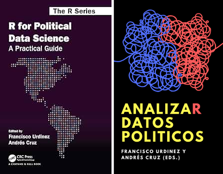

## Lab Instructor: Statistical Analysis in Political Science I/II (G)

<!-- [Materials]() -->

UT Austin: AY 2023/4

Taught by Connor Jerzak, JB Duck-Mayr

## Instructor: Methods Camp (G)

[Materials](https://methodscamp.github.io/previous-editions/2024/)

UT Austin: Summer 2023, Summer 2024

Co-taught with Matt Martin, Meiying Xu

## Instructor: Programming for the Social Sciences (UG)

[Materials (Spanish)](https://andrescruz.org/r-uc-2020/) 

PUC and UDP: 2019--2021

## Textbook: R for Political Data Science / AnalizaR Datos Políticos

[Book (CRC Press)](https://www.routledge.com/R-for-Political-Data-Science-A-Practical-Guide/Urdinez-Cruz/p/book/9780367818890) / [Book (Open-source Spanish version)](https://andrescruz.org/libroadp/)

2020

Co-edited with Francisco Urdinez

```{r, echo=F, out.width="350px", fig.align="center"}

```

## Workshop Presentations

- UT Austin GOV Methods Workshop:

  + [Power analysis: bridging theory and practice (2024)](workshops/power_analysis.html)
  
  + [Speedy R: loops, parallelization, and the cloud (2023)](workshops/speedyr.html)
  
  + [Managing data projects (2022)](workshops/managing_data_projects.html)

- Toronto Data Workshop on Reproducibility:

  + [`inexact`: an RStudio addin to supervise fuzzy joins (2021)](workshops/inexact.html)